<a name="HOLTitle"></a>
# Microsoft Language Understanding Intelligent Service (LUIS) #

---

<a name="Overview"></a>
## Overview ##

One of the key challenges in the world of human-computer interactions is training a computer to discern a user's intent from natural-language commands. Suppose that a user types "find news about Microsoft" into a news reader or browser. A person understands this command easily. But implementing the logic for a computer to understand this simple phrase is an exceedingly difficult task, especially when you factor in language and culture and the influence that those have on how we communicate.  


 
Microsoft's [Language Understanding Intelligent Service](https://www.microsoft.com/cognitive-services/en-us/language-understanding-intelligent-service-luis), or LUIS for short, is designed to fill this need, offering a fast and effective way to add language understanding to applications. LUIS lets you create models that take sentences or *utterances* and interpret them by discerning *intents* such as "find news" and extracting *entities* such as "Microsoft". LUIS utilizes interactive machine-learning techniques and benefits from extensive research on language understanding performed by researchers at Microsoft Research and other institutions. And once a LUIS model is built and trained, it is easily deployed as a Web service so bots and other applications can call it to convert commands entered by users into actions.

In this lab, you will create a LUIS application, configure a language-understanding model using both pre-built and custom entities, and define intents. Then you will build a bot that uses the model to respond to natural-language commands such as "find news about Microsoft" or "get the latest soccer news."

<a name="Objectives"></a>
### Objectives ###

In this hands-on lab, you will learn how to:

- Create a LUIS application
- Define intents and entities
- Use prebuilt entities and entity lists
- Train a LUIS model and publish it to an HTTP endpoint
- Create a bot that uses a LUIS model

<a name="Prerequisites"></a>
### Prerequisites ###

The following are required to complete this hands-on lab:

- A Microsoft account. If you don't have one, [sign up for free](https://account.microsoft.com/account).
- Microsoft [Visual Studio Code](http://code.visualstudio.com) version 1.12.0 or higher

---

<a name="Exercises"></a>
## Exercises ##

This hands-on lab includes the following exercises:

- [Exercise 1: Create a LUIS application](#Exercise1)
- [Exercise 2: Configure intents and entities](#Exercise2)
- [Exercise 3: Add prebuilt entities and entity lists](#Exercise3)
- [Exercise 4: Publish the model to an HTTP endpoint](#Exercise4)
- [Exercise 5: Create a bot and connect it to the model](#Exercise5)
- [Exercise 6: Test the bot](#Exercise6)
 
Estimated time to complete this lab: **60** minutes.

<a name="Exercise1"></a>
## Exercise 1: Create a LUIS application ##

The first step in creating an intelligent language model with LUIS is to provision an application in the [LUIS portal](https://www.luis.ai/). In this exercise, you will create an application called "Newsy" whose purpose is to understand natural-language commands for retrieving news.

1. Open the [LUIS portal](https://www.luis.ai/) in a browser. If you aren't already signed in, click **Sign in or create an account** and sign in with your Microsoft account. If you are prompted to "let this app access your info," review the permissions requested and click **Yes**. Additionally, if you are prompted to provide additional details such as the country you live in and the company you work for, fill in the information and click **Continue**.	

    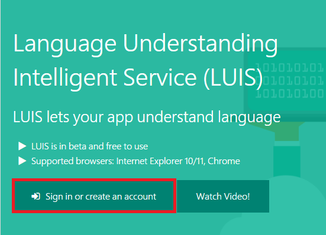

    _Signing in to LUIS_

1. Read through or skip over any welcome screens that are presented.

1. Click **New App**. 

    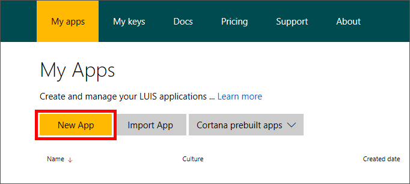

    _Creating a LUIS application_
 
1. Enter "Newsy" (without quotation marks) as the application name and click the **Create** button. 

    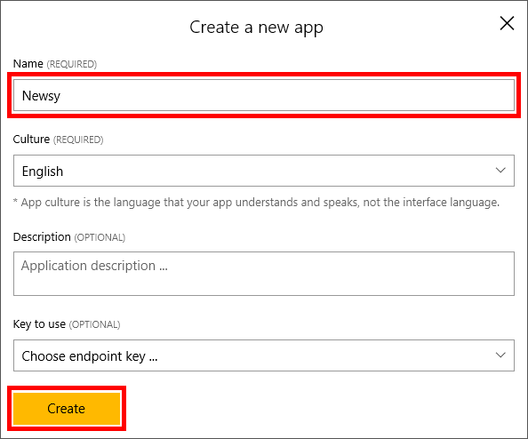

    _Entering information about the application_
 
Your LUIS application is now provisioned and you are ready to start configuring it by adding intents and entities.

<a name="Exercise2"></a>
## Exercise 2: Configure intents and entities ##

In the language of LUIS, *intents* represent actions such as "search" or "find," while *entities* describe target for intents. In this exercise, you will create a simple intent for searching the news and an entity to specify the type of news to search for, such as "soccer" or "Microsoft Surface."

1. Click **Intents** in the menu on the left. Then click **Add Intent** to add an intent.

    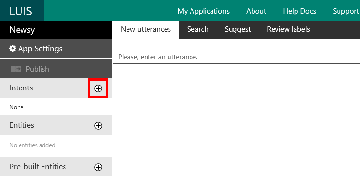

    _Adding an intent_
 
1. Enter "SearchNews" (without quotation marks) for the intent name, and then click the **Save** button.

    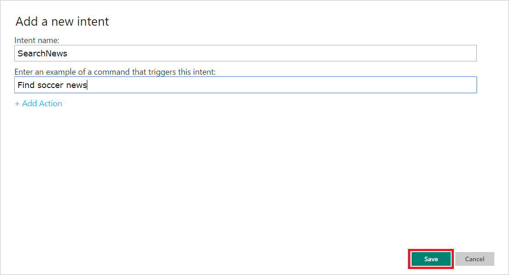

    _Defining an intent_

1. Click **Entities** in the menu on the left. Then click **Add custom entity** to add a a custom entity.

    

    _Adding a custom entity_ 

1. Enter "NewsTopic" as the entity name, ensure that the entity type is set to **Simple**, and then click the **Save** button.
 
    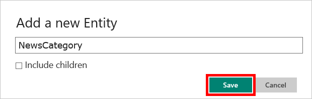

    _Defining a custom entity_ 

1. Now you need to connect the NewsTopic entity to the SearchNews intent. To begin, return to the "Intents" page and click **SearchNews**.
 
    

    _Selecting the SearchNews intent_

1. Type "soccer news" into the utterance box and press **Enter** to add "soccer news" as an utterance.
 
    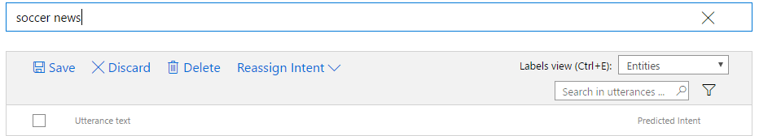

    _Entering a new utterance_

1. Click "soccer" in the utterance (the square brackets will appear when you hover over the word), and then select **NewsTopic** from the ensuing menu to connect "soccer" to the NewsTopic entity. 

    

    _Connecting "soccer" to the NewsTopic entity_

	The phrase "soccer news" is now associated with the SearchNews intent, and LUIS will understand the word “soccer” as the target of your action based on the NewsTopic entity. In order for LUIS to train the model successfully, it needs a few more sample utterances.
	
1. Repeat steps 6 and 7, making certain you select **NewsTopic** from the entity drop-down, with the following utterances to populate the LUIS application with information for training the model:

	- "hockey news"
	- "golf news"

1. When all of the utterances have been added, click **Save**.

    

    _Saving the SearchNews utterances_

	> **Tip:** If you would like to see the original terms you entered in the utterances rather than [$NewsTopic], select **Tokens** from the drop-down list labeled "Labels view."

1. The next step is to train the model with the utterances you entered. Click **Train & Test** in the menu on the left. Then click **Train Application** to train the model. Training should only take a few seconds. 
 
    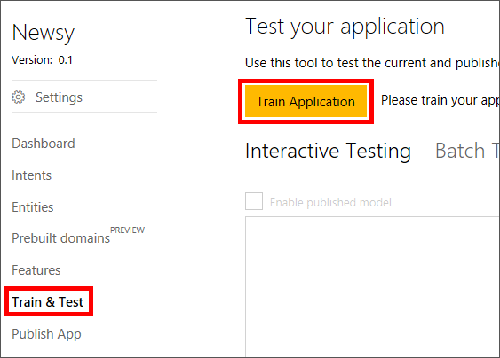

    _Training a LUIS model_

1. Test the model by typing "Find baseball news" into the test-utterance field and pressing **Enter**. Confirm that SearchNews is the top-scoring intent.

    

    _Testing an utterance_ 

Your LUIS application is now configured to understand phrases such as "find soccer news" and to discern that the user wants to search news for the term "soccer." LUIS is smart enough now to know that a phrase such as "Find baseball news" also represents an intent to search news, even though you haven't explicitly trained the model with the term "baseball." Your LUIS model is now ready to be configured to support more advanced scenarios, such as identifying terms from news categories.

<a name="Exercise3"></a>
## Exercise 3: Add prebuilt entities and entity lists ##

Now that LUIS understands some basic intents and phrases, it's time to make the model even more intelligent by leveraging prebuilt entities and entity lists. Prebuilt entities allow a model to know, for example, that words such as "tomorrow" and "September 30" that appear in an entity represent dates and times, or that "20 years old" represents an age. A complete list of the prebuilt entities that LUIS supports can be found at https://docs.microsoft.com/en-us/azure/cognitive-services/LUIS/pre-builtentities. In this exercise, you will add the prebuilt *encyclopedia* entity to your model, and add an entity list for refining news results by category.

1. Click **Entities** in the menu on the left to display the Entities page. Then click **Add prebuilt entity**.

    

    _Adding a prebuilt entity_ 

1. Scroll down and select **encyclopedia**. Then click the **Save** button. A new prebuilt entity named "encyclopedia" will be added to the list.
 
    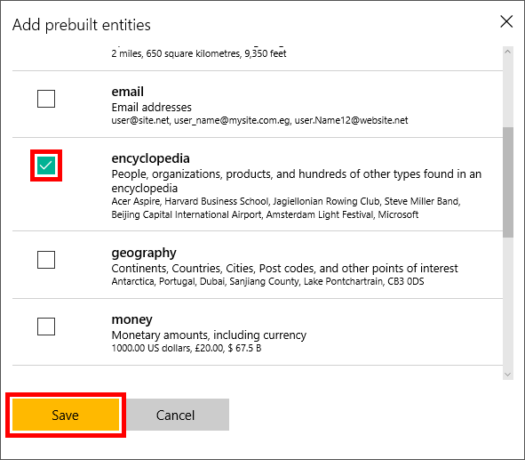

    _Selecting the encyclopedia entity_ 

1. Click **Train & Test** in the menu on the left, and then click **Train Application** to retrain the model.

1. Click **Intents** in the menu on the left. Then click the **SearchNews** intent.

1. Type "news about Seattle Mariners" and press the **Enter** key to add a new utterance. Confirm that LUIS understands "Seattle Mariners" as a potential encyclopedia entry and automatically assigns it the prebuilt encyclopedia entity.

    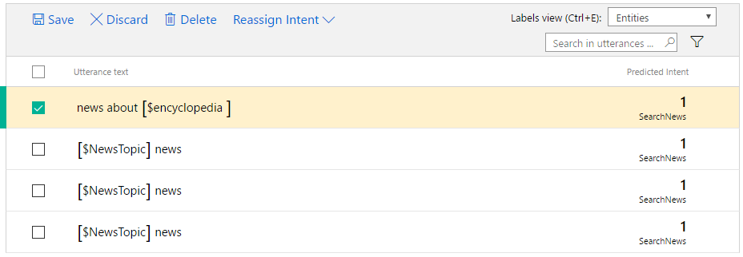

    _"Seattle Mariners" recognized as an encyclopedia entry_ 

1. Repeat step 4 to add the following utterances, and make sure the **encyclopedia** entity gets assigned to each.

	- "news about Super Bowl"
	- "news about Microsoft"

	When you're finished, click the **Save** button to save your changes.

1. The SearchNews intent now supports generic terms and phrases, and it recognizes a variety of terms as potential encyclopedia entries. This works well if a user wants to get news related to a specific topic. However, LUIS also lets you create entities based on predefined lists such as news categories. To demonstrate, click **Entities** in the menu on the left, and then click **Add custom entity**.

1. Enter "NewsCategory" as the entity name, select **List** as the entity type, and then click the **Save** button.

    

    _Adding a custom list entity_ 

1. Type "Business" into the first row in the "Canonical Form" column, and then click **+ Add** to add the entry to the phrase list.

    

    _Adding an entry to the list_ 

2. Repeat the previous step to enter the following terms:

	- Entertainment
	- Health
	- Politics
	- ScienceAndTechnology
	- Sports
	- US
	- World

	These terms will allow the LUIS model identify entire categories of news rather than just single topics.

1. Click **Train & Test** in the menu on the left, and then click **Train Application** to retrain the model.

1. The next step is to connect the NewsCategory entity to an intent. Begin by clicking **Intents** in the menu on the left, and then clicking the **SearchNews** intent.

1. Type "news about health" into the utterance box and press the **Enter** key. Conform that LUIS understands the term "health" as a NewsCategory entry and automatically assigns the NewsCategory intent.

    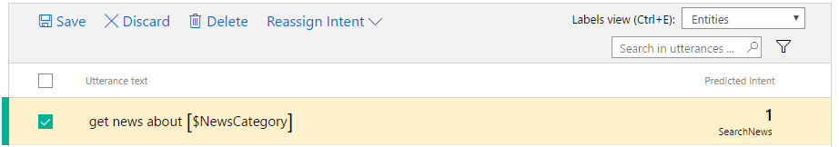

    _"health" token recognized as a news category_ 

1. Repeat the previous step, making certain the **NewsCategory** entity gets assigned, for the following sample phrases:	

	- "news about business"
	- "news about the world"
	
1. Click **Save** to save the utterances. Then click **Train & Test** in the menu on the left, and click **Train Application** to retrain the model.
 
The LUIS model has now been enhanced with a prebuilt encyclopedia entity and a list entity, and can understand most typical phrases relating to finding news based on various terms. Let's see how LUIS interprets this information and publish the model to make it available for use.

<a name="Exercise4"></a>
## Exercise 4: Publish the model to an HTTP endpoint ##

In this exercise, you will publish the model as a Web service so that it's available through an HTTP endpoint and can be accessed by applications that wish to incorporate language understanding. Before proceeding, be certain that you trained the model in the last step in the previous exercise. If you did not train it, train it now.

1. Click **Publish App** in the menu on the left. Select **BootstrapKey** as the **Endpoint Key** and ensure that **Production** is selected under **Endpoint slot**. Then click **Publish**.
 
    

    _Publishing a LUIS app_
 
1. Click the **Endpoint url** link to open a browser tab or window to the Web-service URL.

    

    _Opening the Web service_
 
1. In the browser's address bar, find the empty query-string parameter named "q," and edit it to include the phrase "find news about the golden state warriors." Then press the **Enter** key.

    

    _Modifying the query_

1. Confirm that the result is similar to the result below. Observe that LUIS identified "golden state warriors" as the entity and determined that "SearchNews" was the most likely intent. It also identified built-in encyclopedia entity types, such as 'builtin.encyclopedia.basketball.team" and "builtin.encyclopedia.sports.team" for the entity. And it expressed all of this in JSON.

	```JSON
	{
	  "query": "find news about the golden state warriors",
	  "topScoringIntent": {
	    "intent": "SearchNews",
	    "score": 0.999961853
	  },
	  "intents": [
	    {
	      "intent": "SearchNews",
	      "score": 0.999961853
	    },
	    {
	      "intent": "None",
	      "score": 0.0528251566
	    }
	  ],
	  "entities": [
	    {
	      "entity": "find",
	      "type": "NewsTopic",
	      "startIndex": 0,
	      "endIndex": 3,
	      "score": 0.7529088
	    },
	    {
	      "entity": "golden state warriors",
	      "type": "builtin.encyclopedia.basketball.team",
	      "startIndex": 20,
	      "endIndex": 40
	    },
	    {
	      "entity": "golden state warriors",
	      "type": "builtin.encyclopedia.sports.professional_sports_team"
	    },
	    {
	      "entity": "golden state warriors",
	      "type": "builtin.encyclopedia.sports.team"
	    },
	    {
	      "entity": "golden state warriors",
	      "type": "builtin.encyclopedia.organization.organization",
	      "startIndex": 20,
	      "endIndex": 40,
	      "score": 0.4828897
	    }
	  ]
	}
	```

Now that the model is available over HTTP, you can incorporate its intelligence in your applications.

<a name="Exercise5"></a>
## Exercise 5: Create a bot and connect it to the model ##

In this exercise, you will use the Microsoft Bot Framework to build a bot and connect it to the LUIS model you deployed in the previous exercise so the bot can respond to commands such as "Find health news." You will use Visual Studio Code to write the bot. If you haven't installed Visual Studio Code, [please do so](http://code.visualstudio.com) before continuing with this exercise. It's free, and it runs on Windows, Linux, and macOS.

1. Create a project directory named "Newsy" in the location of your choice — for example, C:\Labs\Newsy.

1. Open a Command Prompt window in Windows or a Terminal window in Linux or macOS and navigate to the directory that you created in the previous step. Then, in the Command Prompt or Terminal window, execute the following command to launch Visual Studio Code in that directory. Be sure to include the period at the end of the command:

	```
	code .
	``` 

1. In Visual Studio Code, click the **New File** icon to create a new file in the "Newsy" folder, and name the file **app.js**.

    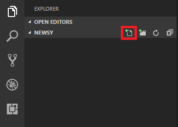

    _Adding a file to the project_

1. Enter the following line of JavaScript code into **app.js**. Then save the file.

	```JavaScript
	console.log("Welcome to Newsy!");
	```

1. Select **Integrated Terminal** from the **View** menu to open an integrated terminal inside Visual Studio Code. 
 
1. In the integrated terminal window, execute the following command to install the Microsoft Bot Builder SDK:

	```
	npm install --save botbuilder
	```	

1. Now execute this command to install the packages needed to leverage REST-based messaging routes in your code:

	```
	npm install --save restify
	```	 

1. Execute the following command to run the application. Confirm that "Welcome to Newsy!" appears in the integrated terminal window:

	```
	node app.js
	```	

1.	Click the **Debug** button in the ribbon on the left. Then click the **Configure or Fix** button at top to add a configuration file named **launch.json** to your project.
	
    

    _Adding a launch file to the project_	

1. Replace the contents of **launch.json** with the following JSON to make sure the debugger starts the **app.js** file and supports interaction via the integrated terminal:

	```JSON
	{
	    "version": "0.2.0",
	    "configurations": [
	        {
	            "type": "node",
	            "request": "launch",
	            "name": "Launch Program",
	            "program": "${workspaceRoot}/app.js",
	            "console": "integratedTerminal"
	        }
	    ]
	}
	```

1. Return to **app.js** and replace the contents of the file with the following code:

	```JavaScript
	var builder = require('botbuilder');
	var https = require('https');
	var querystring = require('querystring');
	
	var connector = new builder.ConsoleConnector().listen();
	var bot = new builder.UniversalBot(connector);
	
	var luisAppId = "LUIS_APP_ID";
	var luisSubscriptionKey = "LUIS_SUBSCRIPTION_ID";
	
	bot.dialog('/', [
	    function (session) {
	        if (session.userData.intent == null) {
	            builder.Prompts.text(session, "Welcome to Newsy! Try typing something like 'Find health news'.");
	        }
	        else {
	            builder.Prompts.text(session, "Try typing something like 'Find health news'.");
	        }
	    },
	    function (session, results) {
	        session.userData.searchQuery = results.response;
	        var searchQuery = querystring.escape(session.userData.searchQuery);
	        var searchQueryString = "";
	
	        processLuisResults(session, searchQuery, searchQueryString);
	    }
	]);
	
	var processLuisResults = (function (session, searchQuery, searchQueryString) {
	    //CALL LUIS APPLICATION
	    var optionsLuisGet = {
	        host: 'westus.api.cognitive.microsoft.com',
	        port: 443,
	        path: '/luis/v2.0/apps/' + luisAppId + '?subscription-key=' + luisSubscriptionKey + '&q=' + searchQuery + '&verbose=true',
	        method: 'GET'
	    };
	
	    var reqGet = https.request(optionsLuisGet, function (res) {
	        res.on('data', function (luisResults) {
	
	            var luisResult = JSON.parse(luisResults.toString());
	            session.userData.intent = luisResult.intents[0].intent.toString();
	
	            if (luisResult.topScoringIntent.intent == "None") {
	                session.send("I'm not quite sure what you mean by '" + session.userData.searchQuery.toUpperCase() + "'");
	            }
	            else {
	
	                session.userData.entity = luisResult.entities[0].entity.toString();
	                session.userData.entityType = luisResult.entities[0].type.toString()
	
	                var searchType = session.userData.entityType;
	
	                switch (session.userData.entityType) {
	                    case "NewsTopic":
	                        searchQueryString = 'searchQuery=' + querystring.escape(session.userData.entity);
	                        break;
	                    case "NewsCategory":
	                        searchQueryString = 'category=' + querystring.escape(session.userData.entity);
	                        break;
	                    default:
	                        searchType = "NewsTopic";
	                        searchQueryString = 'searchQuery=' + querystring.escape(session.userData.entity);
	                        break;
	                }
	
	                session.send("Here's some news about " + session.userData.entity.toUpperCase() + " for you:");
	
	                //SEND DERIVED LUIS INTENT OVER TO BING SEARCH
	                showNewsResults(session, searchType, searchQueryString);
	            }
	        });
	    });
	
	    reqGet.end();
	    reqGet.on('error', function (e) {
	        session.send(e.toString());
	    });
	    //END CALL LUIS APPLICATION
	});
	
	var showNewsResults = (function (session, searchType, searchQueryString) {
	    //CALL BING NEWS SEARCH
	    var optionsSearch = {
	        host: 'traininglabservices.azurewebsites.net',
	        port: 443,
	        path: '/api/' + searchType.replace('News', 'news/') + '?' + searchQueryString,
	        method: 'GET'
	    };
	
	    var reqGet = https.request(optionsSearch, function (res) {
	        res.on('data', function (newsResults) {
	
	            var newsResult = JSON.parse(newsResults.toString());
	
	            for (var result in newsResult) {
	                val = newsResult[result];
	                var title = val.Title;
	                var description = val.Description;
	
	                session.send(title + "\r\n" + description);
	            }
	        });
	    });
	
	    reqGet.end();
	    reqGet.on('error', function (e) {
	        session.send(e.toString());
	    });
	    //END BING NEWS SEARCH   
	});
	```	
 
	> Take a moment to review the code and observe how it uses the Microsoft Bot Framework Bot Builder to prompt the user, and how it places calls to the HTTP endpoint created in Exercise 4 to access your LUIS model. 

1. Before you can test the bot, you need to update your code with the application ID and subscription ID of your LUIS model. These values can be retrieved from the LUIS portal. Return to the Newsy application in the portal and click **Settings** in the menu on the left. Then copy the application ID to the clipboard.
 
    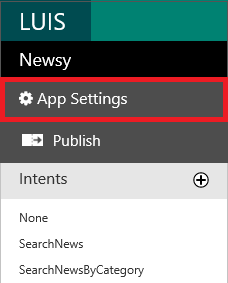

    _Copying the Application ID_ 
 
1. Return to **app.js** in Visual Studio Code and replace *LUIS_APP_ID* on line 8 with the application ID that is on the clipboard.
 
1. Return to the LUIS portal and click **My Keys**. Then copy the programmatic API key to the clipboard. This is your LUIS subscription ID.
 
    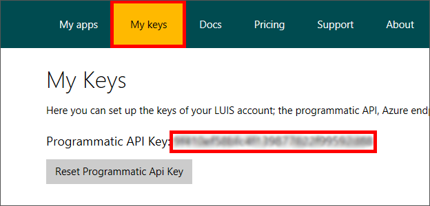

    _Copying the subscription Id_
 
1. Return to **app.js** in Visual Studio Code and replace *LUIS_SUBSCRIPTION_ID* on line 9 with the subscription ID that is on the clipboard.

1. Use Visual Studio Code's **File** > **Save All** command to save your changes.
 
That's it! Your bot is now built, connected to LUIS, and ready to test.

<a name="Exercise6"></a>
## Exercise 6: Test the bot ##

The motivation for creating a bot is to have it carry on conversations with users. LUIS makes those conversations feel much more natural. In this exercise, you will run the bot you implemented in the previous exercise and see Language Understanding Intelligent Service at work.

1. In Visual Studio Code's integrated terminal window, execute the following command to start the bot:

	```
	node app.js
	```

1. Type "Hello" (without quotation marks) to wake up the bot. Then press **Enter** and wait for the bot to respond.
 
    

    _Waking up the bot_

1. Type "find soccer news" and press **Enter**. Wait for the bot to respond. After a brief pause while the bot calls out to your LUIS model, up to five relevant news articles will appear.
 
    

    _Communicating with the bot_

1. Type "Hello" again and press **Enter**. Then type "get Microsoft news" and press **Enter** again. What does the bot return this time? 

Feel free to try other commands such as "Get the latest health news" and continue to converse with the bot. It understands a relatively narrow range of commands, but for those commands that it does understand, it almost seems to know what you're saying. Of course, you could expand the bot's vocabulary by adding to the LUIS model that you built. The only limit is how much time you're willing to spend refining and enhancing the model.

<a name="Summary"></a>
## Summary ##

There is much more that you can do to leverage the power of the Microsoft Language Understanding Intelligent Services in your code. For starters, try experimenting with other LUIS features such as [intent dialogs](https://docs.microsoft.com/en-us/bot-framework/nodejs/bot-builder-nodejs-recognize-intent) and adding more prebuilt entities to your model. For additional background on LUIS and examples of how to use it, refer to https://docs.microsoft.com/en-us/bot-framework/cognitive-services-bot-intelligence-overview#language-understanding.

----

Copyright 2017 Microsoft Corporation. All rights reserved. Except where otherwise noted, these materials are licensed under the terms of the MIT License. You may use them according to the license as is most appropriate for your project. The terms of this license can be found at https://opensource.org/licenses/MIT.