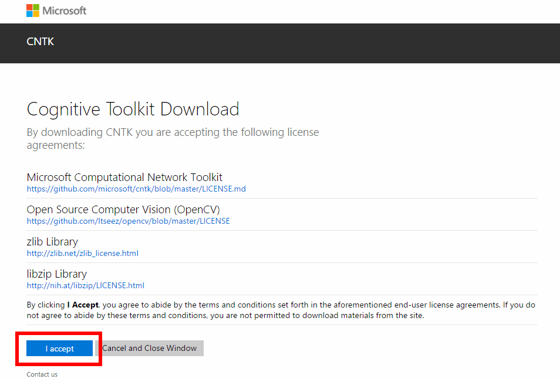
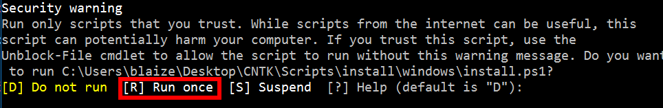
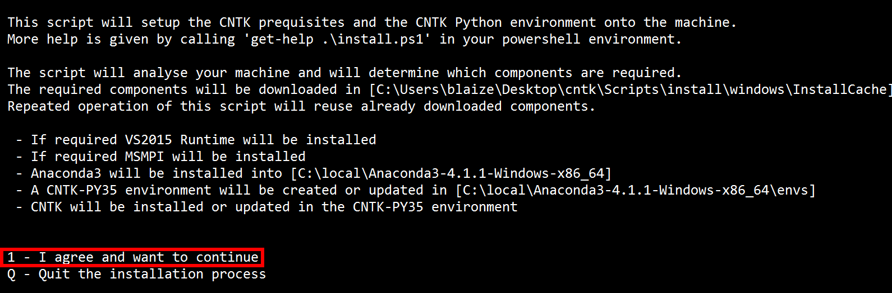
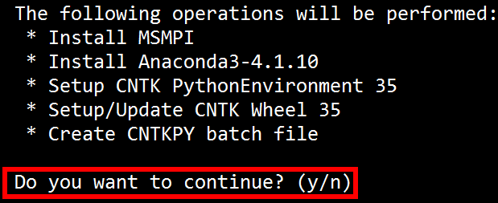
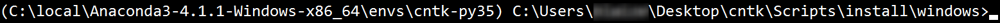
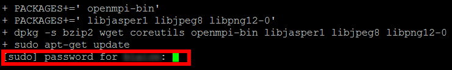
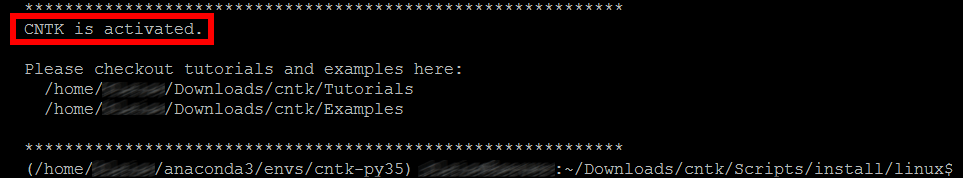

<a name="HOLTitle"></a>
# The Microsoft Cognitive Toolkit #

---

<a name="Overview"></a>
## Overview ##

The [Microsoft Cognitive Toolkit](https://www.microsoft.com/en-us/research/product/cognitive-toolkit/), formerly known as the Cognitive Network Toolkit (CNTK), is a powerful set of free and open-source tools for developing deep-learning applications. It was initially developed by computer scientists at Microsoft to aid in their own research, and was later adopted by Bing and other product groups as well as by Microsoft customers. It can run on a single machine with a single CPU, or scale efficiently across multiple machines with multiple CPUs and NVIDIA GPUs, including Azure's [GPU offering](https://azure.microsoft.com/en-us/blog/azure-n-series-preview-availability/). The Microsoft Cognitive Toolkit supports C++ and Python and includes a number of libraries and utilities for speech, image, language, and video recognition and many examples of how to use them. For more information on its history, its uses, and its capabilities, see https://blogs.microsoft.com/next/2016/10/25/microsoft-releases-beta-microsoft-cognitive-toolkit-deep-learning-advances.

The toolkit centers around machine learning with [neural networks](https://en.wikipedia.org/wiki/Artificial_neural_network). Machine learning enables computers to discern patterns in data that are difficult to identify algorithmically. Imagine trying to write an algorithm to identify images containing cats. The algorithm might scan the image looking for features characteristic of cats such as pointed ears, whiskers, and slit pupils, but identifying those features by examining individual pixels would be difficult. By contrast, a machine-learning model trained with thousands of cat images could "learn" to identify cats from patterns in the data without explicitly understanding what those patterns represent. Machine learning touches lives every day and is widely used in industry to flag fraudulent credit-card transactions, generate online shopping recommendations, perform optical character recognition, and more.


_Features of cats (image: Wikimedia Commons)_

When used for image processing, neural networks begin by decomposing an input image into regions as illustrated in the images above. These regions constitute a series of *input nodes* in a neural network. These nodes are connected to many *hidden nodes* via probabilistic edges. Each input region is assigned a value, which is mathematically generated from the probability of an edge combined with input from other nodes. Signals from these nodes feed into other nodes and traverse the network until they reach an *output node*. If the destination output node meets a specified probability threshold, then the image is identified as one matching the input criteria. 


_Neural network (image: Wikimedia Commons)_

Neural networks are trained with one set of inputs and then tested with another set of inputs. Handwriting recognition is one of the common applications for neural networks. Handwriting is usually unique to an individual, but there are common characteristics of written characters that can be detected in images.

The [MNIST datasbase](https://en.wikipedia.org/wiki/MNIST_database) is a popular dataset for training and evaluating handwriting-recognition models. The database contains 60,000 images of the digits 0 through 9 drawn by high school students. It also includes a set of 10,000 test images. A number of scholarly papers have been published using this dataset, each seeking to optimize neural networks to produce more positives and fewer errors when identifying characters. Models built around the MNIST database frequently divide each image into regions and feed them into a neural network for processing. For a more in-depth explanation of machine learning, particularly as it relates to MNIST, check out http://neuralnetworksanddeeplearning.com/chap1.html.

In this lab, you will use the MNIST database to train and test a variety of different algorithms, and then use the trained models to test sets of images against the models.

<a name="Objectives"></a>
### Objectives ###

In this hands-on lab, you will learn how to:

* Install the Microsoft Cognitive Toolkit
* Download and use the MNIST Dataset to train and test neural networks
* Edit the configuration files to use different inputs for testing.

<a name="Prerequisites"></a>
### Prerequisites ###

The following are required to complete this hands-on lab:

- A text editor
- A machine with 64-bit Linux or 64-bit Windows installed

If you do not have a 64-bit Linux or 64-bit Windows machine, you can create a [Linux Virtual Machine on Azure](https://docs.microsoft.com/en-us/azure/virtual-machines/virtual-machines-linux-quick-create-portal) and perform the lab using the VM. If you don't have an Azure subscription, [sign up for a free trial](http://aka.ms/WATK-FreeTrial).

## Exercises

This hands-on lab includes the following exercises:

* [Exercise 1: Install the Cognitive Toolkit (Windows)](#Exercise1)
* [Exercise 2: Install the Cognitive Toolkit (Linux)](#Exercise2)
* [Exercise 3: Install training and testing data](#Exercise3)
* [Exercise 4: Train and test neural networks](#Exercise4)
* [Exercise 5: Test with custom images](#Exercise5)
* [Exercise 6: Generate custom images (optional)](#Exercise6)

Estimated time to complete this lab: **45** minutes.

<a id="Exercise1"/></a>
## Exercise 1: Install the Cognitive Toolkit (Windows)

Installing the toolkit it pretty straight forward if you use the pre-compiled binaries. It is possible to compile it from the source, but this is only necessary if you want to extend the code rather than simply use it. CNTK also comes with install scripts for Windows and Linux. This exercise will use the Windows scripts to setup CNTK on a Windows machine.


1. Visit the [CNTK release site on GitHub](https://github.com/Microsoft/CNTK/releases) to download the latest binary distribution of CNTK. Select the **CNTK for Windows v.2.x CPU only** distribution.

	

	_Windows Download_

1. On the next screen, select **I Accept** to agree to the license and start the download.

	

	_Windows Download_

1. Extract the contents of the zip file. The root of the zip file contains a folder called **cntk**. For ease of use, copy this folder to your **Desktop**.

1. Launch a Command Prompt. Press **Windows + R**, then type in or copy and paste the following command, then, then click **OK**. This command will start the Command Prompt in administrator mode.

	````
	powershell -Command "Start-Process cmd -Verb RunAs"
	````

	

	_Run Window_

1. Change folder to the **cntk** folder with the **cd** command. This opens the root folder for **cntk**, which contains a other folders with CNTK utilities and Binaries.

	````
	cd %USERPROFILE%\Desktop\cntk
	````

1. Change to the install folder in **scripts** folder for Windows. This folder contains a  PowerShell scripts that install the CNTK dependencies.

	````
	cd Scripts\install\windows
	````

1. Install CNTK dependencies with the **install.ps1** script. 

	````
	powershell -ExecutionPolicy UnRestricted -File install.ps1 -Execute
	````

1. If you see a **Security warning**, select **R** to allow the script to run. You may see this warning for multiple scripts. Select **R** for each script to **Run once**.

	

	_Security Warning_

1. Once the script starts to execute, the screen will prompt to agree with the install scripts changes. Type in **1** to select the **I agree and want to continue**

	

	_CNTK Prerequisites_


1. The script will then determine what needs to be installed. Once the determination is complete, it will list what will be done by the script. Type in **Y** to answer **Do you want to continue?**

	

	_Do you want to continue?_

1. The script will download a number of libraries and install them on the computer. This will take a few minutes to complete. Once the script is finishes, the script will notify the user with a message about examples and tutorials along with a path to a script that will activate the **CNTK Python** environment. Copy and paste this path into the Command Prompt window.

	

	_Install finished_

	**Example:**

	````
	C:\Users\username\Desktop\cntk\scripts\cntkpy35.bat
	````

1. The prompt will change to indicate that the Command Prompt is in the CNTK Python environment. CNTK is activated and ready to use. Each time you use the toolkit, the command will need to be run first to setup the CNTK Python environment.

	

	_New Prompt_

<a id="Exercise2"/></a>
## Exercise 2: Install the Cognitive Toolkit (Linux)

Like the Windows install, this exercise will use scripts to install CNTK, this time on a Linux machine.

1. Visit the [CNTK release site on GitHub](https://github.com/Microsoft/CNTK/releases) to download the latest binary distribution of CNTK. Select the **CNTK for Linux v.2.x CPU only** distribution.

	

	Linux Download_

1. On the next screen, select **I Accept** to agree to the license and start the download.

	

	_Linux Download_

1. After the download completes, open a Terminal window. This can usually be found on the Applications menu for your Distro or can usually be accessed with Ctrl + Alt + F1.

1. In the Terminal, change directories to the Downloads directory.

	````
	cd ~/Downloads
	````

1. Uncompress the **CNTK-2-X-Linux-64bit-CPU-Only.tar.gz** file. For shorthand, most distros allow **tar -xvzf C** then press the **Tab** key to find the file.

	````
	 tar -xvzf CNTK-2-x-Linux-64bit-CPU-Only.tar.gz
	````

1. Change directories to the Linux install folder.

	````
	cd cntk/Scripts/install/linux/
	````

1. Launch the install script.

	````
	 ./install-cntk.sh
	````

1. The install script may ask for a **sudo** password. The user install the script needs root privileges in order to install the CNTK prerequisites.

	

	_sudo Password_

1. The script will download a number of libraries and install them on the computer. This will take a few minutes to complete. Once the script is finishes, the script will notify the user with a message about examples and tutorials along with a **source** command that will activate the **CNTK environment**. Copy and paste or type command into the Terminal window.

	

	_source Command_

	**Example:**
	
	````
	source "/home/username/Downloads/cntk/activate-cntk"
	````

1. Once the command runs, CNTK is activated and ready to use. Each time you use the toolkit, the source command will need to be run first to setup the CNTK environment.


	

	_CNTK is Activated_


<a id="Exercise3"/></a>
## Exercise 3: Install training and testing data

Neural Networks are "trained" using data sets of known values to help in pattern recognition when tested with unknown values. One of the more popular sets for Neural Networks is the [MNIST dataset](http://yann.lecun.com/exdb/mnist/), which contains a set of 60,000 handwriting samples of digits, 0 through 9. Each image is one digit in a 28 x 28 grayscale bitmap. The characters are written using black ink on a a white background, so the the handwriting recognition is looking for varying degrees of contrast between the background and foreground to shape a respective digit.


_Sample Digits_

1. Change folders to the **MNIST dataset** folder in **Examples**. 

	**Windows:**

	````
	cd ..\..\..\Examples\Image\DataSets\MNIST
	````

	**Linux:**

	````
	cd ../../../Examples/Image/DataSets/MNIST
	````

1. Install the image data with the provided script.

	**Windows and Linux:**

	````
	python install_mnist.py
	````

1. The scripts will download and install the dataset, which will take a few minute to complete. Once downloaded, the dataset is converted from a binary format to a text format that is used by CNTK. This will be discussed further in a later Exercise.

	

	_Installed Dataset_

	There are two sets of files the **train** set and the **test** set. The train set contains the 60,000 sample images to train the neural network to recognize handwriting. The scripts output the data into a text file called **Train-28x28_cntk_text.txt**. The second set contains 10,000 images to test the trained neural network. The output for the test data is **Test-28x28_cntk_text.txt**.

<a id="Exercise4"/></a>
## Exercise 4: Train and test neural networks

The Microsoft Cognitive Toolkit comes with a number of sample configurations to use various types of neural networks. Each type of network uses the same training and test data for purposes of consistency. One of the simplest networks is a One Hidden Layer network, which is not a deep neural network, rather only has input nodes, one set of hidden nodes, then output nodes.

1. Change Directories to the Getting Started Folder

	**Windows:**

	````
	cd ..\..\GettingStarted
	````

	**Linux:**

	````
	cd ../../GettingStarted
	````

1. Each Network and Test are defined in a .cntk file. The file contains instructions for the data source which in this case is the data from MNIST, the training parameters to define the neural network type, and also the test data data to test the neural networks. To see a list of the .cntk files, list the directory. The lab will modify one or more of these files later.


	**Windows:**

	````
	dir *.cntk
	````

	**Linux:**

	````
	ls -l *.cntk
	````

	

	_.cntk Files_


1. Now, the cntk command can be used with the configuration file and the dataset to train and test a network. The examples already configured to point to the dataset folder, so no changes are needed at this point.

	
	**Windows and Linux:**

	````
	cntk configFile=01_OneHidden.cntk
	````

1. Wait for the training and testing to complete. This may take a few minutes. The training and testing will write output back to the screen. Once completed, there will be a summary of the tests, will a percentage of errors. Lower percentages mean that the neural network was able to recognize more images in test set.

	

	_One Hidden Results_

2. Now, use the cntk command to train and test with One Convolution.

	
	**Windows and Linux:**

	````
	cntk configFile=02_OneConv.cntk
	````

1. Wait for the training and testing to complete. Notice the lower error rate in this network. This means that it was able to recognize more of the test samples than the first network test.

	

	_One Convolution Results_

1. Repeat the training and testing for more neural networks to see the error rate for these other networks.

<a id="Exercise5"/></a>
## Exercise 5: Test with custom images

The **solution** folder in the lab has a set of custom images that can be used for testing. These images can be used to produce a test input file for the neural networks. These images are not part of the MNIST dataset.


_Test Images_

1. Change directories to the **solution** folder for the lab.

1. Run the **images2cntk.py** script in the solution folder. This script will create a test input file called "Custom-Test-28x28_cntk_text.txt"

	**Windows and Linux:**

	````
	python images2cntk.py
	````

1. The output file contains data from each of the images in a single row. One section is called **labels** and the other **features**. The **labels** correspond to the actual value of the digit -- there are 10 possible values 0 through 9. The first value is 1 or 0 for 0, the second 1 or 0 for 1 and so on. If the value is 7, then all the values of the labels section will be 0 except the 8th value, which will be marked as 1. The **features** correspond to the value for the binary data in the images. 0 is white while 255 is black. There are 784 values, one for each pixel.

	

	_Sample Data_

1. Now, in the cntk folder open the **01_OneHidden.cntk** used for training and testing in Exercise 4 in a text editor. This file has two large sections **trainNetwork** and **testNetwork**. trainNetwork contains all the settings to train the network based on the training dataset. The testNetwork contains all the settings used for testing the network.

1. Find the testNetwork section in the file, and look at the **reader** section in **testNetwork**. The **reader** defines the file format for the input data. (The **trainNetwork** also has a reader section as well.) Notice the features and labels sections are defined in the reader section as well as the data source for the test data called **file**. Comment out the **file** line with a pound sign (#) and add a new **file** line with the full path to the **Custom-Test-28x28_cntk_text.txt** in step 2.


	**Example reader:**

	````
	reader = {
        	readerType = "CNTKTextFormatReader"
        	# file = "$DataDir$/Test-28x28_cntk_text.txt"
		file = "C:\path\to\solution\Custom-Test-28x28_cntk_text.txt"
        	input = {
           	 features = { dim = 784 ; format = "dense" }
           	 labels =   { dim = 10  ; format = "dense" }
        	}
	}
	````

1. Save the file.

1. Back in the Command Prompt, run the **cntk** command for the modified cntk file. The test script will run much faster now because the trained model was saved to disk. CNTK uses the trained model instead of regenerating it. 


	**Windows and Linux:**

	````
	cntk configFile=01_OneHidden.cntk
	````

	Notice the error rate for the custom set of images.

	

	_One Hidden Custom Test_

1. Now, use the edit the **reader** for **testNetwork** in **02_OneConv.cntk** as in step 4, then run the cntk command test with **One Convolution**.

	
	**Windows and Linux:**

	````
	cntk configFile=02_OneConv.cntk
	````

	Notice the error rate for the custom set of images. The rate is different for this network.

	

	_One Convolution Custom Test_

These images show how different neural networks can produce different results although the networks were trained with the same input data. The One Convolution is able to recognize more of the custom images than the One Hidden network.

<a id="Exercise6"/></a>
## Exercise 6: Generate custom images (optional)

It is possible to generate custom images to test with. Using user generated images helps further validate the models created by the training images.

1. Create a 28 x 28 square with a white background in a raster graphics editor.

2. Zoom in on it, and draw a digit using hand writing. 

	

	_Editing a custom image zoomed in_

3. Name the image X-YY.png -- X is the value that corresponds to the digit represented in the image, and YY is any number. For the image above, one would name it "8-02.png".

4. Copy the image into the **input-images** folder in the **solution** folder, then rerun the  **images2cntk.py** script to generate the **Custom-Test-28x28_cntk_text.txt**  data as in step 2 under exercise 5. 

5. Finally, rerun the tests with the new custom images and see the results for each neural network.

<a name="Summary"></a>
## Summary ##

Neural Networks are useful for developing pattern recognition for arbitrary input on any varieties of media types. This lab has looked at one of the most common applications for neural networks, handwriting recognition. The Microsoft Cognitive Toolkit though contains libraries and utilities for speech recognition, video, images, and likewise can be applied to any number of other applications.

---

Copyright 2016 Microsoft Corporation. All rights reserved. Except where otherwise noted, these materials are licensed under the terms of the MIT License. You may use them according to the license as is most appropriate for your project. The terms of this license can be found at https://opensource.org/licenses/MIT.
