<a name="HOLTitle"></a>
# Custom Vision Service #

---

<a name="Overview"></a>
## Overview ##

[Microsoft Cognitive Services](https://azure.microsoft.com/en-us/services/cognitive-services/ "Microsoft Cognitive Services") is a suite of APIs and services backed by machine learning that enables developers to incorporate intelligent features such as facial recognition in photos and videos, sentiment analysis in text, and language understanding into their applications. Microsoft's [Custom Vision Service](https://azure.microsoft.com/en-us/services/cognitive-services/custom-vision-service/) is among the newest members of the Cognitive Services suite. Its purpose is to create image classification models that "learn" from labeled images you provide. Want to know if a photo contains a picture of a flower? Train the Custom Vision Service with a collection of flower images, and it can tell you whether the next image includes a flower — or even what type of flower it is.


The Custom Vision Service enables organizations to develop domain-specific image-classification models and use it to analyze image content. Examples include identifying a dog's breed from a picture of the dog, analyzing images for adult content, and identifying defective parts produced by manufacturing processes. It was recently used to [help search-and-rescue drones](https://blogs.technet.microsoft.com/canitpro/2017/05/10/teaching-drones-to-aid-search-and-rescue-efforts-via-cognitive-services/) identify objects such as boats and life vests in large bodies of water and recognize potential emergency situations in order to notify a rescue squad without waiting for human intervention.

In this lab, you will create a Custom Vision Service model, train it with images of famous paintings tagged with the artists' names, and utilize the model from a Node.js app to identify the artist of paintings that you upload. Along the way, you will learn how to train a Custom Vision Service model and leverage it from your apps using REST APIs.

<a name="Objectives"></a>
### Objectives ###

In this hands-on lab, you will learn how to:

- Create a Custom Vision Service project 
- Build and refine project classifiers
- Populate and tag images 
- Train a Custom Vision classifier  
- Check predictions via the Quick Test 
- Create a Node.js app to use the Custom Vision Service Prediction API 
- Upload painting images to perform and view predictions

<a name="Prerequisites"></a>
### Prerequisites ###

The following are required to complete this hands-on lab:

- A Microsoft account. If you don't have one, [sign up for free](https://account.microsoft.com/account).
- Microsoft [Visual Studio Code](http://code.visualstudio.com) version 1.14.0 or higher

---

<a name="Exercises"></a>
## Exercises ##

This hands-on lab includes the following exercises:

- [Exercise 1: Create a Custom Vision Service project](#Exercise1)
- [Exercise 2: Upload tagged images](#Exercise2)
- [Exercise 3: Train the model](#Exercise3)
- [Exercise 4: Test the model](#Exercise4)
- [Exercise 5: Create a Node.js app in Visual Studio Code](#Exercise5)
- [Exercise 6: Upload painting images to perform and view predictions](#Exercise6)

Estimated time to complete this lab: **60** minutes.

<a name="Exercise1"></a>
## Exercise 1: Create a Custom Vision Service project ##

The first step is to buulding an image-classification model with the Custom Vision Service is to create a project in the Custom Vision Service portal.

1. Open the [Custom Vision Service portal](https://www.customvision.ai/) in your browser. Then click **Sign In**. 
 
    

    _Signing in to the Custom Vision Service portal_

1. If you are asked to sign in, do so using the credentials for your Microsoft account. If you are asked to let this app access your info, click **Yes**, and if prompted, agree to the terms of service.

1. Click **New Project** to create a new project.
  
	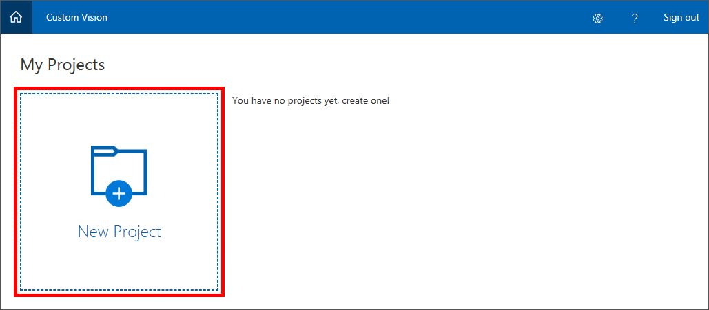

    _Creating a Custom Vision Service project_

1. In the "New project" dialog, name the project "Artworks," ensure that **General** is selected as the domain, and click **Create project**.

	> A domain optimizes a classifier for specific types of images. For example, if your goal is to classify food images by the types of food they contain or the ethnicity of the dishes, then it might be helpful to select the Food domain. For scenarios that don't match any of the offered domains, or if you are unsure of which domain to choose, select the General domain.

	

    _Creating a Custom Vision Service project_

The next step is to train the model by uploading images to the project and providing tags for those images.

<a name="Exercise2"></a>
## Exercise 2: Upload tagged images ##

In this exercise, you will add images of famous paintings by Pablo Picasso, Jackson Pollock, and Rembrandt to the Artworks project, and then tag the images so the Custom Vision Service can learn to differentiate one artist from another.
  
1. Click **Add images** to add an image to your project.

	

    _Adding images to the Artworks project_ 
 
1. Click **Browse local files**.

	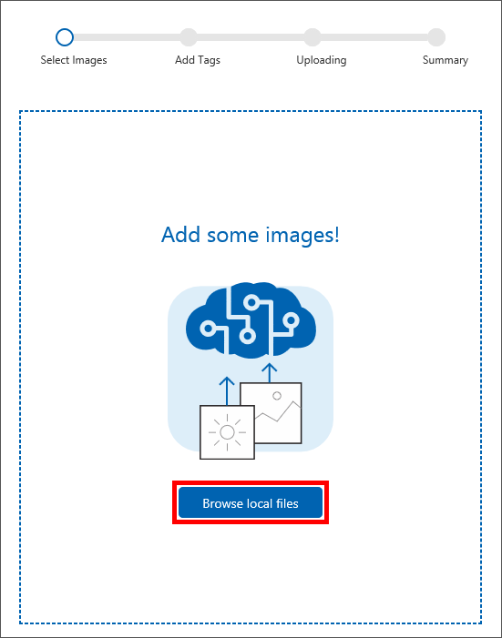

    _Browsing local files in the Artworks project_ 
 
1. Browse to "Resources\Artists\Picasso" folder included with this lab, select **Picasso_01.jpg**, and click **Open**.

	

    _Selecting an image_ 
 
1. Type "painting" (without quotation marks) into the **Add some tags** box. Then click **+** to assign the tag to the image.

	

    _Adding a "painting" tag to the image_ 

1. Repeat Step 4 to add the following tags to the image:

	- artist
	- famous
	- Picasso

1. Click **Upload 1 file** to upload the image. Once the upload has completed, click **Done**.

	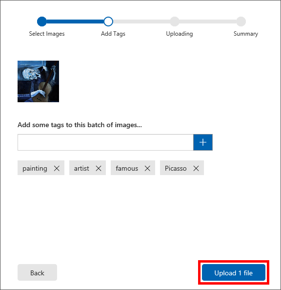

    _Uploading a tagged image_ 

1. Confirm that the page you uploaded appears in the portal, along with the tags you added to it.

	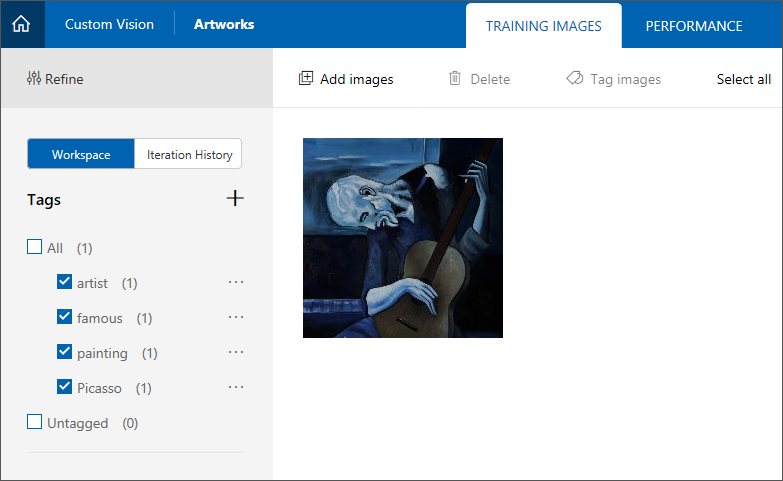

    _The uploaded image_ 

1. When training a Custom Vision Service model, the more tagged images you upload, the better. Click **Add images** in the workspace menu at the top of the page, and then click **Browse local files**. Browse to "Resources\Artists\Picasso" folder included with this lab and select all of the remaining Picasso images, **Picasso_02.jpg** through **Picasso_07.jpg**. Then click **Open**. 

	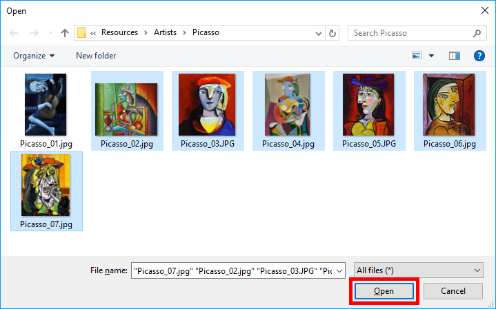

    _Selecting the remaining Picasso images_ 
 
1. Add the tags "artist", "famous", "painting", and "Picasso" to the images by selecting them one by one from the drop-down list. Then click **Upload 6 files**. Once the uploads have completed, click **Done**.

	

    _Tagging the selected images_ 

1. Confirm that all seven Picasso images appear in the workspace.

	

    _Picasso images uploaded to the project_ 

1. With seven Picasso images, the Custom Vision Service can do a decent job of identifying paintings by Picasso. But if you trained the model right now, it would only understand what a Picasso looks like, and it would not be able to identify paintings by other artists.

	The next step is to upload some paintings by another artist. Repeat Steps 8 and 9 to select all of the images in this lab's "Resources\Artists\Rembrandt" folder, tag them with the terms "painting," "artist," "famous," and "Rembrandt" (not "Picasso"), and upload them to the project.

	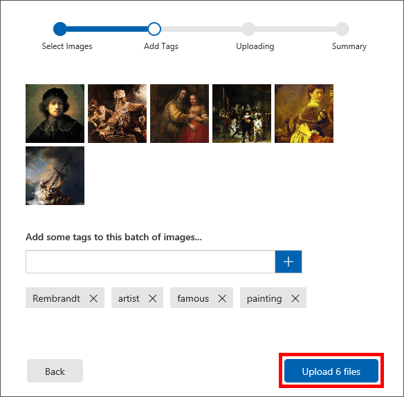

    _Uploading Rembrandt images_ 

1. Confirm that the Rembrandt images appear alongside the Picasso images in the project, and that "Rembrandt" appears in the list of tags.

	

    _Picasso and Rembrandt images_ 

1. Now let's add a few paintings from the enigmatic Jackson Pollock to test the Custom Vision Service's ability to recognize Pollock paintings, too. Repeat Steps 8 and 9 to select all of the images in this lab's "Resources\Artists\Pollock" folder, tag them with the terms "painting," "artist," "famous," and "Pollock", and upload them to the project.

With the tagged images uploaded, the next step is to train the model with these images so it can distinguish between paintings by Picasso, Rembrandt, and Pollock, as well as determine whether a painting is a work by one of these famous artists.

<a name="Exercise3"></a>
## Exercise 3: Train the model ##

In this exercise, you will train the model using the tagged images uploaded in the previous exercise. Training is accomplished with a simple button click in the Custom Vision Service portal, and you can refine a model at any time by uploading additional tagged images and retraining it.
 
1. Click **Train** at the top of the page to train the model. Each time you train the model, a new iteration is created. The Custom Vision Service maintains several iterations, allowing you to compare your progress over time.

	

    _Training the model_ 

1. Wait for the training process to complete. (It should only take a few seconds.) Then review the training statistics presented to you for iteration 1. **Precision** and **recall** are separate but related  measures of the model's accuracy. Suppose that the model was presented with three Picassos and three Van Goghs, and that it correctly identified two of the Picassos as "Picasso" images, but incorrectly identified two of the Van Goghs as "Picasso" images. In this case, the precision would be 50% (two of the four images it classified as Picassos are actually Picassos), while its recall would be 67% (it correctly identified two of the three Picasso images as Picassos). You can learn more about precision and recall from https://en.wikipedia.org/wiki/Precision_and_recall.

	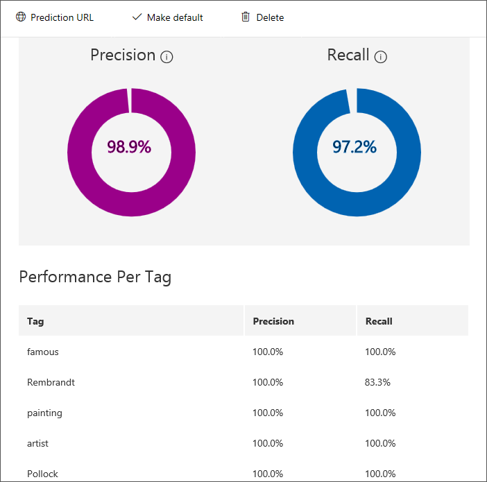

    _Results of training the model_ 

Noe let's test the model using the portal's Quick Test feature, which allows you to submit images to the model and see how it classifies them using the knowledge it gained from the training images.

<a name="Exercise4"></a>
## Exercise 4: Test the model ##

Although you will be creating an app to perform predictions using the Custom Vision Service Prediction API in a later exercise, the Custom Vision Service portal makes it easy to test image prediction via the Quick Test feature. 

In this exercise, you'll be testing model predictions by uploading a few images using the Custom Vision Service Quick Test feature to review prediction results.

1. In a browser, navigate to the [Custom Vision Service portal](https://www.customvision.ai/) and open your **Artworks** project, if not already open from the previous exercise.
  
1. In the Artworks workspace top menu, click **Quick Test** to view the "Quick Test" dialog.
 
	
    _A successful model training_ 

1. Click **Browse local files** and then browse to the **Quick Tests** folder located in the **Resources** folder included with this lab, select "PicassoTest_01.jpg", then click **Open**.

	
    _Selecting to browse local files from the Quick Test dialog_ 

	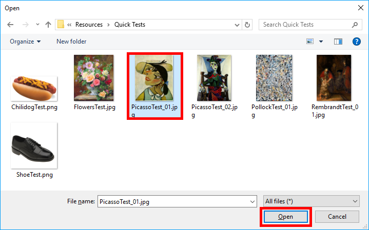
    _Selecting a Picasso image for Quick Test_ 

1. After a short delay, the Custom Vision Service returns a prediction, based on your trained model, that determines the image is almost certainly (in the range of 99%) an "artist", "painting", and "famous", and is highly likely (in the range of over 70%) to be a "Picasso".
 
	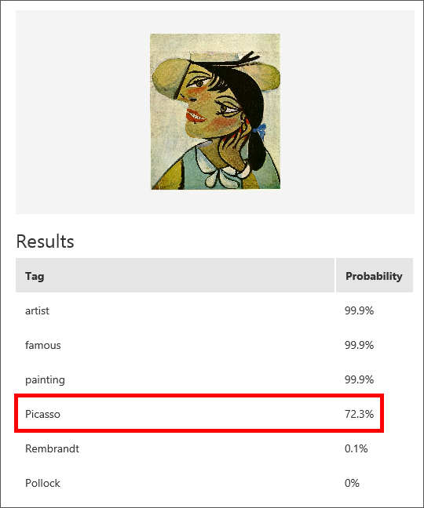
    _A successful prediction of a Picasso painting images_ 

1. After reviewing the Quick Test prediction results, close the "Quick Test" dialog by clicking the **[x]** in the top-right corner of the dialog.
1. Select the **Predictions** tab in the project workspace, then select the previously tested Picasso image from the workspace to view an image prediction detail dialog.
 
	
    _The project Predictions tab_ 
 
	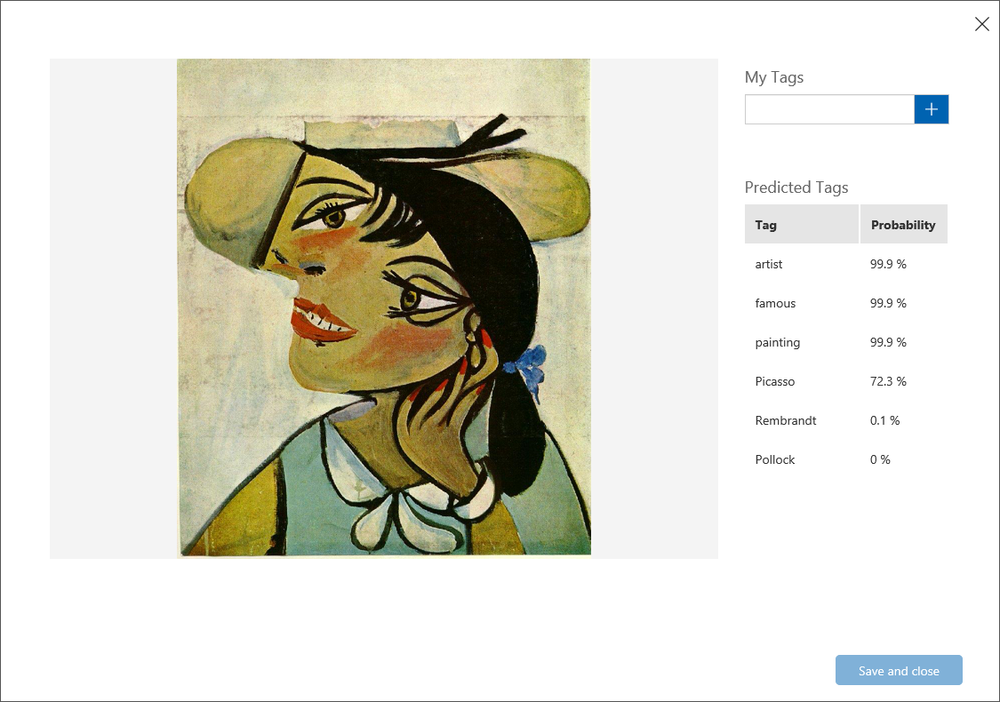
    _The image prediction detail dialog_ 

	Since you already know the image is a Picasso, you can further refine the Custom Vision Service prediction by tagging the predicted image as a Picasso.

1. Place your mouse cursor in the **tag entry** of the "My Tags" panel to view a list of previously defined tags, select the "Picasso" tag from the list, then click **Save and close**.

	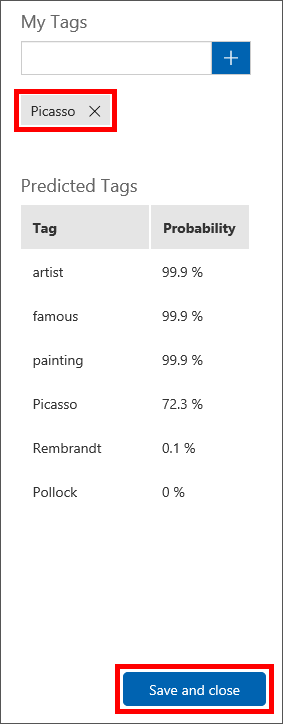
    _Adding a Picasso tag to the predicted image_ 

1. Perform another quick test on an additional image by repeating steps 3 and 4 using "FlowersTest.jpg". You’ll see the high prediction values for "artist", "famous", and "painting", and the extremely low likelihood (less than 1%) of the painting being a "Picasso", "Rembrandt", or "Pollock".

	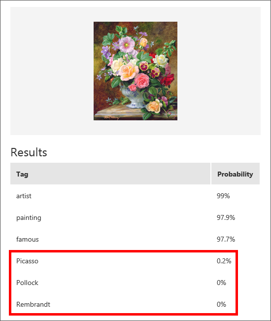
    _The image prediction detail dialog_ 

By performing a Quick Test on these images you've been able to get a hint of how "smart" the Custom Vision Service can be via the portal; the Custom Vision Service via the REST-based Prediction API is even more powerful. 

In the next exercise, you will be integrating the Prediction API into an app experience and prepare it for making predictions outside of the portal.

<a name="Exercise5"></a>
## Exercise 5: Create a Node.js app in Visual Studio Code ##

The true power of Microsoft Custom Vision Services is in the ability for developers to easily integrate model training and image prediction into an app experience.

In this exercise, you will be using Visual Studio Code to configure a pre-built app named Artwork that can select and predict paintings from famous artists, similar to the features of Quick Test in the previous exercise.

**If you have not installed Visual Studio Code on your local workstation, stop now and install it from the Microsoft [Visual Studio Code](http://code.visualstudio.com) portal.**

1. Open Visual Studio Code and use the **File** > **Open Folder...** command to select the **Resources** > **Client** > **Artworks** folder included with this lab.
 
	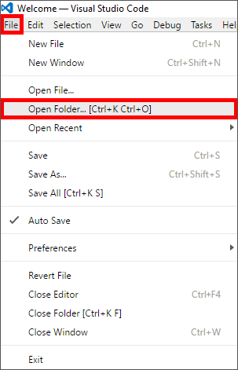
    _The Open Folder... menu in Visual Studio Code_ 
 
	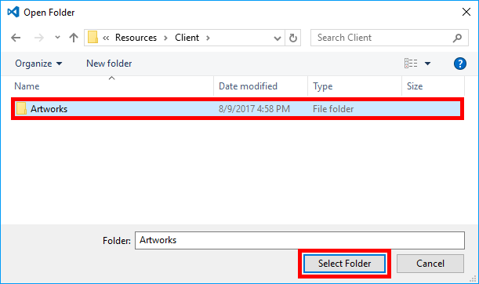
    _Selecting the Artworks folder from lab Resources_ 

1. In Visual Studio Code, open the **Integrated Terminal** using the **View** > **Integrated Terminal** command. 

	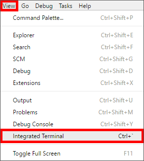
    _The Open Folder... menu in Visual Studio Code_ 

1.  Using the **Integrated Terminal** window, type the following command to determine whether Node.js is installed on your system:

	```	
	node -v
	```

	If Node is not installed (you don't see a Node version number), then go to https://nodejs.org/ and install the version of Node that matches your operating system.

1. Still in the **Integrated Terminal** window, execute the following command to restore any packages required by the app:

	```
	npm install
	```
	
	The Artworks app has been built to easily browse local images and send these images to the Custom Vision Service Prediction API; however the endpoint and authorization information will need to be added to a file in the project to access the project and model iteration created earlier in this lab.

1. In a browser, navigate to the [Custom Vision Service portal](https://www.customvision.ai/) and open your **Artworks** project, if not already open from the previous exercise.

1. Select the **Predictions** tab, then click **Make Default** from the actions panel. 

	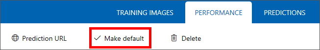
    _Setting an Iteration as the default_ 

	>Since Custom Vision Services support multiple iterations, the Predictions API requires a default iteration to be set or specified in the endpoint path.

1. Still on the **Predictions** tab, click **Prediction URL** to access the "How to use the Prediction API" panel.

	
    _Accessing the Prediction URL information_ 

1. Note the "If you have an image file" section of the instructions. The information in this section will be required since the Artworks app send files to the API instead of URLs.

	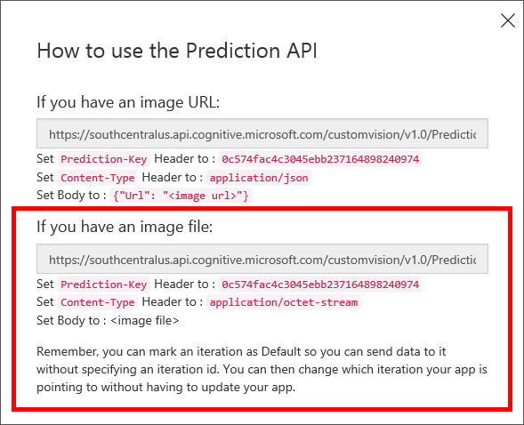
    _Setting an Iteration as the default_ 

1. Copy the entire value of the Prediction API **endpoint** to the clipboard. 

	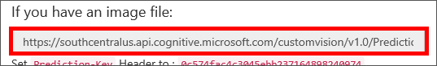
    _The Prediction API endpoint_ 

1. Return to Visual Studio Code, then locate and open **predict.js** from the Explorer window.

	
    _The Artworks predict.js file_ 

1. Locate the **url** variable on line 3, then paste to replace the value "PREDICTION_ENDPOINT" with the endpoint value contained in the clipboard.
 
	
    _The PREDICTION_ENDPOINT placeholder_ 

1. Return to the "How to use the Prediction API" panel in the Custom Vision Service portal, then copy the entire value of the **Prediction-Key** to the clipboard. 

	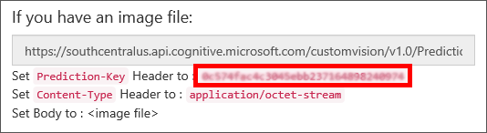
    _The Prediction API Prediction-Key value_ 

1. Locate the **predictionKey** variable on line 4, then paste to replace the value "PREDICTION_KEY" with the value contained in the clipboard.

	
    _The PREDICTION_KEY placeholder_ 

1. Look at the Prediction Endpoint (url) and Prediction Key (predictionKey) in the code block beginning on line 34 of the predict.js file. Using the Custom Vision Service Prediction API is as easy as making a simple, authenticated POST to an endpoint.

	
    _Making an authenticated POST to the Prediction API endpoint_ 

1. Return to the **Integrated Terminal** window, then execute the following command to start the Artworks app:

	```
	npm start
	```

1. Confirm that the Artworks app starts and displays a window like this one:

	
    _The Artworks app running for the first time_ 

You're all set! With the Artworks app configured and ready to make predictions, the only thing left to do is to start using it.

<a name="Exercise6"></a>
## Exercise 6: Upload painting images to perform and view predictions ##

Earlier in this lab you performed a few "Quick Tests" via the Custom Vision Service portal to predict the probability of a painting belonging to a specific famous artist. What you may not have realized is that the Custom Vision Service portal uses the exact same Training and Prediction APIs a developer would use in their own app. This means a developer could, with just a little effort, recreate the entire experience of the Custom Vision Service portal on their own.

In this exercise, you will be using the Artworks app to upload images from your local computer and send them to the Prediction API for analysis: essentially creating your own Quick Test service. Instead of viewing a percentage breakdown of all predicted image tags and probabilities, Artworks streamlines the process by simply identifying the likely artist or returns the probability that an image is not a painting from a famous artist at all.

1. In Visual Studio Code, return to the **Integrated Terminal** window, then execute the following command to start the Artworks app, if not already running from the previous exercise.

	```
	npm start
	```
1. Click the **Browse (...)** button under "step one" to locate images on your local computer. 

	
    _Browsing local files in the Artworks app_ 

1. Browse to the **Quick Tests** folder located in the **Resources** folder included with this lab, select "PicassoTest_02.jpg", then click **Open**.

1. After a short delay, "PicassoTest_02.jpg" will be displayed in the app, and the Prediction button will become enabled. Click **Predict** to begin the prediction process.

	
    _The Predict button in the Artworks app_ 

1. After another short delay, the Custom Vision Service Prediction API will return predictions and probabilities from the service and display the most likely artist:

	
    _A successful prediction of a Picasso image_ 

1. **Repeat steps 2 and 3** for the following images and observe the changes to predictions:

	- RembrandtTest_01.jpg
	- PollockTest_01.jpg

	
    _A successful prediction of a Rembrandt image_ 

1. **Repeat steps 2 and 3 again**, for images that are obviously not famous paintings:

	- Chilidog.png
	- ShoeTest.png

	
    _A successful prediction of a "not famous" image_ 

	As you can see, using the Prediction API from an app is just as reliable as through the Custom Vision Service portal—and way more fun! What's more, if you view the Predictions tab at the portal you'll notice each of the images uploaded via Artworks is now available there as well:
 
	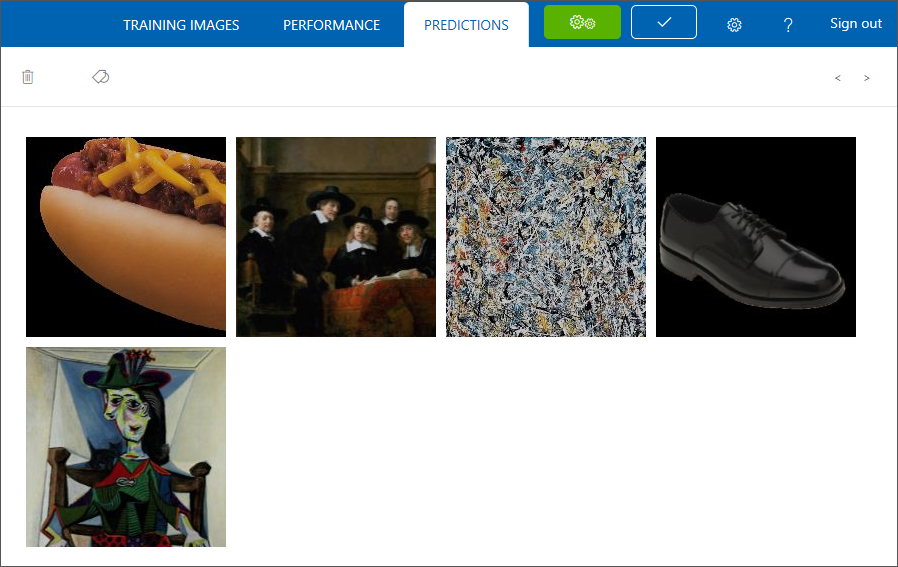
	_Images from Artworks displaying in the Predictions tab_ 

Although powerful, Artworks requires only a single API call to work its magic. The Microsoft Custom Vision Service provides many additional APIs, including methods to create and manage projects, upload images for tagging, and even model training and iteration management.

<a name="Summary"></a>
## Summary ##

In this hands-on lab you learned how to:

- Create a Custom Vision Service project 
- Build and refine project classifiers
- Populate and tag images 
- Train a Custom Vision classifier  
- Check predictions via the Quick Test 
- Create a Node.js app to use the Custom Vision Service Prediction API 
- Upload painting images to perform and view predictions

You've worked through a lot of great scenarios in this lab, but this is really just the beginning. The power of the Microsoft Computer Vision Service, especially when combined with your own services and user experiences, is only a few lines of code away.

---

Copyright 2017 Microsoft Corporation. All rights reserved. Except where otherwise noted, these materials are licensed under the terms of the MIT License. You may use them according to the license as is most appropriate for your project. The terms of this license can be found at https://opensource.org/licenses/MIT.
