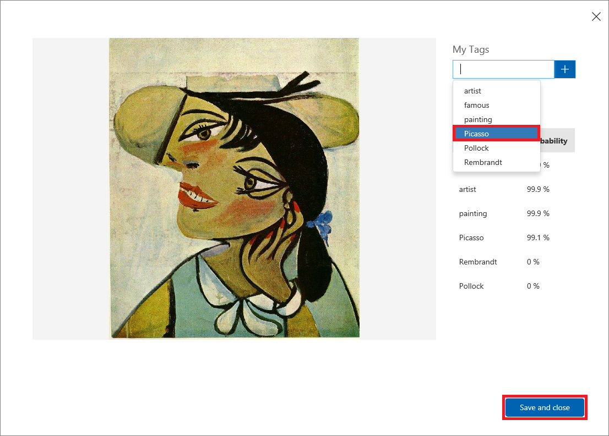

<a name="HOLTitle"></a>
# Using the Custom Vision Service to Perform Image Classification #

---

<a name="Overview"></a>
## Overview ##

[Microsoft Cognitive Services](https://azure.microsoft.com/en-us/services/cognitive-services/ "Microsoft Cognitive Services") is a suite of APIs and services backed by machine learning that enables developers to incorporate intelligent features such as facial recognition in photos and videos, sentiment analysis in text, and language understanding into their applications. Microsoft's [Custom Vision Service](https://azure.microsoft.com/en-us/services/cognitive-services/custom-vision-service/) is among the newest members of the Cognitive Services suite. Its purpose is to create image classification models that "learn" from labeled images you provide. Want to know if a photo contains a picture of a flower? Train the Custom Vision Service with a collection of flower images, and it can tell you whether the next image includes a flower — or even what type of flower it is.


The Custom Vision Service enables organizations to develop domain-specific image-classification models and use it to analyze image content. Examples include identifying a dog's breed from a picture of the dog, analyzing images for adult content, and identifying defective parts produced by manufacturing processes. It was recently used to [help search-and-rescue drones](https://blogs.technet.microsoft.com/canitpro/2017/05/10/teaching-drones-to-aid-search-and-rescue-efforts-via-cognitive-services/) identify objects such as boats and life vests in large bodies of water and recognize potential emergency situations in order to notify a rescue squad without waiting for human intervention.

In this lab, you will create a Custom Vision Service model, train it with images of famous paintings tagged with the artists' names, and utilize the model from a Node.js app to identify the artist of paintings that you upload. Along the way, you will learn how to train a Custom Vision Service model and leverage it from your apps using REST APIs.

<a name="Objectives"></a>
### Objectives ###

In this hands-on lab, you will learn how to:

- Create a Custom Vision Service project 
- Train a Custom Vision Service model with tagged images  
- Test a Custom Vision Service model 
- Create apps that leverage Custom Vision Service models by calling REST APIs 

<a name="Prerequisites"></a>
### Prerequisites ###

The following are required to complete this hands-on lab:

- A Microsoft account. If you don't have one, [sign up for free](https://account.microsoft.com/account).
- Microsoft [Visual Studio Code](http://code.visualstudio.com) version 1.14.0 or higher

---

<a name="Exercises"></a>
## Exercises ##

This hands-on lab includes the following exercises:

- [Exercise 1: Create a Custom Vision Service project](#Exercise1)
- [Exercise 2: Upload tagged images](#Exercise2)
- [Exercise 3: Train the model](#Exercise3)
- [Exercise 4: Test the model](#Exercise4)
- [Exercise 5: Create a Node.js app that uses the model](#Exercise5)
- [Exercise 6: Upload painting images to perform and view predictions](#Exercise6)

Estimated time to complete this lab: **60** minutes.

<a name="Exercise1"></a>
## Exercise 1: Create a Custom Vision Service project ##

The first step is to buulding an image-classification model with the Custom Vision Service is to create a project in the Custom Vision Service portal.

1. Open the [Custom Vision Service portal](https://www.customvision.ai/) in your browser. Then click **Sign In**. 
 
    

    _Signing in to the Custom Vision Service portal_

1. If you are asked to sign in, do so using the credentials for your Microsoft account. If you are asked to let this app access your info, click **Yes**, and if prompted, agree to the terms of service.

1. Click **New Project** to create a new project.
  
	

    _Creating a Custom Vision Service project_

1. In the "New project" dialog, name the project "Artworks," ensure that **General** is selected as the domain, and click **Create project**.

	> A domain optimizes a classifier for specific types of images. For example, if your goal is to classify food images by the types of food they contain or the ethnicity of the dishes, then it might be helpful to select the Food domain. For scenarios that don't match any of the offered domains, or if you are unsure of which domain to choose, select the General domain.

	

    _Creating a Custom Vision Service project_

The next step is to train the model by uploading images to the project and providing tags for those images.

<a name="Exercise2"></a>
## Exercise 2: Upload tagged images ##

In this exercise, you will add images of famous paintings by Pablo Picasso, Jackson Pollock, and Rembrandt to the Artworks project, and then tag the images so the Custom Vision Service can learn to differentiate one artist from another.
  
1. Click **Add images** to add an image to your project.

	

    _Adding images to the Artworks project_ 
 
1. Click **Browse local files**.

	

    _Browsing local files in the Artworks project_ 
 
1. Browse to "Resources\Artists\Picasso" folder included with this lab, select **Picasso_01.jpg**, and click **Open**.

	

    _Selecting an image_ 
 
1. Type "painting" (without quotation marks) into the **Add some tags** box. Then click **+** to assign the tag to the image.

	

    _Adding a "painting" tag to the image_ 

1. Repeat Step 4 to add the following tags to the image:

	- artist
	- famous
	- Picasso

1. Click **Upload 1 file** to upload the image. Once the upload has completed, click **Done**.

	

    _Uploading a tagged image_ 

1. Confirm that the page you uploaded appears in the portal, along with the tags you added to it.

	

    _The uploaded image_ 

1. When training a Custom Vision Service model, the more tagged images you upload, the better. Click **Add images** in the workspace menu at the top of the page, and then click **Browse local files**. Browse to "Resources\Artists\Picasso" folder included with this lab and select all of the remaining Picasso images, **Picasso_02.jpg** through **Picasso_07.jpg**. Then click **Open**. 

	

    _Selecting the remaining Picasso images_ 
 
1. Add the tags "artist", "famous", "painting", and "Picasso" to the images by selecting them one by one from the drop-down list. Then click **Upload 6 files**. Once the uploads have completed, click **Done**.

	

    _Tagging the selected images_ 

1. Confirm that all seven Picasso images appear in the workspace.

	

    _Picasso images uploaded to the project_ 

1. With seven Picasso images, the Custom Vision Service can do a decent job of identifying paintings by Picasso. But if you trained the model right now, it would only understand what a Picasso looks like, and it would not be able to identify paintings by other artists.

	The next step is to upload some paintings by another artist. Repeat Steps 8 and 9 to select all of the images in this lab's "Resources\Artists\Rembrandt" folder, tag them with the terms "painting," "artist," "famous," and "Rembrandt" (not "Picasso"), and upload them to the project.

	

    _Uploading Rembrandt images_ 

1. Confirm that the Rembrandt images appear alongside the Picasso images in the project, and that "Rembrandt" appears in the list of tags.

	

    _Picasso and Rembrandt images_ 

1. Now let's add a few paintings from the enigmatic Jackson Pollock to test the Custom Vision Service's ability to recognize Pollock paintings, too. Repeat Steps 8 and 9 to select all of the images in this lab's "Resources\Artists\Pollock" folder, tag them with the terms "painting," "artist," "famous," and "Pollock", and upload them to the project.

With the tagged images uploaded, the next step is to train the model with these images so it can distinguish between paintings by Picasso, Rembrandt, and Pollock, as well as determine whether a painting is a work by one of these famous artists.

<a name="Exercise3"></a>
## Exercise 3: Train the model ##

In this exercise, you will train the model using the tagged images uploaded in the previous exercise. Training is accomplished with a simple button click in the Custom Vision Service portal, and you can refine a model at any time by uploading additional tagged images and retraining it.
 
1. Click **Train** at the top of the page to train the model. Each time you train the model, a new iteration is created. The Custom Vision Service maintains several iterations, allowing you to compare your progress over time.

	

    _Training the model_ 

1. Wait for the training process to complete. (It should only take a few seconds.) Then review the training statistics presented to you for iteration 1. **Precision** and **recall** are separate but related  measures of the model's accuracy. Suppose that the model was presented with three Picassos and three Van Goghs, and that it correctly identified two of the Picassos as "Picasso" images, but incorrectly identified two of the Van Goghs as "Picasso" images. In this case, the precision would be 50% (two of the four images it classified as Picassos are actually Picassos), while its recall would be 67% (it correctly identified two of the three Picasso images as Picassos). You can learn more about precision and recall from https://en.wikipedia.org/wiki/Precision_and_recall.

	

    _Results of training the model_ 

Noe let's test the model using the portal's Quick Test feature, which allows you to submit images to the model and see how it classifies them using the knowledge it gained from the training images.

<a name="Exercise4"></a>
## Exercise 4: Test the model ##

In [Exercise 5](#Exercise5), you will create a Node.js app that uses the model to identify the artist of paintings presented to it. But you don't have to write an app to test the model; you can do your testing in the portal, and you can further refine the model using the images that you test with. In this exercise, you will test the model's ability to identify the artist of a painting using several test images. While you're at it, you will use the test images to make the model more intelligent.

1. Click **Quick Test** at the top of the page.
 
	

    _Testing the model_ 

1. Click **Browse local files** and then browse to the "Quick Tests" folder in this lab's "Resources" folder. Select **PicassoTest_01.jpg**, and then click **Open**.

	

    _Selecting a Picasso test image_ 

1. Examine the results of the test in the "Quick Test" dialog. What is the probability that the painting is a Picasso? What is the probability that it is a Rembrandt or Pollock?

1. Close the "Quick Test" dialog. Then click **Predictions** at the top of the page.
 
	

    _Viewing the tests that have been performed_ 

1. Click the test image that you uploaded to show a detail of it. Then tag the image as a "Picasso" by selecting **Picasso** from the drop-down list and clicking **Save and close**.

	> By tagging test images this way, you can refine the model without uploading additional training images.
 
	

    _Tagging the test image_ 

1. Perform another quick test using the file named **FlowersTest.jpg** in the lab's "Resources\Quick Test" folder. Confirm that this image is assigned a low probability of being a Picasso, a Rembrandt, or a Pollock.

Finish up by clicking the **Train** button at the top of the page to retrain the model using the test images that you tagged. Until you do this, the "smarts" gained from the additional tagged images aren't incorporated into the model.

<a name="Exercise5"></a>
## Exercise 5: Create a Node.js app that uses the model ##

The true power of the Microsoft Custom Vision Service is the ease with which developers can incorporate its intelligence into their own applications. In this exercise, you will use Visual Studio Code to modify an app named Artwork to use the model you built and trained in previous exercises. Then you will use the app to identify the artists of paintings.

1. If Visual Studio Code isn't installed on your workstation, go to http://code.visualstudio.com and install it now.

1. Start Visual Studio Code and use the **File** > **Open Folder...** command to select the "Resources\Client\Artworks" folder included with this lab.

	

    _Selecting the Artworks folder_ 

1. Use the **View** > **Integrated Terminal** command to open an integrated terminal window in Visual Studio Code. Then execute the following command in the integrated terminal to load the packages required by the app:

	```
	npm install
	```

1. Return to the Artwork project in the Custom Vision Service portal, click **Performance**, and then click **Make Default** to make sure the latest iteration of the model is the default iteration. 

	

    _Setting an Iteration as the default_ 

1. Before you can run the app and use it to call the Custom Vision Service, it needs to be modified to include endpoint and authorization information. To that end, click **Prediction URL**.

	

    _Viewing Prediction URL information_ 

1. The ensuing dialog lists two URLs: one for uploading images via URL, and another for uploading local images. Copy the Prediction API URL for image files to the clipboard. 

	

    _Copying the Prediction API URL_ 

1. Return to Visual Studio Code and click **predict.js** to open it in the code editor.

	

    _Opening predict.js_ 

1. Replace "PREDICTION_ENDPOINT" in line 3 with the URL on the clipboard.

	

    _Adding the Prediction API URL_ 

1. Return to the Custom Vision Service portal and copy the Predction API key to the clipboard. 

	

    _Copying the Prediction API key_ 

1. Return to Visual Studio Code and replace "PREDICTION_KEY" in line 4 of **predict.js** with the API key on the clipboard.

	

    _Adding the Prediction API key_ 

1. Scroll down in **predict.js** and examine block of code that begins on line 34. This is the code that calls out to the Custom Vision Service using AJAX. Using the Custom Vision Service Prediction API is as easy as making a simple, authenticated POST to a REST endpoint.

	

    _Making a call to the Prediction API_ 

1. Return to the integrated terminal in Visual Studio Code and execute the following command to start the app:

	```
	npm start
	```

1. Confirm that the Artworks app starts and displays a window like this one:

	

    _The Artworks app_ 

Artworks is a cross-platform app written with Node.js and [Electron](https://electron.atom.io/). As such, it is equally capable of running on Windows, macOS, and Linux. In the next exercise, you will use it to classify images by the artists who painted them.

<a name="Exercise6"></a>
## Exercise 6: Upload painting images to perform and view predictions ##

Earlier in this lab you performed a few "Quick Tests" via the Custom Vision Service portal to predict the probability of a painting belonging to a specific famous artist. What you may not have realized is that the Custom Vision Service portal uses the exact same Training and Prediction APIs a developer would use in their own app. This means a developer could, with just a little effort, recreate the entire experience of the Custom Vision Service portal on their own.

In this exercise, you will be using the Artworks app to upload images from your local computer and send them to the Prediction API for analysis: essentially creating your own Quick Test service. Instead of viewing a percentage breakdown of all predicted image tags and probabilities, Artworks streamlines the process by simply identifying the likely artist or returns the probability that an image is not a painting from a famous artist at all.

1. Click the **Browse (...)** button in the Artworks app. 

	

    _Browsing for local images in the Artworks app_ 

1. Browse to the "Quick Tests" folder in the "Resources" folder accompanying this lab. Select the file named **PicassoTest_02.jpg**, and then click **Open**.

1. Click the **Predict** button to submit the image to the Custom Vision Service.

	

    _Submitting the image to the Custom Vision Service_ 

1. Confirm that the app identifies the painting as a Picasso.

	

    _Classifying an image as a Picasso_ 

1. Repeat steps 1 through 3 for **RembrandtTest_01.jpg** and **PollockTest_01.jpg** and confirm that the app can identify paintings by Rembrandt and Pollock.

	

    _Classifying an image as a Rembrandt_ 

1. Repeat steps 1 through 3 for **Chilidog.png** and **ShoeTest.png** and observe the results.

	

    _Definitely not a Picasso_ 

1. As you can see, using the Prediction API from an app is just as reliable as through the Custom Vision Service portal — and way more fun! What's more, if you go to the Predictions page in the portal, you'll find that each of the images uploaded via from the app is available there as well:
 
	

	_Images submitted to the Custom Vision Service_ 

Once the model is trained, a simple API call is all that's required to leverage its intelligence in an application. Feel fry to test with images of your own and gauge the model's adeptness at identifying artists or determining that an image is not a Picasso, Rembrandt, or Pollock. And if you'd like to train it to recognize Van Goghs, too, simply upload some Van Gogh paintings tagged with "Van Gogh" and retrain the model. There is no limit to the intelligence you can build if you're willing to do the training. And remember that in general, the more images you train it with, the smarter the model will be.

<a name="Summary"></a>
## Summary ##

Image classification is playing an increasingly large role in industry as a means for automating such tasks as checking images uploaded to Web sites for offensive content and inspecting parts rolling off of assembly lines for defects. Building an image-classification model by hand requires no small amount of expertise, but the Custom Vision Service enables virtually anyone to build sophisticated image-classification models. And once a model is created, an app that uses it is only few lines of code away.

You used the Custom Vision Service portal to create the model and train it with tagged images, but realize that everything you did in the portal can also be accomplished programmatically using the [Custom Vision Training API](https://southcentralus.dev.cognitive.microsoft.com/docs/services/d9a10a4a5f8549599f1ecafc435119fa/operations/58d5835bc8cb231380095be3). This REST-based API contains methods for uploading images, tagging images, training the model, and much more, and it can be called from any language that supports REST calls over HTTPS.


---

Copyright 2017 Microsoft Corporation. All rights reserved. Except where otherwise noted, these materials are licensed under the terms of the MIT License. You may use them according to the license as is most appropriate for your project. The terms of this license can be found at https://opensource.org/licenses/MIT.
