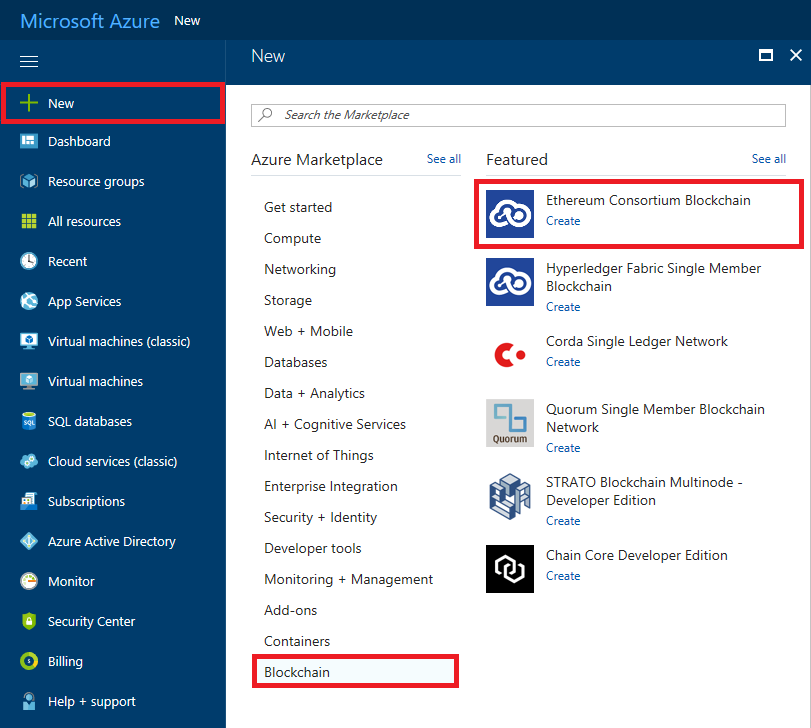
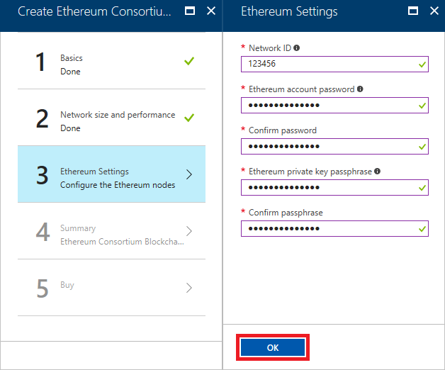
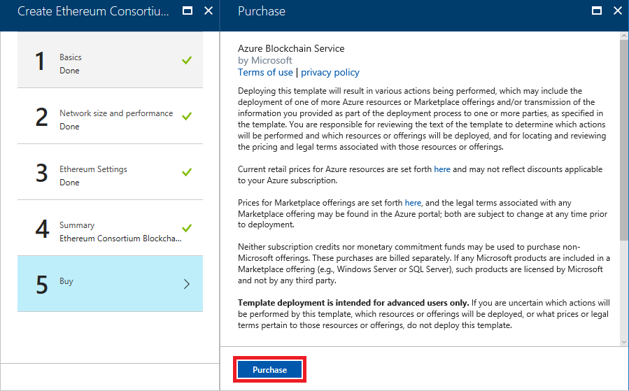
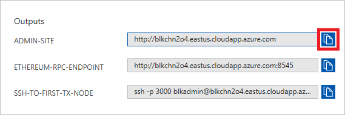
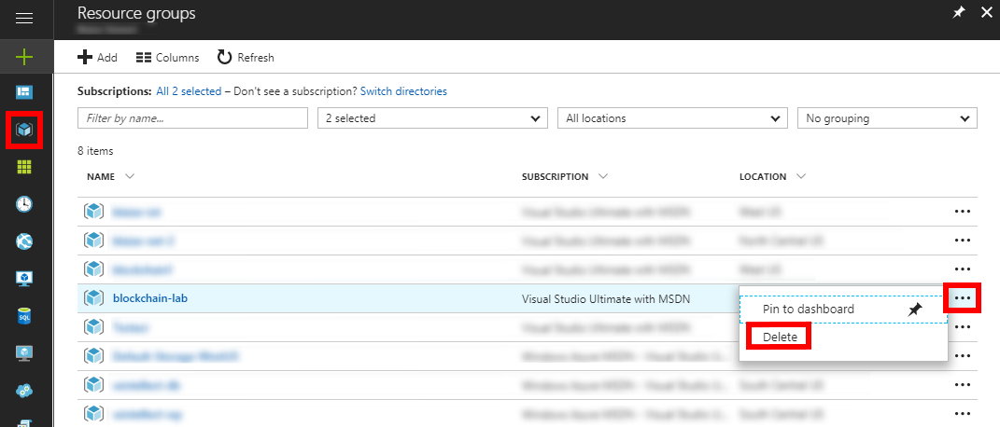

<a name="HOLTitle"></a>
# Blockchain-as-a-Service on Azure #

---

<a name="Overview"></a>
## Overview ##

When one hears the word "blockchain", probably the first thing to pop in one's head is cryptocurrecncy, more specifically Bitcoin. Undoubtedly, blockchain technology from its inception has been used to support cryptocurrecy, however the technology itself isn't restricted to cryptocurrecy. 

[Blockchain](https://en.wikipedia.org/wiki/Blockchain) technology is more about creating a network of trust between multiple parties in a decentralized manner. In other word, a blockchain is meant to be shared with others, and the more it is shared, the more secure it becomes. By secure, we're not talking about data being kept from prying eyes, rather creating a network of immutable data that is tamper-proof and resistant to corruption. A great overview of Blockchain can be found at https://blockgeeks.com/guides/what-is-blockchain-technology/.

Azure offers [Ethereum](https://www.ethereum.org/) as Blockchain as a Service. Ethereum is one of the first general-purpose blockchains to be invented. It still functions with the same basic principals as a blockchain for cryptocurrencies -- there is the blockchain network itself and the mining nodes that do computationally complex algorithms to mine "Ether", which is the digital fuel on an Ethereum network. Ether is the "gas" for running "smart contracts" on a blockchain. A smart contract though is really nothing more than a program that executes on a blockchain. The nature of these smart contracts could be whatever the developer of the contract determines that to be. For an Ethereum network, this may be a particular kind of application for the industry in which the blockchain is being applied.

<a name="Objectives"></a>
### Objectives ###

In this lab, you will set up an Ethereum network and create your own cryptocurrency called My Coin to run on the network. The currency will be brokered by a smart contract that allows currency to be transferred from one user to another.

<a name="Prerequisites"></a>
### Prerequisites ###

- An active Microsoft Azure subscription. If you don't have one, [sign up for a free trial](http://aka.ms/WATK-FreeTrial).
- [PuTTY](http://www.chiark.greenend.org.uk/~sgtatham/putty/download.html) and PowerShell (Windows users only)
- [Google Chrome](https://www.google.com/chrome/browser/desktop/index.html)
- [Node.js](https://nodejs.org)

<a name="Exercises"></a>
## Exercises ##

This hands-on lab includes the following exercises:

- [Exercise 1: Create a blockchain on Azure](#Exercise1)
- [Exercise 2: Create a wallet](#Exercise2)
- [Exercise 3: Unlock the basecoin account (Windows)](#Exercise3)
- [Exercise 4: Unlock the basecoin Account (macOS and Linux) ](#Exercise4)
- [Exercise 5: Deploy smart contracts](#Exercise5)
- [Exercise 6: Deploy an app that uses a contract](#Exercise6)
- [Exercise 7: Delete the Ethereum network](#Exercise7)

Estimated time to complete this lab: **60** minutes.

<a name="Exercise1"></a>
## Exercise 1: Create a blockchain on Azure ##

Setting up a blockchain on Azure is really pretty simple and only takes a few minutes. 

1. In your browser, navigate to the [Azure Portal](https://portal.azure.com). If you are asked to sign in, do so using your Microsoft account.

1. In the portal, click **+ New**, followed by **Blockchain** and **Ethereum Consortium Blockchain**.

	

	_Creating an Ethereum blockchain_

1. Click the **Create** button at the bottom of the "Ethereum Consortium Blockchain" blade.

1. In the "Basics" blade, set **Resource prefix** to "blkchn" (without quotation marks), **VM user name** to "blkadmin" (without quotation marks), and the password to "Blockchain!321" (once more, without quotation marks). Make sure **Create new** is selected under **Resource group**, and enter "BlockchainResourceGroup" as the resource-group name. Select the location nearest you, and then click **OK**.

	

	_Entering basic settings_

1. Click **OK** at the bottom of the "Network Size and Performance" blade to accept the default settings for VM sizes, number of nodes, and so on.

	

	_Accepting the default network settings_

1. In the "Ethereum Settings" blade, set **Network ID** to 123456, and enter "Blockchain!321" in four places as the Ethereum account password and private key passphrase. Then click **OK**.

	

	_Entering Ethereum settings_

1. Review the settings in the "Summary" blade and click **OK**.

	

	_Viewing a summary of settings_

1. Click the **Purchase** button to begin the deployment.

	

	_Beginning the deployment_

The deployment will probably take 5 minutes or more to complete, but rather than wait for it to complete, proceed to Exercise 2 and begin the process of setting up a wallet. 

<a name="Exercise2"></a>
## Exercise 2: Create a wallet ##

The next thing to do with a blockchain network is to set up a wallet. For this, you'll use a Google Chrome extension called [MetaMask](https://metamask.io/). MetaMask enables you to use the Ether from a Blockchain network on Ethereum enabled websites as well as create an account with seeded Ether.

1. If Google Chrome isn't installed on your computer, [download it and install it](https://www.google.com/chrome/browser/desktop/index.html) now.

1. Start Chrome, paste the following link into the address bar, and press **Enter**. 

	```
	https://chrome.google.com/webstore/detail/meta-mask/nkbihfbeogaeaoehlefnkodbefgpgknn?hl=en
	```

1. Click **Add to Chrome**.

	

	_Adding MetaMask to Chrome_

1. Click **Add Extension**.

	

	_Installing the extension_

1. Click the MetaMask icon to the right of the address bar in Chrome, and then click **Accept**.

	

	_Accepting the privacy notice_

1. Scroll to the bottom of the terms of use, and then click **Accept**.

	

	_Accepting the terms of use_

1. Enter "Blockchain!321" (without quotation marks) as the password in two places, and then click **Create** to create a MetaMask "den."

	

	_Creating a MetaMask den_

1. Copy the 12 words presented to you into a text file and save the file for safekeeping. Then click **I've Copied It Somewhere Safe**.

	

	_Saving MetaMask recovery information_

1. Return to the Azure Portal. Click **Resource groups** in the ribbon on the left, and then click the resource group that you created for the Ethereum blockchain in [Exercise 1](#Exercise1).

	

	_Opening the resource group_

1. Make sure all deployments have finished. (If they haven't, periodically click the **Refresh** button at the top of the blade until all deployments have completed.) Then click **Deployments**, followed by **microsoft-azure-blockchain...**.

	

	_Opening the Blockchain resource_
	
1. Click the **Copy** button next to ETHEREUM-RPC-ENDPOINT under "Outputs."

	

	_Copying the endpoint URL_
 
1. Return to Chrome and the MetaMask window. (If the window is no longer displayed, click the MetaMask icon to the right of the address bar to display it again.) Then click the hamburger icon to display the MetaMask menu, and select **Settings** from the menu.

	

	_Opening MetaMask settings_

1. Paste the URL on the clipboard into the "Current Network" box and and click **Save**. Then click the back arrow next to "Settings."

	

	_Entering the network URL_

1. Return to the Azure Portal and click the **Copy** button next to ADMIN-SITE.

	

	_Copying the admin-site link_

1. Open a new browser instance and paste the URL on the clipboard into the browser's address bar. Then press **Enter**.

	

	_Opening the admin site_

1. Return to Chrome. Click the ellipsis (**...**) in the MetaMask window, and then select **Copy Address to clipboard**.

	

	_Copying the address_

1. Return to the admin site you open in Step 15 and paste the value on the clipboard into the **Address of Recipient** box. Then click **Submit**.

	

	_Boostrapping the account with 1,000 Ether_

1. Return to MetaMask and click the refresh icon. Then select **Account 1** and confirm that the account now shows a balance of 1,000 Ether.

	

	_Refreshing the wallet_

You now have a virtual wallet as well as some virtual currency (Ethers) to work with. But before you can deploy anything to the Azure Ethereum Network, you must unlock the basecoin account.

<a name="Exercise3"></a>
## Exercise 3: Unlock the basecoin account (Windows) ##

Before you deploy an app to the Azure Ethereum Network, you need to unlock the basecoin account. To do that, you must connect to one of the Azure Ethereum servers with SSH. If you are running macOS or Linux, **skip to [Exercise 4](#Exercise4)** and use the built-in SSH client. If you are running Windows instead, proceed with this exercise.

1. PuTTY is a popular (and free) SSH client for Windows. If PuTTY isn't installed on your computer, [download and install it](http://www.chiark.greenend.org.uk/~sgtatham/putty/download.html) now.

1. Return to the Azure Portal and click the **Copy** button next to ADMIN-SITE.

	

	_Copying the admin-site link_

1. Start PuTTY and paste the value on the clipboard into the **Host Name (or IP address)** field. Remove "http://" from the beginning of the string, and type 3000 into the **Port** field. Then click the **Open** button to initiate a Secure Shell (SSH) connection. If you are prompted with a security warning asking if you want to update the cached key, answer yes.

	

	_Connecting with PuTTY_

1. A PuTTY terminal window will appear and you will be prompted to **login as**. Log in with the user name ("blkadmin") and password ("Blockchain!321") you entered in Exercise 1, Step 4.

1. Execute the following command in the console window to attach to the Ethereum node:

	```
	geth attach
	```

1. Now execute the following command to unlock the account:

	```
	web3.personal.unlockAccount(web3.personal.listAccounts[0],"Blockchain!321", 15000)
	```

	This will allow you to deploy smart contracts to the blockchain. Make sure that the output from the command is the word "true."

1. Type **exit** into the console window to detach from Ethereum.

1. Type **exit** again to close the SSH connection and end the PuTTY session.

Now proceed to [Exercise 5](#Exercise5). Exercise 4 is for macOS and Linux users only.

<a name="Exercise4"></a>
## Exercise 4: Unlock the basecoin account (macOS and Linux) ##

Before you deploy an app to the Azure Ethereum Network, you need to unlock the basecoin account. To do that, you must connect to one of the Azure Ethereum servers with SSH. macOS and Linux users can use the built-in SSH client to connect.

1. Return to the Azure Portal and click the **Copy** button next to SSH-TO-FIRST-TX-NODE.

	

	_Copying the SSH command_

1. Open a terminal window and paste the command on the clipboard into the terminal window. Then press **Enter** to execute the command. If you are prompted with a security warning asking if you want to update the cached key, answer yes.

1. When prompted for a password, enter the password ("Blockchain!321") you entered in Exercise 1, Step 4.

1. Execute the following command in the terminal window to attach to the Ethereum node:

	```
	geth attach
	```

1. Now execute the following command to unlock the account:

	```
	web3.personal.unlockAccount(web3.personal.listAccounts[0],"Blockchain!321", 15000)
	```

	This will allow you to deploy smart contracts to the blockchain. Make sure that the output from the command is the word "true."

1. Type **exit** into the terminal window to detach from Ethereum.

The Ethereum network is established, a wallet has been created and seeded with currency, and the account has been unlocked so apps can use it. Now it's time to have some fun. 

<a name="Exercise5"></a>
## Exercise 5: Deploy smart contracts ##

On your local machine, you can now start developing with the Ethereum blockchain. Blockchains use "smart contracts" to broker transactions. A smart contract is essentially a program that runs on blockchain transaction nodes. Ethereum developers often use [Truffle](http://truffleframework.com/), a popular framework that helps automate many of the processes used in developing smart contracts. In this exercise, you will set up a development environment and deploy some smart contracts to the blockchain with Truffle.

1. If Node.js isn't installed on your system, go to https://nodejs.org and install the latest LTS version for your operating system.

	> If you aren't sure whether Node.js is installed, open a Command Prompt or terminal window and type **node -v**. If you don't see a Node.js version number, then Node.js isn't installed. If a version of Node.js older than 6.0 is installed, it is highly recommend that you download and install the latest version.

1. On Mac or Linux, open a terminal. On Windows, open a PowerShell window.

1. In the terminal or PowerShell window, navigate to the directory you would like to use as a project directory. Then use the following command to create a directory named "truffle:"

	```
	mkdir truffle
	```

1. Now change to the "truffle" directory:

	```
	cd truffle
	```

1. Use the following command to install Truffle:

	```
	npm install -g truffle
	```

1. Smart contracts for Ethereum networks are written in a language called Solidity. Use the following command to install the Solidity compiler:

	```
	npm install -g solc
	```

1. Use the following command to initialize a Truffle project. This will download a few Solidity scripts and install them, and create a scaffolding in the "truffle" folder.

	```
	truffle init
	```

1. Use your favorite text or program editor to open the file named **truffle.js** in the "truffle" folder. Copy the Ethereum RPC endpoint to the clipboard as you did in Exercise 2, Step 11. Replace "localhost" on line 4 of **truffle.js** with the URL on the clipboard, and remove the leading "http://" and the trailing ":8545," as shown below. Then save the modified file.

	```javascript
	module.exports = {
  	    networks: {
            development: {
                host: "blkchnhje.westus.cloudapp.azure.com",
                port: 8545,
   	            network_id: "*" // Match any network id
   	        }
 	    }
	};
	```

1. Create a new contract in the subfolder named "contracts" by creating a text file named **myCoin.sol** in that folder, pasting in the following code, and then saving the file:

	```javascript
	pragma solidity ^0.4.4;

	// Declares the contract
	contract myCoin {
		
	    // This is a mapping that works like a dictionary or associated array in other languages.
	    mapping (address => uint) balances;

	    // This registers an event
	    event Transfer(address indexed _from, address indexed _to, uint256 _value);

	    // The contract constructor, which is called when the contract is deployed to the blockchain.
	    // The contract is persistent on the blockchain, so it remains until it is removed.
	    function myCoin() {
	        balances[tx.origin] = 100000;
	    }

	    // This method modifies the blockchain. The msg.sender is required to fuel for the transaction in Ether.
	    function sendCoin(address receiver, uint amount) returns(bool sufficient) {
	        if (balances[msg.sender] < amount) return false;
	        balances[msg.sender] -= amount;
	        balances[receiver] += amount;
	        Transfer(msg.sender, receiver, amount);
	        return true;
	    }

	    // This method does not modify the blockchain, so it does not require an account to fuel for the call.
	    function getBalance(address addr) returns(uint) {
	        return balances[addr];
	    }
	}
	```

	This contract is written in [Solidity](https://solidity.readthedocs.io/en/develop/), which is similar to JavaScript. Solidity files are compiled to JSON files containing interface definitions for contracts as well as the bytecode that is used when the contracts are deployed.

1. Create a new file in the "migrations" subfolder named **3_deploy_myCoin.js**. Paste the following code into the file and save it:

	```javascript
	var myCoin = artifacts.require("./myCoin.sol");

	module.exports = function(deployer) {
	    deployer.deploy(myCoin);
	};
	```

1. Return to the terminal or PowerShell window and execute the following command to compile the  contracts:

	```
	truffle compile
	```

1. Now use the following command to deploy the contracts to the blockchain:

	```
	truffle deploy
	```

TODO: Add closing paragraph.

<a name="Exercise6"></a>
## Exercise 6: Deploy an app that uses a contract ##

Smart contracts are designed for interaction with applications that use the blockchain for secure transactions. In this case, you will deploy a node app that will use the myCoin contract, which brokers the exchanges of a virtual currency similar to real world cryptocurrencies. Node uses a library called [web3.js](https://github.com/ethereum/web3.js/), which is a wrapper around the Ethereum RPC. There are other available web3 libraries for other languages including Java and Python.

1. Create a new folder called **use-contract**.

1. CD to the folder **use-contract**

	```
	cd use-contract
	```

1. Run npm to install web3

	```
	npm install web3@^0.20.0
	```

1. Create a new text file called **use-contract.js**, paste in the following code, then save the file.

	```javascript
	var Web3 = require("web3")

	var AzureBlockchainRPC = "<AZURE RPC URL>"
	var account1 = "<ACCOUNT1 ADDRESS>"
	var contractAddress = "<CONTRACT ADDRESS>"

	let web3 = new Web3();
	web3.setProvider(new web3.providers.HttpProvider(AzureBlockchainRPC));

	// The abi object defines the contract interface. Web3 uses this to build the contract interface.
	var abi = JSON.parse('[{"constant":false,"inputs":[{"name":"receiver","type":"address"},{"name":"amount","type":"uint256"}],"name":"sendCoin","outputs":[{"name":"sufficient","type":"bool"}],"payable":false,"type":"function"},{"constant":false,"inputs":[{"name":"addr","type":"address"}],"name":"getBalance","outputs":[{"name":"","type":"uint256"}],"payable":false,"type":"function"},{"inputs":[],"payable":false,"type":"constructor"},{"anonymous":false,"inputs":[{"indexed":true,"name":"_from","type":"address"},{"indexed":true,"name":"_to","type":"address"},{"indexed":false,"name":"_value","type":"uint256"}],"name":"Transfer","type":"event"}]');

	let myCoinContract = web3.eth.contract(abi);
	let myCoinInstance = myCoinContract.at(contractAddress);

	// This sets up a listerner on the Transfer event.
	var transferEvent = myCoinInstance.Transfer( {}, {fromBlock: 0, toBlock: 'latest'})

	// Watching for transfer.... 
	transferEvent.watch(function(error, result){
	    if (!error){
	        console.log("Coin Sent! \n\n Checking balance for coin base...")
	        console.log(myCoinInstance.getBalance.call(web3.eth.coinbase));
	        console.log("Checking balance for account1...")
	        console.log(myCoinInstance.getBalance.call(account1));
	    }
	    else {
	        console.log("An error occurred.")
	        console.log(error);
	    }
	});

	web3.eth.defaultAccount = web3.eth.coinbase;
	console.log("Sending some coin...");

	// Notice that this method invocation does not use .call.
	// The invocation passes a from parameters in an object. 
	// This is because transactions require Ether to modify the blockchain.
	console.log(myCoinInstance.sendCoin(account1, 1000, {from: web3.eth.coinbase}))

	console.log("Checking balance for coin base...")
	// Notice this method invocation does use .call
	// This method is a read-only call, so it does not require ether.
	console.log(myCoinInstance.getBalance.call(web3.eth.coinbase));

	console.log("Checking balance for account1...")
	console.log(myCoinInstance.getBalance.call(account1));

	console.log("Waiting for event to fire...");
	```

1.  Under **Outputs** on the **Deployment**, select the **Copy** button next to **ETHEREUM-RPC-ENDPOINT**.

	

	_Copy RPC URL_
 
1. Paste the copied URL over **<AZURE RPC URL>** in the **use-contract.js**.

1. Back in the PowerShell or Terminal session, use Truffle to get the address of the contract with **truffle networks**.

	```
	truffle networks
	``` 

	This command will write out a list of contracts that are being managed by Truffle. Copy the address next to myCoin.

	

	_Copy Contract Address_
 
1. Paste the copied contract address over **<CONTRACT ADDRESS>** in **use_contract.js**
	
1. Now in MetaMask, copy the address for **Account 1** like you did in **Step 14** in **Setting Up A Wallet**. Click on the ellipses (**...**) next to **Account 1**, and **Copy Address to Clipboard**.

	

	_Copy Address to clipboard_

1. Paste the copied address over **<ACCOUNT1 ADDRESS>** in **use_contract.js**. Your configuration for the **use-contract.js** should look something like this:

	```javascript
	var AzureBlockchainRPC = "http://blkchni7t.westus.cloudapp.azure.com:8545"
	var account1 = "0x25F830d6096eBb97d1E175663E5E5f8Ad24e0be5"
	var contractAddress = "0x79fcaebcc2de9457f9227ebbdd2494d55ac73bea"
	```

1. Save the **use-contract.js** script.

1. Back in the PowerShell or Terminal session, run the script.

	```
	node use_constract.js
	```

1. Watch the output. Notice that before the event fired, the balances in the accounts were still at their pre-event values even though the ```sendCoin``` method had been invoked. This is because there is a delay between a transactions invocation and a transactions completion. The event though fires once the transaction is completed, the balances are changed and the blockchain is immutably modified. 

	```	
	Sending some coin...
	0xb677604426c9589bb1072f1ec517d2ad3d5e37c56f0b5d9a3b2d689a4bd962ad
	Checking balance for coin base...
	{ [String: '100000'] s: 1, e: 5, c: [ 100000 ] }
	Checking balance for account1...
	{ [String: '0'] s: 1, e: 0, c: [ 0 ] }
	Waiting for event to fire...
	Coin Sent!

	 Checking balance for coin base...
	{ [String: '99000'] s: 1, e: 4, c: [ 99000 ] }
	Checking balance for account1...
	{ [String: '1000'] s: 1, e: 3, c: [ 1000 ] }
	```

<a name="Exercise7"></a>
## Exercise 7: Delete the Ethereum network ##

Resource groups are a useful feature of Azure because they simplify the task of managing related resources. One of the most practical reasons to use resource groups is that deleting a resource group deletes all of the resources it contains. Rather than delete those resources one by one, you can delete them all at once.

In this exercise, you will delete the resource group created in [Exercise 1](#Exercise1) when you created the Ethereum network. Deleting the resource group deletes everything in it and prevents any further charges from being incurred for it.

1. Return to the blade for the resource group you created in Exercise 1. Then click the **Delete** button at the top of the blade.

	

	_Deleting a resource group_

1. For safety, you are required to type in the resource group's name. (Once deleted, a resource group cannot be recovered.) Type the name of the resource group. Then click the **Delete** button to remove all traces of this lab from your Azure subscription.

After a few minutes, the blockchain and all of the associated resources will be deleted. Billing stops when you click the **Delete** button, so you're not charged for the time required to delete the resources. Similarly, billing doesn't start until the resources are fully and successfully deployed.

<a name="Summary"></a>
## Summary ##

In this lab, you set up an Ethereum Blockchain on Azure, created a wallet to store ether, deployed some smart contracts to the blockchain, then executed transactions against the blockchain.

Blockchains are typically used for cryptocurrencies but have many use cases beyond this, such as a voting operations for elections, public opinion polls, public ledgers between companies, score keeping for games, for token currencies on a web site, as a way to securely track expenses in a company, and many more. These applications are but one of the  uses for blockchains.

You can learn more about Ethereum networks on the [Ethereum](https://www.ethereum.org/) Web site and more about smart contracts from [Solidity](https://solidity.readthedocs.io/en/develop/).

---

Copyright 2017 Microsoft Corporation. All rights reserved. Except where otherwise noted, these materials are licensed under the terms of the MIT License. You may use them according to the license as is most appropriate for your project. The terms of this license can be found at https://opensource.org/licenses/MIT. 