
# Azure Storage and Cognitive Services #

---

## Overview ##

Microsoft Azure Storage is a set of services that allows you to store large volumes of data in a cost-effective manner and in a way that makes the data readily and reliably available to services and applications that consume it. Data committed to Azure Storage can be stored in blobs, tables, queues, or files. [Azure blobs](http://azure.microsoft.com/en-us/services/storage/blobs/) are ideal for storing images, videos, and other types of data, and are frequently used to provide input to and capture output from other Azure services such as [Azure Stream Analytics](http://azure.microsoft.com/en-us/services/stream-analytics/). [Azure tables](http://azure.microsoft.com/en-us/services/storage/tables/) provide NoSQL storage for semi-structured data. [Azure queues](http://azure.microsoft.com/en-us/services/storage/queues/) support queued message transfers between applications (or parts of applications) and can be used to make applications more scalable and robust by loosely coupling them together. Finally, [Azure Files](http://azure.microsoft.com/en-us/services/storage/files) use the Server Message Block (SMB) protocol to share files through the cloud and access storage as network drives.

Data stored in Microsoft Azure Storage can be accessed over HTTP or HTTPS using straightforward REST APIs, or it can be accessed using rich client libraries available for many popular languages and platforms, including .NET, Java, Android, Node.js, PHP, Ruby, and Python. The [Azure Portal](https://portal.azure.com) includes features for working with Azure Storage, but richer functionality is available from third-party tools, many of which are free and some of which work cross-platform.

In this lab, you will use Eclipse to write a Java app that accepts images uploaded by users and stores the images in Azure blob storage. You will learn how to read and write blobs in Java, and how to use blob metadata to attach additional information to the blobs you create. You will also get first-hand experience using [Microsoft Cognitive Services](https://www.microsoft.com/cognitive-services/), a set of intelligence APIs for building smart applications. Specifically, you'll submit each image uploaded by the user to Cognitive Services' [Computer Vision API](https://www.microsoft.com/cognitive-services/en-us/computer-vision-api) to generate a caption for the image as well as search metadata describing the contents of the image and an image thumbnail. And you will discover how easy it is to deploy apps to the cloud using the Azure Toolkit and Eclipse.

### Objectives ###

In this hands-on lab, you will learn how to:

- Create a storage account and storage containers using the Azure Portal
- Create a Web app in Visual Studio and deploy it to Azure
- Read and write blobs and attach metadata to them
- Use the Computer Vision API to extract information from images
- Use the cross-platform [Microsoft Azure Storage Explorer](http://storageexplorer.com/) to work with Azure Storage

### Prerequisites ###

The following are required to complete this hands-on lab:

- An active Microsoft Azure subscription. If you don't have one, [sign up for a free trial](http://aka.ms/WATK-FreeTrial).

## Exercises ##

This hands-on lab includes the following exercises:

- [Exercise 1: Create a storage account](#Exercise1)
- [Exercise 2: Get a subscription key for the Computer Vision API](#Exercise2)
- [Exercise 3: Setup Java and Eclipse](#Exercise3)
- [Exercise 4: Create a new project](#Exercise4)
- [Exercise 5: Run the app](#Exercise5)
- [Exercise 6: Deploy the app to Azure](#Exercise6)
- [Exercise 7: Cleaning up Azure Explorer](#Exercise7)

Estimated time to complete this lab: **75** minutes.

---

## Exercise 1: Create a storage account

The [Azure Portal](https://portal.azure.com) allows you to perform basic storage operations such as creating storage accounts, creating containers, and managing access keys. In this exercise, you will use the portal to create a storage account. Then you'll create a pair of containers: one to store images uploaded by the user, and another to store image thumbnails generated from the uploaded images.

1. Open the [Azure Portal](https://portal.azure.com) in your browser. If you are asked to log in, do so using your Microsoft account.
 
1. The first step in using Azure Storage is to create a storage account. To create a storage account, click **+ New** in the ribbon on the left. Then click **Storage**, followed by **Storage account**.

    

    _Creating a storage account_

1. In the ensuing "Create storage account" blade, enter a name for the new storage account in **Name** field. The name is important, because it forms one part of the URL through which blobs created under this account are accessed.

	> Storage account names can be 3 to 24 characters in length and can only contain numbers and lowercase letters. In addition, the name you enter must be unique within Azure. If someone else has chosen the same name, you'll be notified that the name isn't available with a red exclamation mark in the **Name** field.

	Once you have a name that Azure will accept (as indicated by the green check mark in the **Name** field), make sure **Resource manager** is selected as the deployment model and **General purpose** is selected as the account kind. Then select **Create new** under **Resource group** and type "IntellipixResourceGroup" (without quotation marks) into the box below to name the new resource group that will be created for the storage account. Finish up by selecting the location nearest you in the **Location** box, and clicking the **Create** button at the bottom of the blade to create the new storage account.
    
	

    _Specifying parameters for a new storage account_

1. Once the storage account has been created, click **Resource groups** in the ribbon on the left. Then click the "IntellipixResourceGroup" resource group, and in the blade that opens for the resource group, click the storage account you just created.
 
    

    _Opening the new storage account_

1. In the blade for the storage account, click **Blobs** to view a list of containers associated with this account.

    

    _Viewing blob containers_

1. The storage account currently has no containers. Before you can create a blob, you must create a container to store it in. Click **+ Container** to create a new container.

    

    _Adding a container_

1. Type "photos" (without quotation marks) into the **Name** field and select **Blob** as the **Access type**. Then click **Create** to create a container named "photos."

	> By default, containers and their contents are private. Selecting **Blob** as the access type makes the blobs in the "photos" container publicly accessible, but doesn't make the container itself public. This is what you want since the images stored in the "photos" container will be linked to from a Web app. 

    

    _Creating a "photos" container_

1. Repeat this process to create a container named "thumbnails," once more ensuring that the container's **Access type** is set to **Blob**.

1. Confirm that both containers appear in the list of containers for this storage account, and that the names are spelled correctly.

    

    _The new containers_

1. Once the containers are created, select **Access Keys** in the menu for the Storage Account blade, then click the **Copy** button next to the **Connection String** for **key1**. Paste this key into a text editor for later use.

    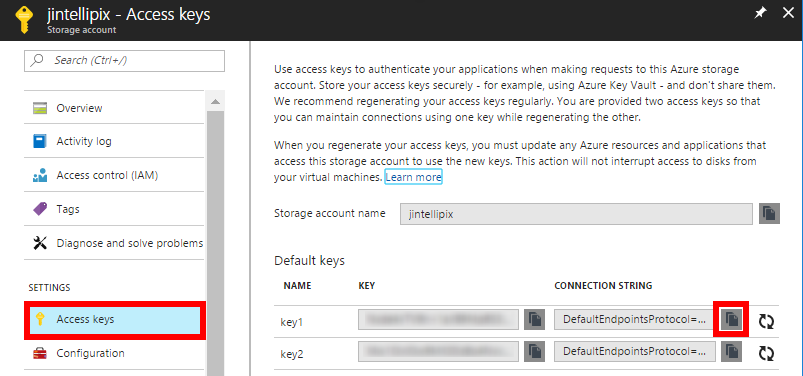

    _Get the connection string_

You have now created a storage account to hold images uploaded to the app you're going to build, and containers to store the images in. Note that you *could* create these containers from within the app. Whether to create them programmatically or create them as part of the provisioning process is a choice that's left up to app developers.

## Exercise 2: Get a subscription key for the Computer Vision API

[Microsoft Cognitive Services](https://www.microsoft.com/cognitive-services/) is a set of intelligence APIs that you can call from your apps. Among the more than 20 APIs it offers are the [Computer Vision API](https://www.microsoft.com/cognitive-services/en-us/computer-vision-api) for distilling actionable information from images, the [Emotion API](https://www.microsoft.com/cognitive-services/en-us/emotion-api) for recognizing emotion in images and video, and the [Text Analytics API](https://www.microsoft.com/cognitive-services/en-us/text-analytics-api) for extracting sentiments and other information from text (for example, Twitter feeds). These APIs make it possible to build smart apps that would have been impossible just a few short years ago. And they're available in preview form for you to begin using today.

In this exercise, you will acquire a subscription key allowing you to call the Computer Vision API from your code. You'll use this key in Exercise 4 to generate thumbnails from the images uploaded to the Web site, and to generate captions and search keywords for the images.

1. In the Azure Portal, Select the **+ New** icon, then choose **AI + Cognitive Services**, then select **Computer Vision API**.

    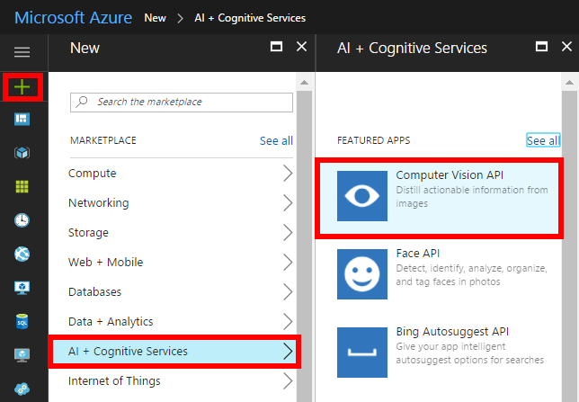

    _Add a new Computer Vision API_

1. In the configuration blade for the Computer Vision API, set **Name** to "Intellipix" (without quotation marks), Select the region nearest you for the **Location**, then choose **F0 (20 Calls per minute, 5k calls per month)** for the **Pricing Tier**. For the Resource Group, select **Use Existing**, then choose **IntellipixResourceGroup** that you created in Exercise 1. Check the box next to **I confirm I have read and understood the notice below**. Lastly, click **Create**. Give Azure a few moments to provision the Computer Vision API.

    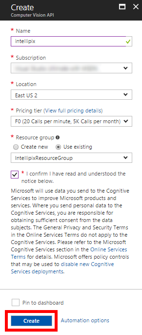

    _Configure a new Computer Vision API_

1. Next, choose the **Resource Group** icon, then click on the **IntellipixResourceGroup**, then select the **intellipix** Computer Vision API.

    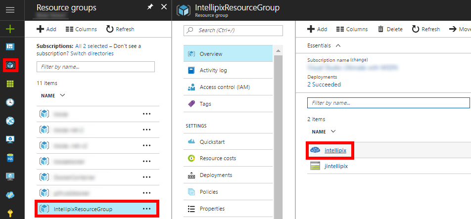

    _Select the Computer Vision API_

1. In the **Essentials** block, copy the **Endpoint** by clicking on the **Copy** button. If the Copy icon is not showing, move your cursor over the URL and it will appear. Paste the Endpoint URL into a text editor for later use. Then click on the **Show access keys** link.

    

    _Copy the computer vision endpoint URL_

1. On the **Manage keys** blade, click the **Copy** button next to **Key 1**. Paste this key into a text editor for later use.

    

    _Copy access keys_

## Exercise 3: Setup Java and Eclipse

[Eclipse](https://eclipse.org/) for the longest time has been one of the most popular IDE's for developing Java Apps. A rich ecosystem of components, plug-ins, and integrations have grown around it making it a very capable IDE for doing just about all things related to Java in the IDE. [Microsoft's Java group](https://azure.microsoft.com/en-us/develop/java/) has has provided tools for integrating Eclipse with Azure using the [Azure Toolkit](https://docs.microsoft.com/en-us/azure/azure-toolkit-for-eclipse). It comes with the ability to deploy apps to Azure either as Web Apps or Docker containers as well as tools for managing assets on Azure including Azure Storage, Web Apps, Redis Cache, HDI Insight, and Virtual Machines.

In this exercise, you will setup Java, Eclipse, and lastly the Azure Toolkit for Eclipse.

1. If you don't already have the JDK (Java Development Kit) installed, [download Java SE Development Kit](http://www.oracle.com/technetwork/java/javase/downloads/index.html) from Oracle's website and install it. 

	

	_Download the JDK_

	First, agree to the license, then select the installer to match your system (Mac, Linux, or Windows) as well as the bit length (32-bit or 64-bit). The installers for each platform are self-contained and will setup everything you need to run and compile Java. Once the installer downloads, run it and it will install the Java Development kit on your computer. The installation for each system will be slightly different, but they are all pretty straight forward.

	

	_Select the JDK_

1. Download the [Eclipse Installer](https://www.eclipse.org/downloads/). Eclipse is perhaps the most widely used IDE for doing Java Development, and it comes with a variety of tailor made installations depending on the nature of the development being done. In this case, you'll be doing web development with servlets, so you'll install the environment to support this kind of development.

	

	_Download Eclipse_

1. When the download completes, launch the installer. The installer will start the installation wizard. On the first screen, select **Eclipse IDE for Java EE Developers**.

	

	_Select IDE Environments_

1. On the second screen of the install wizard, select the installation location for Eclipse. Eclipse is a self-contained application, so if you have other instances of Eclipse, you can install it along side these other instances. After you select a location, click **Install**. The installer will take a few moments to complete so sit back while the installer finishes.

	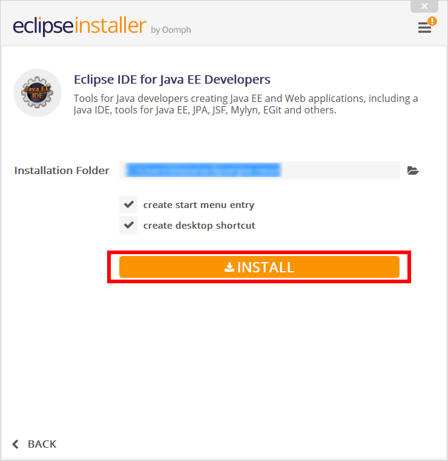

	_Install Eclipse_

1. After installation completes, launch Eclipse. Eclipse will ask you to create a **workspace**. A workspace contains a set of related projects. For the lab, create a workspace in your user colder called **intellipix**, then click **OK**.

	

	_Create a workspace_

1. From the **Help** menu, select **Eclipse Marketplace**. In the **Find** box, type in "Azure Toolkit" without the quotes and then click **Go**. After the search completes, click the **Install** button for the **Azure Toolkit for Eclipse**. 

	

	_Install the Azure Toolkit_

1. Review the license, then click the box next to **I accept the terms of the license agreement**. Then click **Finish**. This will then install the Azure Toolkit for Eclipse. Wait for the install to finish. 

	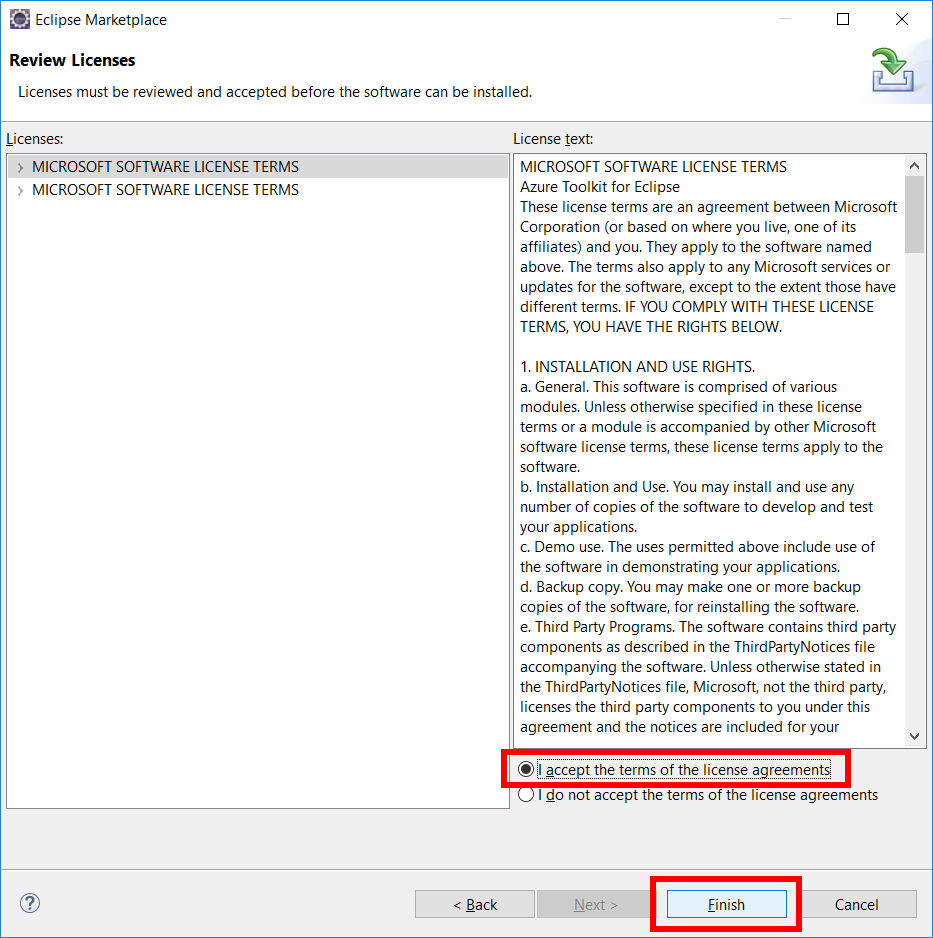

	_Accept the license_

	
1. After the install finishes, you'll be prompted to restart. Select **Yes**.

	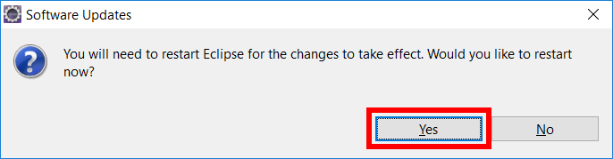

	_Restart Eclipse_

1. From the **Window** menu, select **Preferences**, then select Maven. Uncheck the box next to **Do not automatically update dependencies from remote sites**. Then click **OK**.

	

	_Change Maven updates_

Now Eclipse is setup so you can start creating projects.

## Exercise 4: Create a new project

Like most IDE's, Eclipse provides a number of templates for common project types. The Dynamic Web Project in Eclipse uses server-side Java code for building things like web services and web pages. The two most common technologies for this are Java Server Pages (JSP's) and servlets. These pages can be mapped to URL endpoints so that particular routes will be passed to the appropriate servlet.

In this exercise, you'll create a Dynamic Web Project and use some Azure API's in a servlet. Then you'll add a web page to the project to interact with the servlet through AJAX calls.

1. From the **File** menu, select **New**, then select **Dynamic Web Project**. Set **Project Name** to "Intellipix" without the quotes, then click **New Runtime**.  

	

	_Create a new project_

1. Select **Apache Tomcat v7.0** from the menu, then click the box next to **Create a new local server**, then click **Next**.

	

	_Create a runtime_

1. Select a directory to use as the run time directory by click **Browse**. It can be any directory so long as it is writable. After selecting a directory, click **Download and Install** next. This will start the Tomcat install.

1. Select **I accept the terms of the license agreement**, then click **Finish**. 

	

	_Accept Tomcat license_

1. Wait for the install to finish, then click **Finish** on the **New Server Runtime Environment** window.

	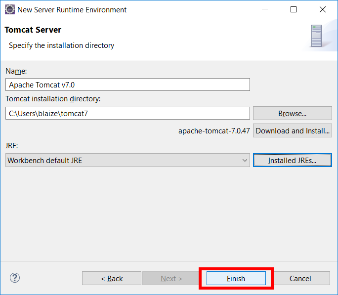

	_Finish Tomcat install_
	
1. Now click **Finish** on the **New Dynamic Web Project** window.

	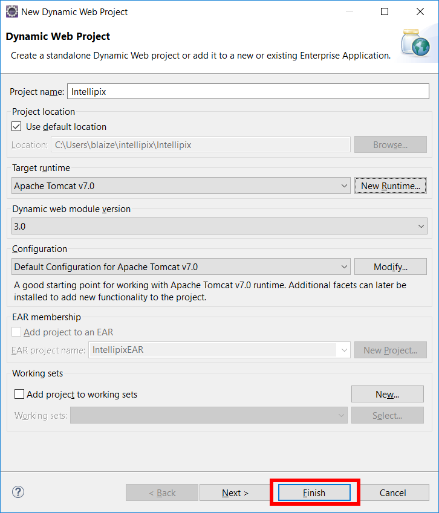

	_Finish creating a new project_

1. Close the **Welcome** tab by click in the **X** icon. This will switch to the Java EE view.

	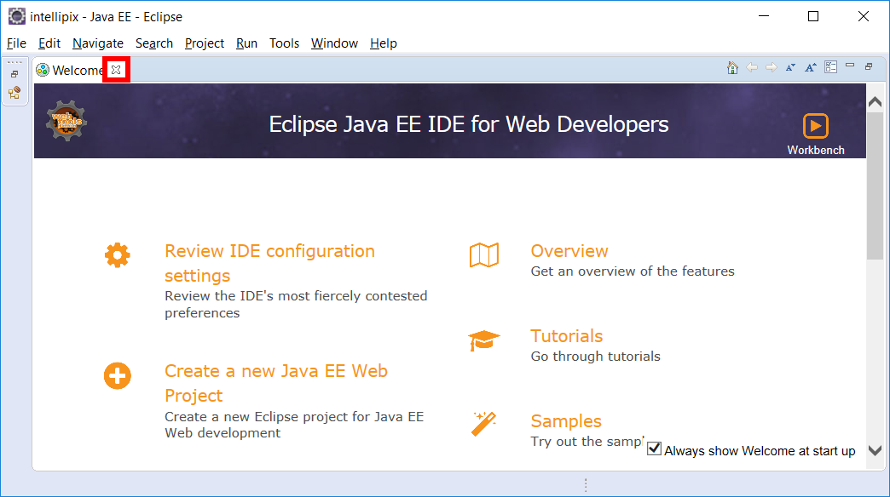

	_Close Welcome_

1. Right click (or Control + Click on a Mac) on the Intellipix project, then select **Configure** from the menu, then **Convert to Maven Project**. Maven is a package manager for many projects in Java. This will add a **pom.xml** to the project which can be used to install dependencies from Maven repositories.

	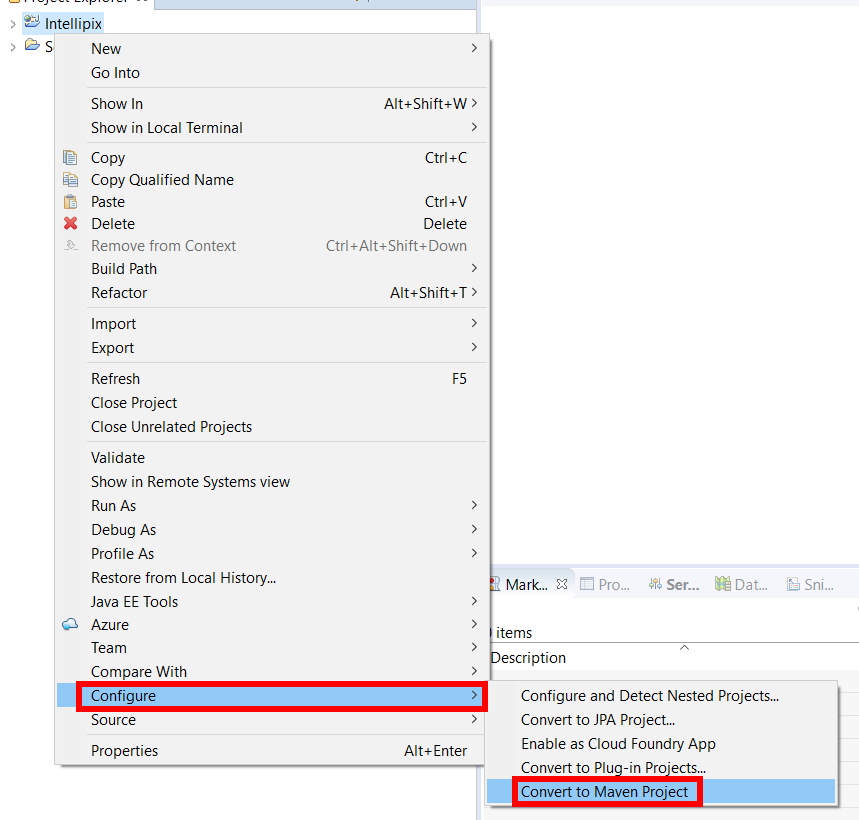

	_Convert to a Maven project_

1. On the **Maven POM** window, take the defaults and click **Finish**.

	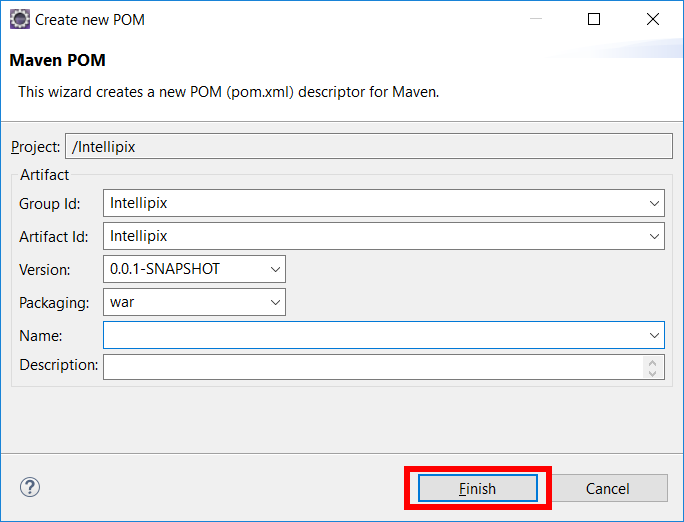

	_Maven POM_

1. Right click on the Intellipix project, then select **Maven**, then **Add Dependency**.

	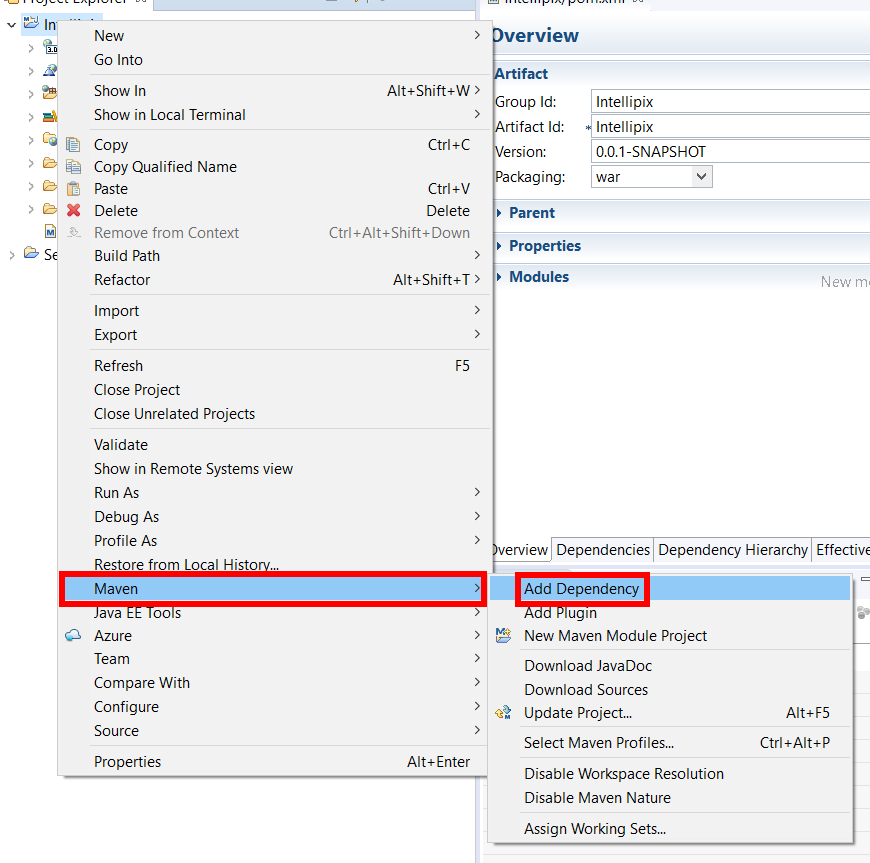

	_Add Maven Dependency_

1. On the **Add Dependency** window, set **Group ID** to "com.microsoft.azure" without the quotes, set **Artifact ID** to "azure-storage" without quotes, then **Version** to "5.1.1" without quotes. Then click **OK**. This adds the Azure Storage libraries.

	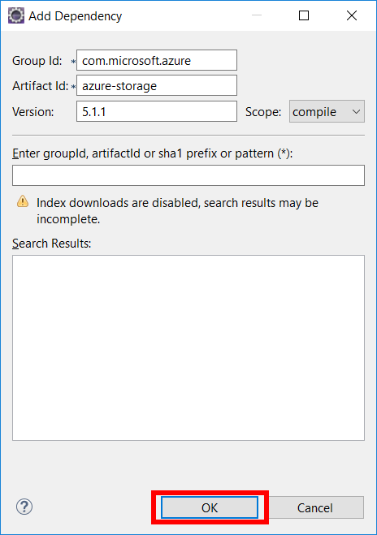

	_Add a dependency_

1. Repeat steps 10 and 11, except use "javax.servlet" for **Group ID**, "javax.servlet-api" for **Artifact ID**, and "4.0.0-b05" for **Version**. This adds the servlet libraries.

1. Repeat steps 10 and 11 again, except use "commons-io" for **Group ID**, "commons-io" for **Artifact ID**, and "2.5" for **Version**. This adds some common IO utility libraries to the project.

1. Repeat steps 10 and 11 one last time, except use "org.json" for **Group ID**, "json" for **Artifact ID**, and "20170516" for **Version**. This adds JSON support to the project. Many of the Azure API serve up data in the JSON format.

1. Expand the Intellipix project, then expand **Java Resources**. Right click (or control click on a Mac) the **src** folder and select **New**, then **Servlet**.

	

	_Add a servlet_

1. On the **Create Servlet** window, set **Java package** to "intellipix" without quotation marks, and likewise set **Class name** to "Api" without quotes. Then click **Finish**.

	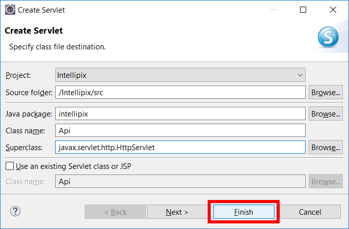

	_Create a servlet_
	
1. Expand the newly created Intellipix folder, then open **Api**. Next, open **Api.java** in the **resource/java** folder for the lab in a text editor. Copy the entire contents of the file and paste it over the the automatically generated code in Eclipse.

1. On **line 40**, replace the value of **connectionString** with the Connection String for storage you copied in Exercise 1 step 10. On **line 41**, replace the **visionAPIKey** with the key you copied in Exercise 2 step 5 from the portal. Lastly, on **line 42** replace the value for **visionEndpoint** with the endpoint from the Azure portal you copied Exercise 2 step 4.

	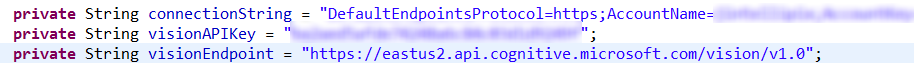

	_Set variables_

1. Right click on WebContent, then select **New** on the menu, then **HTML file**.

	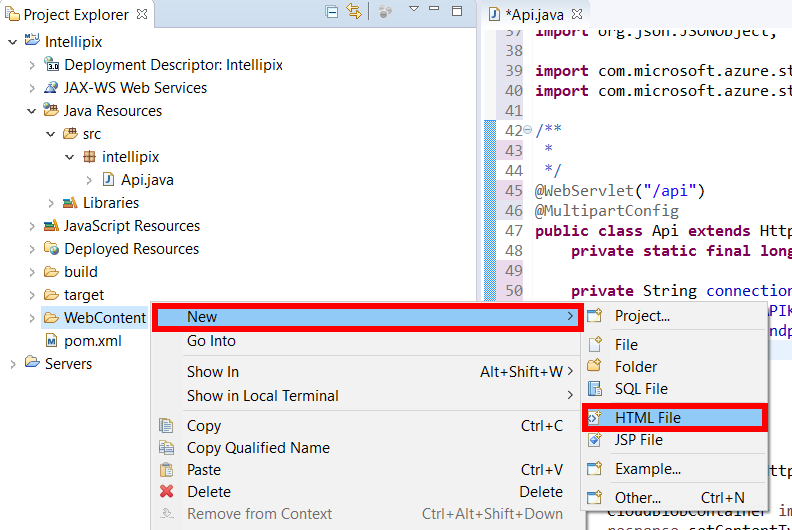

	_New HTML file_

1. Set the **File name** to "index.html" (witout the quotation marks), then click **Finish**.

	

	_Create an HTML file_

1. Open the **index.html** file in the **resources/java** folder for the lab in a text editor. Copy all the contents and paste over the generated content for **index.html** in Eclipse.

## Exercise 5: Run the App

Eclipse has the ability to integrate with many popular servers for running web sites written in Java. One of the most common servers is Tomcat from Apache. Tomcat provides the hooks needed to run servlets as well as static content such as HTML. Azure can also uses Tomcat to host Java apps on the Web Apps service, so Tomcat is a good deployment choice for web apps targeting Azure and for debugging apps locally.

1. Now it's time to start the app. Select the **Debug** icon from the toolbar.

	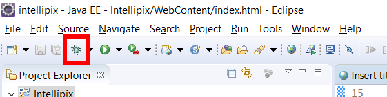

	_Start debugging_

1. On the **Debug As** window, select **Run on Server** then click **OK**.

	

	_Debug As_

1. On the **Debug on Server** window, select **Choose and existing server**, select **Tomcat v7.0 Server at localhost**, then click **Finish**.

	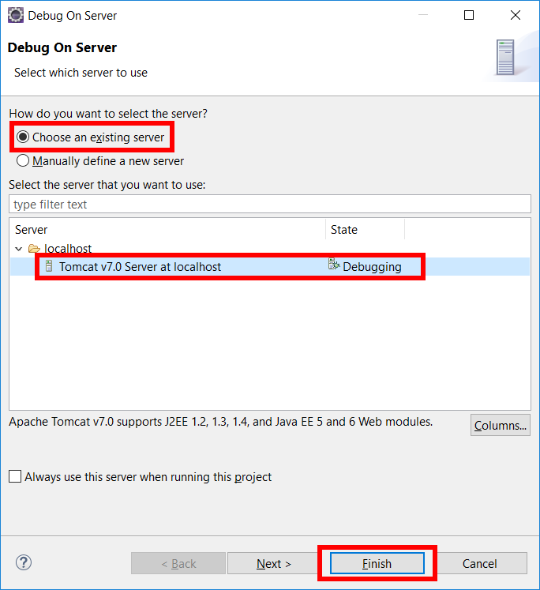

	_Debug On Server_

1. This will start the app in a browser window in the IDE or will launch a browser, depending on your environment. For ease of use, you can copy the URL from the IDE and paste it into a browser.

1. Select **Choose Files** and browse to the **photos** folder in the lab **resources** folder. Select all the images for upload, then click the **Upload** button. This is sending the images to the servlet, which is creating thumbnails and analyzing the images through the Computer Vision API on Azure. After the images are analyzed, the data from the analysis is stored along with the image in Blob Storage on Azure. This process may take a moment depending on your internet connection.

	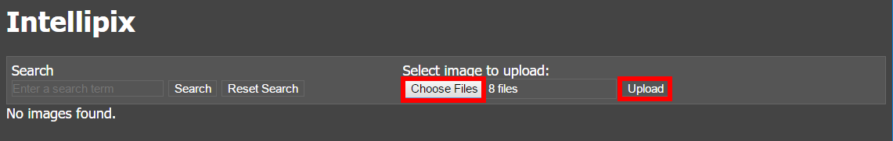

	_Upload files_

1. Mouse over an image, and you will see the caption that was generated by the Vision API on Azure. 

	

	_Upload files_

1. Click on an image to enlarge it. This uses the URL from blob storage to point to the full size image.

	

	_Enlarge an image_

1. In the **Search** dialog, type "river" without the quotations, then click **Search**. This will look at the image tags and in the caption for a match. 

	

	_Search images_

## Exercise 6: Deploy the App to Azure

The Azure Toolkit for Eclipse has integrated support for deploying Dynamic Web Site projects as Web Apps on Azure. In this exercise, you will use the Azure Toolkit to deploy the Intellipix app to Azure.

1. Right click on the Intellipix project, and select **Azure**, then **Publish as Azure Web App**. 

	

	_Publish as Azure Web App_

1. On the **Azure Sign In** window, select **Interactive**, then select **Sign in**. This will launch the familiar Azure Logon dialog. Logon with your account.

	

	_Sign in to Azure_

1. Next, select the subscription or subscriptions your want to use with Azure, then click **Select**. 

	

	_Select subscriptions_

1. On the **Deploy Web App** window, click **Create**.

	

	_Create a deployment_

1. On the **Create App Service** window, Select Create new, then set **Location** to the same location as your storage account and the Vision API for best performance. Select **Free_F1** for the **Pricing tier**, then click **Create**. This will take a moment to deploy.

	

	_Create an app service_

1. Back on the **Deploy Web App** window, copy the **URL** next to link to the clipboard, then check the box next to **Deploy to root**. Lastly, click **Deploy**.

	

	_Deploy web app_

1. In a browser, paste the link into the URL, and launch the app. The app should pull up Intellipix in the browser, this time running on Azure.

## Exercise 7: Cleaning up Azure Explorer

The Azure Toolkit also comes with the ability to do some basic management of resources on Azure. It can view, upload, and download contents from Blob Storage as well as manage Virtual Machines, HDInsight, Redis, and Web Apps, and Docker.

1. If the **Azure Explorer** tab is not already open in Eclipse, you can open it by selecting the **Window** Menu, then **Show View**, then click **Other**. Expand **Azure**, highlight **Azure Explorer**, then click **OK**.

	

	_Open Azure Explorer_

1. Now that **Azure Explorer** is open, expand **Azure**, then **Storage Accounts** to show your accounts. One should be the storage account your created for the lab. Select **photos**. You can also expand Web Apps to see the Web App you created for when deploying the app to Azure.

	

	_Browsing Azure Explorer_

1. Selecting **photos** will show the blobs that were uploaded to the **photos** storage container.

	

	_Browse photos_

1. Right click on the storage account and select **Delete** to delete the storage account.

	

	_Delete a storage account_

1. When prompted to confirm the deletion, click **OK**.

	

	_Delete a storage account confirmation_

1. Now, right click on the web app you created and select **Delete** to delete it. 

	

	_Delete a web app_

1. A confirmation will appear. Click **OK** to delete the web app.

	

	_Confirm a web app deletion_

The Azure Toolkit for Eclipse is under active development, so new features are coming out all the time. It cannot delete everything that needs to be deleted as of right now.  Deleting the resource groups in Azure Portal deletes all of the resources inside it (including the storage account, the blobs uploaded to it, and the App Service), removes all traces of this lab from your account, and prevents any further charges from being incurred for it. To delete the resource group, simply open the resource-group blade in the portal and click **Delete** at the top of the blade. You will be asked to type the resource group's name to confirm that you want to delete it, because once deleted, a resource group can't be recovered.

## Summary

In this hands-on lab, you learned how to:

- Create an Azure storage account and use it as a backing store for an app
- Create a web app in Eclipse, test it locally, and deploy it to Azure
- Write code that uploads blobs to blob storage and attaches metadata to them
- Consume blob metadata to implement search
- Use Microsoft's Computer Vision API to generate metadata from images

There is much more that you could do to develop Intellipix and to leverage Azure even further. For example, you could add support for authenticating users and deleting photos, and rather than force the user to wait for Cognitive Services to process a photo following an upload, you could use [Azure Functions](https://azure.microsoft.com/en-us/services/functions/) to call the Computer Vision API asynchronously each time an image is added to blob storage. You could even use Cognitive Services to detect faces in the photos and analyze the emotions depicted by those faces. With the cloud as your platform, the sky is the limit (pun intended).

----

Copyright 2016 Microsoft Corporation. All rights reserved. Except where otherwise noted, these materials are licensed under the terms of the MIT License. You may use them according to the license as is most appropriate for your project. The terms of this license can be found at https://opensource.org/licenses/MIT.
