<a name="HOLTitle"></a>
# Azure Storage and Cognitive Services #

---

<a name="Overview"></a>
## Overview ##

Microsoft Azure Storage is a set of services that allows you to store large volumes of data in a cost-effective manner and in a way that makes the data readily and reliably available to services and applications that consume it. Data committed to Azure Storage can be stored in blobs, tables, queues, or files. [Azure blobs](http://azure.microsoft.com/en-us/services/storage/blobs/) are ideal for storing images, videos, and other types of data, and are frequently used to provide input to and capture output from other Azure services such as [Azure Stream Analytics](http://azure.microsoft.com/en-us/services/stream-analytics/). [Azure tables](http://azure.microsoft.com/en-us/services/storage/tables/) provide NoSQL storage for semi-structured data. [Azure queues](http://azure.microsoft.com/en-us/services/storage/queues/) support queued message transfers between applications (or parts of applications) and can be used to make applications more scalable and robust by loosely coupling them together. Finally, [Azure Files](http://azure.microsoft.com/en-us/services/storage/files) use the Server Message Block (SMB) protocol to share files through the cloud and access storage as network drives.

Data stored in Microsoft Azure Storage can be accessed over HTTP or HTTPS using straightforward REST APIs, or it can be accessed using rich client libraries available for many popular languages and platforms, including .NET, Java, Android, Node.js, PHP, Ruby, and Python. The [Azure Portal](https://portal.azure.com) includes features for working with Azure Storage, but richer functionality is available from third-party tools, many of which are free and some of which work cross-platform.

In this lab, you will use Eclipse to write a Java app that accepts images uploaded by users and stores the images in Azure blob storage. You will learn how to read and write blobs in Java, and how to use blob metadata to attach additional information to the blobs you create. You will also get first-hand experience using [Microsoft Cognitive Services](https://www.microsoft.com/cognitive-services/), a set of intelligence APIs for building smart applications. Specifically, you'll submit each image uploaded by the user to Cognitive Services' [Computer Vision API](https://www.microsoft.com/cognitive-services/en-us/computer-vision-api) to generate a caption for the image as well as search metadata describing the contents of the image and an image thumbnail. And you will discover how easy it is to deploy apps to the cloud using Eclipse and the Azure Toolkit for Eclipse.

<a name="Objectives"></a>
### Objectives ###

In this hands-on lab, you will learn how to:

- Create a storage account and storage containers using the Azure Portal
- Create a Web app in Eclipse and deploy it to Azure
- Read and write blobs and attach metadata to them
- Use the Computer Vision API to extract information from images
- Use the cross-platform [Microsoft Azure Storage Explorer](http://storageexplorer.com/) to work with Azure Storage

<a name="Prerequisites"></a>
### Prerequisites ###

The following are required to complete this hands-on lab:

- An active Microsoft Azure subscription. If you don't have one, [sign up for a free trial](http://aka.ms/WATK-FreeTrial).
- [Java SE Development Kit](http://www.oracle.com/technetwork/java/javase/downloads/index.html)
- [Eclipse](https://www.eclipse.org/downloads/)
- Azure Toolkit for Eclipse

---

<a name="Exercises"></a>
## Exercises ##

This hands-on lab includes the following exercises:

- [Exercise 1: Create a storage account](#Exercise1)
- [Exercise 2: Get a subscription key for the Computer Vision API](#Exercise2)
- [Exercise 3: Set up Java and Eclipse](#Exercise3)
- [Exercise 4: Create a photo-upload app](#Exercise4)
- [Exercise 5: Test the app locally](#Exercise5)
- [Exercise 6: Deploy the app to Azure](#Exercise6)
- [Exercise 7: Cleaning up Azure Explorer](#Exercise7)

<a name="Exercise1"></a>

Estimated time to complete this lab: **75** minutes.

---

<a name="Exercise1"></a>
## Exercise 1: Create a storage account

The [Azure Portal](https://portal.azure.com) allows you to perform basic storage operations such as creating storage accounts, creating containers, and managing access keys. In this exercise, you will use the portal to create a storage account. Then you'll create a pair of containers: one to store images uploaded by the user, and another to store image thumbnails generated from the uploaded images.

1. Open the [Azure Portal](https://portal.azure.com) in your browser. If you are asked to log in, do so using your Microsoft account.
 
1. The first step in using Azure Storage is to create a storage account. To create a storage account, click **+ New** in the ribbon on the left. Then click **Storage**, followed by **Storage account**.

    

    _Creating a storage account_

1. In the ensuing "Create storage account" blade, enter a name for the new storage account in **Name** field. The name is important, because it forms one part of the URL through which blobs created under this account are accessed.

	> Storage account names can be 3 to 24 characters in length and can only contain numbers and lowercase letters. In addition, the name you enter must be unique within Azure. If someone else has chosen the same name, you'll be notified that the name isn't available with a red exclamation mark in the **Name** field.

	Once you have a name that Azure will accept (as indicated by the green check mark in the **Name** field), make sure **Resource manager** is selected as the deployment model and **General purpose** is selected as the account kind. Then select **Create new** under **Resource group** and type "IntellipixResourceGroup" (without quotation marks) into the box below to name the new resource group that will be created for the storage account. Finish up by selecting the location nearest you in the **Location** box, and clicking the **Create** button at the bottom of the blade to create the new storage account.
    
	

    _Specifying parameters for a new storage account_

1. Once the storage account has been created, click **Resource groups** in the ribbon on the left. Then click the "IntellipixResourceGroup" resource group, and in the blade that opens for the resource group, click the storage account you just created.
 
    

    _Opening the new storage account_

1. In the blade for the storage account, click **Blobs** to view a list of containers associated with this account.

    

    _Viewing blob containers_

1. The storage account currently has no containers. Before you can create a blob, you must create a container to store it in. Click **+ Container** to create a new container. Type "photos" (without quotation marks) into the **Name** field and select **Blob** as the **Access type**. Then click **OK** to create a container named "photos."

	> By default, containers and their contents are private. Selecting **Blob** as the access type makes the blobs in the "photos" container publicly accessible, but doesn't make the container itself public. This is what you want since the images stored in the "photos" container will be linked to from a Web app. 

    

    _Creating a "photos" container_

1. Repeat this process to create a container named "thumbnails," once more ensuring that the container's **Access type** is set to **Blob**.

1. Confirm that both containers appear in the list of containers for this storage account, and that the names are spelled correctly.

    

    _The new containers_

1. Click **Access keys** in the menu on the left side of the storage-account blade, and then click the **Copy** button next to **CONNECTION STRING** for **key1**. Paste this connection string into your favorite text editor for later use.

    

    _Copying the connection string_

You have now created a storage account to hold images uploaded to the app you're going to build, and containers to store the images in. Note that you *could* create these containers from within the app. Whether to create them programmatically or create them as part of the provisioning process is a choice that's left up to app developers.

<a name="Exercise2"></a>
## Exercise 2: Get a subscription key for the Computer Vision API

[Microsoft Cognitive Services](https://www.microsoft.com/cognitive-services/) is a set of intelligence APIs that you can call from your apps. Among the more than 25 APIs it offers are the [Computer Vision API](https://www.microsoft.com/cognitive-services/en-us/computer-vision-api) for distilling actionable information from images, the [Emotion API](https://www.microsoft.com/cognitive-services/en-us/emotion-api) for recognizing emotion in images and video, and the [Text Analytics API](https://www.microsoft.com/cognitive-services/en-us/text-analytics-api) for extracting sentiments and other information from text (for example, Twitter feeds). These APIs make it possible to build smart apps that would have been impossible just a few short years ago. And they're available for you to begin using today.

In this exercise, you will acquire a subscription key allowing you to call the Computer Vision API from your code. You'll use this key in a later exercise to generate thumbnails from the images uploaded to the Web site, and to generate captions and search keywords for the images.

1. In the Azure Portal, click **+ New**, followed by **AI + Cognitive Services** and **Computer Vision API**.

    

    _Creating a new Computer Vision API subscription_

1. Enter "VisionAPI" into the **Name** box and select **F0** as the **Pricing tier**. Under **Resource Group**, select **Use existing** and select the "IntellipixResourceGroup" that you created in Exercise 1. Check the **I confirm** box, and then click **Create**.

    

    _Subcribing to the Computer Vision API_

1. Return to the blade for the "IntellipixResourceGroup" resource group and click the Computer Vision API subscription that you just created.

    

    _Opening the Computer Vision API subscription_

1. Copy the URL under **Endpoint** into your favorite text editor so you can easily retrieve it later. Then click **Show access keys**.

    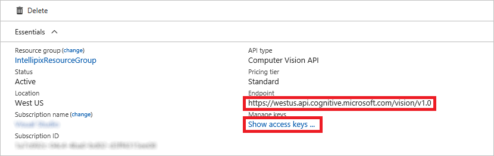

    _Viewing the access keys_

1. Click the **Copy** button to the right of **KEY 1** to copy the access key to the clipboard. Then paste the key into your favorite text editor so you can retrieve it later.

    

    _Copying the access key_

The access key that you just copied will be included in each HTTPS request sent to the Computer Vision API so Azure can verify that the caller is authorized. You should protect this access key the same way you protect access keys for storage accounts and other Azure resources.

<a name="Exercise3"></a>
## Exercise 3: Set up Java and Eclipse

[Eclipse](https://eclipse.org/) has long been one of the most popular IDEs for developing Java apps. A rich ecosystem of components and plug-ins has grown up around it, making it a very capable IDE for doing all things Java. [Microsoft's Java group](https://azure.microsoft.com/en-us/develop/java/) has has provided tools for integrating Eclipse with Azure using the [Azure Toolkit for Eclipse](https://docs.microsoft.com/en-us/azure/azure-toolkit-for-eclipse). It comes with the ability to deploy apps to Azure either as Azure Web Apps or in Docker containers, and it contains tools for managing Azure resources such as Azure Storage, Azure Web Apps, Redis Cache, HDInsight, and Azure virtual machines.

In this exercise, you will set up Java, Eclipse, and the Azure Toolkit for Eclipse.

1. If you don't already have the Java Development Kit (JDK) installed, go to http://www.oracle.com/technetwork/java/javase/downloads/index.html and click the **JDK Download** button. 

	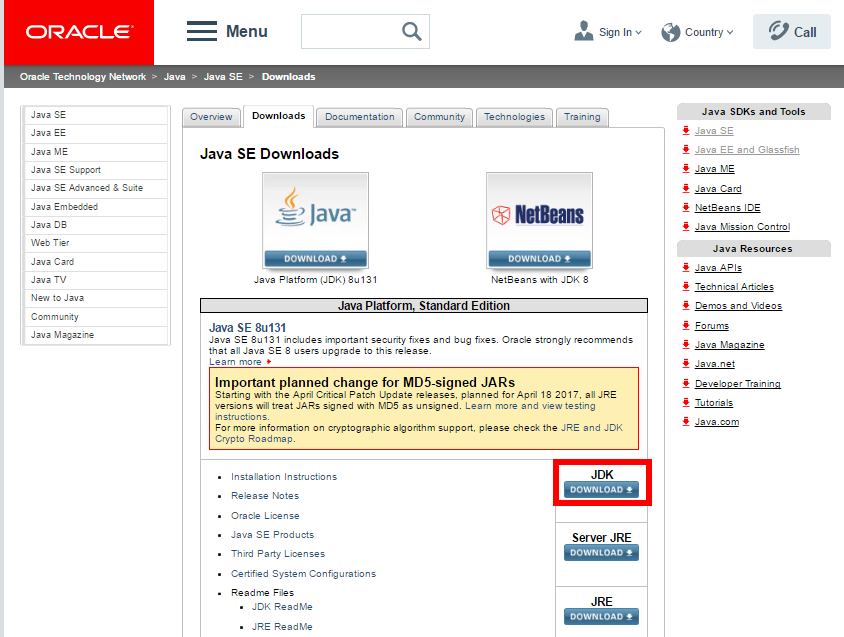

	_Downloading the JDK_

1. Click **Accept License Agreement**, and then click the installer that matches your system. The installers for each platform are self-contained and will install and configure everything you need to run and compile Java. Once the installer downloads, run it and follow the prompts to install the JDK.

	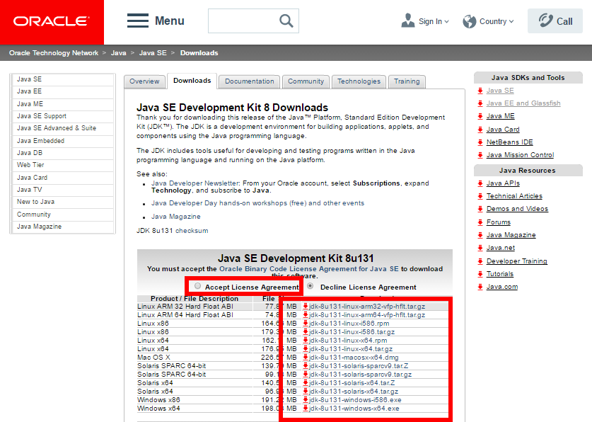

	_Installing the JDK_

1. If Eclipse is not installed on your system. go to https://www.eclipse.org/downloads/ and click the **Download** button. Then click the **Download** button that appears on the next page to download the Eclipse installer.

	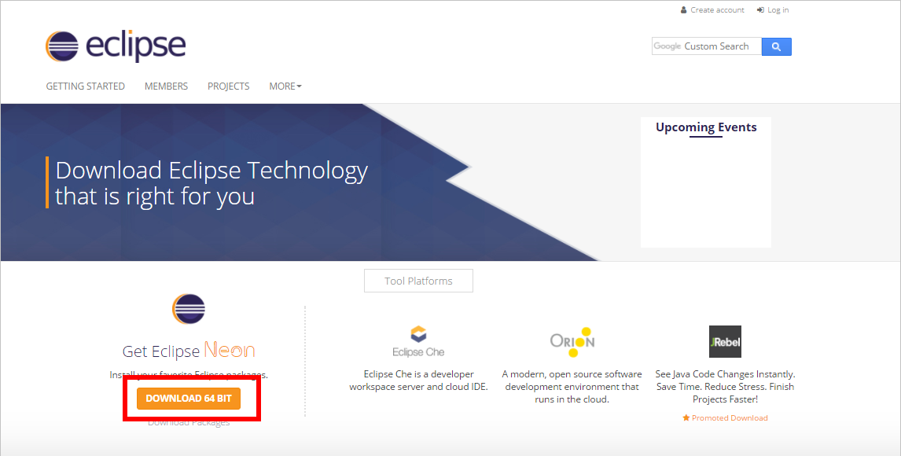

	_Downloading Eclipse_

1. When the download completes, launch the installer. When prompted to choose an Eclipse configuration, select **Eclipse IDE for Java EE Developers**. Then click the **Install** button and follow the prompts to install Eclipse.

	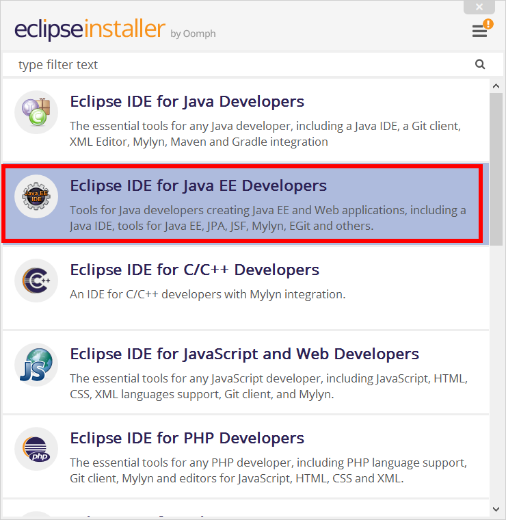

	_Specifying the Eclipse configuration_

1. Launch Eclipse. When prompted to create a workspace, enter "intellipix" as the workspace folder name.

	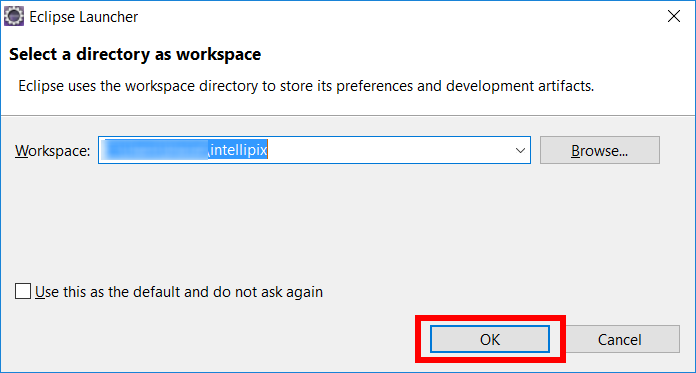

	_Creating a workspace_

1. Select **Eclipse Marketplace** from Eclipse's **Help** menu. Type "azure toolkit" into the **Find** box and click **Go**. Then click the **Install** button under **Azure Toolkit for Eclipse** to install the toolkit. Accept any licenses presented to you and allow Eclipse to restart if it prompts you to allow a restart. 

	

	_Installing the Azure Toolkit for Eclipse_

1. Select **Preferences** from Eclipse's **Window** menu. Click **Maven** in the preferences list on the left and uncheck the **Do not automatically update dependencies from remote repositories** box. Then click **OK**.

	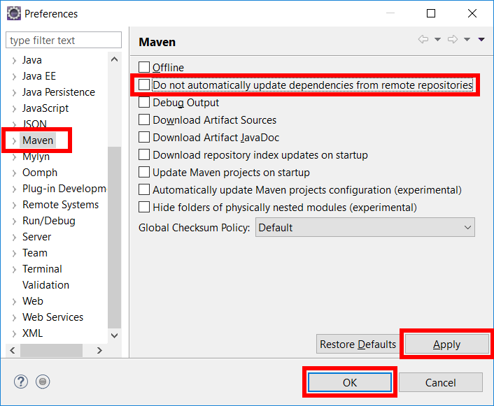

	_Updating Maven settings_

Eclipse is now configured to do Azure development. The next step is to use it to begin a new project and create an Azure Web App.

<a name="Exercise4"></a>
## Exercise 4: Create a photo-upload app

Like most IDEs, Eclipse provides templates for common project types. The Dynamic Web Project in Eclipse uses server-side Java code to build Web services, Web pages, and the like. The two most common technologies for this are Java Server Pages (JSP's) and servlets. These pages can be mapped to URL endpoints so that particular routes will be passed to the appropriate servlet.

In this exercise, you will create a Dynamic Web Project and use some Azure APIs in a servlet. Then you'll add a Web page to the project that interacts with the servlet using AJAX calls.

1. Use the **File** > **New** > **Dynamic Web Project** command to create a new project. Set **Project name** to "Intellipix," and then click the **New Runtime...** button.  

	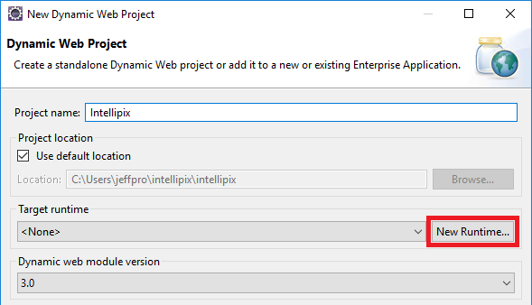

	_Creating a new project_

1. Select **Apache Tomcat v7.0**. Then check the **Create a new local server** box and click **Next**.

	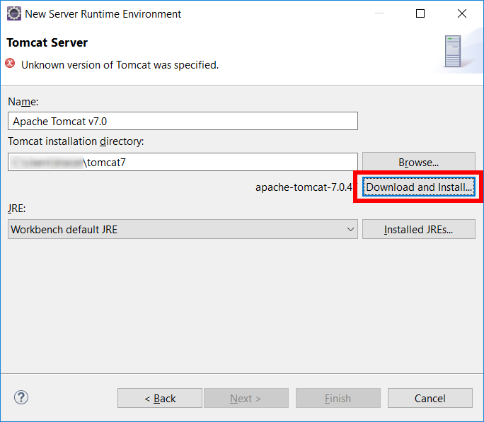

	_Selecting a runtime_

1. Click the **Browse...** button and a select a Tomcat installation directory. (Any writable directory will do.) Then click **Download and Install...** to start the Tomcat install. Accept the license agreement presented to you. When installation is complete, click **Finish** in the "New Server Runtime Environment" dialog, followed by **Finish** in the "New Dynamic Web Project" dialog.

	

	_Installing Tomcat_

1. Close the "Welcome" tab in Eclipse to switch to the Java EE view.

1. Right-click (On a Mac, Control-click) the Intellipix project in Project Explorer. Then select **Configure** > **Convert to Maven Project** from the context menu. In the "Create new POM" dialog that ensues, accept the defaults and click **Finish**.

	> Maven is a package manager for Java. This action will add a **pom.xml** file to the project which can be used to install dependencies from Maven repositories.

1. Right-click the Intellipix project again, and this time select **Maven** > **Add Dependency**. In the "Add Dependency" dialog, set **Group Id** to "com.microsoft.azure," **Artifact Id** to "azure-storage," and **Version** to "5.1.1." Then click **OK** to add Azure Storage libraries to the project.

	

	_Adding Azure Storage libraries_

1. Repeat Step 6, but enter the values shown below into the "Add Dependency" dialog. This adds Java servlet libraries to the project.

	

	_Adding servlet libraries_

1. Repeat Step 6, but enter the values shown below into the "Add Dependency" dialog. This adds some common I/O utility libraries to the project.

	

	_Adding I/O utility libraries_

1. Repeat Step 6 one last time, but enter the values shown below into the "Add Dependency" dialog. This adds JSON libraries to the project. Many of the Azure APIs send and receive data in JSON format.

	

	_Adding JSON libraries_

1. Expand the Intellipix project in Project Explorer. Right-click the "src" folder under **Java Resources** and select **New** > **Servlet**.

	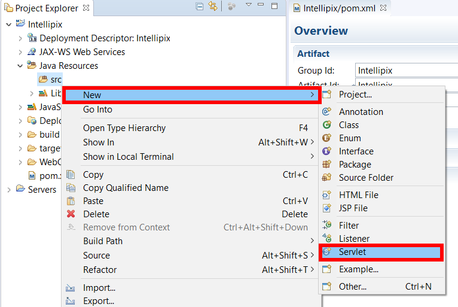

	_Add a servlet_

1. In the "Create Servlet" dialog, set **Java package** to "intellipix" and **Class name** to "Api." Then click **Finish**.

	

	_Create a servlet_

1. Open **Api.java** in the "intellipix" folder created under the "src" folder, and replace its contents with the code below. Then save the modified file.

	```java
	package intellipix;
	
	import java.awt.Graphics2D;
	import java.awt.GraphicsConfiguration;
	import java.awt.GraphicsDevice;
	import java.awt.GraphicsEnvironment;
	import java.awt.geom.AffineTransform;
	import java.awt.image.BufferedImage;
	import java.io.*;
	import java.net.HttpURLConnection;
	
	import java.net.URL;
	import java.nio.file.Paths;
	import java.util.HashMap;
	import java.util.List;
	import java.util.stream.Collectors;
	
	import javax.imageio.ImageIO;
	import javax.imageio.stream.ImageOutputStream;
	import javax.servlet.ServletException;
	import javax.servlet.annotation.MultipartConfig;
	import javax.servlet.annotation.WebServlet;
	import javax.servlet.http.*;
	
	import org.apache.commons.io.IOUtils;
	import org.json.JSONArray;
	import org.json.JSONObject;
	
	import com.microsoft.azure.storage.*;
	import com.microsoft.azure.storage.blob.*;
	
	@WebServlet("/api")
	@MultipartConfig
	public class Api extends HttpServlet {
	    private static final long serialVersionUID = 1L;
	    private String connectionString = "connection_string";
	    private String visionAPIKey = "vision_api_key";
	    private String visionEndpoint = "vision_api_endpoint";
	    
	    
	    public Api() {
	        super();
	    }
	
	    // This method handles GET requests for images 
	    protected void doGet(HttpServletRequest request, HttpServletResponse response) throws ServletException, IOException {
	        CloudBlobContainer images = getContainer("photos");
	        response.setContentType("application/json");  
	        PrintWriter out = response.getWriter();
	
	        // look for a search parameter in the query string
	        String search = request.getParameter("search");
	        JSONArray azureImages = new JSONArray();
			
	        // get a list of images from Azure Storage
	        for (ListBlobItem photo: images.listBlobs()) {
	            boolean match = false;
	            JSONObject azureImage = new JSONObject();
	            CloudBlob imageBlob = (CloudBlob)photo;

	            try {
	                imageBlob.downloadAttributes();
	            }
	            catch (StorageException e) {
	                e.printStackTrace();
	            }
				
	            // get the blob URL
	            azureImage.put("url", imageBlob.getUri().toString().replace(".blob.core.windows.net/photos/", ".blob.core.windows.net/thumbnails/"));
	            azureImage.put("fullUrl", imageBlob.getUri().toString());
				
	            HashMap<String, String> metadata = imageBlob.getMetadata();
				
	            if (!metadata.isEmpty()) {
	                JSONObject imageMetadata = new JSONObject();

	                // get the caption from blob metadata
	                if (metadata.containsKey("caption")) {
	                    imageMetadata.put("caption", metadata.get("caption"));
	                    if (search != null && imageMetadata.getString("caption").toLowerCase().contains(search.toLowerCase())) {
	                        match = true;
	                    }
	                }

	                // get tags from blob metadata	
	                if (metadata.containsKey("tags")) {
	                    JSONArray tags = new JSONArray(metadata.get("tags"));
	                    imageMetadata.put("tags", tags);
	                    if (search != null) {
	                        for (Object tag: imageMetadata.getJSONArray("tags")) {
	                            if (((String)tag).toLowerCase().equals(search.toLowerCase())) {match = true; break;}
	                        }								
	                    }
	                }
							
	                azureImage.put("metadata", imageMetadata);	
					
	                if (search != null && match) {
	                    azureImages.put(azureImage);				
	                }
	                else if (search == null) {
	                    azureImages.put(azureImage);	
	                }
	            }
	            else if (search == null) {
	                azureImages.put(azureImage);								
	            }
	        };
			
	        // write the list back as JSON
	        out.print(azureImages.toString());
	        out.flush();
	    }
	
	    // This method handles image uploads
	    protected void doPost(HttpServletRequest request, HttpServletResponse response) throws ServletException, IOException {
	        // parse uploaded content for uploaded files
	        List<Part> fileParts = request.getParts().stream().filter(part -> "photos".equals(part.getName())).collect(Collectors.toList()); // Retrieves <input type="file" name="file" multiple="true">
	
	        for (Part filePart : fileParts) {
	            String fileName = Paths.get(getSubmittedFileName(filePart)).getFileName().toString(); 
	            InputStream fileContent = filePart.getInputStream();
	            byte[] imageBuffer = IOUtils.toByteArray(fileContent); // raw byte data for the image
		                
	            // create a thumbnail for the uploaded image and convert it into a ByteArrayInputStream
	            ByteArrayInputStream inputStream = new ByteArrayInputStream(imageBuffer);
	            BufferedImage img = ImageIO.read(inputStream);
	            BufferedImage thumbnail = scale (img, 200.0 / img.getWidth()); //scale to 200  pixels wide
		        
	            // write the thumbnail as a PNG to an input stream
	            ByteArrayOutputStream bytes = new ByteArrayOutputStream();
	            ImageOutputStream thumbnailData = ImageIO.createImageOutputStream(bytes);
	            ImageIO.write(thumbnail, "png", thumbnailData);
	            ByteArrayInputStream thumbnailContent = new ByteArrayInputStream(bytes.toByteArray()); 
	
	            // upload the original image to Azure Storage
	            inputStream = new ByteArrayInputStream(imageBuffer);
	            CloudBlob imgBlob = uploadBlob("photos", fileName, inputStream, null);
		        
	            try {
	                // send the image to the Computer Vision API for analysis
	                JSONObject analysis = new JSONObject(analyzeImage(imgBlob.getUri().toString()));
	                HashMap<String, String> metadata = new HashMap<String,String>();
			        
	                // extract analysis data and stores it in blob metadata
	                if (analysis.has("description")) {
	                    if (analysis.getJSONObject("description").has("captions") && analysis.getJSONObject("description").getJSONArray("captions").length() != 0) {
		                    metadata.put("caption", analysis.getJSONObject("description").getJSONArray("captions").getJSONObject(0).getString("text"));
	                    }
	                    else {
	                        metadata.put("caption", "Unknown");
	                    }
	
	                    if (analysis.getJSONObject("description").has("tags") && analysis.getJSONObject("description").getJSONArray("tags").length() != 0) {
	                        metadata.put("tags", analysis.getJSONObject("description").getJSONArray("tags").toString());
	                    }
	                    else {
	                        metadata.put("caption", new JSONArray().toString());
	                    }
	                }
	
	                imgBlob.setMetadata(metadata);
	                imgBlob.uploadMetadata();
			        
	                // upload the thumbnail to Azure Storage
	                uploadBlob("thumbnails", fileName, thumbnailContent, metadata);	
	            }
	            catch (Exception e) {
	                e.printStackTrace();
	            }
	        }
		    
	        response.getWriter().append("");
	    }
	
	    // Utility method for storing blobs on Azure
	    private CloudBlockBlob uploadBlob(String containerName, String fileName, InputStream blobData, HashMap<String,String> metadata) {
	        try  {
	            CloudBlobContainer container = getContainer(containerName);
	            CloudBlockBlob blob = container.getBlockBlobReference(fileName);
	            blob.upload(blobData, blobData.available());

	            if (metadata != null) {
	                blob.setMetadata(metadata);
	                blob.uploadMetadata();				
	            }
	            return blob;
	        }
	        catch(Exception e) {
	            return null;
	        }
	    }
		
	    // Helper method to extract file names
	    private static String getSubmittedFileName(Part part) {
	        for (String cd : part.getHeader("content-disposition").split(";")) {
	            if (cd.trim().startsWith("filename")) {
	                String fileName = cd.substring(cd.indexOf('=') + 1).trim().replace("\"", "");
	                return fileName.substring(fileName.lastIndexOf('/') + 1).substring(fileName.lastIndexOf('\\') + 1); // MSIE fix.
	            }
	        }
	        return null;
	    }
		
	    // Helper method to get blob containers
	    private CloudBlobContainer getContainer(String containerName) {
	        try {
	            CloudStorageAccount account = CloudStorageAccount.parse(connectionString);
	            CloudBlobClient serviceClient = account.createCloudBlobClient();
	            return serviceClient.getContainerReference(containerName);
	        }
	        catch (Exception e) {
	            System.out.print("Exception encountered: ");
	            System.out.println(e.getMessage());
	        }
	        return null;
	    }
		
	    // Helper method to scale an image	
	    private BufferedImage scale(BufferedImage source, double ratio) {
	        int w = (int) (source.getWidth() * ratio);
	        int h = (int) (source.getHeight() * ratio);
	        BufferedImage bi = getCompatibleImage(w, h);
	        Graphics2D g2d = bi.createGraphics();
	        double xScale = (double) w / source.getWidth();
	        double yScale = (double) h / source.getHeight();
	        AffineTransform at = AffineTransform.getScaleInstance(xScale,yScale);
	        g2d.drawRenderedImage(source, at);
	        g2d.dispose();
	        return bi;
	    }
	
	    private BufferedImage getCompatibleImage(int w, int h) 
	    {
	        GraphicsEnvironment ge = GraphicsEnvironment.getLocalGraphicsEnvironment();
	        GraphicsDevice gd = ge.getDefaultScreenDevice();
	        GraphicsConfiguration gc = gd.getDefaultConfiguration();
	        BufferedImage image = gc.createCompatibleImage(w, h);
	        return image;
	    }
		
	    // Utility method for handling requests to the Computer Vision API
	    private String analyzeImage(String blobUrl) throws Exception {
	        URL obj = new URL(visionEndpoint +  "/analyze?visualFeatures=description");
	        HttpURLConnection con = (HttpURLConnection) obj.openConnection();
	        con.setRequestMethod("POST");
	
	        // add request header
	        con.setRequestProperty("Ocp-Apim-Subscription-Key", visionAPIKey);
	        con.setRequestProperty("Content-Type", "application/json");
			
	        con.setUseCaches (false);
	        con.setDoInput(true);
	        con.setDoOutput(true);
			
	        // prepare the HTTP POST body
	        JSONObject url = new JSONObject();
	        url.put("url", blobUrl);
			
	        con.setDoOutput(true);
	        DataOutputStream wr = new DataOutputStream(con.getOutputStream());
	        wr.writeBytes(url.toString());
	        wr.flush();
	        wr.close();
			
	        int responseCode = con.getResponseCode();
	        BufferedReader in = new BufferedReader(new InputStreamReader(con.getInputStream()));
	        String inputLine;
	        StringBuffer response = new StringBuffer();
	
	        // read the response as a string
	        while ((inputLine = in.readLine()) != null) {
	            response.append(inputLine);
	        }

	        in.close();
	        return response.toString();
	    }
	}
	```

1. On line 36, replace *connection_string* with the connection string that you saved in Exercise 1, Step 9.

1. On line 37, replace *vision_api_key* with the Computer Vision API key that you saved in Exercise 2, Step 5.

1. On line 38, replace *vision_api_endpoint* with the Computer Vision API endpoint that you saved in Exercise 2, Step 4.

1. Right-click **WebContent** in Project Explorer and use the **New** > **HTML file** command to add an HTML file named "index.html" to the project.

1. Replace the contents of **index.html** with the statements below. Then save the modified file.

	```html
	<!DOCTYPE html>
	<html>
	<head>
	<meta charset="ISO-8859-1">
	<title>Intellipix</title>
	</head>
	<body onload="searchPics()">
	
	<style>
	body {
	    background-color:#444;
	    color:#FFF;
	    font-family:tahoma;
	}
	
	input {
	    background-color:#555;
	    border:1px solid #666;
	    color:#fff;
	}
	
	#modal{
	    max-height: calc(100% - 100px);
	    position: fixed;
	    top: 50%;
	    left: 50%;
	    transform: translate(-50%, -50%);
	    display:none;
	    background-color:#555;
	    border:1px solid #666;
	    padding:3px;
	    text-align:center;
	}
	
	#modalimage{
	    max-height: calc(100% - 100px);
	    max-width: 100%;
	}
	
	#controls{
	    background-color:#555;
	    border:1px solid #666;
	    padding:5px;
	}
	
	#gallery span {
	    display:inline-block;
	}
	
	#gallery img {
	    border:1px solid #000;
	    padding:5px;
	    background-color:#fff;
	    margin:3px;
	}
	
	#search {
	    width:45%;
	    float:left;
	}
	
	#upload {
	    width:45%;
	    margin-left:45%;
	}
	</style>
	
	<script type="text/javascript">
	function uploadPics() {
	    var form = document.getElementById('uploader');
	    var message = document.getElementById('uploadmessage');
		
	    form.enabled = false;
	    message.innerHTML = 'Uploading and Processing...';
	
	    // get file references from the form and then uploads the files
	    var formData = new FormData();
	    var fileSelect = document.getElementById('file-select');
	    var files = fileSelect.files;
		
	    for (var i = 0; i < files.length; i++) {
	        var file = files[i];
	        formData.append('photos', file, file.name);
	    }		
		
	    // pure AJAX; no jQuery
	    var xhr = new XMLHttpRequest();
	    xhr.open('POST', 'api', true);
	    xhr.onload = function () {
	        if (xhr.status === 200) {
	            message.innerHTML = (files.length) + ' file(s) uploaded.';
	            reset();
	        }
            else {
	            message.innerHTML = 'An error occurred!';
	        }
	        form.reset();
	    };
	    xhr.send(formData);
	}
		
	function searchPics(search) {
	    var xhr = new XMLHttpRequest();
	    var url = "api"
		
	    if (search && search != ""){
	        url += "?search=" + search;
	    }
		
	    xhr.open('GET', url, true);
	    xhr.onload = function () {
	        if (xhr.status === 200) {
	            htmlStr = "";
	            var images = JSON.parse(xhr.responseText);
				
	            // create HTML from JSON data and append it to the DOM
	            for (var i = 0; i < images.length; i++) {
	                var image = images[i];
	                htmlStr += "<span class='imgwrapper'></span>"
	            }
				
	            if (htmlStr == "") {
	                htmlStr = "No images found."
	            }
				
	            var gallery = document.getElementById("gallery");
	            gallery.innerHTML = htmlStr;
			}
            else {
	            gallery.innerHTML = 'An error occurred!';
	        }
	    };
	    xhr.send();
	}
	
	// resets the search form
	function reset(){
	    document.getElementById('searchTerm').value = "";
	    searchPics();
	}
	
	// shows the modal dialog for an image
	function showImage(url, caption){
	    document.getElementById('modalimage').src = url;
	    document.getElementById('modaltext').innerHTML = caption;
	    document.getElementById('modal').style.display = "block";
	}
	
	// closes the modal dialog
	function closeImage(){
	    document.getElementById('modal').style.display = "none";
	}
	</script>
	
	<h1 id="title">Intellipix</h1>
	
	<div id="controls">
	<div id="search">
	<div>Search</div>
	<input type="text" value="" id="searchTerm" placeholder="Enter a search term">
	<input type="button" onclick="searchPics(document.getElementById('searchTerm').value)" value="Search">
	<input type="button" onclick="reset()" value="Reset Search">
	</div>
	
	<div id="upload">
	<form id="uploader" >
	<div id="uploadmessage">Select image to upload:</div>
	<input type="file" name="file-select" id="file-select" multiple>
	<input type="button" value="Upload" onclick="uploadPics()">
	</form>
	</div>
	</div>
	<div id="message"></div>
	
	<div id="gallery">
	</div>
	
	<div id="modal">
	
	<p id="modaltext"></p>
	<input type="button" value="close" onclick="closeImage()">
	</div>
	
	</body>
	</html>
	```

With the app complete, the next step is to run it locally and make sure it works as intended before deploying it to Azure.

<a name="Exercise5"></a>
## Exercise 5: Test the app locally

Eclipse has the ability to integrate with many popular servers for running web sites written in Java. One of the most common servers is Tomcat from Apache. Tomcat provides the hooks needed to run servlets as well as static content such as HTML. Azure can also uses Tomcat to host Java apps on the Web Apps service, so Tomcat is a good deployment choice for web apps targeting Azure and for debugging apps locally.

1. Use the **Run** > **Debug** command to launch the app in the debugger. In the "Debug As" dialog that opens, select **Run on Server**, and then click **OK**.

	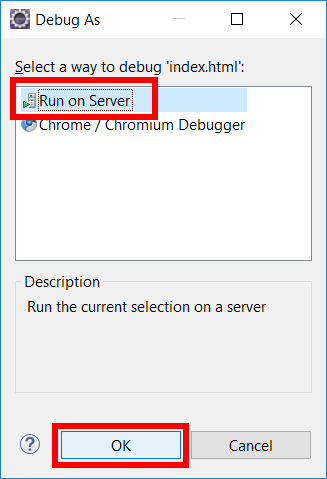

	_Launching the app in the debugger_

1. In the "Debug on Server" dialog, select **Choose an existing server**, select **Tomcat v7.0 Server at localhost** as the server, and click **Finish**.

1. Wait for the app to appear in your browser, either inside or outside Eclipse. Then click the **Browse...** button, select all of the files in this lab's "resources\photos" folder, and click the **Upload** button to upload them to the Web site.

	> Each image uploaded to the Web site is written to Azure blob storage and then passed to the Computer Vision API, which analyzes the image and returns a caption and a set of tags. Captions and tags are stored in blob metadata.

1. Wait for the upload to complete. Then confirm that the uploaded images appear in the Web page. These are the thumbnails generated from the uploaded images. They are stored as blobs in the "thumbnails" container that you created in Exercise 1. 

	

	_The uploaded images_

1. Hover the cursor over one of the images and confirm that a tooltip window appears showing the caption generated by the Computer Vision API. 

	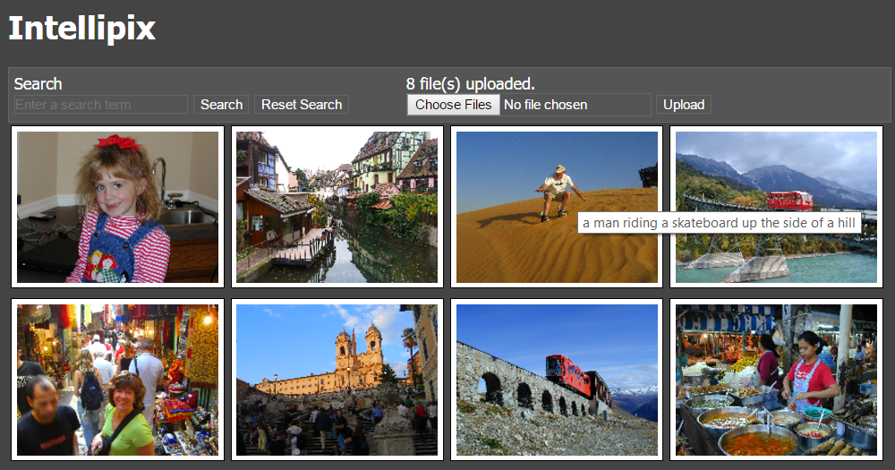

	_Viewing a computer-generated caption_

1. Click an image and confirm that an enlarged version appears. This is the full-size image stored in blob storage in the "photos" container that you created in Exercise 1.

	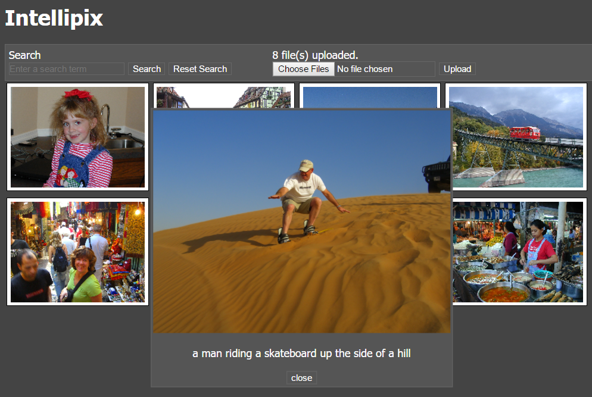

	_Enlarging an image_

1. Close the enlarged image. Then type "river" into the search box and click the **Search** button. Confirm that two images are shown, each containing a river. This image-search feature uses the tags generated for the images by the Computer Vision API. 

	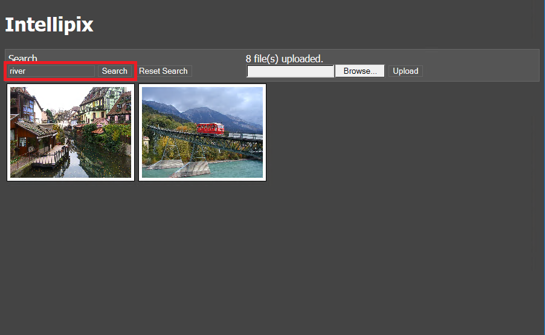

	_Searching for images containing a river_

Now that the app has been tested locally, it's time to deploy it to Azure. You can do that directly from Eclipse since the Azure Toolkit for Eclipse is installed.

<a name="Exercise6"></a>
## Exercise 6: Deploy the App to Azure

The Azure Toolkit for Eclipse has integrated support for deploying Dynamic Web Site projects as Web Apps on Azure. In this exercise, you will use the Azure Toolkit to deploy the Intellipix app to Azure.

1. Right click on the Intellipix project, and select **Azure**, then **Publish as Azure Web App**. 

	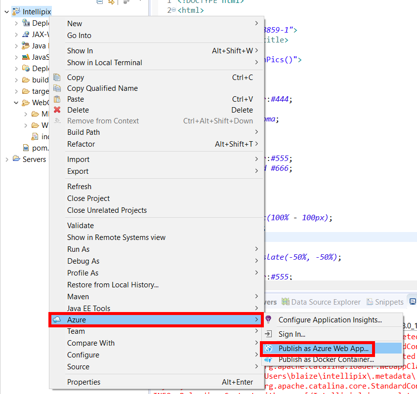

	_Publish as Azure Web App_

1. On the **Azure Sign In** window, select **Interactive**, then select **Sign in**. This will launch the familiar Azure Logon dialog. Logon with your account.

	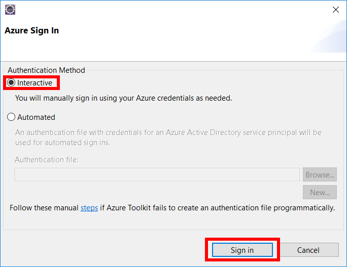

	_Sign in to Azure_

1. Next, select the subscription or subscriptions your want to use with Azure, then click **Select**. 

	

	_Select subscriptions_

1. On the **Deploy Web App** window, click **Create**.

	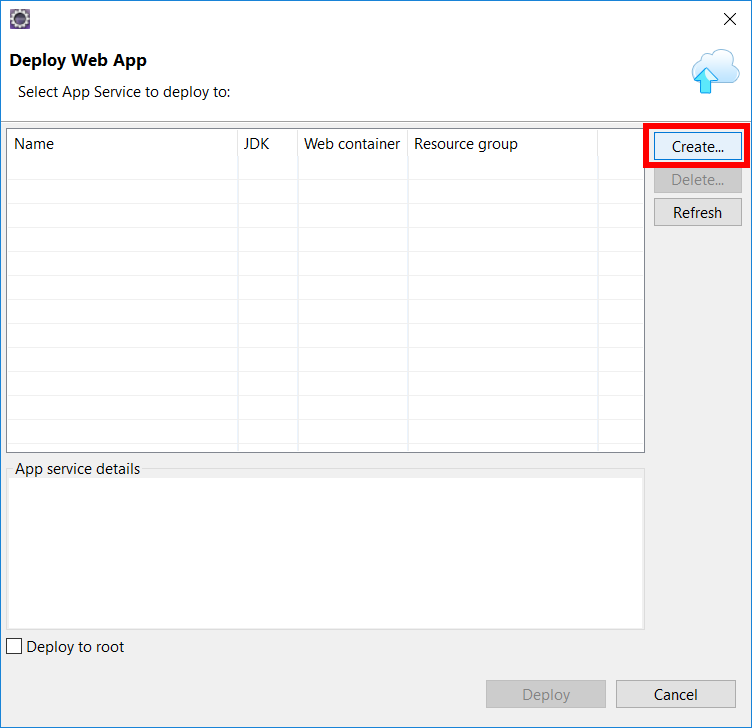

	_Create a deployment_

1. On the **Create App Service** window, Select Create new, then set **Location** to the same location as your storage account and the Vision API for best performance. Select **Free_F1** for the **Pricing tier**, then click **Create**. This will take a moment to deploy.

	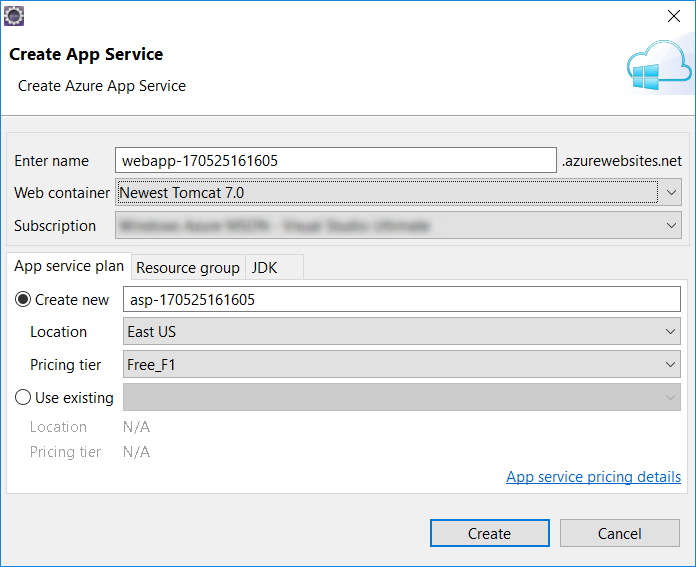

	_Create an app service_

1. Back on the **Deploy Web App** window, copy the **URL** next to link to the clipboard, then check the box next to **Deploy to root**. Lastly, click **Deploy**.

	

	_Deploy web app_


1. In a browser, paste the link into the URL, and launch the app. The app should pull up Intellipix in the browser, this time running on Azure.

<a name="Exercise7"></a>
## Exercise 7: Cleaning up Azure Explorer

The Azure Toolkit also comes with the ability to do some basic management of resources on Azure. It can view, upload, and download contents from Blob Storage as well as manage Virtual Machines, HDInsight, Redis, and Web Apps, and Docker.

1. If the **Azure Explorer** tab is not already open in Eclipse, you can open it by selecting the **Window** Menu, then **Show View**, then click **Other**. Expand **Azure**, highlight **Azure Explorer**, then click **OK**.

	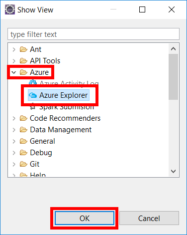

	_Open Azure Explorer_

1. Now that **Azure Explorer** is open, expand **Azure**, then **Storage Accounts** to show your accounts. One should be the storage account your created for the lab. Select **photos**. You can also expand Web Apps to see the Web App you created for when deploying the app to Azure.

	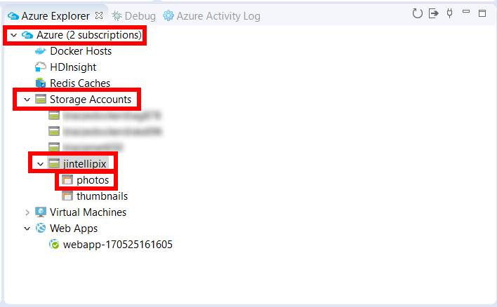

	_Browsing Azure Explorer_

1. Selecting **photos** will show the blobs that were uploaded to the **photos** storage container.

	

	_Browse photos_

1. Right click on the storage account and select **Delete** to delete the storage account.

	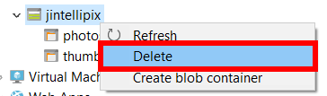

	_Delete a storage account_

1. When prompted to confirm the deletion, click **OK**.

	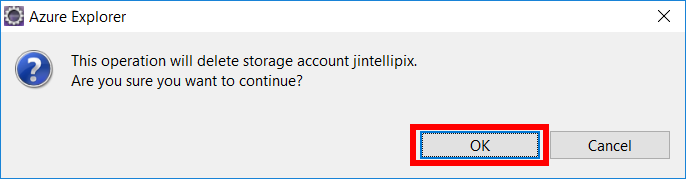

	_Delete a storage account confirmation_

1. Now, right click on the web app you created and select **Delete** to delete it. 


	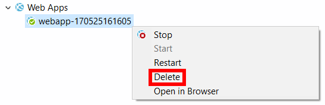

	_Delete a web app_

1. A confirmation will appear. Click **OK** to delete the web app.

	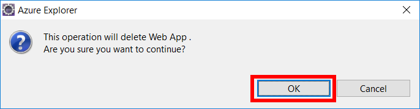

	_Confirm a web app deletion_

The Azure Toolkit for Eclipse is under active development, so new features are coming out all the time. It cannot delete everything that needs to be deleted as of right now.  Deleting the resource groups in Azure Portal deletes all of the resources inside it (including the storage account, the blobs uploaded to it, and the App Service), removes all traces of this lab from your account, and prevents any further charges from being incurred for it. To delete the resource group, simply open the resource-group blade in the portal and click **Delete** at the top of the blade. You will be asked to type the resource group's name to confirm that you want to delete it, because once deleted, a resource group can't be recovered.

## Summary

In this hands-on lab, you learned how to:

- Create an Azure storage account and use it as a backing store for an app
- Create a web app in Eclipse, test it locally, and deploy it to Azure
- Write code that uploads blobs to blob storage and attaches metadata to them
- Consume blob metadata to implement search
- Use Microsoft's Computer Vision API to generate metadata from images

There is much more that you could do to develop Intellipix and to leverage Azure even further. For example, you could add support for authenticating users and deleting photos, and rather than force the user to wait for Cognitive Services to process a photo following an upload, you could use [Azure Functions](https://azure.microsoft.com/en-us/services/functions/) to call the Computer Vision API asynchronously each time an image is added to blob storage. You could even use Cognitive Services to detect faces in the photos and analyze the emotions depicted by those faces. With the cloud as your platform, the sky is the limit (pun intended).

----

Copyright 2016 Microsoft Corporation. All rights reserved. Except where otherwise noted, these materials are licensed under the terms of the MIT License. You may use them according to the license as is most appropriate for your project. The terms of this license can be found at https://opensource.org/licenses/MIT.
