<a name="HOLTitle"></a>
# Azure Storage and Cognitive Services #

---

<a name="Overview"></a>
## Overview ##

Microsoft Azure Storage is a set of services that allows you to store large volumes of data in a cost-effective manner and in a way that makes the data readily and reliably available to services and applications that consume it. Data committed to Azure Storage can be stored in blobs, tables, queues, or files. [Azure blobs](http://azure.microsoft.com/en-us/services/storage/blobs/) are ideal for storing images, videos, and other types of data, and are frequently used to provide input to and capture output from other Azure services such as [Azure Stream Analytics](http://azure.microsoft.com/en-us/services/stream-analytics/). [Azure tables](http://azure.microsoft.com/en-us/services/storage/tables/) provide NoSQL storage for semi-structured data. [Azure queues](http://azure.microsoft.com/en-us/services/storage/queues/) support queued message transfers between applications (or parts of applications) and can be used to make applications more scalable and robust by loosely coupling them together. Finally, [Azure Files](http://azure.microsoft.com/en-us/services/storage/files) use the Server Message Block (SMB) protocol to share files through the cloud and access storage as network drives.

Data stored in Microsoft Azure Storage can be accessed over HTTP or HTTPS using straightforward REST APIs, or it can be accessed using rich client libraries available for many popular languages and platforms, including .NET, Java, Android, Node.js, PHP, Ruby, and Python. The [Azure Portal](https://portal.azure.com) includes features for working with Azure Storage, but richer functionality is available from third-party tools, many of which are free and some of which work cross-platform.

In this lab, you will write a Web app that accepts images uploaded by users and stores the images in Azure blob storage. You will learn how to read and write blobs in C#, and how to use blob metadata to attach additional information to the blobs you create. You will also get first-hand experience using [Microsoft Cognitive Services](https://www.microsoft.com/cognitive-services/), a set of intelligence APIs for building smart applications. Specifically, you'll submit each image uploaded by the user to Cognitive Services' [Computer Vision API](https://www.microsoft.com/cognitive-services/en-us/computer-vision-api) to generate a caption for the image as well as searchable metadata describing the contents of the image. And you will discover how easy it is to deploy apps to the cloud using Visual Studio.

<a name="Objectives"></a>
### Objectives ###

In this hands-on lab, you will learn how to:

- Create a storage account and containers using the Azure Portal
- Create a Web app in Visual Studio and deploy it to Azure
- Read and write blobs and attach metadata to them
- Use the Computer Vision API to extract information from images
- Use the cross-platform [Microsoft Azure Storage Explorer](http://storageexplorer.com/) to work with Azure Storage

<a name="Prerequisites"></a>
### Prerequisites ###

The following are required to complete this hands-on lab:

- An active Microsoft Azure subscription. Use the one you created in Lab 1, or [sign up for a free trial](http://aka.ms/WATK-FreeTrial)
- [Microsoft Azure Storage Explorer](http://storageexplorer.com/)
- [Visual Studio 2015 Community edition](https://www.visualstudio.com/en-us/products/visual-studio-community-vs.aspx) or higher

---

<a name="Exercises"></a>
## Exercises ##

This hands-on lab includes the following exercises:

- [Exercise 1: Create a storage account](#Exercise1)
- [Exercise 2: Run the Microsoft Azure Storage Explorer](#Exercise2)
- [Exercise 3: Create a new Web app in Visual Studio](#Exercise3)
- [Exercise 4: Add a lightbox for viewing photos](#Exercise4)
- [Exercise 5: Use Cognitive Services to generate metadata](#Exercise5)
- [Exercise 6: Add search to the app](#Exercise6)
- [Exercise 7: Deploy the app to Azure](#Exercise7)

Estimated time to complete this lab: **60** minutes.

<a name="Exercise1"></a>
## Exercise1: Create a storage account

The [Azure Portal](https://portal.azure.com) allows you to perform basic storage operations such as creating storage accounts, creating containers, and managing access keys. In this exercise, you will use the portal to create a storage account. Then you'll create a pair of containers: one to store images uploaded by the user, and another to store image thumbnails generated from the uploaded images.

1. Go to the [Azure Portal](https://portal.azure.com/) and sign in using your Microsoft account.
 
1. The first step in using Azure Storage is to create a storage account. To create a storage account, click **+ NEW** in the ribbon on the left. Then click **Data + Storage**, followed by **Storage account**.

    

    _Creating a storage account_

1. In the ensuing "Create storage account" blade, enter a name for the new storage account in **Name** field. The name is important, because it forms one part of the URL through which blobs created under this account are accessed.

	> Storage account names can be 3 to 24 characters in length and can only contain numbers and lowercase letters. In addition, the name you enter must be unique within Azure. If someone else has chosen the same name, you'll be notified that the name isn't available with a red exclamation mark in the **Name** field.

	Once you have a name that Azure will accept (as indicated by the green check mark in the **Name** field), make sure **Resource manager** is selected as the deployment model and **General purpose** is selected as the account kind. Then select **Locally-redundant storage (LRS)** as the replication type.

	> Locally redundant storage is the most cost-effective storage option. It prevents data stored under this storage account from being replicated in other data centers, but it ensures that the data will be replicated at least three times within the chosen data center.

	Select **Create new** under **Resource group** and type "Intellipix" (without quotation marks) into the box below to name the new resource group that will be created for the storage account. Finish up by selecting the location nearest you in the **Location** box, and clicking the **Create** button at the bottom of the blade to create the new storage account.
    
	

    _Specifying parameters for a new storage account_

1. Once the storage account has been created, click **Resource groups** in the ribbon on the left. Then click the "Intellipix" resource group, and in the blade that opens for the resource group, click the storage account you just created.
 
    

    _Opening the new storage account_

1. In the blade for the storage account, click **Blobs** to view a list of containers associated with this account.

    

    _Viewing blob containers_

1. The storage account currently has no containers. Before you can create a blob, you must create a container to store it in. Click **+ Container** to create a new container.

    

    _Adding a container_

1. Type "photos" (without quotation marks) into the **Name** field and select **Blob** as the **Access type**. Then click **Create** to create a container named "photos."

	> By default, containers and their contents are private. Selecting **Blob** as the access type makes the blobs in the "photos" container publicly accessible, but doesn't make the container itself public. This is what you want since the images stored in the "photos" container will be linked to from a Web app. 

    

    _Creating a "photos" container_

1. Repeat this process to create a container named "thumbnails," once more ensuring that the container's **Access type** is set to **Blob**.

    

    _Creating a "thumbnails" container_

1. Confirm that both containers appear in the list of containers for this storage account, and that the names are spelled correctly.

    

    _The new containers_

You have now created a storage account to hold images uploaded to the app you're going to build, and containers to store the images in. Note that you *could* create these containers from within the app. Whether to create them programmatically or create them as part of the provisioning process is a choice that's left up to app developers.

<a name="Exercise2"></a>
## Exercise 2: Run the Microsoft Azure Storage Explorer

The [Microsoft Azure Storage Explorer](http://storageexplorer.com/) is a free tool that provides a graphical interface for working with Azure Storage on PCs running Windows, OS X, and Linux. It provides most of the same functionality as the Azure Portal. It also offers features the portal does not, such as the ability to upload blobs to Azure Storage and view blob metadata. In this exercise, you will use the Microsoft Azure Storage Explorer to view the containers you created in Exercise 1.

1. Start the Microsoft Azure Storage Explorer.

1. In the Storage Explorer window, click **Connect to Microsoft Azure**.

    

    _Connecting Storage Explorer to Azure_

1. Enter the e-mail address for your Microsoft account. Then click **Continue**.

    

    _Entering your e-mail address_

1. Enter the user name and password for your Microsoft account. Check the box labeled **Keep me signed in**. Then click the **Sign in** button.

    

    _Signing in to Storage Explorer_

1. Confirm that the storage account you created in Exercise 1 appears in the list of storage accounts shown in Storage Explorer. Click the small arrow next to the storage account to display its contents, and then click the arrow next to **Blob Containers**. Confirm that the containers you created in Exercise 1 appear in the list of containers.

    

    _The Microsoft Azure Storage Explorer_

The containers are currently empty, but that will change once your app is deployed and you start uploading photos. Having Storage Explorer installed will make it easy for you to see what your app writes to blob storage.

<a name="Exercise3"></a>
## Exercise 3: Create a new Web app in Visual Studio

In this exercise, you will create a new Web app in Visual Studio and add code to implement the basic functionality required to upload images, write them to blob storage, and display them in a Web page.

1. Start Visual Studio 2015 and use the **File -> New -> Project** command to create a new Visual C# **ASP.NET Web Application** project named "Intellipix" (short for "Intelligent Pictures").

    

    _Creating a new Web Application project_

1. In the "New ASP.NET Project" dialog, select the **MVC** template. Then click the **Change Authentication** button and select **No Authentication**. (This simplifies the app by omitting authentication infrastructure.) Next, make sure the **Host in the cloud** box is checked and that **App Service** is selected in the drop-down list below the check box. Finally, click **OK**.

	> Selecting **Host in the cloud** enables Visual Studio to create an Azure App Service for you and deploy the app to the cloud with a couple of button clicks. You will leverage this feature in [Exercise 7](#Exercise7).

    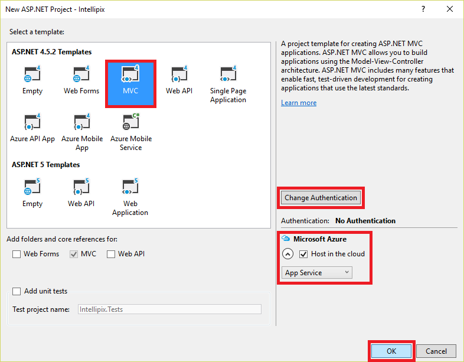

    _Creating a new ASP.NET MVC project_

1. In the "Create App Service" dialog that ensues, enter a name into the **Web App Name** box, or accept the default. (The default name will include a bunch of numbers. Since this name will form part of the DNS name through which the app is accessed once it's deployed to Azure, it must be unique within Azure. For this reason, you probably won't be able to use the name "Intellipix" pictured in the screen shot.)

	Type "Intellipix" (without quotation marks) into the **Resource Group** box to make the App Service that's being created part of the same resource group as the storage account you created in Exercise 1.

	Now click the **New** button to the right of **App Service Plan** to open the "Configure App Service Plan" dialog. In that dialog, set **Location** to the same location you specified for the storage account in Exercise 1, and make sure **Free** is selected in the **Size** drop-down. Click **OK** to close the dialog.

    

    _Configuring an App Service plan_

	Finish up by clicking the **Create** button in the lower-right corner of the "Create App Service" dialog.

    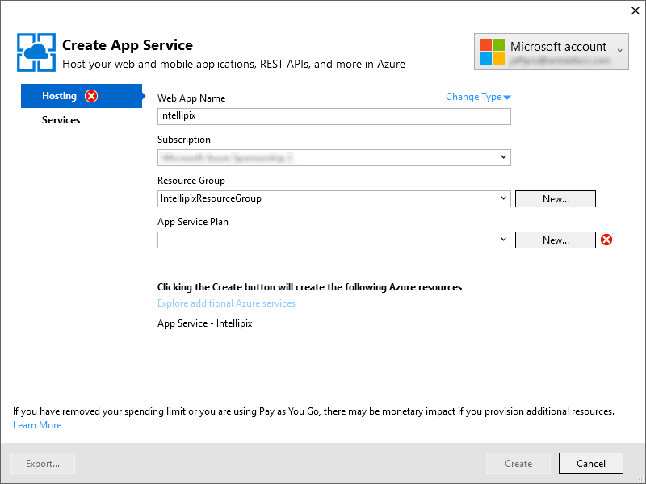

    _Creating a new App Service_

1. Take a moment to review the project structure in the Solution Explorer window. Among other things, there's a folder named "Controllers" that holds the project's MVC controllers, and a folder named "View" that holds the project's views. You'll be working with assets in these folders and others as you implement the application.

1. Now use Visual Studio's **Debug -> Start Without Debugging** command (or simply press **Ctrl+F5**) to launch the application in your browser. Here's how the application looks in its present state:

    

    _The initial application_

1. Close the browser and return to Visual Studio. In the Solution Explorer window, right-click the **Intellipix** project and select **Manage NuGet Packages...**

	> NuGet is a free and open-source package manager for Microsoft development platforms. It provides access to thousands of libraries, or *packages*, containing code to perform a variety of tasks. It is integrated into Visual Studio 2015, which makes it easy to add NuGet packages to your project and make a lot of things happen without writing a lot of code.

    

    _Managing NuGet Packages for the project_

1. Click **Browse**. Then type "storage" (without quotation marks) into the search box. Click **WindowsAzure.Storage** to select the Azure Storage client library from NuGet. Finally, click **Install** to install the latest stable version of the package. This package contains APIs for accessing Azure Storage from .NET applications. Click **OK** if you're prompted to review changes, and **I Accept** if prompted to accept licenses for downloaded packages.

    

    _Installing WindowsAzure.Storage_

1. Repeat this process to add the NuGet package named **Microsoft.WindowsAzure.ConfigurationManager** to the project. This package contains APIs that you will use in your code to parse storage connection strings. Once more, OK any changes and accept any licenses presented to you.

    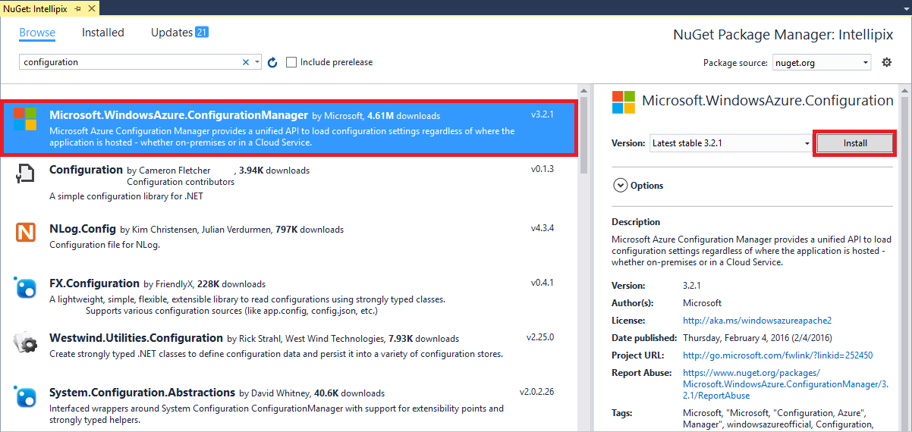

    _Installing Microsoft.WindowsAzure.ConfigurationManager_

1. Repeat this process to add the NuGet package named **ImageResizer** to the project. This package contains APIs that you will use to create image thumbnails from the images uploaded to the app. OK any changes and accept any licenses presented to you.

    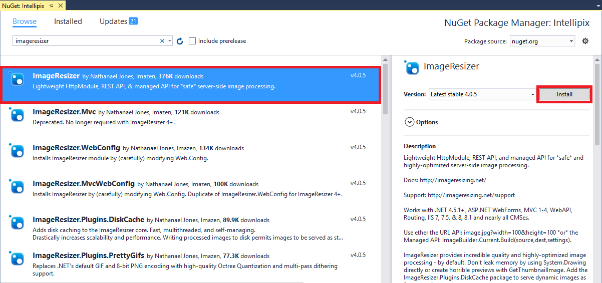

    _Installing ImageResizer_

1. In the Solution Explorer window, double-click Web.config to open it for editing.

    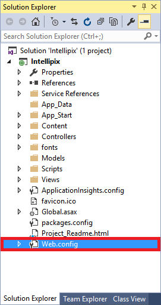

    _Opening Web.config_

1. Return to the Azure Portal for a moment and open the blade for the storage account you created in Exercise 1. Then click the key icon near the top of the blade. 

    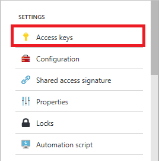

    _Viewing the storage account's access keys_

1. Click the **Copy** button to the right of **key1** to copy the access key to the clipboard.

    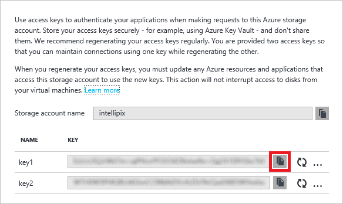

    _Copying the storage account's access key_

1. Return to Visual Studio. In Web.config, add the following statement to the \<appSettings\> section, replacing *account_name* with the name of the storage account you created in Exercise 1, and *account_key* with the access key you copied to the clipboard in the previous step.

	```C#
	<add key="StorageConnectionString" value="DefaultEndpointsProtocol=https;AccountName=account_name;AccountKey=account_key" />
	```

	Now save your changes and close Web.config.

1. In the Solution Explorer window, find the file named _Layout.cshtml in the Views/Shared folder. Double-click the file to open it.

	> In an ASP.NET MVC project, _Layout.cshtml is a special view that serves as a template for other views. You typically define header and footer content that is common to all views in _Layout.cshtml.

    

    _Opening _Layout.cshtml_

1. On line 29, change "Application name" to "Intellipix." Here is the edited line of code:

	```C#
	@Html.ActionLink("Intellipix", "Index", "Home", new { area = "" }, new { @class = "navbar-brand" })
	```

	Save your changes and close _Layout.cshtml.

1. In Solution Explorer, right-click the project's Models folder and select **Add -> Class**:

    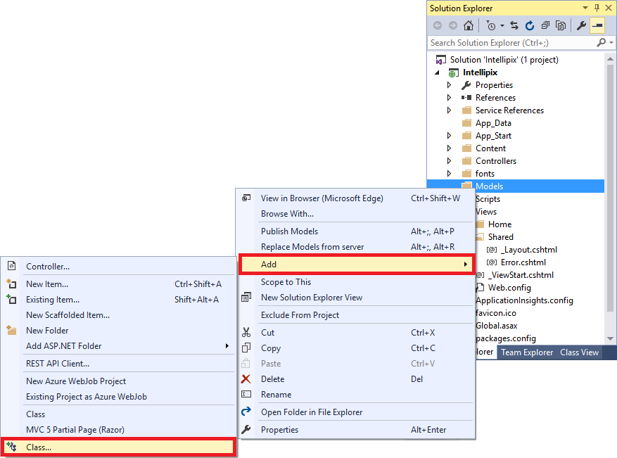

    _Adding a class to the Models folder_

1. Type "BlobInfo.cs" (without quotation marks) into the **Name** box, and then click **OK**.

    

    _Naming the new class_

1. Replace the empty BlobInfo class with the following class definition, and note that you are making the class public rather than private:

	```C#
	public class BlobInfo
	{
	    public string ImageUri { get; set; }
	    public string ThumbnailUri { get; set; }
	    public string Caption { get; set; }
	}
	```
	Now save your changes and close BlobInfo.cs.

1. In Solution Explorer, find HomeController.cs in the Views/Home folder and double-click it to open it.

    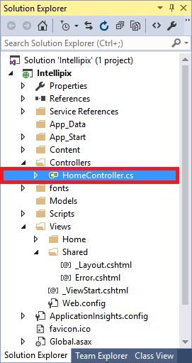

    _Opening HomeController.cs_

1. Add the following using statements to the top of the file:

	```C#
	using ImageResizer;
	using Intellipix.Models;
	using Microsoft.Azure;	
	using Microsoft.WindowsAzure.Storage;
	using Microsoft.WindowsAzure.Storage.Blob;
	using System.Threading.Tasks;
	using System.IO;
	```

1. Replace the *Index* method in HomeController.cs with the following implementation:

	```C#
	public ActionResult Index()
	{
	    // Pass a list of blob URIs in ViewBag
	    CloudStorageAccount account = CloudStorageAccount.Parse(CloudConfigurationManager.GetSetting("StorageConnectionString"));
	    CloudBlobClient client = account.CreateCloudBlobClient();
	    CloudBlobContainer container = client.GetContainerReference("photos");
	    List<BlobInfo> blobs = new List<BlobInfo>();
	
	    foreach (IListBlobItem item in container.ListBlobs())
	    {
	        var blob = item as CloudBlockBlob;
	
	        if (blob != null)
	        {
	            blobs.Add(new BlobInfo()
	            {
	                ImageUri = blob.Uri.ToString(),
	                ThumbnailUri = blob.Uri.ToString().Replace("/photos/", "/thumbnails/")
	            });
	        }
	    }
	
	    ViewBag.Blobs = blobs.ToArray();
	    return View();
	}
	```

	The modified *Index* method enumerates the blobs in the "photos" container and passes an array of BlobInfo objects representing those blobs to the view through ASP.NET MVC's ViewBag property. In a moment, you will modify the view to enumerate these objects and display a collection of photo thumbnails. The classes used to access your storage account and enumerate the blobs — CloudStorageAccount, CloudBlobClient, and CloudBlobContainer — come from the WindowsAzure.Storage package you installed from NuGet.

1. Add the following method to the HomeController class in HomeController.cs:

	```C#
	[HttpPost]
	public async Task<ActionResult> Upload(HttpPostedFileBase file)
	{
	    if (file != null && file.ContentLength > 0)
	    {
	        // Make sure the user selected an image file
	        if (!file.ContentType.StartsWith("image"))
	        {
	            TempData["Message"] = "Only image files may be uploaded";
	        }
	        else
	        {
	            // Save the original image in the "photos" container
	            CloudStorageAccount account = CloudStorageAccount.Parse(CloudConfigurationManager.GetSetting("StorageConnectionString"));
	            CloudBlobClient client = account.CreateCloudBlobClient();
	            CloudBlobContainer container = client.GetContainerReference("photos");
	            CloudBlockBlob photo = container.GetBlockBlobReference(Path.GetFileName(file.FileName));
	            await photo.UploadFromStreamAsync(file.InputStream);
	            file.InputStream.Seek(0L, SeekOrigin.Begin);
	
	            // Generate a thumbnail and save it in the "thumbnails" container
	            using (var outputStream = new MemoryStream())
	            {
	                var settings = new ResizeSettings { MaxWidth = 192, Format = "png" };
	                ImageBuilder.Current.Build(file.InputStream, outputStream, settings);
	                outputStream.Seek(0L, SeekOrigin.Begin);
	                container = client.GetContainerReference("thumbnails");
	                CloudBlockBlob thumbnail = container.GetBlockBlobReference(Path.GetFileName(file.FileName));
	                await thumbnail.UploadFromStreamAsync(outputStream);
	            }
	        }
	    }
	
	    // redirect back to the index action to show the form once again
	    return RedirectToAction("Index");
	}
	```

	This is the method that's called when you upload a photo. It stores each uploaded image as a blob in the "photos" container, creates a thumbnail image from the original image using the ImageResizer packager you installed from NuGet, and stores the thumbnail image as a blob in the "thumbnails" container.

1. In Solution Explorer, find Index.cshmtl in the Views/Home folder and double-click it to open it. This is the view that serves as the application's home page.

1. Replace the contents of Index.cshtml with the following code and markup:

	```HTML
	@{
	    ViewBag.Title = "Intellipix Home Page";
	}
	
	@using Intellipix.Models
	
	<div class="container" style="padding-top: 24px">
	    <div class="row">
	        <div class="col-sm-8">
	            @using (Html.BeginForm("Upload", "Home", FormMethod.Post, new { enctype = "multipart/form-data" }))
	            {
	                <input type="file" name="file" id="upload" style="display: none" onchange="$('#submit').click();" />
	                <input type="button" value="Upload a Photo" class="btn btn-primary btn-lg" onclick="$('#upload').click();" />
	                <input type="submit" id="submit" style="display: none" />
	            }
	        </div>
	        <div class="col-sm-4 pull-right">
	        </div>
	    </div>
	
	    <hr />
	
	    <div class="row">
	        <div class="col-sm-12">
	            @foreach (BlobInfo blob in ViewBag.Blobs)
	            {
	                
	            }
	        </div>
	    </div>
	</div>
	
	@section scripts
	{
	    <script type="text/javascript" language="javascript">
	        if ("@TempData["Message"]" !== "") {
	            alert("@TempData["Message"]");
	        }
	    </script>
	}
	```

	The language used here is [Razor](http://www.asp.net/web-pages/overview/getting-started/introducing-razor-syntax-c), which lets you embed executable code in HTML markup. The @foreach statement in the middle of the file enumerates the BlobInfo objects passed from the controller in ViewBag and creates HTML \ elements from them. The src property of each element is initialized with the URI of the blob containing the image thumbnail.

1. Use Visual Studio's **Debug -> Start Without Debugging** command (or press **Ctrl+F5**) to launch the application in your browser. Then click the **Upload a Photo** button and upload one of the images found in the "resources/photos" folder of this lab. After a few seconds, a thumbnail version of the photo appears on the page:

    

    _Intellipix with one photo uploaded_

1. Upload a few more images from this lab's "resources/photos" folder. Confirm that they appear on the page, too:

    

    _Intellipix with three photos uploaded_

1. Return to the Microsoft Azure Storage Explorer (or restart if it you didn't leave it running) and double-click the "photos" container under the storage account you created in Exercise 1. The number of blobs in the container should equal the number of photos you uploaded. Double-click one of the blobs to download it and see the image stored in the blob.

    

    _Contents of the "photos" container_

1. Open the "thumbnails" container in Storage Explorer. How many blobs do you see there? Open one of the blobs to see what's inside. These are the thumbnail images generated from the image uploads.

1. Do a **View Source** in your browser to view the source for the page. Find the \ elements representing the image thumbnails. Observe that the URLs assigned to the images refer **directly to blobs in blob storage**. This is possible because you set the containers' **Access type** to **Blob**, which makes the blobs inside them publicly accessible.

	> What would happen if the containers were private? If you're not sure, try it and see. Temporaily change the "thumbnails" container's **Access type** to **Private** in the Azure Portal. Then refresh the Intellipix page in your browser and see what happens.

The app doesn't yet offer a way to view the original images that you uploaded. Ideally, clicking an image thumbnail should display the original image. Let's implement that before proceeding further. 

<a name="Exercise4"></a>
## Exercise 4: Add a lightbox for viewing photos

In this exercise, you will use a free, open-source JavaScript library to add a lightbox viewer enabling users to see the original images that they uploaded (rather than just the image thumbnails). The files are provided for you in subfolders of this lab's "resources" folder. All you have to do is integrate them into the project and make a minor modification to Index.cshtml.

1. In Visual Studio's Solution Explorer window, right-click the Scripts folder and use the **Add -> Existing Item** command to add lightbox.js, found in this lab's "resources/scripts" folder, to the project's Scripts folder.

1. Right-click the Content folder and use the **Add -> Existing Item** command to add lightbox.css, found in this lab's "resources/css" folder, to the project's Content folder.

1. Right-click the Intellipix project in Solution Explorer and use the **Add -> New Folder** command to add a folder named "Images" to the project.

1. Right-click the Images folder and use the **Add -> Existing Item** command to add the four images found in this lab's "resources/images" folder to the project's Images folder.

1. Open the project's App_Start folder and double-click **BundleConfig.cs** to open the file for editing.

1. Add the following statement to the *RegisterBundles* method in BundleConfig.cs:

	```C#
	bundles.Add(new ScriptBundle("~/bundles/lightbox").Include(
    			"~/Scripts/lightbox.js"));
	````

1. In the same method, find the statement that defines a StyleBundle named "~/Content/css" and add lightbox.css to the list of style sheets in the bundle. Here is the modified statement:

	```C#
	bundles.Add(new StyleBundle("~/Content/css").Include(
            	"~/Content/bootstrap.css",
            	"~/Content/site.css",
            	"~/Content/lightbox.css"));
	````

	Now save your changes and close BundleConfig.cs.

1. Open _Layout.cshtml in the project's Views/Shared folder and add the following statement just before the @RenderSection statement near the bottom:

	```C#
	@Scripts.Render("~/bundles/lightbox")
	````

	Save your changes and close _Layout.cshtml.

1. You're almost there. The final task is to incorporate the lightbox viewer into the home page. To do that, open Index.cshtml (it's in the project's Views/Home folder) and replace the @foreach loop with the following code:

	```HTML
	@foreach (BlobInfo blob in ViewBag.Blobs)
	{
	    <a href="@blob.ImageUri" rel="lightbox" title="@blob.Caption">
	        
	    </a>
	}
	````

	Save your changes and close Index.cshtml.

1. Use Visual Studio's **Debug -> Start Without Debugging** command (or press **Ctrl+F5**) to launch the application in your browser. Then click one of the images you uploaded earlier. Confirm that a lightbox appears showing an enlarged view of the image.

    

    _An enlarged image_

1. Click the **X** in the lower-right corner of the lightbox to dismiss it.

Now you have a way to view the images you uploaded. The next step is to do more with those images.

<a name="Exercise5"></a>
## Exercise 5: Use Cognitive Services to generate metadata

Now comes the fun part: using [Microsoft Cognitive Services](https://www.microsoft.com/cognitive-services/) to generate captions and search keywords for the photos you upload. Cognitive Services is a set of intelligence APIs that you can call from your apps. Among the more than 20 APIs it offers are the [Computer Vision API](https://www.microsoft.com/cognitive-services/en-us/computer-vision-api) for distilling actionable information from images, the [Emotion API](https://www.microsoft.com/cognitive-services/en-us/emotion-api) for recognizing emotion in images and video, and the [Text Analytics API](https://www.microsoft.com/cognitive-services/en-us/text-analytics-api) for extracting sentiments and other information from text (for example, Twitter feeds). These APIs make it possible to build smart apps that would have been impossible just a few short years ago. And they're available in preview form for you to begin using today.

In this exercise, you will use the Computer Vision API to generate a caption for each image that is uploaded, as well as keywords describing the contents of the image. You will store this data in metadata attached to each blob in the "photos" container.

1. Begin by using the Azure Storage Explorer to delete the blobs in the "photos" container and the "thumbnails" container. (Do not delete the containers themselves.) This will allow you to start fresh with a new batch of images to process with the Computer Vision API.

1. In order to use the Computer Vision API, you need to sign up for a free account and acquire a subscription key. To do that, point your browser to [https://www.microsoft.com/cognitive-services/en-us/subscriptions](https://www.microsoft.com/cognitive-services/en-us/subscriptions).

1. If you are asked to sign in, do so with your Microsoft account.

1. Click **Yes** when asked if this app can access your info.

    

    _Approving access to personal info_

1. Scroll down until you find **Computer Vision**. Then check the box next to it.

    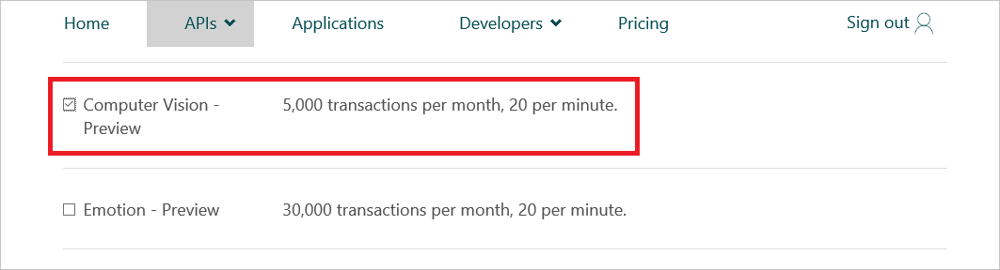

    _Requesting access to the Computer Vision API_

1. Scroll to the bottom of the page. Check the box to agree to the terms and privacy statement, and then click the **Subscribe** button.

    

    _Subscribing to the Computer Vision API_

1. Click **Copy** under **Key 1** to copy your Computer Vision subscription key to the clipboard.

    

    _Copying the subscription key to the clipboard_

1. Return to Visual Studio. Open the Web.config file at the root of the project and add the following statement to the \<appSettings\> section of the file, replacing *subscription_key* with the key you copied to the clipboard in the previous step:

	````C#
    <add key="SubscriptionKey" value="subscription_key" />
	````
	Save your changes and close Web.config.

1. In Solution Explorer, right-click the project and use the **Manage NuGet Packages...** command to install a package named **Microsoft.ProjectOxford.Vision** from NuGet. This package contains types for calling the Computer Vision API. As usual, approve any changes and licenses that are presented to you.

    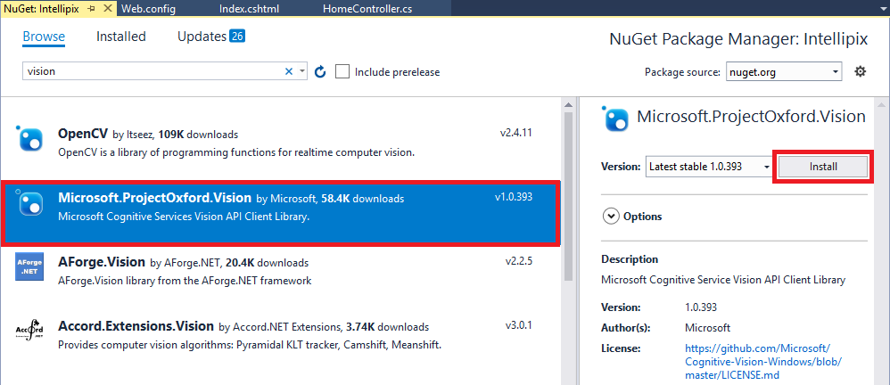

    _Installing Microsoft.ProjectOxford.Vision_

1. Open HomeController.cs in the project's Controllers folder and add the following using statement at the top of the file:

	```C#
	using Microsoft.ProjectOxford.Vision;
	```

1. Add the following statements to the *Upload* method, immediately after the block of code that begins with the comment "Generate a thumbnail and save it in the thumbnails container." This code passes the URL of the blob containing the image that was uploaded to the Computer Vision API, and requests that Computer Vision generate a description for the image. In addition to generating a description, the Computer Vision API also generates a list of keywords describing what it sees in the image. Your code stores the computer-generated description and the keywords in the blob's metadata so they can be retrieved later on.

	````C#
    // Submit the image to Azure's Computer Vision API
    VisionServiceClient vision = new VisionServiceClient(CloudConfigurationManager.GetSetting("SubscriptionKey"));
    VisualFeature[] features = new VisualFeature[] { VisualFeature.Description };
    var result = await vision.AnalyzeImageAsync(photo.Uri.ToString(), features);

    // Record the image description and tags in blob metadata
    photo.Metadata.Add("Caption", result.Description.Captions[0].Text);

    for (int i = 0; i < result.Description.Tags.Length; i++)
    {
        string key = String.Format("Tag{0}", i);
        photo.Metadata.Add(key, result.Description.Tags[i]);
    }

    await photo.SetMetadataAsync();
	````

1. Replace the *foreach* block in the *Index* method with the following statements:

	````C#
    foreach (IListBlobItem item in container.ListBlobs())
    {
        var blob = item as CloudBlockBlob;

        if (blob != null)
        {
            blob.FetchAttributes(); // Get blob metadata
            var caption = blob.Metadata.ContainsKey("Caption") ? blob.Metadata["Caption"] : blob.Name;

            blobs.Add(new BlobInfo()
            {
                ImageUri = blob.Uri.ToString(),
                ThumbnailUri = blob.Uri.ToString().Replace("/photos/", "/thumbnails/"),
                Caption = caption
            });
        }
    }
	````

	The modified *foreach* block calls *FetchAttributes* to fetch the metadata for the blob. Then it extracts the computer-generated description from the metadata and adds it to the BlobInfo object passed to the view.

	Now save your changes and close HomeController.cs.

1.  Use Visual Studio's **Debug -> Start Without Debugging** command (or press **Ctrl+F5**) to launch the application in your browser. Upload a few images from this lab's "resources/photos" folder as you did before.

1. Hover the cursor over one of the thumbnails. Confirm that a tooltip window appears containing the computer-generated caption for the image.

    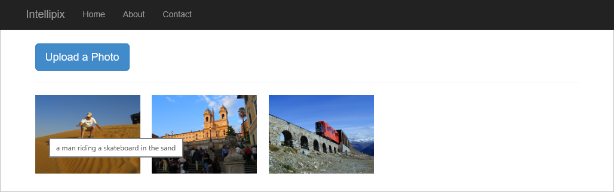

    _The computer-generated caption_

1. Click one of the thumbnails to display the original image in a lightbox. Confirm that the computer-generated caption appears at the bottom of the lightbox. Then dismiss the lightbox.

    

    _Lightbox with computer-generated caption_

1. Want to see where the metadata generated by the Computer Vision API is being stored? Use the Azure Storage Explorer to open the "photos" container. Right-click any of the blobs in the container and select **Properties**. In the ensuing dialog, you'll see a list of the metadata attached to the blob. Each metadata item is a key-value pair. The computer-generated image description is stored in the item named "caption," while the metadata items named "tag0," "tag1," and so on hold the additional keywords created for the image.

    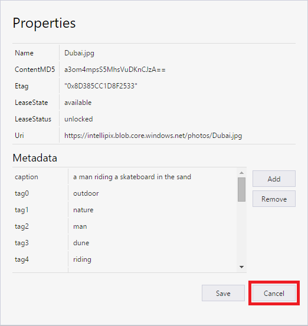

    _Blob metadata_

	When you're finished, click **Cancel** to close the Properties dialog.

In the next exercise, you'll put the extra keywords to work by adding a search feature to the app.

<a name="Exercise6"></a>
## Exercise 6: Add search to the app

In this exercise, you will add a search box to the home page enabling users to do keyword searches on the images that they have uploaded. The keywords are the ones generated by the Computer Vision API and stored in blob metadata.

1. Open Index.cshtml in the project's Views/Home folder and add the following statements to the empty \<div\> element with the class="col-sm-4 pull-right" attribute:

	```HTML
    @using (Html.BeginForm("Search", "Home", FormMethod.Post, new { enctype = "multipart/form-data", @class = "navbar-form" }))
    {
	    <div class="input-group">
		    <input type="text" class="form-control" placeholder="Search photos" name="term" value="@ViewBag.Search" style="max-width: 800px">
		    <span class="input-group-btn">
			    <button class="btn btn-primary" type="submit">
				    <i class="glyphicon glyphicon-search"></i>
			    </button>
		    </span>
	    </div>
	}
	````

	This code and markup adds a search box and a **Search** button to the home page.

1. Open HomeController.cs in the project's Controllers folder and add the following method to the HomeController class:

	```C#
    [HttpPost]
    public ActionResult Search(string term)
    {
        return RedirectToAction("Index", new { id = term });
    }
	```

	This is the method that's called when the user clicks the **Search** button added in the previous step. It refreshes the page and includes a search parameter in the URL.

1. Replace the *Index* method with the following implementation:

	```C#
    public ActionResult Index(string id)
    {
        // Pass a list of blob URIs and captions in ViewBag
        CloudStorageAccount account = CloudStorageAccount.Parse(CloudConfigurationManager.GetSetting("StorageConnectionString"));
        CloudBlobClient client = account.CreateCloudBlobClient();
        CloudBlobContainer container = client.GetContainerReference("photos");
        List<BlobInfo> blobs = new List<BlobInfo>();

        foreach (IListBlobItem item in container.ListBlobs())
        {
            var blob = item as CloudBlockBlob;

            if (blob != null)
            {
                blob.FetchAttributes(); // Get blob metadata

                if (String.IsNullOrEmpty(id) || HasMatchingMetadata(blob, id))
                {
                    var caption = blob.Metadata.ContainsKey("Caption") ? blob.Metadata["Caption"] : blob.Name;

                    blobs.Add(new BlobInfo()
                    {
                        ImageUri = blob.Uri.ToString(),
                        ThumbnailUri = blob.Uri.ToString().Replace("/photos/", "/thumbnails/"),
                        Caption = caption
                    });
                }
            }
        }

        ViewBag.Blobs = blobs.ToArray();
        ViewBag.Search = id; // Prevent search box from losing its content
        return View();
    }
	```

	Observe that the *Index* method now accepts a parameter ("id") that contains the value the user typed into the search box. An empty or missing "id" parameter indicates that all the photos should be displayed.

1. Add the following helper method to the HomeController class:

	```C#
    private bool HasMatchingMetadata(CloudBlockBlob blob, string term)
    {
        foreach (var item in blob.Metadata)
        {
            if (item.Key.StartsWith("Tag") && item.Value.Equals(term, StringComparison.InvariantCultureIgnoreCase))
                return true;
        }

        return false;
    }
	```

	This method is called by the *Index* method to determine whether the metadata keywords attached to a given image blob contain the search term that the user entered.

1. Launch the application again and upload several photos. **Feel free to upload photos of your own**, not just the ones provided with the lab.

1. Type a keyword such as "river" into the search box. Then click the **Search** button.

    

    _Performing a search_

1. Search results will vary depending on what you typed and what images you uploaded. But the result should be a list of matching images:

    

    _Search results_

1. Click the browser's back button to display all of the images again.

You're almost finished, but the final and most important step remains. It is time to deploy the app to the cloud.

<a name="Exercise7"></a>
## Exercise 7: Deploy the app to Azure

In this exercise, you will deploy the app to Azure using Visual Studio's Web Deploy feature. Up to now, you have been running the app locally. Web Deploy makes it incredibly easy to publish to the Web without having to FTP up a bunch of files. You will be deploying to the Azure App Service that was created when you created the project in Visual Studio. (Remember that **Host in the cloud** box you checked? If not, refer to Exercise 3, Step 2.)

1. Right-click the project in Solution Explorer and select **Publish...** from the context menu.

    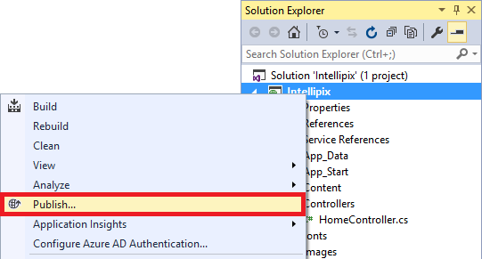

    _Publishing the app_

1. In the ensuing dialog, make sure **Web Deploy** is selected as the **Publish method**. Then click the **Publish** button.

    

    _Deploying to the Web from Visual Studio_

1. After a few moments, the app will appear in a browser window. Note the URL in the address bar. The app is no longer running locally; it's on the Web, where it's reachable by everyone.

    

    _The finished product!_

If you make changes to the app and want to push the changes out to the Web, simply go through the Publish process again. Of course, you can still test your changes locally before publishing to the Web.

## Summary

In this hands-on lab, you learned how to:

- Create an Azure storage account and use it as a backing store for an app
- Create a Web app in Visual Studio, test it locally, and deploy it to Azure
- Write code that uploads blobs to blob storage and attaches metadata to them
- Consume blob metadata to implement search
- Use Microsoft's Computer Vision API to generate metadata from images

There is much more that you could do to develop Intellipix and to leverage Azure even further. For example, you could add support for authenticating users and deleting photos, and rather than force the user to wait for Cognitive Services to process a photo following an upload, you could use [Azure Functions](https://azure.microsoft.com/en-us/services/functions/) to call the Computer Vision API asynchronously each time an image is added to blob storage. You could even use Cognitive Services to detect faces in the photos and analyze the emotions depicted by those faces. With the cloud as your platform, the sky is the limit (pun intended).

----

Copyright 2016 Microsoft Corporation. All rights reserved. Except where otherwise noted, these materials are licensed under the terms of the MIT License. You may use them according to the license as is most appropriate for your project. The terms of this license can be found at https://opensource.org/licenses/MIT.