<a name="HOLTitle"></a>
# Processing IoT Data with Azure Stream Analytics #

---

<a name="Overview"></a>
## Overview ##

[Azure Stream Analytics](https://azure.microsoft.com/en-us/services/stream-analytics/) is a cloud-based service for ingesting high-velocity data streaming from devices, sensors, applications, Web sites, and other data sources and analyzing that data in real time. It supports a SQL-like query language that works over dynamic data streams and makes analyzing constantly changing data no more difficult than performing queries on static data stored in traditional databases. With Azure Stream Analytics, you can set up jobs that analyze incoming data for anomalies or information of interest and record the results, present notifications on dashboards, or even fire off alerts to mobile devices. And all of it can be done at low cost and with a minimum of effort.

Scenarios for the application of real-time data analytics are legion and include fraud detection, identity-theft protection, optimizing the allocation of resources (think of an Uber-like transportation service that sends drivers to areas of increasing demand *before* that demand peaks), click-stream analysis on Web sites, shopping suggestions on retail-sales sites, and countless others. Having the ability to process data *as it comes in* rather than waiting until after it has been aggregated offers a competitive advantage to businesses that are agile enough to make adjustments on the fly.

In this lab, you'll create an Azure Stream Analytics job and use it to analyze data from simulated Internet of Things (IoT) devices. You will see how simple it is to monitor real-time data streams for information of significance. And at the end, you will build a Web app that shows output from the Stream Analytics job in real time. 

<a name="Objectives"></a>
### Objectives ###

In this hands-on lab, you will learn how to:

- Create Azure event hubs and use them for Stream Analytics input and output
- Create a Stream Analytics job and test queries on sample data streams
- Run a Stream Analytics job and perform queries on live data streams
- Consume events from an event hub and display them in a Web app

<a name="Prerequisites"></a>
### Prerequisites ###

The following is required to complete this hands-on lab:

- An active Microsoft Azure subscription. Use the one you created in Lab 1, or [sign up for a free trial](http://aka.ms/WATK-FreeTrial)
- [Visual Studio 2015 Community edition](https://www.visualstudio.com/en-us/products/visual-studio-community-vs.aspx) or higher 

---
<a name="Exercises"></a>
## Exercises ##

This hands-on lab includes the following exercises:

- [Exercise 1: Create an event hub for input](#Exercise1)
- [Exercise 2: Send events to the event hub](#Exercise2)
- [Exercise 3: Create a Stream Analytics job](#Exercise3)
- [Exercise 4: Prepare queries and test with sample data](#Exercise4)
- [Exercise 5: Create an event hub for output](#Exercise5)
- [Exercise 6: Build a real-time dashboard](#Exercise6)
- [Exercise 7: Analyze a live data stream](#Exercise7)

Estimated time to complete this lab: **75** minutes.

<a name="Exercise1"></a>
## Exercise1: Create an event hub for input ##

Azure Stream Analytics supports several types of input, including input from Azure blobs and input from Azure event hubs. Of the two, the latter is typically more interesting because in the IoT world, data is easily transmitted to Azure event hubs through field gateways (for devices that are not IP-capable) or cloud gateways (for devices that *are* IP-capable), and a single Azure event hub can handle millions of events per second transmitted from devices spread throughout the world.

In this exercise, you'll create an Azure event hub to provide input to Azure Stream Analytics and configure it to so that it can be accessed safely and securely by IoT devices and gateways. 

1. You can't (yet) create an event hub using the Azure Portal, so you'll create it instead using the Classic Portal. Go to [https://manage.windowsazure.com](https://manage.windowsazure.com) to open the Classic Portal, and click **Service Bus** in the ribbon on the left. Then click **CREATE A NEW NAMESPACE** to create a new service-bus namespace. (If you have already created one or more namespaces, click **+ NEW** in the lower-left corner of the page to create another one.)

    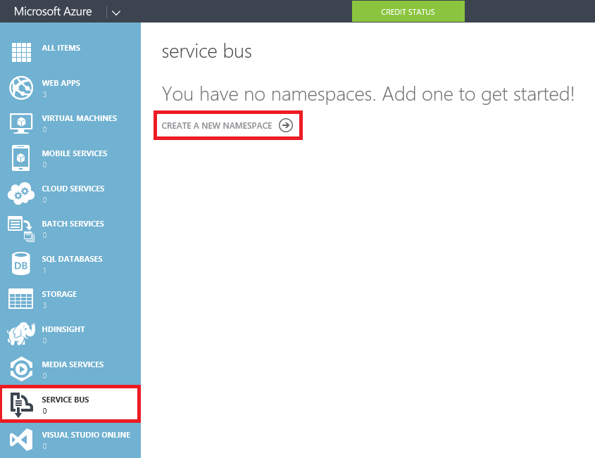

    _Azure Service Bus_

1. Type a namespace name into the **NAMESPACE NAME** box. The name must be unique within Azure, so you'll have to use something other than the name in the screen shot below. (A green check mark will appear in the box when the name you've entered is one that Azure will accept.) Set **TYPE** to **EVENTHUB**, and choose the region closest to you from the **REGION** drop-down. Then click the check mark in the lower-right corner of the dialog.

    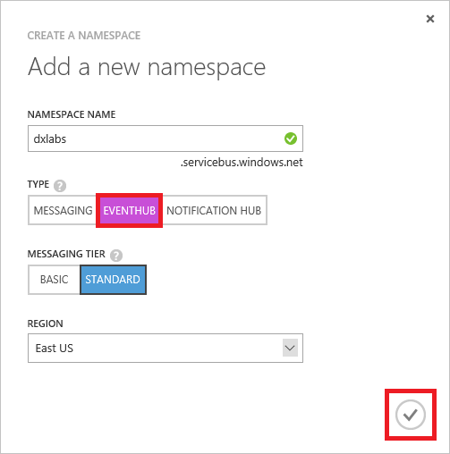

    _Creating a service-bus namespace_

1. Click the **+ NEW** button in the lower-left corner of the page. Click **EVENT HUB**, followed by **QUICK CREATE**. Type "inputhub" (without quotation marks) into the **EVENT HUB NAME** box (the name doesn't have to be unique within Azure). Select the same region you selected for the service-bus namespace in the previous step, and make sure the namespace you created in that step is selected in the **NAMESPACE** box. Then click **CREATE A NEW EVENT HUB** in the lower-right corner.

    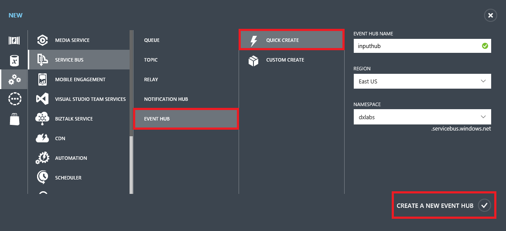

    _Creating an event hub_

1. Wait for the event hub to be created. Then click the event hub name to display the event hub's dashboard.

    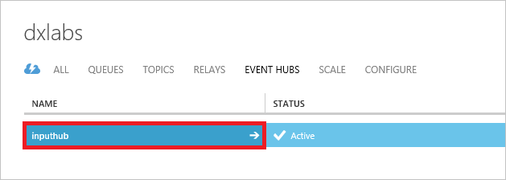

    _Input event hub_

1. Click **CONFIGURE**.

    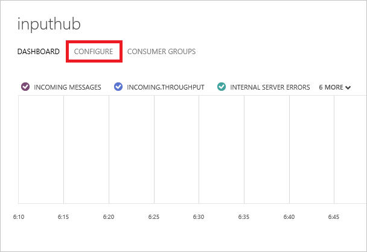

    _Event hub dashboard_

1. In order to transmit events to the event hub from an application or device, you need to create a shared-access policy that includes Send permission. In the **shared access policies** section of the event-hub configuration page, create a new policy by typing "SendPolicy" (without quotation marks) into the first text box and checking the **Send** box in the drop-down list under **PERMISSIONS**. Then click the **Save** button at the bottom of the page to save the new policy.

    

    _Creating a policy with Send permission_

1. Click **DASHBOARD** near the top of the page to return to the event hub's dashboard.

    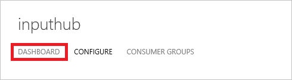

    _Returning to the dashboard_

1. Under **quick glance** on the right side of the page, click **View Connection String**.

    

    _Viewing the connection string_

1. Copy the connection string to the clipboard. (If you hover over the connection string, a copy-to-clipboard button will appear.) Then click the check mark to dismiss the dialog. Finish up by pasting the connection string into your favorite text editor so you can retrieve it in the next exercise.

    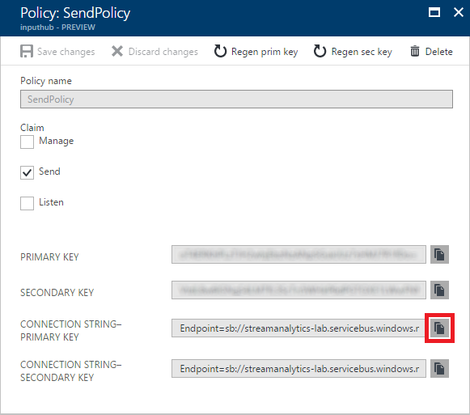

    _Copying the connection string_

You have created an event hub that can ingest events and be used as the source of input to a Stream Analytics job. You have also created a policy that allows events to be sent to the event hub, and a connection string that encapsulates that policy. The next step is to use that connection string to transmit events to the event hub.

<a name="Exercise2"></a>
## Exercise 2: Send events to the event hub ##
Applications, devices, and gateways can send events to Azure event hubs using the [Azure Event Hubs REST API](https://msdn.microsoft.com/en-us/library/azure/Dn790674.aspx) or the [Advanced Message Queuing Protocol](https://www.amqp.org/), or AMQP for short. In this exercise, you will write a Windows console app that uses AQMP to send events to the event hub you created in [Exercise 1](#Exercise1). Each event will represent a withdrawal from an ATM machine, and will contain relevant information such as the card number used for the withdrawal, the time and amount of the withdrawal, and a unique identifier for the ATM machine used.

1. Start Visual Studio 2015 and use the **File -> New -> Project** command to create a new Windows Console Application named "ATMEventGenerator."

    

    _Creating a new console app_

1. In the Solution Explorer window, right-click the **ATMEventGenerator** project and select **Manage NuGet Packages...**

    

    _Managing NuGet Packages for the project_

	> NuGet is a free and open-source package manager for Microsoft development platforms. It provides access to thousands of libraries, or *packages*, containing code to perform a variety of tasks. It is integrated into Visual Studio 2015, which makes it easy to add NuGet packages to your project and make a lot of things happen without writing a lot of code.

1. Click **Browse**. Then type "azure" (without quotation marks) into the search box. Click **WindowsAzure.ServiceBus** to select the Azure service-bus package from NuGet. Finally, click **Install** to install the latest stable version of the package. This package contains the APIs that your app will use to send events to the event hub.

    

    _Installing WindowsAzure.ServiceBus_

1. If prompted to review changes, click **OK**. Optionally check **Do not show this again** so you won't be prompted again.

	

	_Reviewing changes_

1. If prompted to accept a license for the package, click **I Accept**..

	

	_Accepting the package license_

1. Return to the search box and type "newtonsoft," again without quotation marks. Select **Newtonsoft.Json** and click **Install** to install the latest stable version of Json.NET. This package contains convenient APIs for generating and consuming JSON. If prompted to review changes, click **OK**.

    

    _Installing Json.NET_

1. Open **Program.cs** and add the following using statements to the using statements at the top of the file:

	```C#
	using Microsoft.ServiceBus.Messaging;
	using Newtonsoft.Json;
	```

1. Replace the empty Program class with the following implementation:

	```C#
	class Program
	{
	    static double _probability = 0.01;
	    static int _transactions = 0;
	    static int _cardNumber = -1;
	    static string _connectionString = "connection_string";
	
	    static void Main(string[] args)
	    {
	        var rand = new Random();
	        var client = EventHubClient.CreateFromConnectionString(_connectionString, "inputhub");
	
	        while (true)
	        {
	            int card = 123456789 + rand.Next(0, 888888888);
	
	            // Occasionally generate a fraudulent transaction by reusing a card number
	            if (rand.NextDouble() < _probability && _cardNumber != -1)
	            {
	                card = _cardNumber;
	                _cardNumber = -1;
	            }
	
	            // Formulate a transaction
	            var transaction = new {
	                transactionId = _transactions++,
	                transactionTime = DateTime.UtcNow.ToString(),
	                deviceId = 12345 + rand.Next(0, 88888),
	                cardNumber = card,
	                amount = rand.Next(1, 20) * 20
	            };
	
	            // Occasionally record a card number for later use in generating fraud
	            if (rand.NextDouble() < _probability)
	            {
	                _cardNumber = transaction.cardNumber;
	            }
	
	            // Send an event to the event hub
	            var message = JsonConvert.SerializeObject(transaction);
	            client.Send(new EventData(Encoding.UTF8.GetBytes(message)));
	            Console.WriteLine("[{0}] Event transmitted", transaction.transactionId);
	        }
	    }
	}
	```

1. Replace **connection_string** in line 6 with the connection string you copied to the clipboard (and hopefully into your favorite text editor) in Exercise 1, Step 9.

1. Remove ";EntityPath=inputhub" from the end of the connection string. The _connectionString field should now look something like this:

	```C#
	static string _connectionString = "Endpoint=sb://dxlabs.servicebus.windows.net/;SharedAccessKeyName=SendPolicy;SharedAccessKey=Zx/fjB8kH3nuW789pUpXJ1S45FkMacJq9gYUu6cRD3Y=";
	```

1. Press **Ctrl+F5** to run the program and confirm that you see output similar to the following. Each line represents one event sent to the event hub, and events will probably roll by at a rate of about 2 to 3 per second. (Rates will vary depending on your connection speed.) **Confirm that no exceptions are thrown**.

    

    _Messages sent to the event hub_

1. Press **Ctrl+C** to stop the flow of events. Then press Enter to close the Command Prompt window.

In real life, there would be real ATM machines sending events to the event hub. ATMEventGenerator simulates these events in software and sets the stage for you to build and test a Stream Analytics job that analyzes these events.

<a name="Exercise3"></a>
## Exercise 3: Create a Stream Analytics job ##

You now have software that sends events to an Azure event hub, and an event hub that ingests the data. In this exercise, you'll use the Microsoft Azure [Classic Portal](https://manage.windowsazure.com) to create a Stream Analytics job and connect it to the event hub. You'll also capture the raw data being presented to Stream Analytics by the event hub and examine its structure. But first, you will create a storage account for the Stream Analytics job to use.

1. Open the [Classic Portal](https://manage.windowsazure.com) in your browser if it isn't already open, and click **+ NEW** in the lower-left corner of the portal.

1. Click **DATA SERVICES -> STORAGE -> QUICK CREATE**. Enter a name for the new storage account in the **URL** box, and then select the region nearest you under **LOCATION** and **Locally Redundant** under **REPLICATION**. Then click **CREATE STORAGE ACCOUNT**.

	> Recall that storage-account names can be 3 to 24 characters in length, can only contain numbers and lowercase letters, and must be unique within Azure. A green check mark next to the name indicates that it meets all these criteria.

    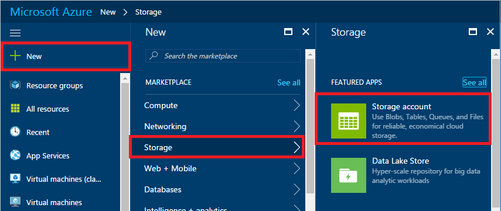

    _Creating a new storage account_

1. Once the storage account is created (it generally takes 30 to 60 seconds) and appears in the list of storage accounts associated with your subscription, click it.

    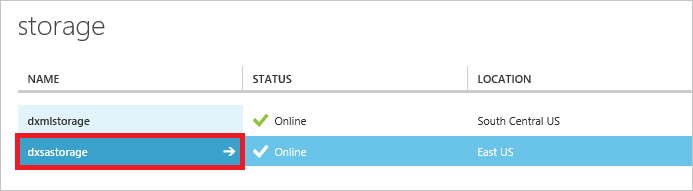

    _Selecting the new storage account_

1. Click **MANAGE ACCESS KEYS** in the ribbon at the bottom of the portal.

    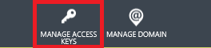

    _Viewing the storage account's access keys_

1. In the ensuing dialog, click the **Copy** button to the right of the storage account's primary access key to copy the key to the clipboard. Paste the key into your favorite text editor so you can retrieve it later. Then dismiss the dialog by clicking the check mark in the lower-right corner.

    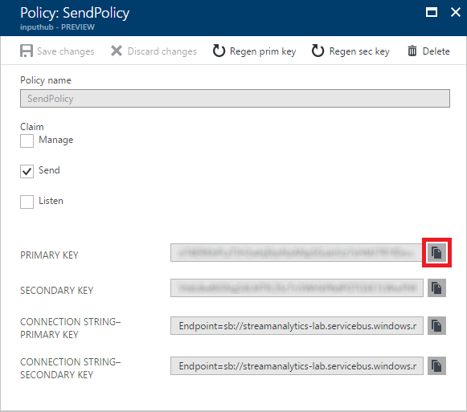

    _Copying the primary access key to the clipboard_

1. Now it's time to create a Stream Analytics job. Begin by clicking **STREAM ANALYTICS** in the ribbon on the left side of the portal (you may have to scroll down to find it), and then clicking **CREATE A NEW STREAM ANALYTICS JOB**.

    

    _Azure Stream Analytics_

1. Type "IoT-Analytics" (without quotation marks) into the **JOB NAME** box. Select the region nearest you in the **REGION** box. Under **REGIONAL MONITORING STORAGE ACCOUNT**, select the storage account that you created just a moment ago. (If the portal selects another storage account and won't let you change the selection, that's fine. Just accept it.) Then click **CREATE STREAM ANALYTICS JOB** in the lower-right corner.

    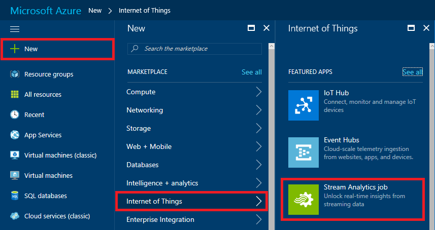

    _Creating a Stream Analytics job_

1. After a few moments, the Stream Analytics job will appear in the portal. Wait until the job has been created, and then click it.

    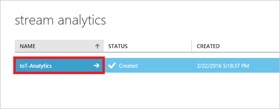

    _The new Stream Analytics job_

1. Click **INPUTS** near the top of the page.

    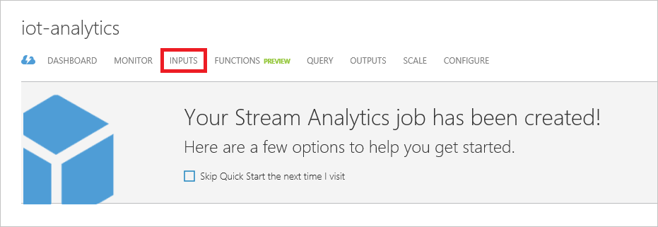

    _IoT-Analytics page_

1. Click **ADD AN INPUT**.

    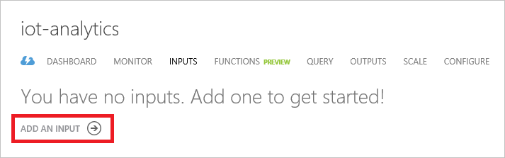

    _Adding an input_

1. Make sure **Data stream** is selected, and then click the right-arrow in the lower-right corner of the dialog.

    

    _Specifying an input type_

1. Make sure **Event Hub** is selected, and then click the right-arrow.

    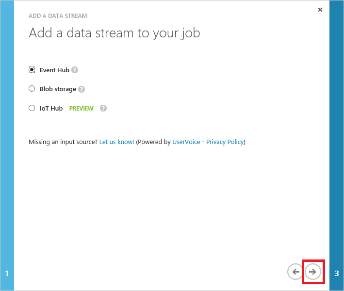

    _Specifying a data-stream type_

	> IoT hubs are a relatively recent addition to Azure. Their primary purpose is to enable two-way communications between hubs and IoT devices, and to allow devices that communicate with them to be registered. You chose **Event Hub** because you don't need the added functionality that IoT hubs provide. In addition, IoT hubs are still in preview and therefore are subject to change.

1. Enter "Withdrawals" (without quotation marks) as a friendly alias for the input in the **INPUT ALIAS** box. In the **CHOOSE A NAMESPACE** and **CHOOSE AN EVENTHUB** boxes, select the namespace and event hub that you created in [Exercise 1](#Exercise1). Leave **EVENT HUB POLICY NAME** set to **RootManageSharedAccessKey** (that's a default policy that's created automatically when you create an event hub; it grants permission to manage the event hub, send events, and receive events) and **CHOOSE A CONSUMER GROUP** set to **$Default**. Then click the right-arrow in the lower-right corner.

    

    _Specifying event-hub settings_

1. Make sure **JSON** is selected under **EVENT SERIALIZATION FORMAT** (the console app that sends events to the event hub sends JSON data), and **UTF8** is selected under **ENCODING**. Then click the check mark in the lower-right corner to finish adding the input.

    

    _Specifying a serialization format_

1. After a few moments, the new input — "Withdrawals" — appears in the list of inputs for the Stream Analytics job. Go back to Visual Studio and run ATMEventGenerator again.

1. Allow ATMEventGenerator to run for a minute or two. Then press Ctrl+C to stop it and Enter to close it, and return to the portal open in your browser.
  
1. Click the **SAMPLE DATA** button at the bottom of the page to sample data from the event hub.

    

    _Sampling input data_

1. Click the check mark in the lower-right corner of the ensuing dialog to sample any data transmitted to the event hub in the last 10 minutes. (This is why you ran ATMEventGenerator again: to make sure there is data to sample, even if more than 10 minutes have elapsed since you completed [Exercise 2](#Exercise2).)

    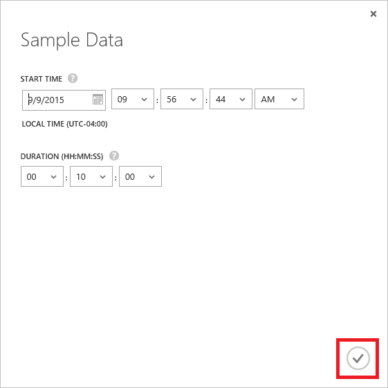

    _Specifying start time and duration_

1. Wait until sampling has completed. Then click the button in the lower-right corner of the page that indicates the operation has completed.

    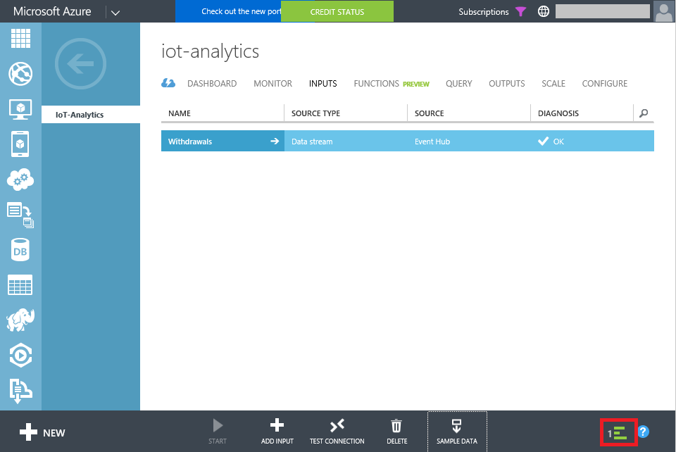

    _Data sampling completed_

1. When a ribbon appears that says "Successfully sampled data from Withdrawals," click the **Details** button on the right.

    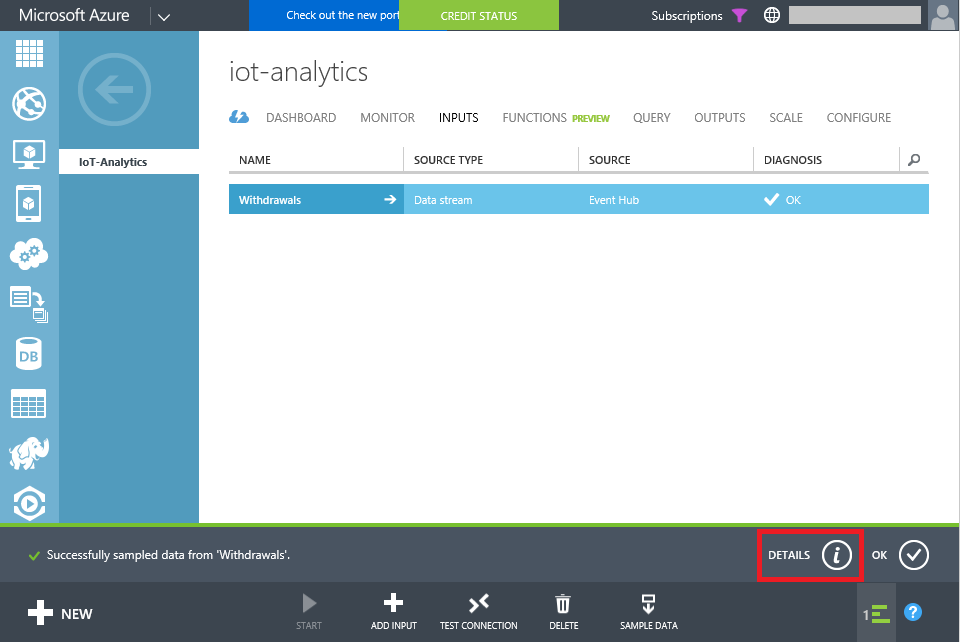

    _Data sampling succeeded_

1. Click **Click here** to download the data sampled from the event hub. Save the JSON file that is downloaded to a location where you can easily find it. Then click **OK** to dismiss the ribbon.

    

    _Downloading sample data_

1. Open the JSON file you downloaded in your favorite text editor and take a moment to examine its contents. How many rows (events) are represented in the sample data? What is the structure of each row — that is, what fields does each row contain?

You have connected a Stream Analytics job to an event hub and demonstrated that data is passed from one to the other. You have also examined the structure of that data. The next step is to do something with it — specifically, to bring the power of Azure Stream Analytics to bear on the data.  

<a name="Exercise4"></a>
## Exercise 4: Prepare queries and test with sample data ##

Now that your job is set up, there's much more you can do with Stream Analytics than simply view the raw data presented to it. The whole point of Stream Analytics is being able to perform queries on the data, even though the data is dynamic rather than static. In this exercise, you'll use the [Stream Analytics Query Language](https://msdn.microsoft.com/en-us/library/azure/Dn834998.aspx) to query a sample data set for potentially fraudulent ATM transactions. It is always a good idea to test your queries against sample data before deploying them against live data streams, because with sample data, you can verify that a known set of inputs produces the expected set of outputs.

To flag potentially fraudulent withdrawals from ATMs, you will query for transactions performed with the same ATM card at different ATM machines within a specified time window (60 seconds). In real life, you would probably use a larger time window and perhaps even factor in the distance between ATM machines. However, a narrower time window is useful in a lab environment because it allows you to perform meaningful experiments in minutes rather than hours.

1. Begin by returning to the Stream Analytics job in the portal and clicking **QUERY** at the top of the page.

    

    _Navigating to the Query page_

1. Enter the following query into the **query** field, and then click the **Test** button.

	<pre>
	SELECT * FROM Withdrawals
	</pre>

	> Where did the name "Withdrawals" come from? That's the alias you assigned to the event-hub input in the previous exercise. If you named it differently, you'll need to replace "Withdrawals" with the alias you used.

    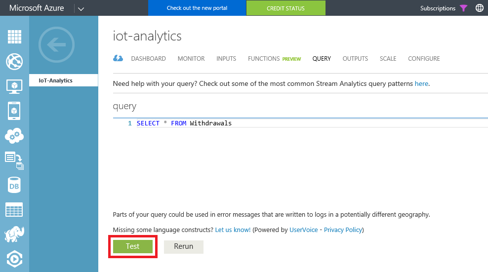

    _Testing a query_

1. In the ensuing dialog, click **BROWSE FOR FILE**. Select the file named Withdrawals.json provided in the "resources" directory of this lab. Then OK the selection by clicking the check mark in the dialog's lower-right corner.

	> The reason you're using a file provided for you (rather than the one you captured in the previous exercise) is to make sure everyone who is doing this exercise gets the same results.

    

    _Loading test data_

1. Scroll down the page and confirm that you see the output pictured below. The test data contains 607 rows. Each row has fields named TRANSACTIONID, TRANSACTIONTIME, DEVICEID, CARDNUMBER, and AMOUNT. DEVICEID is the ID of the ATM machine at which the transaction took place. AMOUNT is the amount of cash withdrawn from the ATM.

    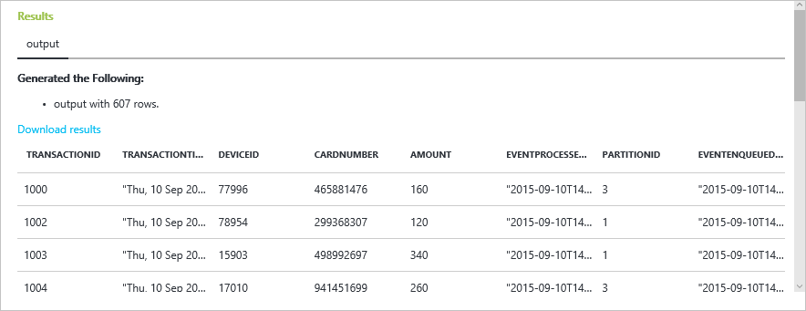

    _Output from SELECT \*_

1. Suppose you only wanted to view transactions for amounts between 200 and 300, inclusive. Furthermore, suppose you wanted to clean up the output by assigning your own column names and excluding the TRANSACTIONID column. Enter the following query and click the **Rerun** button to test it. (**Rerun** executes the query against the test data already loaded. If you wanted to load a different test file, you would click the **Test** button again.)

	<pre>
	SELECT TransactionTime as [Time of Transaction],
	       DeviceID as [ATM],
	       CardNumber as [Card Number],
	       Amount as [Amount]
	FROM Withdrawals
	WHERE Amount >= 200 and Amount <= 300
	</pre>

1. Scroll down and confirm that the query generated the following output:

    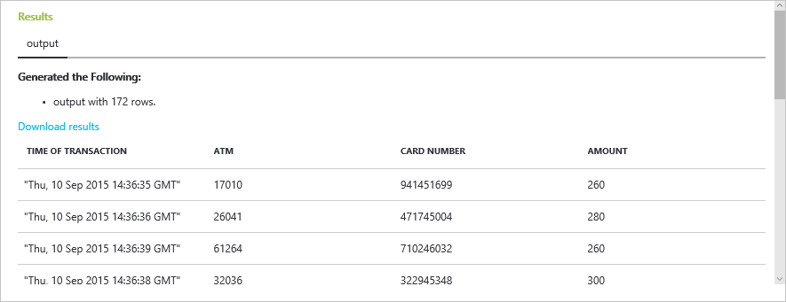

    _Customizing the output_

1. One of the key features of the Stream Analytics Query Language is its ability to group results using windows of time whose length you specify. To demonstrate, enter the following query to count the number of transactions taking place each minute and click **Rerun** to execute it:

	<pre>
	SELECT System.Timestamp as [Time Ending],
        COUNT(*) AS [Number of Transactions]
    FROM Withdrawals TIMESTAMP BY TransactionTime
    GROUP BY TumblingWindow(n, 1)
	</pre>

	> TIMESTAMP BY is an important element of the Stream Analytics Query Language. If it was omitted from the query above, you would be querying for the number of transactions that arrived *at the event hub* each minute rather than the number of transactions that occurred in each 1-minute interval. TIMESTAMP BY allows you to specify a field in the input stream as the event time.

1. Scroll down and confirm that you see the output below:

    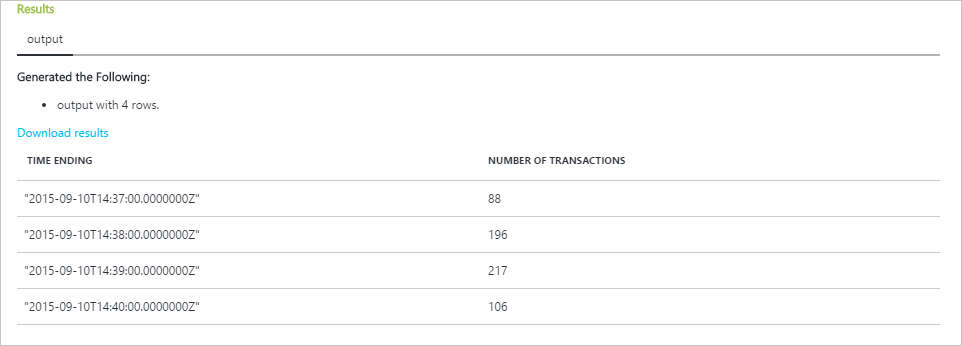

    _Number of transactions per minute_

1. Now it's time to query the test data for potentially fraudulent transactions — transactions involving the same ATM card but different ATM machines that take place within 60 seconds of each other. *This is the query you will later use against a live data stream*.

	Enter the following query and click **Rerun** to execute it:

	<pre>
	SELECT W1.CardNumber as [Card Number],
	    W1.DeviceID as [ATM 1], W2.DeviceID as [ATM 2],
	    W1.TransactionTime as [Time 1], W2.TransactionTime as [Time 2]
	FROM Withdrawals W1 TIMESTAMP BY TransactionTime
	JOIN Withdrawals W2 TIMESTAMP BY TransactionTime
	ON W1.CardNumber = W2.CardNumber
	AND DATEDIFF(ss, W1, W2) BETWEEN 0 and 60
	WHERE W1.DeviceID != W2.DeviceID
	</pre>

1. This time the output should contain just three rows, each representing two transactions performed with one ATM card at two different locations within 60 seconds of each other:

    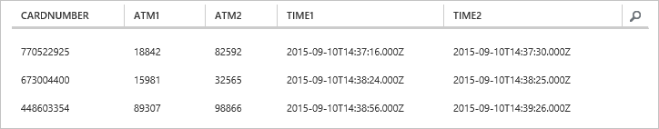

    _Potentially fraudulent transactions_

1. Click the **SAVE** button at the bottom of the page to save the query. Then click **YES** when asked to confirm.

    

    _Saving the query_

With the query now formulated, tested against a set of sample data, and saved, it's time to deploy it against a live data stream to produce a running record of potentially fraudulent transactions.

<a name="Exercise5"></a>
## Exercise 5: Create an event hub for output ##

Being able to run queries and see the results in the portal is great for testing, but the whole point of Stream Analytics is being able to query live data streams. Azure Stream Analytics supports a variety of output types, including blobs, Azure SQL databases, and event hubs. You can designate blob storage as the destination for output from a Stream Analytics job to generate a persistent record of query results. Another useful scenario involves using event hubs as output. Because software can subscribe to events from event hubs, developers can build custom applications that show Stream Analytics output in real time.

In this exercise, you'll configure the Stream Analytics job to write output to an event hub.

1. Return to the [Classic Portal](http://manage.windowsazure.com) and click the **+ NEW** button in the lower-left corner.

1. Click **APP SERVICES** -> **SERVICE BUS** -> **EVENT HUB** -> **QUICK CREATE** to create a new event hub. Name the event hub "outputhub," select the same region you selected for the other event hub and the Stream Analytics job, and select the namespace you created in Exercise 1. Then click **CREATE A NEW EVENT HUB**.

    

    _Creating an event hub for output_

1. Click the new event hub to go to the event-hub dashboard.

    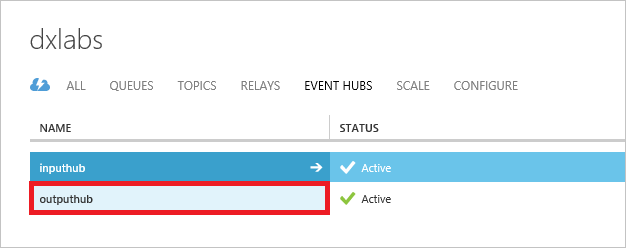

    _Output event hub_

1. Click **CONFIGURE**.

    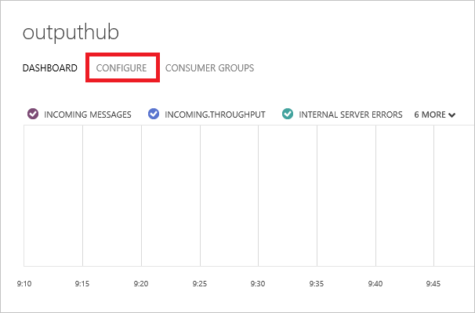

    _Event hub dashboard_

1. In order for an application to subscribe to events firing from an event hub, you need to create a shared-access policy that includes Listen permission. In the **shared access policies** section of the outputhub configuration page, create a new policy by typing "ReceivePolicy" (without quotation marks) into the first text box and checking the **Listen** box in the drop-down list under **PERMISSIONS**. Then click the **Save** button at the bottom of the page to save the new policy.

    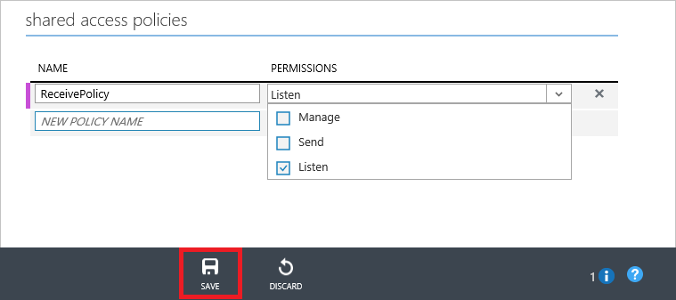

    _Creating a policy with Listen permission_

1. Click **DASHBOARD** near the top of the page to return to the event hub's dashboard.

    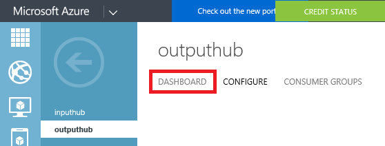

    _Returning to the dashboard_

1. Under **quick glance** on the right side of the page, click **View Connection String**.

    

    _Viewing the connection string_

1. Copy the connection string to the clipboard. (If you hover over the connection string, a copy-to-clipboard button will appear.) Then click the check mark to dismiss the dialog. Finish up by pasting the connection string into your favorite text editor so you can retrieve it in the next exercise.

    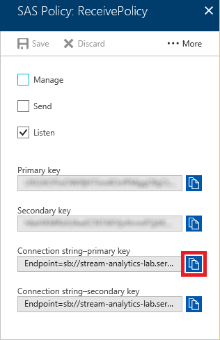

    _Copying the connection string_

1. Click the **STREAM ANALYTICS** button in the ribbon on the left to list all your Stream Analytics jobs, and then click **IoT-Analytics** to return to your Stream Analytics job.

    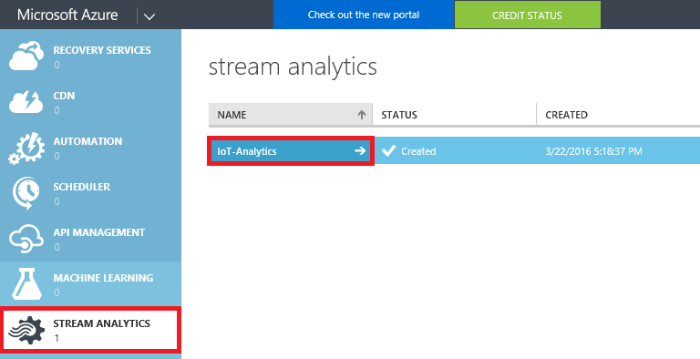

    _Returning to the Stream Analytics job_

1. Click **OUTPUTS**.

    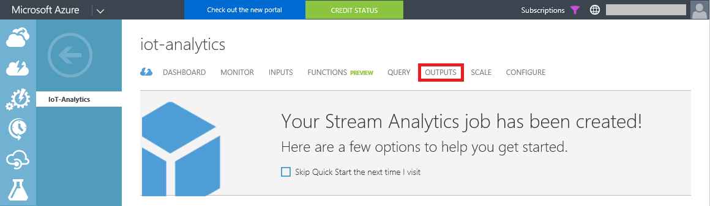

    _Navigating to the Outputs page_

1. Click **ADD AN OUTPUT** to add an output to the job.

    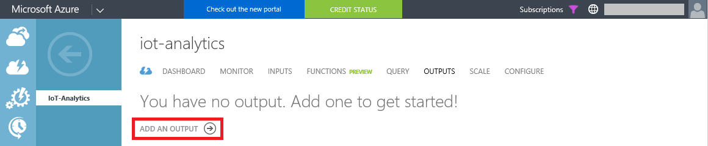

    _Adding an output_

1. Select **Event Hub** as the output type. Then click the right-arrow in the lower-right corner of the dialog.

    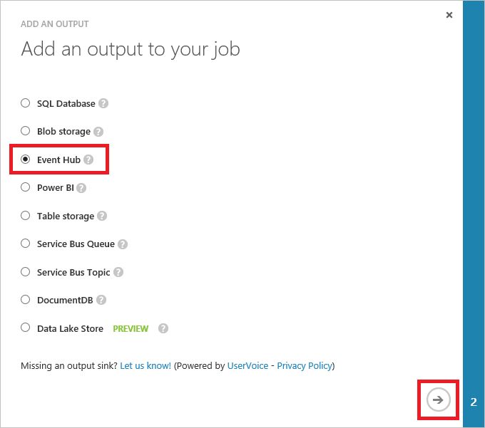

    _Specifying the output type_

1. Type "Flagged-Withdrawals" into the **OUTPUT ALIAS** box. Select **Use Event Hub from Current Subscription**, the namespace you created in Exercise 1, and the event hub you created in this exercise (outputhub). Then click the right-arrow in the lower-right corner.

    

    _Specifying event-hub settings_

1. Make sure **EVENT SERIALIZATION FORMAT**, **ENCODING**, and **FORMAT** are set as shown below, and then finish up by clicking the check mark in the lower-right corner.

    

    _Specifying serialization settings_

Now that you have directed the output from the Stream Analytics job to an event hub, the next task is to write an app that consumes events from that event hub.

<a name="Exercise6"></a>
## Exercise 6: Build a real-time dashboard ##

In this exercise, you will write a Web app that connects to the event hub and displays real-time notifications of potentially fraudulent transactions.

1. Start a new instance of Visual Studio 2015 and use the **File -> New -> Project** command to create a new ASP.NET Web Application named "ATMDashboard."

    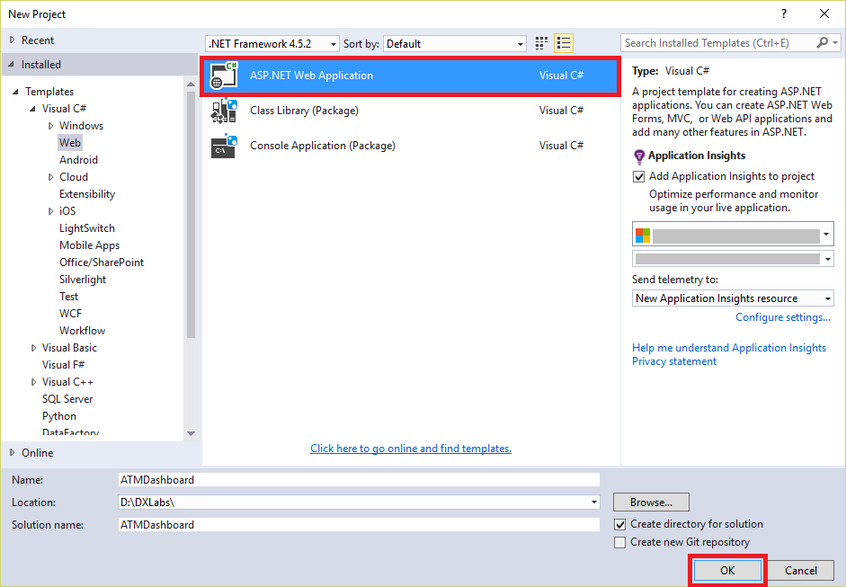

    _Creating a new Web app_

1. In the **New ASP.NET Project** dialog, select **MVC** and check the **Web API** box. If **Host in the cloud** is checked, uncheck it. (For testing purposes, you'll run this Web app locally.) Then click **OK**.

    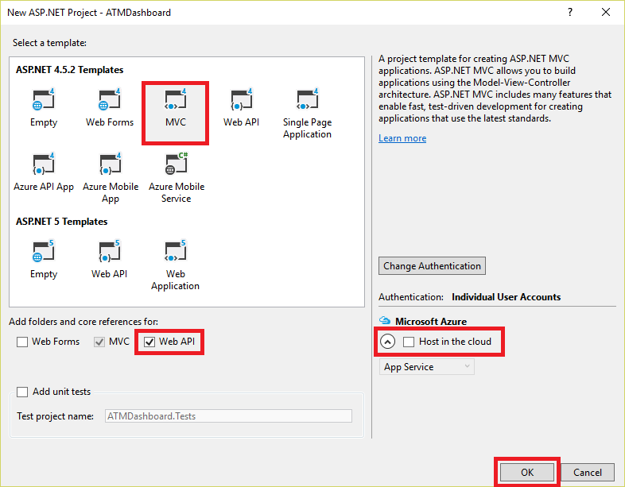

    _Specifying paremeters for the Web app_

1. In the Solution Explorer window, right-click the **ATMDashboard** project and select **Manage NuGet Packages...**

    

    _Managing NuGet Packages for the project_

1. Click **Browse**. Then type "eventprocessor" (without quotation marks) into the search box. Click **Microsoft.Azure.ServiceBus.EventProcessorHost** to select the Azure EventProcessorHost package from NuGet. Finally, click **Install** to install the latest stable version of the package. This package contains the APIs that your app will use to receive events from the output event hub. Click **OK** if you're prompted review changes, and **I Accept** when prompted to accept licenses for the downloaded packages.

    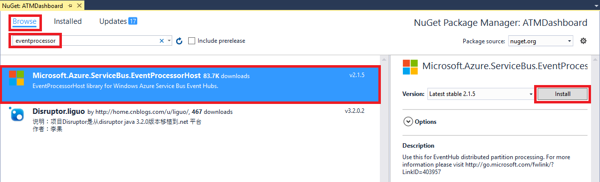

    _Installing EventProcessorHost_

1. Right-click the project in the Solution Explorer window and use the **Add -> Class** command to add a class named ATMEvent to the project.

    

    _Adding ATMEvent_

1. Implement the ATMEvent class as follows:

	```C#
    public class ATMEvent
    {
        public string CardNumber { get; set; }
        public string ATM1 { get; set; }
        public string ATM2 { get; set; }
        public string TransactionTime1 { get; set; }
        public string TransactionTime2 { get; set; }
    }
	```

1. Right-click the project in the Solution Explorer window and use the **Add -> Class** command to add a class named ATMEventAggregator to the project.

    

    _Adding ATMEventAggregator_

1. Implement the ATMEventAggregator class as follows:

	```C#
    public static class ATMEventAggregator
    {
        private static List<ATMEvent> _events = new List<ATMEvent>();

        public static void LogEvent(ATMEvent e)
        {
            if (_events.Count < 1024) // Avoid unconstrained memory growth
            {
                _events.Add(e);
            }
        }

        public static ATMEvent[] GetLoggedEvents()
        {
            var events = _events.ToArray();
            _events.Clear();
            return events;
        }
    }
	```

1. Right-click the project in the Solution Explorer window and use the **Add -> Class** command to add a class named SimpleEventProcessor to the project.

    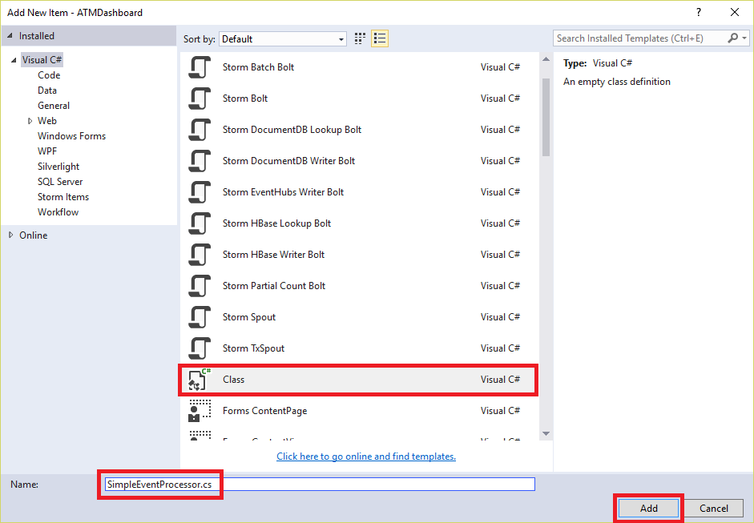

    _Adding SimpleEventProcessor_

1. Add the following using statements to the ones at the top of the file:

	```C#
	using Microsoft.ServiceBus.Messaging;
	using System.Diagnostics;
	using System.Threading.Tasks;
	using Newtonsoft.Json;
	using System.Text;
	```

1. Implement the SimpleEventProcessor class as follows:

	```C#
	class SimpleEventProcessor : IEventProcessor
	{
	    Stopwatch checkpointStopWatch;
	
	    async Task IEventProcessor.CloseAsync(PartitionContext context, CloseReason reason)
	    {
	        Debug.WriteLine("Processor Shutting Down. Partition '{0}', Reason: '{1}'.", context.Lease.PartitionId, reason);
	        if (reason == CloseReason.Shutdown)
	        {
	            await context.CheckpointAsync();
	        }
	    }
	
	    Task IEventProcessor.OpenAsync(PartitionContext context)
	    {
	        Debug.WriteLine("SimpleEventProcessor initialized.  Partition: '{0}', Offset: '{1}'", context.Lease.PartitionId, context.Lease.Offset);
	        this.checkpointStopWatch = new Stopwatch();
	        this.checkpointStopWatch.Start();
	        return Task.FromResult<object>(null);
	    }
	
	    async Task IEventProcessor.ProcessEventsAsync(PartitionContext context, IEnumerable<EventData> messages)
	    {
	        foreach (EventData eventData in messages)
	        {
	            string data = Encoding.UTF8.GetString(eventData.GetBytes());
	
	            Debug.WriteLine(string.Format("Message received.  Partition: '{0}', Data: '{1}'",
	                context.Lease.PartitionId, data));
	
	            // Log the event
	            ATMEvent e = JsonConvert.DeserializeObject<ATMEvent>(data);
	            ATMEventAggregator.LogEvent(e);
	        }
	
	        if (this.checkpointStopWatch.Elapsed > TimeSpan.FromMinutes(5))
	        {
	            await context.CheckpointAsync();
	            this.checkpointStopWatch.Restart();
	        }
	    }
	}
	```

1. Open Global.asax.cs and add the following using statements:

	```C#
	using Microsoft.ServiceBus.Messaging;
	using System.Diagnostics;
	```

1. In Global.asax.cs, add the following statements to the end of the Application_Start method:

	```C#
    string eventHubConnectionString = "connection_string";
    string eventHubName = "outputhub";
    string storageAccountName = "storage_account_name";
    string storageAccountKey = "storage_account_key";
    string storageConnectionString = string.Format("DefaultEndpointsProtocol=https;AccountName={0};AccountKey={1}", storageAccountName, storageAccountKey);

    string eventProcessorHostName = Guid.NewGuid().ToString();
    EventProcessorHost eventProcessorHost = new EventProcessorHost(eventProcessorHostName, eventHubName, EventHubConsumerGroup.DefaultGroupName, eventHubConnectionString, storageConnectionString);
    Debug.WriteLine("Registering EventProcessor...");
    var options = new EventProcessorOptions();
    options.ExceptionReceived += (sender, e) => { Debug.WriteLine(e.Exception); };
    eventProcessorHost.RegisterEventProcessorAsync<SimpleEventProcessor>(options).Wait();

    Debug.WriteLine("Receiving...");
	```

1. Replace **connection_string** in line 1 with the connection string you copied to the clipboard (and hopefully into your favorite text editor) in Exercise 5, Step 8.

1. Remove ";EntityPath=outputhub" from the end of the connection string. The eventHubConnectionString variable declaration should now look something like this:

	```C#
	string eventHubConnectionString = "Endpoint=sb://dxlabs.servicebus.windows.net/;SharedAccessKeyName=ReceivePolicy;SharedAccessKey=3XHaU3pm5t82WxA43hUM/bWa7kumqAsqzA1rVJq3Qv0=";
	```

1. Replace **storage\_account\_name** in line 3 with the the name of the storage account you created in Exercise 3, Step 2, and **storage\_account\_key** in line 4 with the storage account's primary key (which you pasted into a text editor for later retrieval in Exercise 3, Step 5).

	> This storage account has nothing to do with the Stream Analytics job; it's used by the EventProcessorHost class. However, you are letting one storage account do double duty for Stream Analytics and EventProcessorHost.

1. In the Solution Explorer window, right-click the Controllers folder and use the **Add -> Controller** command to add an empty Web API 2 controller.

    

    _Adding a Web API Controller_

1. Name the controller "EventsController" (without quotation marks). Then click **Add**.

    

    _Naming the Web API Controller_

1. Add the following method to the EventsController class:

	```C#
    public ATMEvent[] GetEvents()
    {
        return ATMEventAggregator.GetLoggedEvents();
    }
	```

	> The controller you just added is a Web API controller. It exposes a REST method that can be called over HTTP to retrieve the latest events that ATMEventAggregator received from the event hub.

1. Open Index.cshtml in the project's Views/Home folder and replace its contents with the following statements:

	```HTML
	@{
	    ViewBag.Title = "Home Page";
	}

	<div class="jumbotron">
	    <h1>ATM Dashboard</h1>
	    <p class="lead">The table below lists potentially fraudulent ATM transactions and is updated every 5 seconds.</p>
	</div>

	<div class="row">
	    <div class="col-xs-12">
	        <table id="output" style="width: 100%">
	            <tr>
	                <td><b>Card Number</b></td>
	                <td><b>ATM 1</b></td>
	                <td><b>ATM 2</b></td>
	            </tr>
	        </table>
	    </div>
	</div>
	
	@section scripts {
	<script type="text/javascript">
	    $(function () {
	        // Check for new events every 5 seconds
	        window.setInterval(function () {
	            $.ajax({
	                url: "/api/events",
	                success: function (result) {
	                    for (i = 0; i < result.length; i++) {
	                        $("#output tr:last").after("<tr><td>" + result[i].CardNumber + "</td><td>" + result[i].ATM1 + "</td><td>" + result[i].ATM2 + "</td></tr>");
	                    }
	                },
	                error: function (xhr, status, error) {
	                    if (status == "error") {
	                        console.log("Error: " + xhr.status);
	                    }
	                },
	                dataType: "json"
	            });
	        }, 5000);
	    });
	</script>
	}
	```

	> See what's happening here? In addition to modifying the view's UI to include an HTML table in which ATM events can be displayed, you added a script block that uses jQuery's $.ajax method to call back to the server every 5 seconds. The endpoint for the call is the method you implemented in the Web API controller in the previous step. When that method returns one or more events, rows are added to the table to display them.

1. Go to the **Build** menu at the top of the Visual Studio window and use the **Build Solution** command to build the solution. Correct any build errors that are reported, and then press **Ctrl+F5** to launch the application in your browser. Confirm that the application looks like this:

    

    _The ATM dashboard_

Leave the browser open with the application running. And don't be alarmed if a few  events show up the first few seconds the dashboard is open. Those are simply events that the event hub cached. You'll be generating new events in the next exercise.

<a name="Exercise7"></a>
## Exercise 7: Analyze a live data stream ##

Almost there! Now it's time to run the Stream Analytics job and see the output in your dashboard.

1. Return to the Stream Analytics job in the Azure Portal and click the **START** button at the bottom of the page to start it.

    

    _Starting the Stream Analytics job_

1. Make sure **JOB START TIME** is selected, and then click the check mark. **JOB START TIME** means that the job will begin sampling output from the input source the moment the job is started. Event hubs retain events for a specified period of time (the default is 1 day), so if you wanted, you could select **CUSTOM TIME** and start sampling output before the job's start time.

    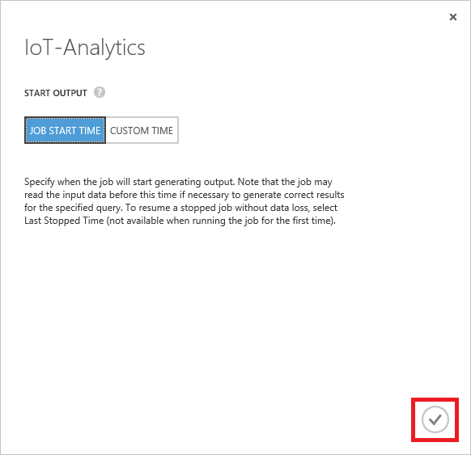

    _Starting the output_

1. Wait until the Stream Analytics job starts. Then return to the instance of Visual Studio in which the ATMEventGenerator project is open and start ATMEventGenerator again to pump events into the input event hub.

	> If you'd like, you can run several instances of ATMEventGenerator simultaneously to increase the volume of events.

1. Return to the ATMDashboard application running in your browser and watch for a few minutes. Every so often, a line should appear representing a potentially fraudulent transaction and identifying the ATM card number and the ATMs at which the card was used.

    

    _Potentially fraudulent transactions_

1. Return to the Stream Analytics job in the portal and click the **STOP** button at the bottom of the page to stop it. Then click **YES** when asked if you're sure you want to stop the job.

    

    _Stopping the Stream Analytics job_

1. Return to the console window in which ATMEventGenerator is running and press **Ctrl+C** to terminate it.

You now have a Web app that displays output from a Stream Analytics job in near real-time. There are other ways to build such dashboards, including [Microsoft Power BI](https://powerbi.microsoft.com/). With Power BI, you can create dashboards that render output from Stream Analytics jobs without writing any code. The connection between Azure and Power BI is currently offered only as a preview and is subject to certain limitations, but soon the two will be making beautiful music together.

<a name="Summary"></a>
## Summary ##

Azure Stream Analytics is a powerful tool for analyzing live data streams from IoT devices or anything else that's capable of transmitting data. In this lab, you got a first-hand look at Stream Analytics as well as Azure event hubs. Among other things, you learned how to:

- Create Azure event hubs and use them for Stream Analytics input and output
- Write a C# app that transmits events to an event hub
- Create a Stream Analytics job and test queries on sample data streams
- Run a Stream Analytics job and perform queries on live data streams
- Create a rule (query) that detects anomalies in streaming data
- Display output from a Stream Analytics job in a Web app

One drawback to hard-coding rules into Stream Analytics is that rules don't "learn" from the data streams, which can lead to false positives in anomaly detection. If this concerns you, read the article entitled [Anomaly Detection – Using Machine Learning to Detect Abnormalities in Time Series Data](http://blogs.technet.com/b/machinelearning/archive/2014/11/05/anomaly-detection-using-machine-learning-to-detect-abnormalities-in-time-series-data.aspx) in the Azure team's Machine Learning blog. In it, they present an anomaly detection service accessible through a REST API that uses Azure Machine Learning to learn from the data presented to it. Imagine combining the power of Stream Analytics to extract information from real-time data streams with the power of Azure Machine Learning to learn from that information and refine the analytics on the fly. This is precisely the type of solution that Microsoft Azure empowers you to build!

---

Copyright 2016 Microsoft Corporation. All rights reserved. Except where otherwise noted, these materials are licensed under the terms of the MIT License. You may use them according to the license as is most appropriate for your project. The terms of this license can be found at https://opensource.org/licenses/MIT.
