
# Creating a SLURM Cluster using Docker and the Azure Container Service #

---

## Overview ##

The [Simple Linux Utility for Resource Management](https://computing.llnl.gov/linux/slurm/overview.html) (SLURM), also known as the *SLURM Workload Manager*, is a free and open-source job scheduler for Linux that excels at distributing heavy computing workloads across clusters of machines and processors. It is used on more than half of the world's largest supercomputers and High-Performance Computing (HPC) clusters, and it enjoys widespread use in the research community for jobs that require significant CPU resources.

SLURM clusters can be built from real machines or virtual machines. Today, they can also be built from containers. A *container* is a self-contained package that includes everything needed to run a job, including code, run-time, system tools, and libraries. Containers are similar to VMs, but they feature lower overhead and faster startup times. One of the most popular container formats is [Docker](https://www.docker.com/), which is an open-source containerization platform. Bundling your code in Docker containers provides portability between platforms such as Microsoft Azure and Amazon Web Services (AWS) and lets you avoid being tied to a specific cloud-platform vendor.

To simplify the use of Docker containers, Azure offers the [Azure Container Service](https://azure.microsoft.com/en-us/services/container-service/) (ACS), which hosts Docker containers in the cloud and includes an optimized configuration of popular open-source scheduling and orchestration tools, including [DC/OS](https://dcos.io/) and [Docker Swarm](https://www.docker.com/products/docker-swarm). The latter uses native clustering capabilities to turn a group of Docker engines into a single virtual Docker engine and is the perfect tool for the job of creating SLURM clusters from Docker containers. 
 
In this lab, you will create a SLURM cluster from a swarm of Docker container instances hosted in ACS and run a Python script in those container instances to convert a batch of color images to grayscale.

### Objectives ###

In this hands-on lab, you will learn how to:

- Create an Azure container service
- Deploy Docker images to a container service
- Run jobs in containers created from Docker images
- Stop container instances running in a container service
- Delete a container service

### Prerequisites ###

The following are required to complete this hands-on lab:

- An active Microsoft Azure subscription. Use the one you created in Lab 1, or [sign up for a free trial](http://aka.ms/WATK-FreeTrial)
- [Microsoft Azure Storage Explorer](http://storageexplorer.com/)
- [PuTTY](http://www.chiark.greenend.org.uk/~sgtatham/putty/download.html)
- [Docker client for Windows](https://get.docker.com/builds/Windows/x86_64/docker-latest.zip)

---

## Exercises ##

This hands-on lab includes the following exercises:

- [Exercise 1: Create an Azure container service](#Exercise1)
- [Exercise 2: Deploy a SLURM cluster in the container service](#Exercise2)
- [Exercise 3: Create a storage account and upload images](#Exercise3)
- [Exercise 4: Prepare the Python script](#Exercise4)
- [Exercise 5: Copy the job scripts to the cluster and run the job](#Exercise5)
- [Exercise 6: View the converted images](#Exercise6)
- [Exercise 7: Suspend the SLURM cluster](#Exercise7)
- [Exercise 8: Delete the resource group](#Exercise8)

Estimated time to complete this lab: **60** minutes.

## Exercise 1: Create an Azure container service

Before you can deploy Docker images to Azure, you must create an Azure container service. And in order to create an Azure container service, you need a public/private key pair for authenticating with the container service. In this exercise, you will use the PuTTY Key Generator, also known as PuTTYGen, to create the SSH keys. Then you will use the Azure Portal to create an Azure container service.

> Unlike OS X and Linux, Windows doesn't have an SSH key generator built in. PuTTYGen is a free key generator that is popular in the Windows community. It is part of an open-source toolset called [PuTTY](http://www.putty.org/), which provides the SSH support that Windows lacks.

1. Launch PuTTYGen and click the **Generate** button. For the next few seconds, move your cursor around in the empty space in the "Key" box to help randomize the keys that are generated.

 	

	_Generating a public/private key pair_

2. Once the keys are generated, click **Save public key** and save the public key to a text file named public.txt. Then click **Save private key** and save the private key to a file named private.ppk. When prompted to confirm that you want to save the private key without a passphrase, click **Yes**.

 	

	_Saving the public and private keys_

1. Open the [Azure Portal](https://portal.azure.com) in your browser. Select **+ New -> Containers -> Azure Container Service**. Then click the **Create** button at the bottom of the "Azure Container Service" blade.

	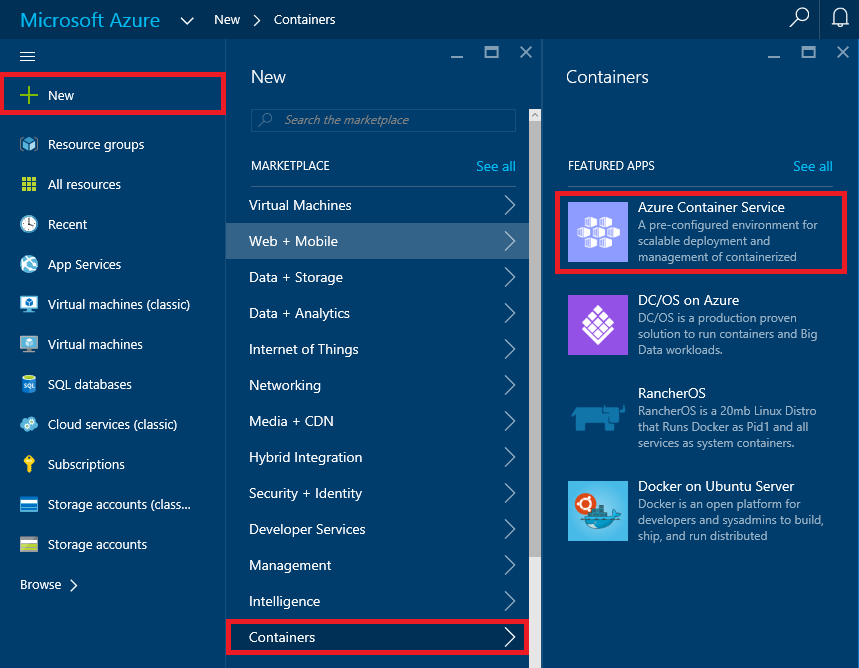

	_Creating a container service_

1. Click **Basics** in the "Azure Container Service" blade. In the "Basics" blade, enter a user name for connecting to the container service (be sure to remember the name you enter!), the public key that you generated with PuTTYGen and saved to a text file, and the subscription you want to charge to. Select **Create new** under **Resource group** and enter the resource-group name "ACSLabResourceGroup" (without quotation marks). Select the location nearest you under **Location**, and then click the **OK** button.

	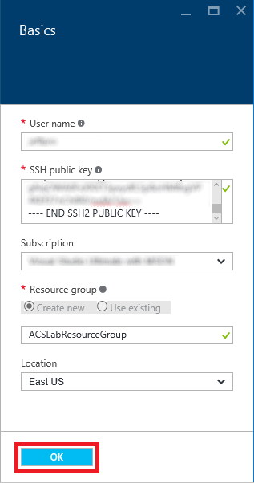

	_Basic settings_

1. In the "Framework configuration" blade, select **Swarm** as the orchestrator configuration. Then click **OK**.

	> DC/OS and Swarm are popular open-source orchestration tools that enable you to deploy clusters containing thousands or even tens of thousands of containers. (Think of a compute cluster consisting of containers rather than physical servers, all sharing a load and running code in parallel.) DC/OS is a distributed operating system based on the Apache Mesos distributed systems kernel. Swarm is Docker's own native clustering tool. Both are preinstalled in Azure Container Service, with the goal being that you can use the one you are most familiar with rather than have to learn a new tool.

	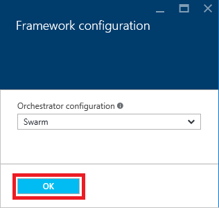

	_Framework configuration settings_

1. In the "Azure Container service settings" blade, set **Agent count** to **2**, **Master count** to **1**, and enter a DNS name in the **DNS prefix** box. (The DNS name doesn't have to be unique across Azure, but it does have to be unique to a data center.) Then click **OK**.

	> When you create an Azure container service, one or more master VMs are created to orchestrate the workload. In addition, an [Azure Virtual Machine Scale Set](https://azure.microsoft.com/en-us/documentation/articles/virtual-machine-scale-sets-overview/) is created to provide VMs for the "agents," or VMs that the master VMs delegate work to. Docker container instances are hosted in the agent VMs. By default, Azure uses a standard D2 virtual machine for each agent. These are dual-core machines with 7 GB of RAM. Agent VMs are created as needed to handle the workload. In this example, there will be one master VM and up to two agent VMs, regardless of the number of Docker container instances.

	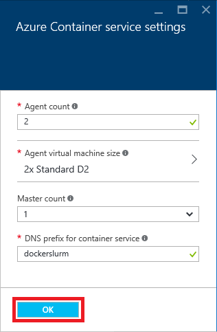

	_Service settings_

1. In the "Summary" blade, review the settings you selected. Then click **OK**.

	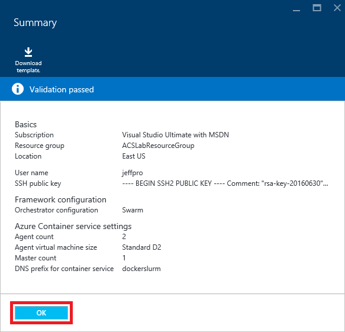

	_Settings summary_

1. In the ensuing "Purchase" blade, click the **Purchase** button to begin deploying a new container service.

1. Deployment will take about 15 to 20 minutes. To monitor the deployment, click **Resource groups** on the left side of the portal to display a list of all the resource groups associated with your subscription. Then select the resource group created for the container service ("ACSLabResourceGroup") to open a resource-group blade. When "Succeeded" appears under "Last Deployment," the deployment has completed successfully.

	> Click the browser's **Refresh** button every few minutes to update the deployment status. Clicking the **Refresh** button in the resource-group blade doesn't reliably update the status.

	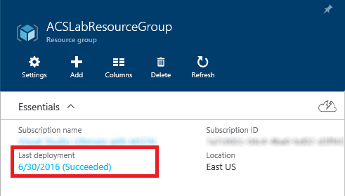

	_Successful deployment_

Take a short break and wait for the deployment to finish. Then proceed to Exercise 2.

## Exercise 2: Deploy a SLURM cluster in the container service

SLURM can be run in Docker containers, with each container instance acting as a node in the SLURM cluster. In this exercise, you will deploy a SLURM cluster in the container service that you created in Exercise 1. The cluster will contain nine nodes: one master node and eight worker nodes.

1. After the container service finishes deploying, return to the blade for the resource group that contains the container service. Then click the resource named **swarm-master-lb-xxxxxxxx**. This is the master load balancer for the swarm.

	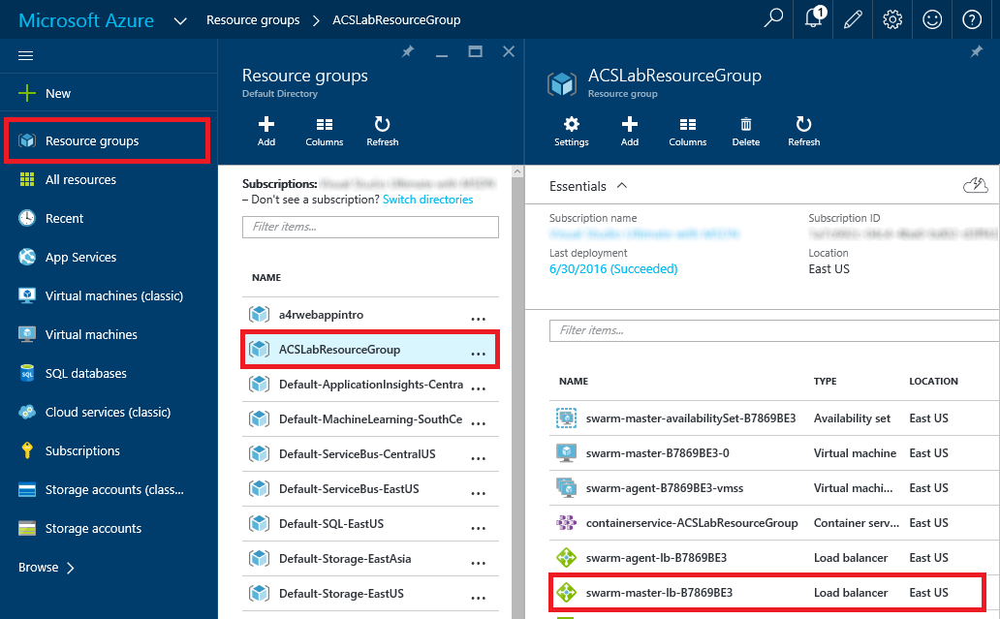

	_Opening the master load balancer_

1. Click the IP address under "Public IP Address."

	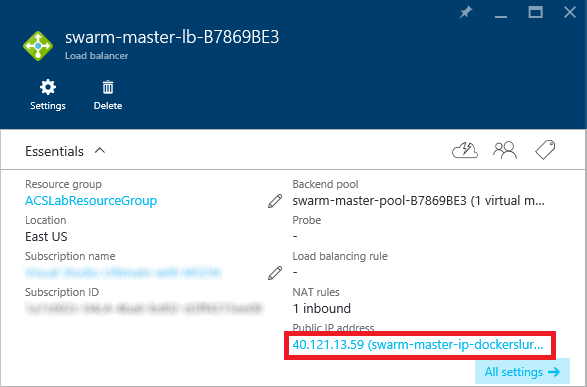

	_The master load balancer's public IP_

1. Hover over the DNS name under "DNS Name." Wait for a **Copy** button to appear, and then click it to copy the master load balancer's DNS name to the clipboard.

	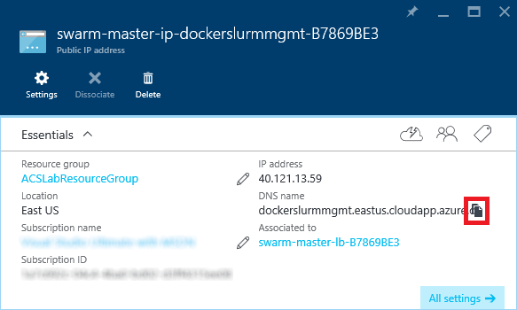

	_Copying the DNS name_

1. Launch PuTTY and paste the DNS name on the clipboard into the **Host Name (or IP address)** box. Set the port number to **2200** and type "ACS" (without quotation marks) into the **Saved Sessions** box. Click the **Save** button to save these settings under that name.

	> Why port 2200 instead of port 22, which is the default for SSH? Because the load balancer you're connecting to listens on port 2200 and forwards the SSH messages it receives to port 22 on the master VM.

	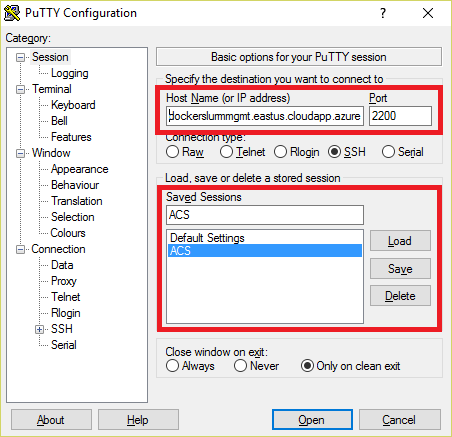

	_Configuring a PuTTY session_

1. In the treeview on the left, click the + sign next to **SSH**, and then click **Auth**. Click the  **Browse** button and select the private-key file that you created in Exercise 1.

	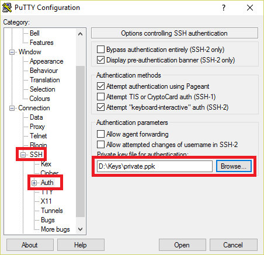

	_Entering the private key_

1. Select **Tunnels** in the treeview. Then set **Source port** to **22375** and **Destination** to **127.0.0.1:2375**, and click the **Add** button.

	> The purpose of this is to forward traffic transmitted through port 22375 on the local machine (that's the port used by the **docker** command you will be using shortly) to port 2375 at the other end. Docker Swarm listens on port 2375.
	
	

	_Configuring the SSH tunnel_

1. Click **Session** at the top of the treeview. Click the **Save** button to save your configuration changes, and then click **Open** to create a secure SSH connection to the container service. If you are warned that the server's host key isn't cached in the registry and asked to confirm that you want to connect anyway, click **Yes**.

	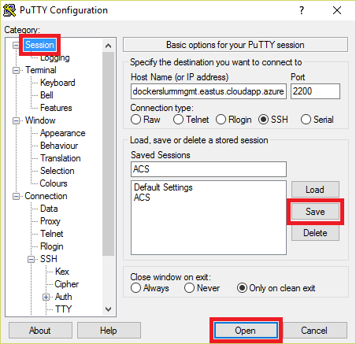

	_Opening a connection to the container service_

1. An SSH window will open and prompt you to log in. Enter the user name that you specified in Exercise 1, Step 4. Then press the **Enter** key. If you successfully connected, you'll see a screen that looks like this:

	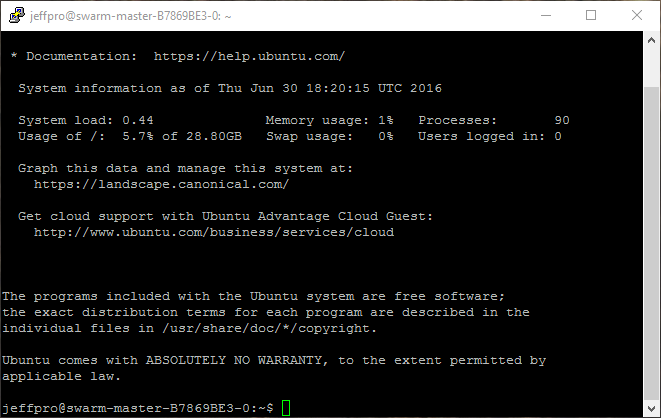

	_Successful connection_

	> Observe that you didn't have to enter a password. That's because the connection was authenticated using the public/private key pair you generated in Exercise 1. Key pairs tend to be much more secure than passwords because they are cryptographically strong.

1. Launch a Windows Command Prompt and use a CD command to navigate to this lab's "docker-resources" folder. Then execute the following command to show a list of Docker containers running in the container service you are connected to. (There are currently no containers running, so the list will be empty.)

	<pre>
	docker -H 127.0.0.1:22375 ps -a
	</pre>

1. At the command prompt, execute the following command:

	<pre>
	create-slurm
	</pre>

	This runs a batch file provided for you in the "docker-resources" folder. It will take 5 to 10 minutes to run. The batch file builds a Docker image with everything needed for the lab. Then it deploys the image to the container service nine times to create a SLURM master in one container and SLURM nodes in eight other containers.

1. When the batch file finishes running, execute the following command:

	<pre>
	docker -H 127.0.0.1:22375 ps -a
	</pre>

	Confirm that there are now nine Docker container instances running:

	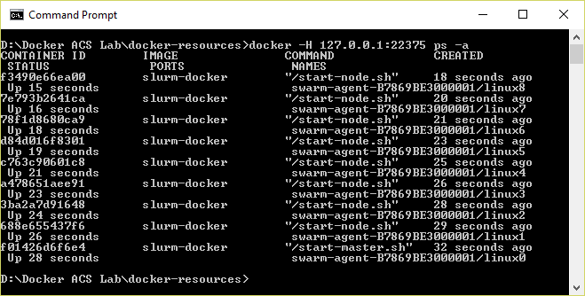

	_Docker container instances_

Congratulations! You just created a SLURM cluster in a swarm of Docker containers hosted in an Azure container service. Now it is time to put the cluster to work.

## Exercise 3: Create a storage account and upload images

In [Exercise 5](#Exercise5), you will run a Python script on the SLURM cluster to generate grayscale images from color images. That script requires a set of color images as well as two blob storage containers: one for input and one for output. In this exercise, you will use the Azure Portal to create a storage account to hold the images. Then you will use the cross-platform [Microsoft Azure Storage Explorer](http://storageexplorer.com/) to create containers in that storage account and upload the images.

1. Return to the [Azure Portal](https://portal.azure.com) and click **Resource groups** in the ribbon on the left. Then click the resource group that holds the Azure Container Service instance you created in Exercise, and click **+ Add** in the resource group's blade.

	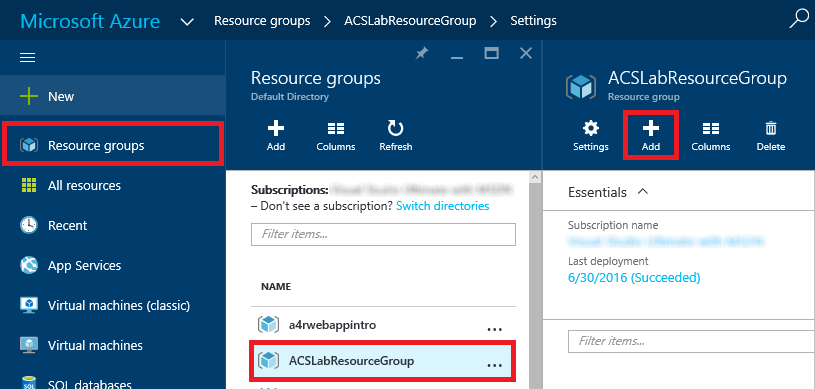

	_Adding a resource to ACSLabResourceGroup_

1. Type "Storage account" (without quotation marks) into the search box to filter the list of resources. Select **Storage account** from the search results. (There will probably be two instances of "Storage account" in the search results. Select the one that says "Web + Mobile" on the far right.) Then click the **Create** button at the bottom of the "Storage account" blade.

	

	_Adding a storage account_

1. Fill in the "Create storage account" blade as shown below, substituting a unique storage-account name for the one shown (remember that storage account names must be unique within Azure) and selecting the same location you selected for the container service. Then click the **Create** button.

	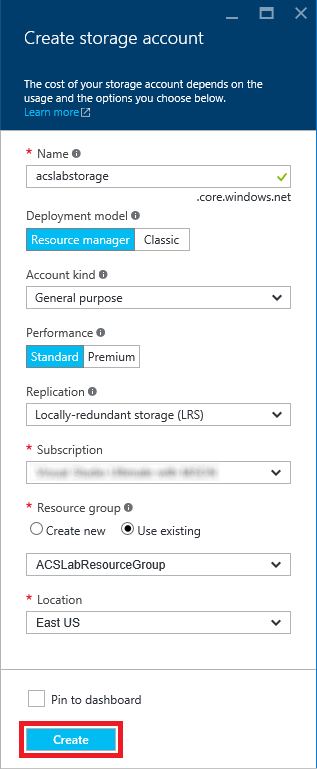

	_Creating a new storage account_

1. Wait for the storage account to be created. Then start the Microsoft Azure Storage Explorer. If you're prompted for credentials, sign in with the user name and password for your Microsoft account.

1. In the Storage Explorer window, find the storage account that you just created. Expand the list of items underneath that storage account. Then right-click **Blob Containers** and select **Create Blob Container** from the menu.

    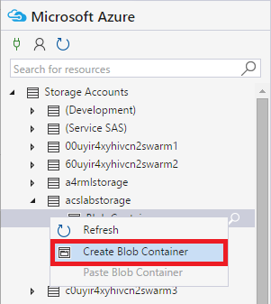

    _Creating a new container_

1. Type "input" (without quotation marks) and press **Enter** to create a container named "input."

1. Repeat this procedure to create a blob container named "output."

1. Double-click the "input" container to show its contents. Then click the **Upload** button and select **Upload Files** from the menu.

    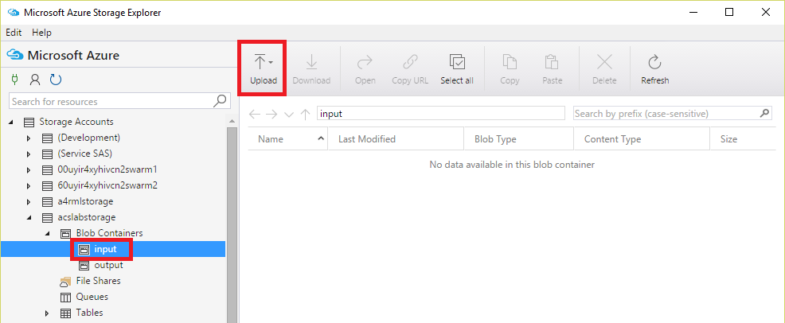

    _Uploading images to the "input" container_

1. Click the **...** button to the right of the field labeled "Files." In the ensuing dialog, navigate to this lab's "ColorImages" subdirectory and select all the files in that subdirectory. Then close the dialog and click the **Upload** button.

    

    _Uploading files to blob storage_

1. Confirm that all 49 files were uploaded to the "input" container.

    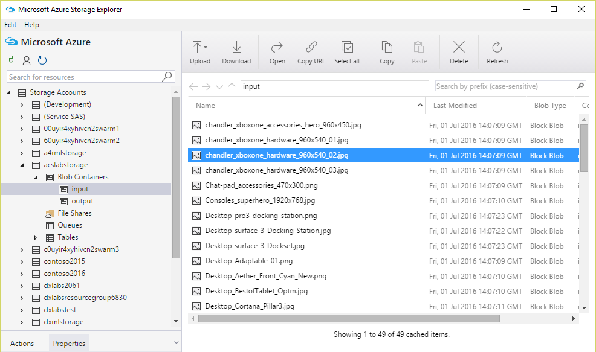

    _Uploaded images_

You now have containers to hold input and output and a collection of color images in the input container. The next step is to prepare the scripts needed to configure the cluster and process the images.

## Exercise 4: Prepare the Python script

With the SLURM cluster up and running in Docker containers and the color images uploaded to blob storage, the next task is to modify the Python script that will process the images with information about the storage account that holds the blobs.

1. Return to the Azure Portal and open the blade for the storage account you created in [Exercise 3](#Exercise3). In the storage-account blade, click the key icon.

    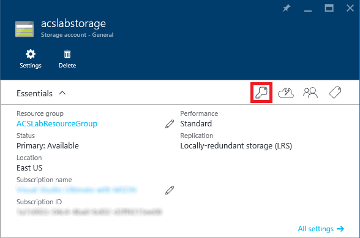

    _Accessing the storage account's access keys_

1. In the "Access keys" blade, click the **Copy** button to copy the storage account's primary access key to the clipboard.

    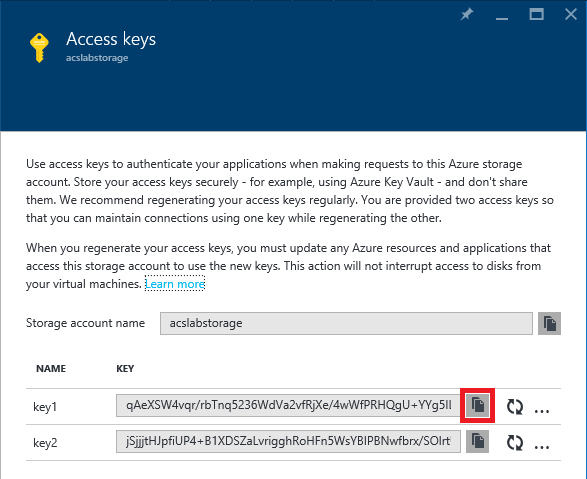

    _Copying the primary access key to the clipboard_

1. Navigate to this lab's "docker-resources" directory. Open **slurmdemo.py** in a text editor and find the following section near the top of the file:

	<pre>
    #######################################################
    # Update these two variables to those for your account.
    #######################################################
    ACCOUNT_NAME = 'account_name'
    ACCOUNT_KEY = 'account_key'
    #######################################################
    </pre>

1. Replace *account_name* with the name of the storage account you created. Make sure the account name is enclosed in single quotes.

1. Replace *account_key* with the access key on the clipboard. Make sure it is enclosed in single quotes. The modified code will look something like this:

	<pre>
	#######################################################
	# Update these two variables to those for your account.
	#######################################################
	ACCOUNT_NAME = 'acslabstorage'
	ACCOUNT_KEY = '4CUfFk2wTcE+...+mNCGCn9ln23F0PFzxwi8Q=='
	#######################################################
    </pre>

1. Save your changes to **slurmdemo.py** and close the text editor.

You've updated the Python script with the information it needs to access the storage account. Now comes the fun part: generating grayscale images from the color images in the "input" container.

## Exercise 5: Copy the job scripts to the cluster and run the job

**slurmdemo.py** is one of several scripts in the "docker-resources" folder that must be copied to the SLURM cluster. In this exercise, you will copy the scripts to the cluster, and then execute the Python script on the cluster.

1. Return to the Command Prompt window that's open to the lab's "docker-resources" directory and run the following command to copy **slurmdemo.py** and other job scripts to the SLURM nodes:

	<pre>
	copy-scripts
	</pre>

1. Now use the following command to run **slurmdemo.py** and do the image conversions:

	<pre>
	docker -H 127.0.0.1:22375 exec -it linux0 python /slurmdemo.py
	</pre>
	
After a second or two, the command should complete. Note that it might take 30 seconds or more for the Python script, which is running in the cloud in the various container instances, to convert all the images. 

## Exercise 6: View the converted images

If the job ran successfully, the grayscale images generated from the color images in the input container will be in the output container you created in [Exercise 3](#Exercise3). In this exercise, you will check the contents of that container.

1. Launch the Microsoft Azure Storage Explorer if it isn't already running.

1. In Storage Explorer, double-click the container named "output" to see its contents.
 
    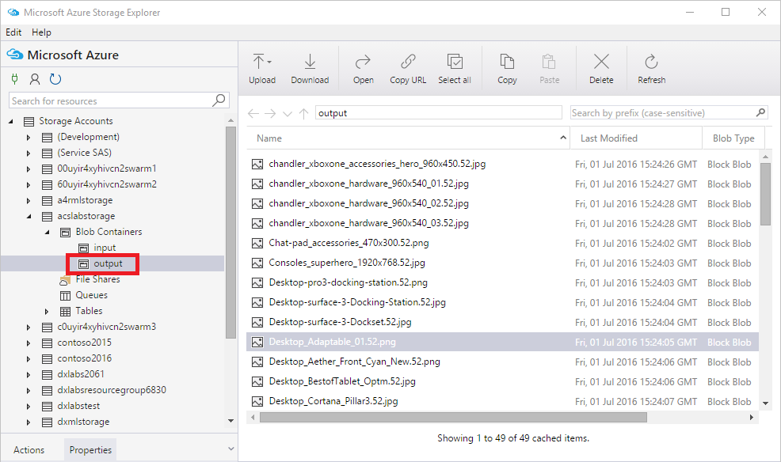

    _Contents of the output container_

1. Double-click one of the blobs in the container. When the downloaded image opens, confirm that it's a grayscale image, not a color image. To be sure, download a few other images, too. If the images are grayscale, congratulations! You have a working SLURM cluster.

You now know how to deploy SLURM clusters in Docker containers and run jobs on them. But when those clusters aren't being used, you should shut them down to avoid incurring unnecessary charges. The next exercise explains how.

## Exercise 7: Suspend the SLURM cluster

When virtual machines are running, you are being charged — even if the VMs are idle. Therefore, it's advisable to stop virtual machines when they are not in use. You will still be charged for storage, but that cost is typically insignificant compared to the cost of an active VM. Your container service contains a master VM that needs to be stopped when you're not using the cluster. The Azure Portal makes it easy to stop virtual machines. VMs that you stop are easily started again later so you can pick up right where you left off.

1. Return to the Command Prompt window and ensure that you are still in the lab's "docker-resources" directory. Then run the following command:

	<pre>
	stop-slurm
	</pre>

	This command is actually a batch file that shuts down all of the container instances, effectively shutting down the SLURM cluster. You can use the **start-slurm** command to restart the container instances at any time.

1. Wait for the **stop-slurm** command to finish. Then go to the Azure Portal and open the blade for the resource group that contains the container service. Click the virtual machine whose name begins with **swarm-master** to open a blade for the master VM.

	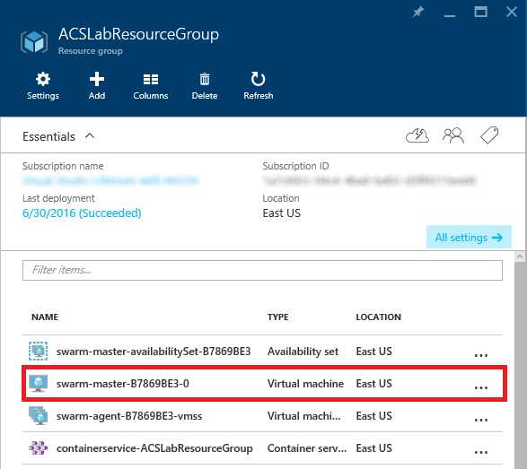
	
	 _Opening a blade for the master VM_

1. Click the **Stop** button to stop the master VM. Answer **Yes** when prompted to verify that you wish to stop it.

	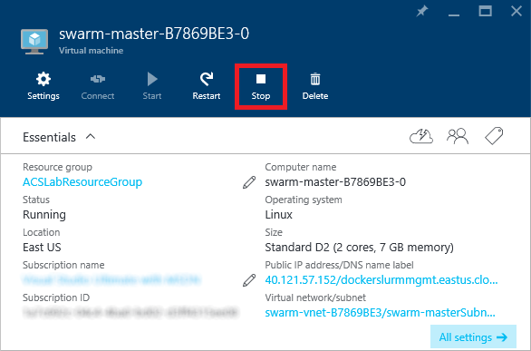
	
	_Stopping the master virtual machine_

There is no need to stop the agent VMs. They are part of an Azure Virtual Machine Scale Set and are automatically spun up and down as needed by the master VM. Note that if you wish to start the cluster again, you will need to restart the master VM before executing a **start-slurm** command.

## Exercise 8: Delete the resource group

Resource groups are a useful feature of Azure because they simplify the task of managing related resources. One of the most practical reasons to use resource groups is that deleting a resource group deletes all the resources it contains. Rather than delete those resources one by one, you can delete them all at once.

In this exercise, you'll delete the resource group created in [Exercise 1](#Exercise1) when you created the container service. Deleting the resource group deletes everything in it and prevents any further charges from being incurred for it.

1. In the Azure Portal, open the blade for the resource group that holds the container service. Then click the **Delete** button at the top of the blade.

	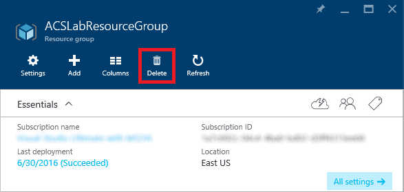

	_Deleting a resource group_

1. For safety, you are required to type in the resource group's name. (Once deleted, a resource group cannot be recovered.) Type the name of the resource group.

1. Click the **Delete** button to remove all traces of this lab from your account.

### Summary ###

The Azure Container Service makes it easy to run apps packaged in Docker containers in the cloud without having to manage servers or install a container stack yourself. Container images are smaller than VM images, they start faster, and they typically cost less since a single VM can host multiple container instances. More importantly, Docker containers can be hosted in other cloud platforms such as Amazon Web Services (AWS). If you want to avoid being tied to a single cloud platform, containers are a great to achieve that independence.

---

Copyright 2016 Microsoft Corporation. All rights reserved. Except where otherwise noted, these materials are licensed under the terms of the MIT License. You may use them according to the license as is most appropriate for your project. The terms of this license can be found at https://opensource.org/licenses/MIT.
