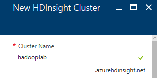
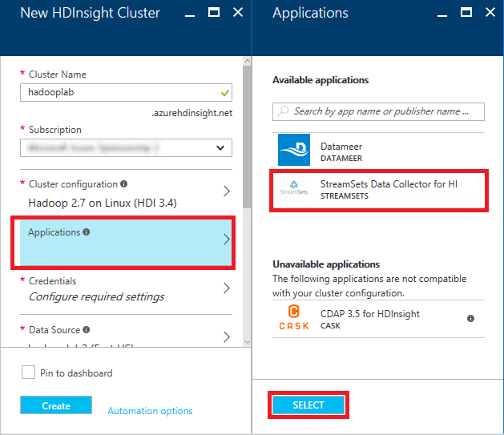
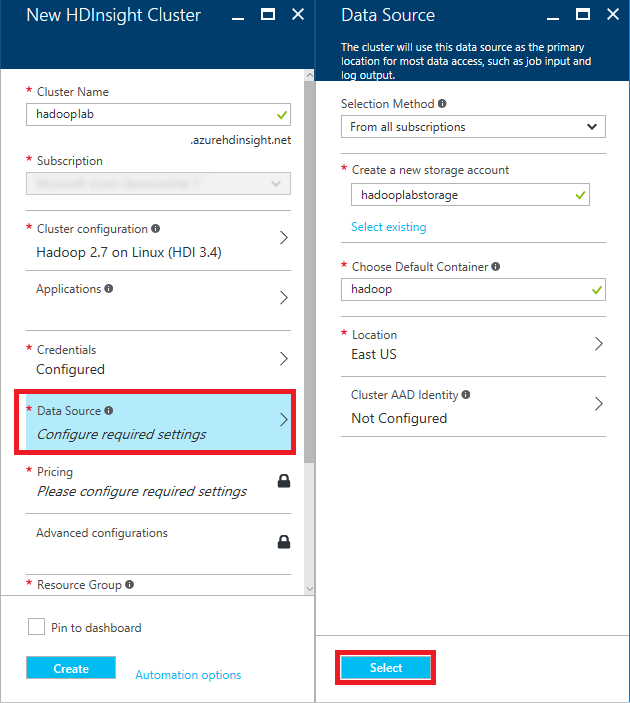
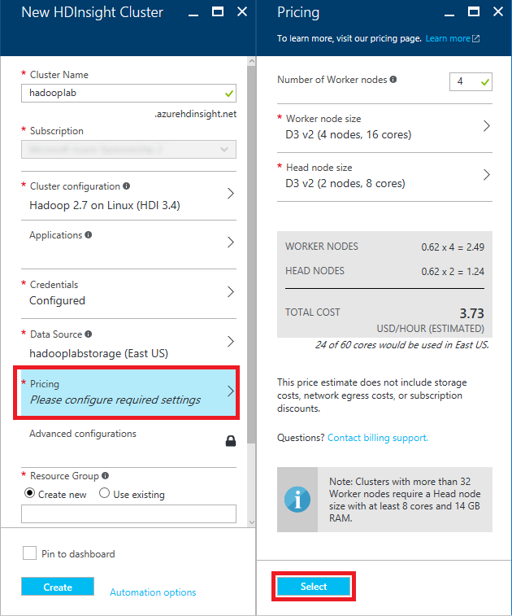
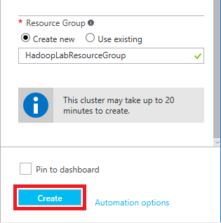
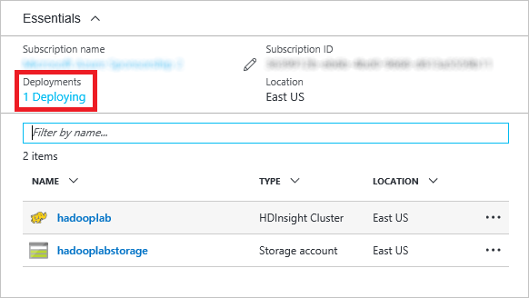
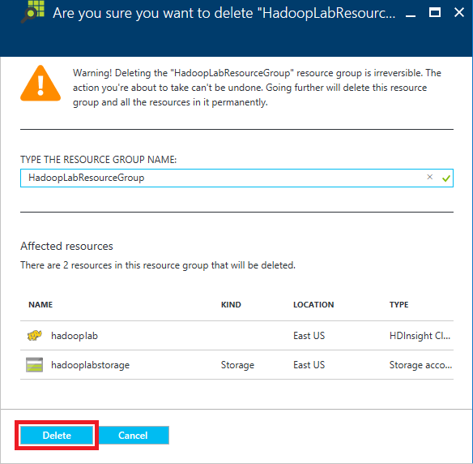

<a name="HOLTitle"></a>
# Processing Big Data with Apache Hadoop on Azure HDInsight #

---

<a name="Overview"></a>
## Overview ##

When you consider that there are more than 20 billion devices connected to the Internet today, most all of them generating data, and then think of the massive amounts of data being produced by Web sites, social networks, and other sources, you begin to understand the true implications of **BIG DATA**. Data is being collected in ever-escalating volumes, at increasingly high velocities, and in a widening variety of formats, and it's being used in increasingly diverse contexts. "Data" used to be something stored in a table in a database, but today it can be a sensor reading, a tweet, a GPS location, or almost anything else. The challenge for information scientists is to make sense of all that data.

A popular tool for analyzing big data is [Apache Hadoop](https://hadoop.apache.org/). Hadoop is "a framework that allows for the distributed processing of large data sets across clusters of computers using simple programming models." It is frequently combined with other open-source frameworks such as [Apache Spark](http://spark.apache.org/), [Apache HBase](http://hbase.apache.org/), and [Apache Storm](https://storm.apache.org/) to increase its capabilities and performance. [Azure HDInsight](http://azure.microsoft.com/en-us/services/hdinsight/) is the Azure implementation of Hadoop, Spark, HBase, and Storm, with other tools such as [Apache Pig](https://pig.apache.org/) and [Apache Hive](https://hive.apache.org/) thrown in to provide a comprehensive and high-performance solution for advanced analytics. HDInsight can spin up Hadoop clusters for you using either Linux or Windows as the underlying operating system, and it integrates with popular business-intelligence tools such as Microsoft Excel and SQL Server Analysis Services.

The purpose of this lab is to acquaint you with the process of deploying and running Hadoop clusters provisioned by HDInsight on Linux VMs. Once your Hadoop cluster is running, most of the operations you perform on it are identical to the ones you would perform on hardware clusters running Hadoop.

<a name="Objectives"></a>
### Objectives ###

In this hands-on lab, you will learn how to:

- Create an HDInsight cluster running Linux
- Use Hive on the cluster to query datasets
- Use Python to perform MapReduce operations
- Delete a cluster when it is no longer needed

<a name="Prerequisites"></a>
### Prerequisites ###

The following are required to complete this hands-on lab:

- An active Microsoft Azure subscription. If you don't have one, [sign up for a free trial](http://aka.ms/WATK-FreeTrial).
- Windows users need to install	[PuTTY](http://www.chiark.greenend.org.uk/~sgtatham/putty/download.html), an open-source SSH client for Windows. Install the latest full package using the MSI installer.

---
<a name="Exercises"></a>
## Exercises ##

This hands-on lab includes the following exercises:

- [Exercise 1: Deploy an HDInsight Hadoop cluster on Linux](#Exercise1)
- [Exercise 2: Connect to the cluster via SSH](#Exercise2)
- [Exercise 3: Analyze an Apache log file with Hive](#Exercise3)
- [Exercise 4: Use MapReduce to analyze a text file with Python](#Exercise4)
- [Exercise 5: Delete the HDInsight cluster](#Exercise5)

Estimated time to complete this lab: **45** minutes.

<a name="Exercise1"></a>
## Exercise 1: Deploy an HDInsight Hadoop cluster on Linux

In this exercise, you will use the Azure Portal to deploy an HDInsight Hadoop cluster with Linux installed on the cluster's nodes.

1. Open the [Azure Portal](https://portal.azure.com) in your browser. If you are asked to log in, do so using your Microsoft account.

1. Click **+ New** in the upper-left corner of the portal. Then click **Intelligence + analytics** followed by **HDInsight**.

    

    _Creating an HDInsight cluster_

1. In the **Cluster Name** box, enter a unique DNS name for the cluster and make sure a green check mark appears next to it indicating that the name is valid and unique.

	> In case someone else in the lab selects the same name, try to make it as unique as possible by including birth dates, initials, and anything else you care to add. The name you entered may be unique right now, but it might NOT be unique a few minutes into the deployment.

    

    _Specifying the cluster name_

1. Click **Cluster configuration**. Then, in the ensuing blade, specify **Hadoop** as the **Cluster Type** and **Linux** as the **Operating System**, and accept the default version of Hadoop offered to you. Then select **Standard** as the **Cluster Tier**, and finish up by clicking the **Select** button at the bottom of the blade.

    

    _Specifying the cluster type_

1. Click **Applications** and select **StreamSets Data Collector HI**. Then click the **Select** button at the bottom of the blade.

    

    _Specifying the installed applications_

1. Click **Credentials** to open a "Cluster Credentials" blade. Leave **Cluster Login Username** set to "admin" and set the **Cluster Login Password** to "Had00pdemo!" without quotation marks. (The fourth and fifth characters are zeroes, not capital Os.) Enter "sshuser" (without quotation marks) for the **SSH Username**, make sure **SSH Authentication Type** is set to **Password**, and enter "Had00pdemo!" (again without quotation marks) again for the **SSH Password**. Then click the **Select** button at the bottom of the blade.

    

    _Specifying cluster credentials_

1. Click **Data Source** to open a "Data Source" blade. Leave **Selection Method** set to **From all subscriptions** and enter a unique storage-account name in the box below **Create a new storage account**. (Once more, try to make the name as unique as possible by including birth dates or other values that aren't likely to be used by someone else. You can use lowercase letters, numbers, and hyphens in the storage-account name. Make sure a green check mark appears indicating that the name is valid and unique) For **Choose Default Container**, enter "hadoop" (without quotation marks). Select the **Location** nearest you, and then click the **Select** button at the bottom of the blade.

    

    _Specifying the data source_

1. Click **Pricing** to open a "Pricing" blade. Make sure **Number of Worker nodes** is set to **4** and accept the default values everywhere else. Then click the **Select** button at the bottom of the blade.

    

    _Specifying the pricing_

1. Select **Create new** under **Resource Group** and enter "HadoopLabResourceGroup" (without quotation marks) as the resource-group name. Then click the **Create** button at the bottom of the blade to begin deploying the cluster.

    

    _Specifying a resource group and creating the cluster_

1. Deploying an HDInsight cluster can take 20 minutes or more. You can monitor the status of the deployment by opening the resource group's blade. Click **Resource group** in the ribbon on the left side of the portal, and then click the resource group name ("HadoopLabResourceGroup") to open the blade. "Deploying" will change to "Succeeded" when the deployment has completed successfully.

	> Click the browser's **Refresh** button every few minutes to update the deployment status. Clicking the **Refresh** button in the resource-group blade refreshes the list of resources in the resource group, but does not reliably update the deployment status.

    

     _Monitoring the deployment_

In this exercise, you learned how to provision an HDInsight Hadoop cluster on Azure, and about some of the options you can choose from when doing so. Wait for the deployment to finish, and then proceed to the next exercise.

<a name="Exercise2"></a>
## Exercise 2: Connect to the cluster via SSH

Before you can run jobs on the Hadoop cluster, you need to open an SSH connection to it so you can execute commands on the cluster. In this exercise, you will remote into the cluster via SSH using the **ssh** command if you are running macOS or Linux, or PuTTY if you are running Windows. If you are a Windows user and haven't installed PuTTY, take the time to [install it now](http://www.chiark.greenend.org.uk/~sgtatham/putty/download.html).

**If you're a Windows user, skip to Step 2**. Otherwise, proceed to Step 1.

1. **Linux and macOS users only**: Open a terminal window so you can use the **ssh** command to establish a connection. Execute the following command in the terminal window, replacing *clustername* with the cluster name you entered in Exercise 1, Step 3:

    <pre>
    ssh sshuser@<i>clustername</i>-ssh.azurehdinsight.net</pre>

	Enter the SSH password ("Had00pdemo!") when prompted. **Now proceed to Exercise 3**. Step 2 is for Windows users only.

1. **Windows users only**: Start PuTTY. In the **Host Name (or IP address)** field, type "sshuser@<i>clustername</i>-ssh.azurehdinsight.net" without quotation marks, replacing *clustername* with the cluster name you entered in Exercise 1, Step 3. Then click the **Open** button to open an SSH connection.

	> Because this is the first time you have connected to the master node, you will be prompted with a warning dialog asking if you trust this host. Since the host is one you created, click **Yes**.

    

    _Establishing a connection with PuTTY_

	A PuTTY terminal window will appear and prompt you for a password. Enter the SSH password ("Had00pdemo!") you specified when you created the cluster and press **Enter**.

<a name="Exercise3"></a>
## Exercise 3: Analyze an Apache log file with Hive

In this exercise, you will use [Apache Hive](https://cwiki.apache.org/confluence/display/Hive?src=sidebar) and the HiveQL query language to query a sample Apache log4j log file that was created along with the cluster. Apache Hive is a data-warehouse infrastructure built on top of Hadoop that facilitates summarizing, querying, and analyzing data. It supports a SQL-like interface for querying data stores that integrate with Hadoop, and it allows you to project structure onto data that lacks structure.

1. In the terminal window you opened in the previous exercise, start the Hive command-line interface by executing the following command:

    ```
    hive
	```

1. Wait for a Hive prompt to appear. Then enter the following commands to create a new table named "log4jlogs" using sample data stored in a blob that was created along with your cluster. (Tip: You can paste a command into a PuTTY terminal window by right-clicking in the window.)

    ```
	DROP TABLE log4jLogs;
	CREATE EXTERNAL TABLE log4jLogs(t1 string, t2 string, t3 string, t4 string, t5 string, t6 string, t7 string) ROW FORMAT DELIMITED FIELDS TERMINATED BY ' ' STORED AS TEXTFILE LOCATION 'wasb:///example/data/';
	SELECT t4 AS sev, COUNT(*) AS cnt FROM log4jLogs WHERE t4 = '[ERROR]' GROUP BY t4;
    ```

    The **DROP TABLE** command removes any existing table named "log4jLogs." **CREATE EXTERNAL TABLE** creates a new external table. External tables store only the table definitions in Hive; the data is left in the original location. **STORED AS TEXTFILE LOCATION** tells Hive that the data is stored in a text file and where the file is located. "wasb" is the protocol prefix; it stands for "Windows Azure Storage Blob." (HDInsight transparently maps HDFS to Azure blob storage.) Finally, the **SELECT** statement counts all the rows in which column t4 contains the value "[ERROR]."

    After the final command is entered, you will see statements similar to the following at the end of the output:

    ```
    OK
    [ERROR]	3
    Time taken: 15.388 seconds, Fetched: 1 row(s)
    ```

    Note that the output contains "[ERROR] 3," as there are three rows that contain this value.

1. Execute the following commands to create a new internal table named "errorLogs:"

    ```
    CREATE TABLE IF NOT EXISTS errorLogs (t1 string, t2 string, t3 string, t4 string, t5 string, t6 string, t7 string) STORED AS ORC;
    INSERT OVERWRITE TABLE errorLogs SELECT t1, t2, t3, t4, t5, t6, t7 FROM log4jLogs WHERE t4 = '[ERROR]';
    ```

    **CREATE TABLE IF NOT EXISTS** creates a table if it does not already exist. Because the EXTERNAL keyword is not specified, this is an internal table that is stored in the Hive data warehouse and is managed completely by Hive. Unlike dropping an external table, dropping an internal table deletes the underlying data as well. **STORED AS ORC** says to store the data in Optimized Row Columnar (ORC) format. This is a highly optimized and efficient format for storing Hive data. **INSERT OVERWRITE...SELECT** selects rows from the "log4jLogs" table that contain the string "[ERROR]," and then inserts them into the "errorLogs" table.

1. The final step is to verify that only rows containing "[ERROR]" in column t4 were stored in the "errorLogs" table. To do that, use the following command to return all rows from "errorLogs:"

    ```
    SELECT * FROM errorLogs;
    ```

    The output will look like this:

    ```
    OK
    2012-02-03	18:35:34	SampleClass0	[ERROR]	incorrect	id
    2012-02-03	18:55:54	SampleClass1	[ERROR]	incorrect	id
    2012-02-03	19:25:27	SampleClass4	[ERROR]	incorrect	id
    Time taken: 0.58 seconds, Fetched: 3 row(s)
    ```

1. Use the following command to close the Hive session:
 
	```
	quit;
	```

	**Leave your SSH session open**, because you will use it again in the next exercise.

Hive is useful, but executing Hive commands is not all you can do with a Hadoop cluster. In the next exercise, you will learn how to perform MapReduce operations using Python.

<a name="Exercise4"></a>
## Exercise 4: Use MapReduce to analyze a text file with Python

One of the most important algorithms introduced in recent years is Google's [MapReduce](http://research.google.com/archive/mapreduce.html), which facilitates the processing of very large data sets. MapReduce is a two-stage algorithm that relies on a pair of functions: the *map* function, which transforms a set of input data to produce a result, and the *reduce* function, which reduces the results of a map to a scalar value. What makes MapReduce so relevant for big data is that operations can be executed in parallel and independent of the data source. The parallelism facilitates handling massive amounts of data, and the data-source independence means you are not locked into a particular data store such as MySQL or Microsoft SQL Server.

HDInsight, with its underlying Hadoop implementation, allows you to write MapReduce functions in Java, Python, C#, and even [Apache Pig](http://pig.apache.org/). In this exercise, you will use Python since it is widely used in the data-processing community. The Python code, which is based on a sample from[ Michael Noll](http://www.michael-noll.com/tutorials/writing-an-hadoop-mapreduce-program-in-python/), reads a text file and counts the frequency of the words in it.

1. Before you start, take a moment to read over the Python code for the mapper you will be using:

    ```python
    #!/usr/bin/env python

    # Use the sys module
    import sys

    # 'file' in this case is STDIN
    def read_input(file):
        # Split each line into words
        for line in file:
            yield line.split()

    def main(separator='\t'):
        # Read the data using read_input
        data = read_input(sys.stdin)
        # Process each words returned from read_input
        for words in data:
            # Process each word
            for word in words:
                # Write to STDOUT
                print '%s%s%d' % (word, separator, 1)

    if __name__ == "__main__":
        main()
    ```

    The mapper reads a file from standard input (STDIN) and outputs each word in the file, followed by a tab character and the value 1, on a separate line.

1. Now take a moment to examine the reducer:

    ```python
    #!/usr/bin/env python

    # import modules
    from itertools import groupby
    from operator import itemgetter
    import sys

    # 'file' in this case is STDIN
    def read_mapper_output(file, separator='\t'):
        # Go through each line
        for line in file:
            # Strip out the separator character
            yield line.rstrip().split(separator, 1)

    def main(separator='\t'):
        # Read the data using read_mapper_output
        data = read_mapper_output(sys.stdin, separator=separator)
        # Group words and counts into 'group'
        #   Since MapReduce is a distributed process, each word
        #   may have multiple counts. 'group' will have all counts
        #   which can be retrieved using the word as the key.
        for current_word, group in groupby(data, itemgetter(0)):
            try:
                # For each word, pull the count(s) for the word
                #   from 'group' and create a total count
                total_count = sum(int(count) for current_word, count in group)
                # Write to stdout
                print "%s%s%d" % (current_word, separator, total_count)
            except ValueError:
                # Count was not a number, so do nothing
                pass

    if __name__ == "__main__":
        main()
    ```

    The reducer reads each word output by the mapper, looks it up in the list of word groups it compiles, and adds the number of instances found to the total number of instances, writing the data to standard output (STDOUT).

1. The two Python scripts containing the mapper and the reducer are provided for you in the lab's "resources" directory, which is in the same directory as the document you're currently reading. The next step is to copy the two files, which are named **mapper.py** and **reducer.py**, from the "resources" directory on the local machine to the cluster. **If you're using Windows, skip to Step 5**. Otherwise, proceed to the next step.

1. **Linux and macOS users only**: Open a terminal window and navigate to this lab's "resources" directory. Then execute the following command to copy **mapper.py** and **reduce.py** to the HDInsight cluster, replacing *clustername* with the cluster name you specified in Exercise 1, Step 3. When prompted for a password, enter the cluster's SSH password ("Had00pdemo!").

    <pre>
    scp *.py sshuser@<i>clustername</i>-ssh.azurehdinsight.net:</pre>

	**Now skip to Step 6**. Step 5 is for Windows users only.
 
1. **Windows users only**: Open a Command Prompt window and navigate to this lab's "resources" directory. Then execute the following command to copy **mapper.py** and **reduce.py** to the HDInsight cluster, replacing *clustername* with the cluster name you specified in Exercise 1, Step 3. When prompted for a password, enter the cluster's SSH password ("Had00pdemo!").

    <pre>
    pscp *.py sshuser@<i>clustername</i>-ssh.azurehdinsight.net:</pre>

	> pscp.exe is part of PuTTY. This command assumes that pscp.exe is in the PATH. If it's not, preface the command with the path to pscp.exe.

1. Return to the SSH session that you established in Exercise 2. (If you closed the session, or if it timed out, follow the instructions in Exercise 2 to establish a new SSH connection.)

1. To be certain that the Python files you uploaded contain Linux-style line endings ("/r" rather than "/r/n"), execute the following commands in the terminal window to install and run the dos2unix conversion program:

    ```
    sudo apt-get install dos2unix
    dos2unix -k -o *.py
    ```

1. Now execute the following command to run the Hadoop job:

    ```
    hadoop jar /usr/hdp/current/hadoop-mapreduce-client/hadoop-streaming.jar -files mapper.py,reducer.py -mapper mapper.py -reducer reducer.py -input wasb:///example/data/gutenberg/davinci.txt -output wasb:///example/wordcountout
    ```

    There is a lot going on in that command. Here's a quick synopsis of each part:

    - **hadoop**: Launches the Hadoop program
    - **jar /usr/hdp/current/hadoop-mapreduce-client/hadoop-streaming.jar**: Tells Hadoop you want to run a specific jar (Java ARchive). In this case, it is the program that interfaces Hadoop with the MapReduce code.
    - **-files mapper.py,reducer.py**: Specifies that these files should be copied to all the nodes in the cluster
    - **-mapper mapper.py**: Specifies which file contains the mapper
    - **-reducer reducer.py**: Specifies which file contains the reducer
    - **-input wasb:///example/data/gutenberg/davinci.txt**: Specifies the input file. In this case, it is the file named davinci.txt, which was copied into blob storage when the cluster was created.
    - **-output wasb:///example/wordcountout**: Specifies the output file

    A lot of output will stream by. Near the end of the output will be something resembling the following:

    ```
	Shuffle Errors
	        BAD_ID=0
	        CONNECTION=0
	        IO_ERROR=0
	        WRONG_LENGTH=0
	        WRONG_MAP=0
	        WRONG_REDUCE=0
	File Input Format Counters
	        Bytes Read=1615338
	File Output Format Counters
	        Bytes Written=337623
	16/12/09 13:44:48 INFO streaming.StreamJob: Output directory: wasb:///example/wordcountout
    ```

1. To see the files that Hadoop created, execute the following command:

    ```
    hadoop fs -ls /example/wordcountout
    ```

    The output will show that two files were created:

    ```
	Found 2 items
	-rw-r--r--   1 sshuser supergroup          0 2016-12-09 14:04 /example/wordcountout/_SUCCESS
	-rw-r--r--   1 sshuser supergroup     337623 2016-12-09 14:04 /example/wordcountout/part-00000
	````

    The &#95;SUCCESS file, which is zero bytes in length, indicates that the job was a success. The part-00000 file contains the list of words and their counts. To view the contents of that file, use the following command.

    ```
    hadoop fs -cat /example/wordcountout/part-00000
    ```

    You will see a lot of output showing words and their counts. Here's a small sample:

    ```
    yourself	26
    yourself,	3
    yourself.	3
    yourself;	2
    yourselves	2
    yourselves;	1
    youth	9
    youth,	3
    youth--devoted	1
    youth.	2
    youth.]	1
    youth;	1
    youthful	3
    ```

    As you can see, **mapper.py** does not separate words that contain punctuation characters. It is left as an exercise for you to consider how you would change the code to strip off extra punctuation marks when harvesting words.

    If you want to run the job again, you will either have to change the output directory specified in the **hadoop** command, or delete the output directory with the following command:

    ```
    hadoop fs -rm -r /example/wordcountout
    ```

This exercise showed how to execute streaming MapReduce jobs with HDInsight using a widely used programming language, Python. The next and most important step is to delete the HDInsight cluster so you are not billed for it when it is not being used.

<a name="Exercise5"></a>
## Exercise 5:  Delete the HDInsight cluster

As long as the HDInsight clusters you create exist, you are charged for them. Even when the clusters aren't actively processing data, charges are being incurred. Therefore, it behooves you to shut them down when they're no longer needed. Currently, it is not possible to suspend an HDInsight cluster, so your only option is to delete it.

Thankfully, it is easy to remove an HDInsight cluster. Deleting a resource group deletes everything in that resource group, including HDInsight clusters and accompanying resources. In this exercise, you will delete the HDInsight cluster that you created in Exercise 1.

1. Return to the Azure Portal and click **Resource groups** on the left side of the page. Then click the "HadoopLabResourceGroup" resource group to open it.

1. In the blade for the resource group, click the **Delete** button.

    

    _Deleting a resource group_  

1. As a safeguard against accidental deletion, you must type the resource group's name to delete it. Type in the name, and then click the **Delete** button at the bottom of the blade.

    

    _Confirming deletion of a resource group_  

After 10 minutes or so, the cluster and all of its associated resources will be deleted. Billing stops when you click the **Delete** button, so you're not charged for the time required to delete the cluster. Similarly, bulling doesn't start until a cluster is fully and successfully deployed.

<a name="Summary"></a>
## Summary ##

Here is a quick summary of what you learned in this lab:

- HDInsight is Microsoft Azure's implementation of Hadoop, Spark, and supporting big-data tools
- The Azure Portal makes it easy to create and configure HDInsight Hadoop clusters running Windows or Linux
- Hive can be used on HDInsight Hadoop clusters to query and analyze data
- An HDInsight Hadoop cluster can perform MapReduce operations coded in Python or other languages
- HDInsight clusters should be deleted when they're not being used to avoid unnecessary charges

If you have set up hardware clusters of your own and installed and configured Hadoop on them, you appreciate how easy Azure makes it to deploy Hadoop clusters. The provisioning is done for you, so you can spend your time crunching data rather than troubleshooting hardware and software installs. This is yet another example of how cloud computing is changing the face of data analytics, and just one example of the types of HDInsight clusters that Azure supports.

---

Copyright 2016 Microsoft Corporation. All rights reserved. Except where otherwise noted, these materials are licensed under the terms of the MIT License. You may use them according to the license as is most appropriate for your project. The terms of this license can be found at https://opensource.org/licenses/MIT.