
# Data Analytics with Apache Spark for Azure HDInsight #
---

## Overview ##

Today, data is being collected in ever-increasing amounts, at ever-increasing velocities, and in an ever-expanding variety of formats. This explosion of data is colloquially known as the Big Data phenomenon.

In order to gain actionable insights into big-data sources, new tools need to be leveraged that allow the data to be cleaned, analyzed, and visualized quickly and efficiently. Azure HDInsight provides a solution to this problem by making it exceedingly simple to create high-performance computing clusters provisioned with [Apache Spark](http://spark.apache.org/) and members of the Spark ecosystem. Rather than spend time deploying hardware and installing, configuring, and maintaining software, you can focus on your research and apply your expertise to the data rather than the resources required to analyze that data.

[Apache Spark](http://spark.apache.org/) is an open-source parallel-processing platform that excels at running large-scale data analytics jobs. Spark’s combined use of in-memory and disk data storage delivers performance improvements that allow it to process some tasks up to 100 times faster than Hadoop. With Microsoft Azure, deploying Apache Spark clusters becomes significantly simpler and gets you working on your data analysis that much sooner.

In this lab, you will experience [Apache Spark for Azure HDInsight](https://azure.microsoft.com/en-us/services/hdinsight/apache-spark/) first-hand. After provisioning a Spark cluster, you will use the [Microsoft Azure Storage Explorer](http://storageexplorer.com/) to upload several Jupyter notebooks to the cluster. You will then use these notebooks to explore, visualize, and build a machine-learning model from food-inspection data — more than 100,000 rows of it — collected by the city of Chicago. The goal is to learn how to create and utilize your own Spark clusters, experience the ease with which they are provisioned in Azure, and, if you're new to Spark, get a working introduction to Spark data analytics.

### Objectives ###

In this hands-on lab, you will learn how to:

-   Deploy an HDInsight Spark cluster
-   Work with content stored in Azure Blob Storage and accessed by the Spark cluster as an HDFS volume
-   Use a Jupyter notebook to interactively explore a large dataset
-   Use a Jupyter notebook to develop and train a machine-learning model
-   Delete a Spark cluster to avoid incurring unnecessary charges

### Prerequisites ###

The following are required to complete this hands-on lab:

- An active Microsoft Azure subscription. If you don't have one, [sign up for a free trial](http://aka.ms/WATK-FreeTrial).

---

## Exercises ##

This hands-on lab includes the following exercises:

- [Exercise 1: Create a Spark cluster on HDInsight](#Exercise1)
- [Exercise 2: Upload Jupyter notebooks to the cluster](#Exercise2)
- [Exercise 3: Work with Jupyter notebooks](#Exercise3)
- [Exercise 4: Interactively explore data in Spark](#Exercise4)
- [Exercise 5: Use Jupyter to develop a machine-learning model](#Exercise5)
- [Exercise 6: Remove the HDInsight Spark cluster](#Exercise6)

Estimated time to complete this lab: **60** minutes.

## Exercise 1: Create a Spark Cluster on HDInsight ##

In this exercise, you will create an HDInsight cluster running [Apache Spark](http://spark.apache.org/). Spark is renowned for its versatility and is built for speed, performing some operations 100 times faster than Hadoop.

1. Open the [Azure Portal](https://portal.azure.com) in your browser. If you are asked to log in, do so using your Microsoft account.

1. Click **+ New** in the upper-left corner of the portal. Then click **Intelligence + analytics** followed by **HDInsight**.

    

    _Creating an HDInsight cluster_

1. In the **Cluster Name** box, enter a unique DNS name for the cluster and make sure a green check mark appears next to it indicating that the name is valid and unique.

	> In case someone else in the lab selects the same name, try to make it as unique as possible by including birth dates, initials, and anything else you care to add. The name you entered may be unique right now, but it might NOT be unique a few minutes into the deployment.

    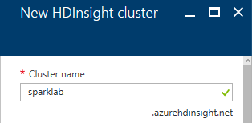

    _Specifying the cluster name_

1. Click **Cluster configuration** to open a "Cluster configuration" blade. In that blade, select **Spark** as the **Cluster type** and **Spark 1.6.2 (HDI 3.5)** as the **Version**. Make sure **Cluster tier** is set to **Standard**, and finish up by clicking the **Select** button at the bottom of the blade.

    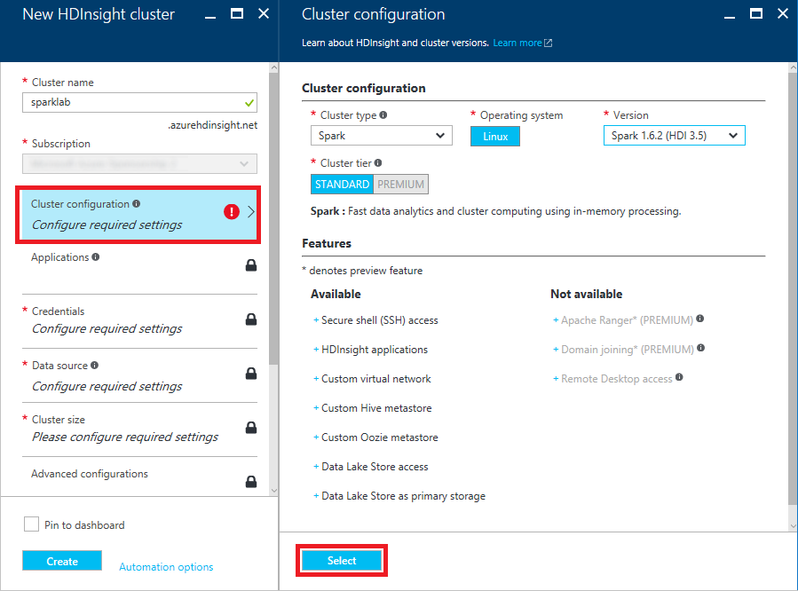

    _Specifying the cluster type_

1. Click **Credentials** to open a "Cluster credentials" blade. Leave **Cluster login username** set to "admin" and set the **Cluster login password** to "A4rsparkdemo!" (without quotation marks).  Enter "sshuser" for the **SSH username**, make sure **SSH authentication type** is set to **PASSWORD**, and enter "A4rsparkdemo!" for the **SSH password**. Then click the **Select** button at the bottom of the blade.

    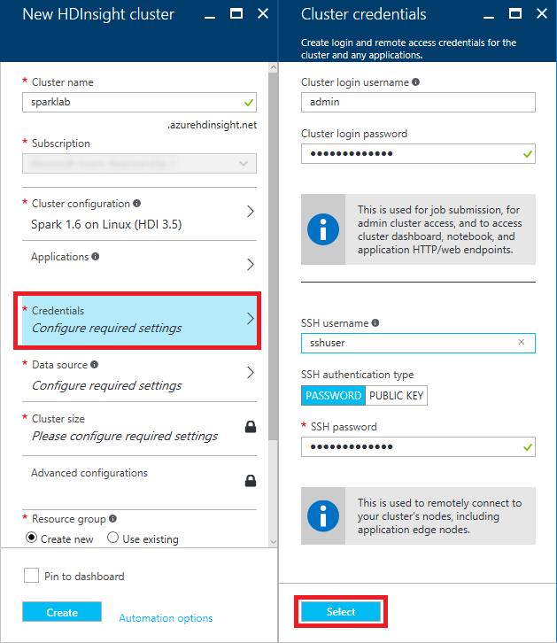

    _Specifying cluster credentials_

1. Click **Data source** to open a "Data source" blade. Enter a unique storage-account name in the box below **Create a new Storage account**. (Once more, try to make the name as unique as possible by including birth dates or other values that aren't likely to be used by someone else.) For **Default container**, enter "sparklab" (without quotation marks). Select the **Location** nearest you, and then click the **Select** button at the bottom of the blade.

    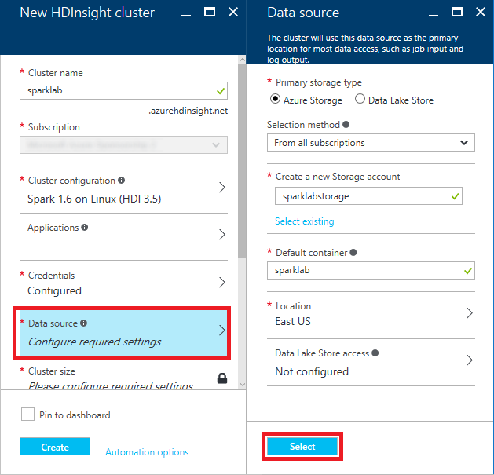

    _Specifying the data source_

1. Click **Cluster size** to open a "Pricing" blade. Make sure **Number of Worker nodes** is set to **4** and accept the default values everywhere else. Then click the **Select** button at the bottom of the blade.

    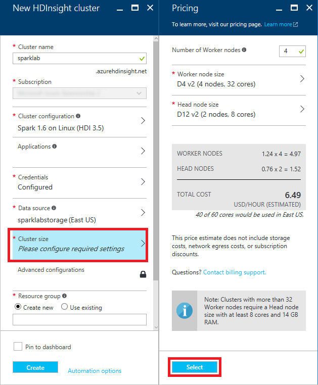

    _Specifying the cluster size_

1. Select **Create new** under **Resource group** and enter the resource-group name "SparkLabResourceGroup" (without quotation marks). Then click the **Create** button at the bottom of the blade to start deploying the cluster.

    

    _Specifying a resource group and creating the cluster_

1. Deploying an HDInsight cluster can take 20 minutes or more. You can monitor the status of the deployment by opening the resource group's blade. Click **Resource group** in the ribbon on the left side of the portal, and then click the resource group name ("SparkLabResourceGroup") to open the blade. "Deploying" will change to "Succeeded" when the deployment has completed successfully.

	> Click the browser's **Refresh** button every few minutes to update the deployment status. Clicking the **Refresh** button in the resource-group blade refreshes the list of resources in the resource group, but does not reliably update the deployment status.

    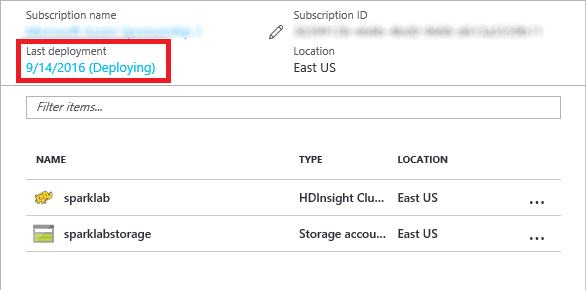

     _Monitoring the deployment_

In this exercise, you learned how to provision an HDInsight Spark cluster on Azure, and about some of the options you can choose from when doing so. Wait for the deployment to finish, and then proceed to the next exercise.

## Exercise 2: Upload Jupyter notebooks to the cluster ##

You will be using Jupyter notebooks to do the data-exploration and machine-learning portions of this lab. The notebooks have been prepared for you ahead of time, and need to be uploaded to your cluster. In this exercise, you will use the Azure Portal to upload the notebooks.

1. Click the storage account that was created for the cluster (the storage account whose name you specified in Exercise 1, Step 6).

    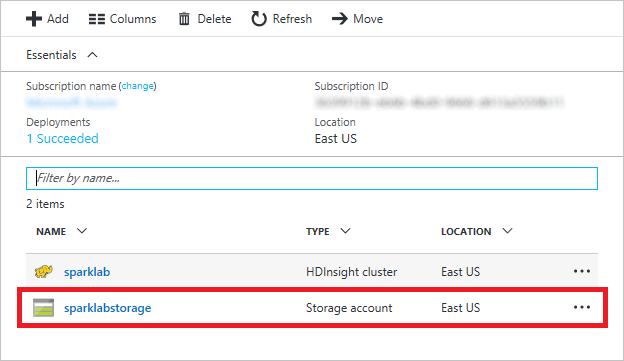

    _Opening the cluster's storage account_

1. Click **Blobs**.

    

    _Opening the cluster's blob storage_

1. Click **sparklab**.

    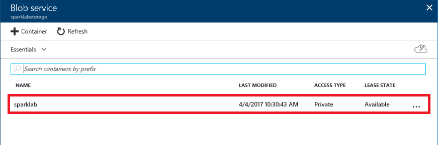

    _Opening the blob container_

1. Click **HdiNotebooks**.

    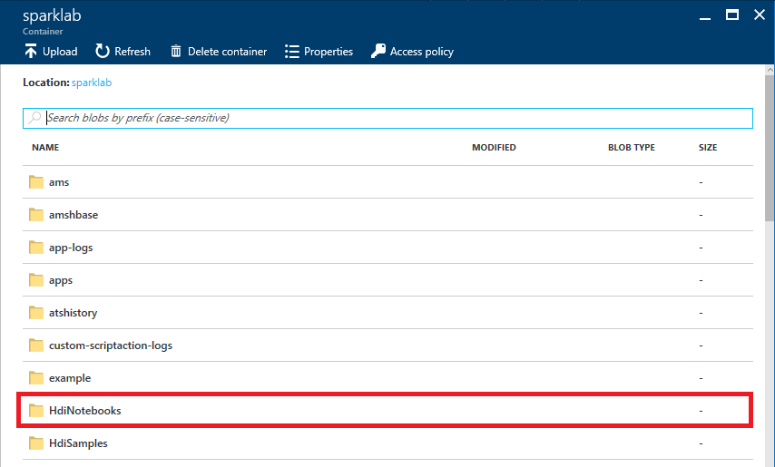

    _Opening the "HdiNotebooks" folder_

1. Click **Upload**.

    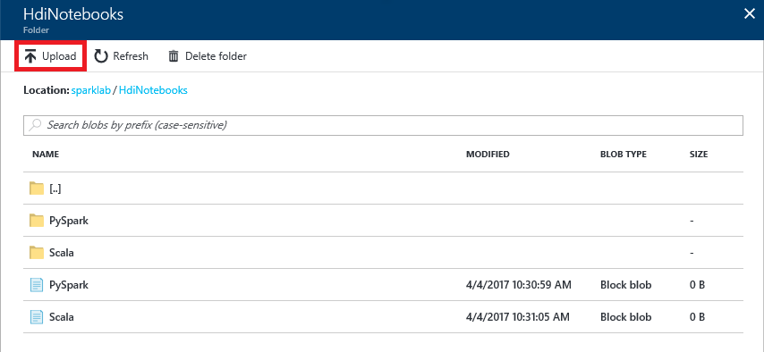

    _Uploading files to the "HdiNotebooks" folder_

1. Click the button with the folder icon to the right of the **Files** box. Navigate to this lab's "resources" directory and select the three **.ipynb** files in that directory. Then click the **Upload** button. 

    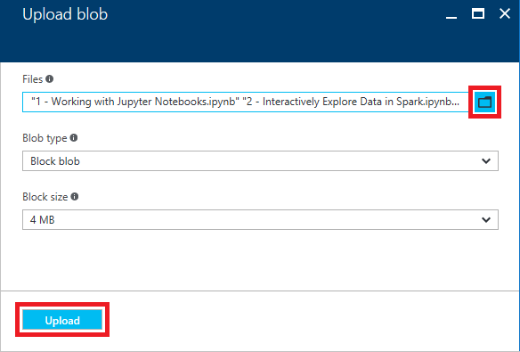

    _Uploading Jupyter notebooks_

1. Wait until the files have uploaded. Then return to the "HdiNotebooks" blade and confirm that all three files were uploaded to the "HdiNotebooks" folder.

    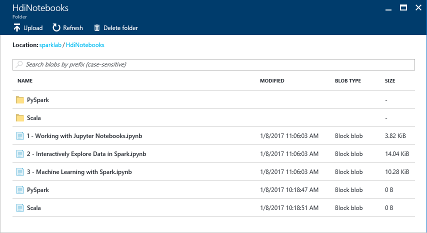

    _Uploaded notebooks_

The notebooks are uploaded and ready to go. Let's put them to work.

## Exercise 3: Work with Jupyter Notebooks ##

[Jupyter notebooks](http://jupyter.org/) are Web applications that allow you to create shareable, interactive documents containing text, equations, code, and data visualizations. Jupyter notebooks are proving to be extraordinarily useful for data scientists exploring and manipulating data sets in order to gain insights and share results. Jupyter supports several programming languages through the use of installable interpreters called *kernels*. Spark clusters on HDInsight include the Spark and PySpark kernels for Scala and Python, respectively. In this exercise, you will learn how to access Jupyter notebooks in your Spark cluster and acquire basic skills for using them.

1. In the Azure Portal, return to the blade for the resource group ("SparkLabResourceGroup") that contains the cluster. In the list of resources that belong to the resource group, click the HDInsight cluster.

    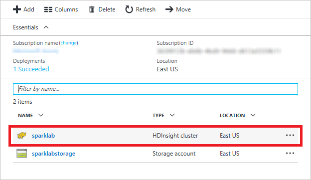

    _Opening the cluster_

1. In the blade for the HDInsight Spark cluster, click **Cluster Dashboards.**
  
    

    _Opening the cluster dashboards_

1. In the ensuing blade, click **Jupyter Notebook**.
  
    

    _Opening a Jupyter notebook_

1. When prompted for a user name and password, log in with your cluster credentials ("admin" and "A4rsparkdemo!") from Exercise 1, Step 5.

	> If you mistype the password and are greeted with a 403 Forbidden error, start a new incognito or private browsing session, go to the Azure Portal, and open the Jupyter notebook again.

1. A new browser window (or tab) will open showing the Jupyter notebooks in your cluster. Here, you can manage your notebooks, upload new ones, and more. You can also see which notebooks are currently “running”, meaning they are currently consuming resources in your Spark cluster. Confirm that you see the notebooks you uploaded in Exercise 2. Then click **1 – Working with Jupyter Notebooks.ipynb** to open that notebook.

    

    _Opening Notebook 1_

1. Jupyter notebooks consist of a series of cells into which you can insert commands, HTML, or Markdown text. The notebook you opened contains the remaining instructions for this exercise. Follow the instructions in the notebook to complete Exercise 3.

    

    _Working with Jupyter notebooks_

Once you have completed the steps in the notebook, close the browser window in which the notebook is displayed and return to the Azure Portal.

## Exercise 4: Interactively explore data in Spark ##

One of the ways in which researchers and data scientists use Jupyter notebooks in Spark is to explore datasets in order to understand their content and structure. Notebooks can be used to visualize data, as well as to apply structure to it. DataFrames are particularly helpful in this regard because they make it simple to apply schemas to raw data. DataFrames can also be used to create temporary tables that can be queried using [Apache Hive SQL](http://hortonworks.com/blog/hive-cheat-sheet-for-sql-users/), also known as HiveQL or simply HQL. Libraries such as *matplotlib*, which is already provisioned on your Spark cluster, provide support for graphing, charting, and visualizing datasets and query results. Put them all together and you have a powerful set of tools for exploring and analyzing datasets large and small.

You have already learned how to access and run Spark notebooks on your Azure HDInsight Spark cluster. In this exercise, you will take the learning a level deeper by using DataFrames, HiveQL, and matplotlib to explore [food-inspection data](https://data.cityofchicago.org/Health-Human-Services/Food-Inspections/4ijn-s7e5) from the city of Chicago. In addition to analyzing the contents of the data, you will apply structure to it, query it, and graph it to discover key relationships.

1. Go back to the browser window showing the Jupyter notebooks in your cluster. If necessary, open the Azure Portal and follow the steps in the previous exercise to find the notebooks.

1. Click **2 – Interactively Explore Data in Spark.ipynb** to open that notebook. Then follow the instructions in the notebook to complete Exercise 4.

    

    _Exploring data in Spark_

Once you have completed the steps in the notebook, close the browser window in which the notebook is displayed and return to the Azure Portal.

## Exercise 5: Use Jupyter to develop a machine-learning model ##

In the previous exercise, you explored a set of food-inspection data and obtained key insights by looking at it in different ways. However, sometimes the sheer volume and complexity of the data makes relationships difficult to identify. One solution is machine learning, a technique that algorithmically finds patterns in data and exploits those patterns to perform predictive analytics.

Your Azure HDInsight Spark cluster includes several libraries from which you can build sophisticated machine-learning models. In this exercise, you will use some of these tools to build, train, and score a machine-learning model using the food-inspection data featured in the previous exercise. In the model, you will use a popular classification algorithm to predict which restaurants will be successful and which ones won't based on certain features of the input data — information that is difficult to discern simply by examining the data.

1. Go back to the browser window showing the Jupyter notebooks in your cluster.

1. Click **3 - Machine Learning with Spark.ipynb** to open that notebook. Then follow the instructions in the notebook to complete Exercise 5.

    

    _Machine learning with Spark_

Once you have completed the steps in the notebook, close the browser window in which the notebook is displayed and return to the Azure Portal.

## Exercise 6: Remove the HDInsight Spark cluster ##

When you are finished using an HDInsight Spark cluster, you should delete it because you are charged for it while it exists, regardless of whether it's doing any work. In this exercise, you will delete the resource group created in [Exercise 1](#Exercise1) when you created the cluster. Deleting the resource group deletes everything in it and prevents any further charges from being incurred for it.

1. In the Azure Portal, open the blade for the "SparkLabResourceGroup" resource group that holds the cluster. Then click the **Delete** button at the top of the blade.

	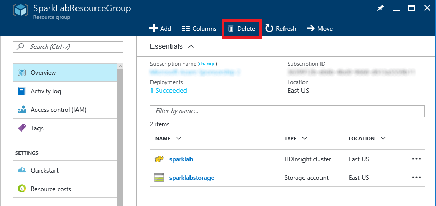

	_Deleting a resource group_

1. For safety, you are required to type in the resource group's name. (Once deleted, a resource group cannot be recovered.) Type the name of the resource group. Then click the **Delete** button to remove all traces of this lab from your account.

After a few minutes, the cluster and all of its resources will be deleted. Billing stops when you click the **Delete** button, so you're not charged for the time required to delete the cluster. Similarly, bulling doesn't start until a cluster is fully and successfully deployed.

## Summary ##

Here is a summary of what you learned in this lab:

-   Apache Spark for Azure HDInsight is Microsoft Azure's implementation of Hadoop, Spark, and supporting big-data tools
-   The Azure Portal makes it easy to create, configure, and delete HDInsight Spark clusters
-   HDInsight Spark clusters come with Jupyter preinstalled
-   Jupyter notebooks provide a powerful means for querying, analyzing, and visualizing data
-   HDInsight Spark clusters should be deleted when they're no longer needed to avoid incurring unwanted charges

With Apache Spark for Azure HDInsight, high-performance computing clusters with all the tools you need to handle big data are just a few button clicks away. It's just one example of why cloud computing is changing the face of research.

---

Copyright 2016 Microsoft Corporation. All rights reserved. Except where otherwise noted, these materials are licensed under the terms of the MIT License. You may use them according to the license as is most appropriate for your project. The terms of this license can be found at https://opensource.org/licenses/MIT.