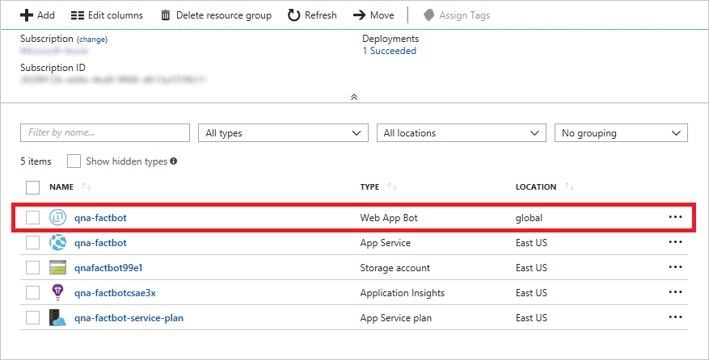
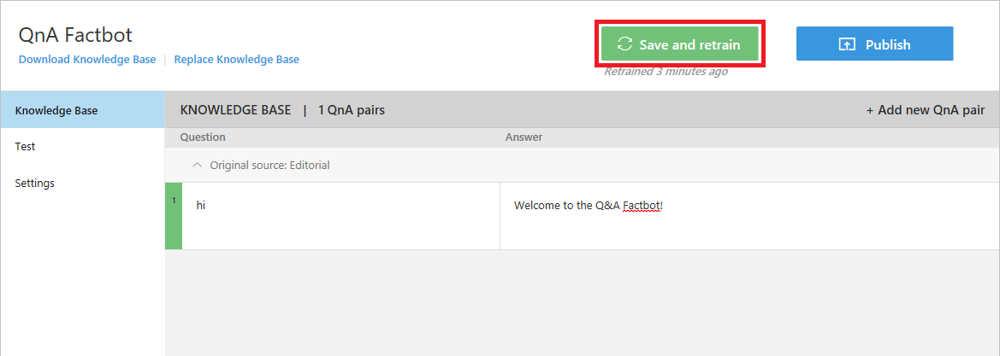
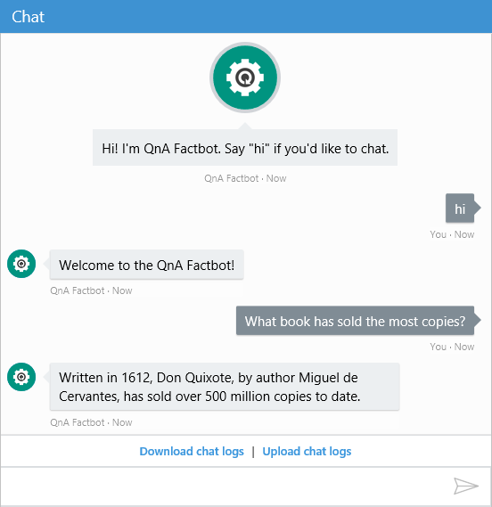
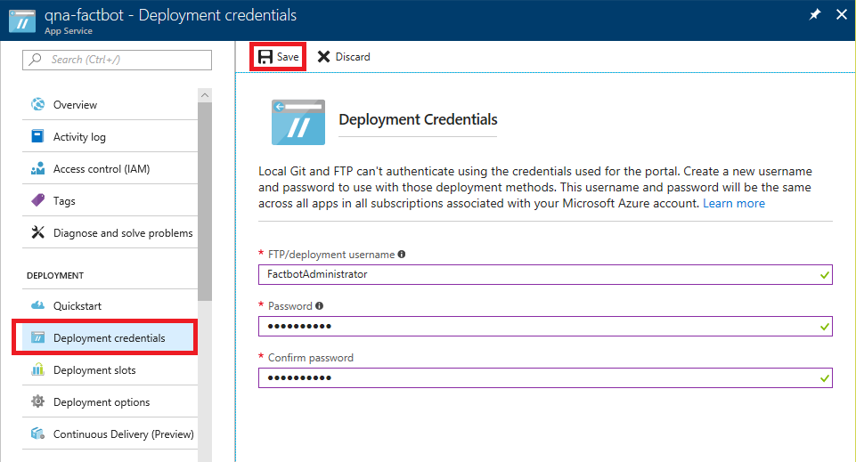
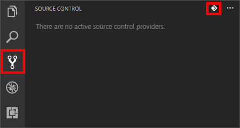
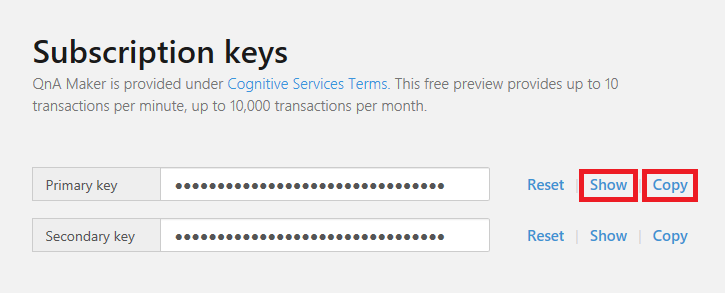
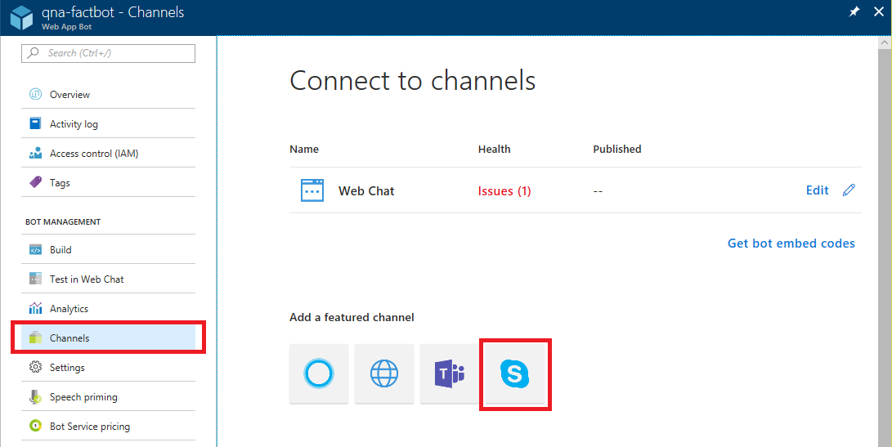

<a name="HOLTitle"></a>
# Building a Chat Bot with the Azure Bot Service #

Software bots are everywhere. You probably interact with them every day without realizing it. Bots, especially chat and messenger bots, are changing the way we interact with businesses, communities, and even each other. Thanks to light-speed advances in artificial intelligence (AI) and the ready availability of AI services, bots are not only becoming more advanced and personalized, but also more accessible to developers. 

Regardless of the target language or platform, developers building bots face a variety of challenges. Bots must be able process input and output intelligently. Bots need to be responsive, scalable, and extensible. They need to work cross-platform, and they need to interact with users in a conversational manner and in the language the user chooses.

The [Azure Bot Service](https://azure.microsoft.com/en-us/services/bot-service/), combined with [Microsoft QnA Maker](https://qnamaker.ai/), provide the tools developers need to build and publish intelligent bots that interact naturally with users using a range of services. In this lab, you will create a bot using the Azure Bot Service and connect it to a knowledge base built with QnA Maker. Then you will interact with the bot using Skype — one of many popular services with which bots built with the Azure Bot Service can integrate.


<a name="Objectives"></a>
### Objectives ###

In this hands-on lab, you will learn how to:

- Create an Azure Web App Bot to host a bot
- Create a Microsoft QnA knowledge base, populate it with data, and connect it to a bot
- Implement bots in code and debug the bots that you build
- Publish bots and use continuous integration to keep them up to date
- Plug a bot into Skype and interact with it there

<a name="Prerequisites"></a>
### Prerequisites ###

The following are required to complete this hands-on lab:

- An active Microsoft Azure subscription. If you don't have one, [sign up for a free trial](http://aka.ms/WATK-FreeTrial).
- [Visual Studio Code](http://code.visualstudio.com) 
- [Git](https://git-scm.com) for Windows, macOS, or Linux
- The [Microsoft Bot Framework Emulator](https://emulator.botframework.com/)
- [Node.js](https://nodejs.org)
- [Skype](https://www.skype.com/en/download-skype/skype-for-computer/)

<a name="Cost"></a>
### Cost ###


The cost of this lab is **moderate**. For an overview of cost ratings, refer to [Explanation of Costs](../../Costs.md).

<a name="Exercises"></a>
## Exercises ##

This hands-on lab includes the following exercises:

- [Exercise 1: Create an Azure Web App Bot](#Exercise1)
- [Exercise 2: Train the bot with Microsoft QnA Maker](#Exercise2)
- [Exercise 3: Deploy the bot using continuous integration](#Exercise3)
- [Exercise 4: Debug the bot locally](#Exercise4)
- [Exercise 5: Connect the bot to the knowledge base](#Exercise5)
- [Exercise 6: Test the bot with Skype](#Exercise6)
 
Estimated time to complete this lab: **45** minutes.

<a name="Exercise1"></a>
## Exercise 1: Create an Azure Web App Bot ##

The first step in creating a bot is to provide a location for the bot to be hosted in Azure. [Azure Web Apps](https://azure.microsoft.com/services/app-service/web/) are perfect for hosting bot applications, and the Azure Bot Service is designed to provision them for you. In this exercise, you will use the Azure portal to provision an Azure Web App Bot.

1. Open the [Azure Portal](https://portal.azure.com) in your browser. If you are asked to sign in, do so using your Microsoft account.

1. Click **+ Create a resource**, followed by **AI + Cognitive Services** and then **Web App Bot**.
 
    

    _Creating a new Azure Web App Bot_
  
1. Enter a name such as "qna-factbot" into the **App name** box. *This name must be unique within Azure, so make sure a green check mark appears next to it.* Select **Create new** under **Resource group** and enter the resource-group name "BotResources." Select the location nearest you, and then click **Bot template**.

	

	_Configuring the Azure Web App Bot_

1. Select **Node.js** as the SDK language and **Question and Answer** as the template type. Then click **Select** at the bottom of the blade.   
  
	

	_Selecting the language and template_

1. Now click **App service plan/Location** followed by **Create New** and create an app service plan in the same region that you selected in Step 3. Once that's done, click **Create** at the bottom of the "Web App Bot" blade to start the deployment. 

1. Click **Resource Groups** in the ribbon on the left. Then click **BotResources** to open the resource group created for the Azure Web App Bot.

    

    _Opening the resource group_
  
1. Wait until "Deploying" changes to "Succeeded" at the top of the blade indicating that the Azure Web App Bot was successfully deployed. (You can click the **Refresh** button at the top of the blade to refresh the deployment status.) Then click the Web App Bot resource.

    

    _Opening the Web App Bot_
  
1. Behind the scenes, a lot happened when the Azure Web App Bot was deployed. A bot was created and registered, an Azure Web App was created to host it, and the bot was configured to work with [Microsoft QnA Maker](https://qnamaker.ai/). To make sure the deployment was successful, click **Test in Web Chat** in the menu on the left, and then type "Hi" into the chat window at the bottom of the blade. Confirm that the bot responds with an informational message regarding QnA Maker, as pictured below.

    

    _Chatting with your bot_

The next step is to send your bot to school by connecting it to QnA Maker and training it with questions and answers.

<a name="Exercise2"></a>
## Exercise 2: Train the bot with Microsoft QnA Maker ##

[Microsoft QnA Maker](https://qnamaker.ai/) is part of [Azure Cognitive Services](https://www.microsoft.com/cognitive-services/), which is a suite of services and APIs for building intelligent apps backed by AI and machine learning. Rather than infuse a bot with intelligence by writing code that tries to anticipate every question a user might ask and provide a response, you can train it with a knowledge base of questions and answers created with QnA Maker. A common usage scenario is to create a knowledge base from a FAQ so the bot can answer domain-specific questions such as "How do I find my Windows product key" or "Where can I download Visual Studio Code?"

In this exercise, you will use QnA Maker to train the bot to respond to questions such as "What NFL teams have won the most Super Bowls" and "What is the largest city in the world?"

1. Open the [Microsoft QnA Maker portal](https://qnamaker.ai/) in your browser and sign in with your Microsoft account. Then click **Create new service** in the menu bar at the top of the page.
 
    

    _Creating a new QnA service_

1. Enter "QnA Factbot" as the service name. Then scroll to the bottom of the page and click the **Create** button. 

1. The knowledge base currently contains a single question and answer: "hi" and "hello."  Replace "hello" with "Welcome to the QnA Factbot!" Then click **Save and retrain**. 
 
    

    _Updating the default QnA Maker response_

1. Click **Test** on the left side of the page. Then type "hi" into the box at the bottom of the chat window and press **Enter**. Confirm that the bot responds with "Welcome to the QnA Factbot!"
 
    

    _Chatting with the bot_

1. You can enter questions and answers into a QnA Maker knowledge base manually, or you can import them from a variety of sources, including online FAQs. Click **Settings** on the left side of the page. Paste the following URL into the "URLs" box, and then click **Save and retrain**:

	```
	https://traininglabservices.azurewebsites.net/help/faqs.html
	```

1. Click **Knowledge Base** on the left side of the page and confirm that six new questions and answers were added. Then click **Save and retrain** again to save the changes.

1. Click **Test** to return to the test page. Type "What's the largest city in the world?" into the box at the bottom of the chat window and press **Enter**. How does the bot respond?
 
1. The knowledge base only contains a few questions and answers, but can easily be updated to include more. You can even import questions and answers stored in text files on your computer. To demonstrate, [click here](https://a4r.blob.core.windows.net/public/bots-resources.zip) to download a zip file containing a text file named **Final QnA.txt**, and copy the text file to your computer. Click **Replace Knowledge Base** in the upper-left corner of the portal, select the text file, and click **OK** when prompted to confirm that importing this file will overwrite existing questions and answers.
 
1. Click **Knowledge Base** and confirm that 20 questions and answers appear in the knowledge base. Then click **Save and retrain** to save the changes.

1. Click **Test** to return to the test page. Type "What book has sold the most copies?" into the box at the bottom of the chat window and press **Enter**. Confirm that the bot responds as shown below. 
 
    

    _Chatting with the bot_

1. The knowledge base now contains 20 questions and answers, but the answer on row 7 contains an invalid character. Click **Knowledge Base** in the menu on the left. Locate the invalid character in row 7 between the words "most" and "Emmys," and replace it with a space character. Then click **Save and retrain**.
 
    

    _Editing an answer_

1. Click the **Publish** button at the top of the page to publish the changes to the knowledge base. Review the changes and click the **Publish** button at the bottom of the page.
 
    

    _Publishing the updated knowledge base_

With the knowledge base in place and the bot trained, it is now time to deploy the bot to Azure.

<a name="Exercise3"></a>
## Exercise 3: Deploy the bot using continuous integration ##

When you created an Azure Web App Bot in [Exercise 1](#Exercise1), an Azure Web App was deployed to host it. But the bot does require some code, and it still needs to be deployed to the Azure Web app. Fortunately, the code was generated for you by the Azure Bot Service. In this exercise, you will use Visual Studio Code to place the code in a local Git repository and publish the bot to Azure by pushing changes from the local repository to a remote repository connected to the Azure Web App that hosts the bot — a process known as [continuous integration](https://en.wikipedia.org/wiki/Continuous_integration).

1. If [Git](https://git-scm.com/) isn't installed on your PC, go to https://git-scm.com/downloads and install the Git client for your operating system. Git is a free and open-source distributed version-control system, and it integrates seamlessly into Visual Studio Code. If you aren't sure whether Git is installed, open a Command Prompt or terminal window and execute the following command:

	```	
	git --version
	```

	If a version number is displayed, then the Git client is installed.

1. If Node.js isn't installed on your PC, go to https://nodejs.org/ and install the latest LTS version. You can determine whether Node is installed by opening a Command Prompt or terminal window and typing the following command:

	```
	node --version
	```

	If Node is installed, the version number will be displayed.

1. If Visual Studio Code isn't installed on your PC, go to https://code.visualstudio.com/ and install it now.

1. Create a folder named "Factbot" in the location of your choice on your hard disk to hold the bot's source code.

1. Return to the Azure Portal and open the Web App Bot you created in [Exercise 1](#Exercise1). Click **Build** in the menu on the left, and then click **Download zip file** to prepare a zip file containing the bot's source code. Once the zip file is prepared, click the **Download zip file** button to download it. When the download is complete, copy the contents of the zip file to the "Factbot" folder that you created a moment ago.

    

    _Downloading the source code_
  
1. Still on the "Build" blade, click **Configure continuous deployment**. Click **Setup** at the top of the ensuing blade, followed by **Choose Source**. Then select **Local Git Repository** as the deployment source and click **OK**. 
 
    

    _Specifying a local Git repository as the deployment source_  

1. Close the "Deployments" blade and click **All App service settings** in the menu on the left.

1. Click **Deployment credentials**, and then enter a user name and password. You will probably have to enter a user name other than "FactbotAdministrator" because the name must be unique within Azure. Then click **Save** and close the blade.

    

    _Entering deployment credentials_  

1. Start Visual Studio Code and use the **File** > **Open Folder...** command to open the "Factbot" folder that you copied the bot's source code into in Step 5.

1. Click the **Source Control** button in the activity bar on the left side of Visual Studio Code, and click the **Initialize Repository** icon at the top. Then click the **Intialize Repository** button in the ensuing dialog.

    

    _Initializing a local Git repository_  

1. Type "First commit." into the message box, and then click the check mark to commit your changes.

    

    _Committing changes to the local repository_  

1. Select **Integrated Terminal** from Visual Studio Code's **View** menu to open an integrated terminal. Then execute the following command in the integrated terminal, replacing BOT_NAME in two places with the bot name you entered in Exercise 1, Step 3.

	```
	git remote add qna-factbot https://BOT_NAME.scm.azurewebsites.net:443/BOT_NAME.git
	```

1. Click the ellipsis (the three dots) at the top of the SOURCE CONTROL panel and select **Publish Branch** from the menu to push the bot code from the local repository to Azure. If prompted for credentials, enter the user name and password you specified in Step 8 of this exercise.

Your bot has been published to Azure. Now it's time to see it in action and learn how to debug it in Visual Studio Code.

<a name="Exercise4"></a>
## Exercise 4: Debug the bot locally ##

As with any application code that you write, changes to bot code need to be tested and debugged locally before being deployed to production. To help debug bots, Microsoft offers the [Bot Framework Emulator](https://emulator.botframework.com/). In this exercise, you will learn how to use Visual Studio Code and the emulator to debug your bots.

1. If you haven't installed the Microsoft Bot Framework Emulator, take a moment to do so now. You can download it from https://emulator.botframework.com/.

1. Execute the following command in Visual Studio Code's integrated terminal to install [Restify](http://restify.com/), a popular Node package for building and consuming RESTful Web services:

	```
	npm install restify
	```

1. Repeat this step for the following commands to install the [Microsoft Bot Framework Bot Builder SDK for Node.js](https://docs.microsoft.com/en-us/bot-framework/nodejs/bot-builder-nodejs-quickstart):

	```
	npm install botbuilder
	npm install botbuilder-azure
	npm install botbuilder-cognitiveservices
	```

1. Click the **Explorer** button in Visual Studio Code's activity bar. Then select **app.js** to open it in the code editor. This file contains the code that drives the bot — code that was generated by the Azure Bot Service and downloaded from the Azure portal.

    

    _Opening app.js_ 

1. Replace the contents of **app.js** with the following code. Then save the file:

	```JavaScript
	"use strict";
	var builder = require("botbuilder");
	var botbuilder_azure = require("botbuilder-azure");
	
	var useEmulator = true; 
	var userName = ""; 
	var yearsCoding = ""; 
	var selectedLanguage = "";
	
	var connector = useEmulator ? new builder.ChatConnector() : new botbuilder_azure.BotServiceConnector({
	    appId: process.env.MicrosoftAppId,
	    appPassword: process.env.MicrosoftAppPassword	   
	});
	
	var bot = new builder.UniversalBot(connector);
	
	bot.dialog('/', [
	
	function (session) {
	    builder.Prompts.text(session, "Hello, and welcome to QnA Factbot! What's your name?");
	},
	
	function (session, results) {
	    userName = results.response;
	    builder.Prompts.number(session, "Hi " + userName + ", how many years have you been writing code?"); 
	},
	
	function (session, results) {
	    yearsCoding = results.response;
	    builder.Prompts.choice(session, "What language do you love the most?", ["C#", "Python", "Node.js", "Visual FoxPro"]);
	},
	
	function (session, results) {
	    selectedLanguage = results.response.entity;   
	
	    session.send("Okay, " + userName + ", I think I've got it:" +
	                " You've been writing code for " + yearsCoding + " years," +
	                " and prefer to use " + selectedLanguage + ".");
	}]);
	 
	var restify = require('restify');
	var server = restify.createServer();

	server.listen(3978, function() {
	    console.log('test bot endpoint at http://localhost:3978/api/messages');
	});

	server.post('/api/messages', connector.listen());    
	```

1. Set breakpoints on lines 20, 25, and 30 by clicking in the margin on the left.
 
    

    _Adding breakpoints to app.js_ 

1. Click the **Debug** button in the activity bar, and then click the green arrow to start a debugging session. Observe that "test bot endpoint at http://localhost:3978/api/messages" appears in the debug console.
 
    

    _Launching the debugger_ 

1. Your bot code is now running locally. Launch the Bot Framework Emulator and type the following URL into the box at the top of the window:

	```
	http://localhost:3978/api/messages
	```

1. Leave "Microsoft App ID" and "Microsoft App Password" blank, and click **CONNECT** to connect the emulator to the debugging session.
 
    

    _Connecting the emulator to the debugging session_ 

1. Type "hi" into the box at the bottom of the emulator and press **Enter**. Confirm that Visual Studio Code breaks on line 20 of **app.js**. Then click the **Continue** button in Visual Studio Code's debugging toolbar and return to the emulator to see the bot's response.
 
    

    _Continuing in the debugger_ 

1. The bot will ask you a series of questions. Answer them and click **Continue** in Visual Studio Code each time a breakpoint is hit. When you're done, click the **Stop** button in the debugging toolbar to end the debugging session.

At this point, you have a fully functioning bot and know how to debug it by running it locally in the Microsoft Bot Emulator. The next step is to make the bot more intelligent by connecting it to the knowledge base you published in [Exercise 2](#Exercise2).

<a name="Exercise5"></a>
## Exercise 5: Connect the bot to the knowledge base ##

In this exercise, you will connect your bot to the QnA Maker knowledge base you built earlier so the bot can carry on an intelligent conversation. Connecting to the knowledge base involves retrieving a couple of keys from the QnA Maker portal, copying them into the Azure portal, updating the bot code, and then redeploying the bot to Azure.

1. Return to the [QnA Maker portal](https://qnamaker.ai/) and click **My services** at the top. Then click the pencil icon for your factbot.

	

	_Editing the knowledge base_

1. Copy the knowledge base ID from the query string in the browser's address bar and paste it into a text file so you can easily retrieve it in a few moments.

	
	
	_Copying the knowledge base ID_  

1. Click your name in the upper-right corner of the QnA Maker portal and select **Subscription keys** from the menu that drops down. Click **Show** to show the primary subscription key, and **Copy** to copy it to the clipboard. Then paste it into a text file as well.

	
	
	_Copying the subscription key_ 

1. Return to the Web App Bot in the Azure portal. Click **Application settings** in the menu on the left and scroll down until you find application settings named "QnAKnowledgebaseId" and "QnASubscriptionKey." Paste the knowledge base ID and the subscription key into these fields. Then click **Save**.

    

    _Editing application settings_ 
 
1. Return to Visual Studio Code and replace the contents of **app.js** with the code below. Then save the file.

	```JavaScript
	var restify = require('restify');
	var builder = require('botbuilder');
	var botbuilder_azure = require("botbuilder-azure");
	var builder_cognitiveservices = require("botbuilder-cognitiveservices");
	
	// Setup Restify Server
	var server = restify.createServer();
	server.listen(process.env.port || process.env.PORT || 3978, function () {
	   console.log('%s listening to %s', server.name, server.url); 
	});
	  
	// Create chat connector for communicating with the Bot Framework Service
	var connector = new builder.ChatConnector({
	    appId: process.env.MicrosoftAppId,
	    appPassword: process.env.MicrosoftAppPassword     
	});
	
	// Listen for messages from users 
	server.post('/api/messages', connector.listen());
	 
	// Create your bot with a function to receive messages from the user
	var bot = new builder.UniversalBot(connector);
	
	var recognizer = new builder_cognitiveservices.QnAMakerRecognizer({
	                 knowledgeBaseId: process.env.QnAKnowledgebaseId, 
	    subscriptionKey: process.env.QnASubscriptionKey});
	
	var basicQnAMakerDialog = new builder_cognitiveservices.QnAMakerDialog({
	    recognizers: [recognizer],
	                 defaultMessage: "I'm not quite sure what you're asking. Please ask your question again.",
	                 qnaThreshold: 0.3
	});
	
	bot.dialog('basicQnAMakerDialog', basicQnAMakerDialog);
	
	bot.dialog('/', //basicQnAMakerDialog);
	[
	    function (session) {
	        var qnaKnowledgebaseId = process.env.QnAKnowledgebaseId;
	        var qnaSubscriptionKey = process.env.QnASubscriptionKey;
	        
	        // QnA Subscription Key and KnowledgeBase Id null verification
	        if ((qnaSubscriptionKey == null || qnaSubscriptionKey == '') || (qnaKnowledgebaseId == null || qnaKnowledgebaseId == ''))
	            session.send('Please set QnAKnowledgebaseId and QnASubscriptionKey in App Settings. Get them at https://qnamaker.ai.');
	        else
	            session.replaceDialog('basicQnAMakerDialog');
	    }
	]);
	```

	Note the call to ```QnAMakerDialog``` on line 28. This creates a dialog that integrates a bot built with the Microsoft Bot Framework with a knowledge base built Microsoft QnA Maker.
 
1. Click the **Source Control** button in the activity bar in Visual Studio Code. Type "Added QnA Maker support" into the message box, and click the check mark to commit your changes. Then click the ellipsis and use the **Publish Branch** command to push these changes to the remote repository (and therefore to the Azure Web App).

1. Return to the Web App Bot in the Azure portal and click **Test in Web Chat** on the left to open the test console. Type "What's the most popular software programming language in the world?" into the box at the bottom of the chat window and press **Enter**. Confirm that the bot responds as follows:

    

    _Testing the bot_

Now that the bot is connected to the knowledge base, the final step is to test it in the wild. And what could be wilder than testing it with Skype?

<a name="Exercise6"></a>
## Exercise 6: Test the bot with Skype ##

Once deployed, bots can be connected to channels such as Skype, Slack, Microsoft Teams, and Facebook Messenger, where you can interact with them the way you would with a person. In this exercise, you will add the bot to your Skype contacts and carry on a conversation with it in Skype.

1. If Skype isn't already installed on your computer, please install it now. You can download Skype for Windows, macOS, and Linux from https://www.skype.com/en/download-skype/skype-for-computer/.

1. Return to your Web App Bot in the Azure Portal and click **Channels** in the menu on the left. Click the **Skype** icon. Then click **Save** at the bottom of the blade and agree to the terms of service. Finish up by clicking **Cancel**.

    

    _Editing the Skype channel_
 
1. Click **Skype**. Then click **Add to Contacts** to add the bot as a Skype contact and launch Skype.

	
	
	_Connecting to Skype_
 
1. Start a conversation with by typing "hi" into the Skype window. Then converse with the bot by asking it questions and seeing how it responds.   	
 
    

    _Chatting with the bot in Skype_

You now have a fully functional bot created with the Azure Bot Service, infused with intelligence by Microsoft QnA Maker, and available for anyone in the world to interact with. Feel free to plug your bot into other channels and test it in different scenarios. And if you would like to make the bot smarter, consider expanding the knowledge base with additional questions and answers. For example, you could use the [online FAQ](https://docs.microsoft.com/bot-framework/bot-service-resources-bot-framework-faq) for the Bot Framework to train the bot to answer questions about the framework itself.

<a name="Summary"></a>
## Summary ##

There is much more that you can do to leverage the power of the Microsoft Bot Framework by incorporating [Dialogs](http://aihelpwebsite.com/Blog/EntryId/9/Introduction-To-Using-Dialogs-With-The-Microsoft-Bot-Framework), [FormFlow](https://blogs.msdn.microsoft.com/uk_faculty_connection/2016/07/14/building-a-microsoft-bot-using-microsoft-bot-framework-using-formflow/), and [Microsoft Language Understanding and Intelligence Services (LUIS)](https://docs.botframework.com/en-us/node/builder/guides/understanding-natural-language/). With these and other features, you can build sophisticated bots that respond to users' queries and commands and interact in a fluid, conversational, and non-linear manner. For more information, and for ideas to get you started, see [What is Microsoft Bot Framework Overview](https://blogs.msdn.microsoft.com/uk_faculty_connection/2016/04/05/what-is-microsoft-bot-framework-overview/).

----

Copyright 2018 Microsoft Corporation. All rights reserved. Except where otherwise noted, these materials are licensed under the terms of the MIT License. You may use them according to the license as is most appropriate for your project. The terms of this license can be found at https://opensource.org/licenses/MIT.