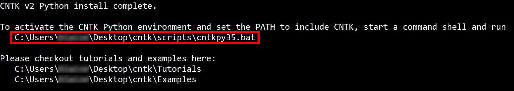

<a name="HOLTitle"></a>
# Building Neural Networks with the Microsoft Cognitive Toolkit #

The [Microsoft Cognitive Toolkit](https://www.microsoft.com/en-us/research/product/cognitive-toolkit/), also known as the Computational Network Toolkit (CNTK), is a powerful set of free and open-source tools for developing deep-learning applications. It was initially developed by computer scientists at Microsoft to aid in their own research, was later adopted by Bing and other product groups, and is now being used by Microsoft customers. It can run on a single machine with a single CPU, or scale efficiently across multiple machines with multiple CPUs and NVIDIA GPUs, including Azure's [GPU offering](https://azure.microsoft.com/en-us/blog/azure-n-series-preview-availability/). The toolkit supports C++ and Python and includes a number of libraries and utilities for processing speech, images, text, and video, as well as examples demonstrating how to use them. For more information on its history, its uses, and its capabilities, see https://blogs.microsoft.com/next/2016/10/25/microsoft-releases-beta-microsoft-cognitive-toolkit-deep-learning-advances.

The toolkit centers around machine learning with [neural networks](https://en.wikipedia.org/wiki/Artificial_neural_network). Machine learning enables computers to discern patterns in data that are difficult to identify algorithmically. Imagine trying to write an algorithm to identify images containing cats. The algorithm might scan the image looking for features characteristic of cats such as pointed ears, whiskers, and slit pupils, but identifying those features by examining individual pixels and groups of pixels would be difficult. By contrast, a machine-learning model trained with hundreds of thousands of cat images could "learn" to identify cats from patterns in the data without explicitly understanding what those patterns represent. Machine learning touches lives every day and is widely used in industry to flag fraudulent credit-card transactions, generate online shopping recommendations, and more.


_Features of cats (image: Wikimedia Commons)_

When used for image processing, neural networks begin by decomposing an input image into regions as illustrated above. These regions constitute a series of *input nodes* in a neural network. These nodes are connected to many *hidden nodes* via probabilistic edges. Each input region is assigned a value, which is mathematically generated from the probability of an edge combined with input from other nodes. Signals from these nodes feed into other nodes and traverse the network until they reach an *output node* specifying a probabilistic outcome.


_Neural network featuring a single hidden layer_

Neural networks are trained with one set of inputs and then tested with another set of inputs. Handwriting recognition is one of the common applications. Handwriting is somewhat unique to an individual, but there are common characteristics of written characters that can be detected in images.

The [MNIST database](http://yann.lecun.com/exdb/mnist/) is a popular dataset for training and evaluating handwriting-recognition models. The database contains 60,000 scanned and normalized images of the digits 0 through 9 drawn by high school students. It also includes a set of 10,000 test images for evaluating a model's accuracy. Numerous scholarly papers have been published using this dataset, each seeking to optimize neural networks to produce more positives and fewer errors when identifying hand-written digits. Models built around the MNIST database frequently divide each image into regions and feed them into a neural network for processing. For a more in-depth explanation of how neural networks are used in this context, and in particular with MNIST data, check out http://neuralnetworksanddeeplearning.com/chap1.html.

In this lab, you will use the MNIST database to train and test a pair of neural networks, and then use the trained models to identify hand-written digits.

<a name="Objectives"></a>
### Objectives ###

In this hands-on lab, you will learn how to:

- Install the Microsoft Cognitive Toolkit
- Use the MNIST dataset to train and test neural networks
- Edit CNTK configuration files to input custom datasets

<a name="Prerequisites"></a>
### Prerequisites ###

The following are required to complete this hands-on lab:

- A text or program editor
- A machine with 64-bit Linux or 64-bit Windows installed

If you do not have a 64-bit Linux or 64-bit Windows machine, you can create a [Linux Virtual Machine on Azure](https://docs.microsoft.com/en-us/azure/virtual-machines/virtual-machines-linux-quick-create-portal) and perform the lab using the VM. If you don't have an Azure subscription, [sign up for a free trial](http://aka.ms/WATK-FreeTrial).

<a name="Cost"></a>
### Cost ###


There is no cost associated with this lab because it doesn't require an Azure subscription. For an overview of cost ratings, refer to [Explanation of Costs](../../Costs.md).

<a name="Resources"></a>
### Resources ###

[Click here](https://a4r.blob.core.windows.net/public/cntk-resources.zip) to download a zip file containing the resources used in this lab. Copy the contents of the zip file into a folder on your hard disk.

---

<a name="Exercises"></a>
## Exercises ##

This hands-on lab includes the following exercises:

* [Exercise 1: Install the Cognitive Toolkit (Windows)](#Exercise1)
* [Exercise 2: Install the Cognitive Toolkit (Linux)](#Exercise2)
* [Exercise 3: Install training and testing data](#Exercise3)
* [Exercise 4: Train and test a pair of neural networks](#Exercise4)
* [Exercise 5: Input custom handwriting samples](#Exercise5)
* [Exercise 6: Generate handwriting samples of your own (optional)](#Exercise6)

Estimated time to complete this lab: **45** minutes.

<a id="Exercise1"/></a>
## Exercise 1: Install the Cognitive Toolkit (Windows)

Installing the Microsoft Cognitive Toolkit is reasonably straightforward if you use the precompiled binaries available on GitHub. The toolkit comes with installation scripts for Windows and Linux. In this exercise, you will use the Windows scripts to install the toolkit on a Windows machine. If you are running Linux, skip this exercise and go to [Exercise 2](#Exercise2).

1. Visit the [CNTK release site on GitHub](https://github.com/Microsoft/CNTK/releases) and download the latest CPU-only version of the toolkit from the "Windows" section of the page. If you are prompted to accept any license agreements, answer yes.

	

	_Downloading CNTK for Windows_

1. Open the downloaded zip file and copy the folder named "cntk" to your desktop or to the location of you choice.

1. Open a Command Prompt window and use a **cd** command to change to the "cntk" directory that you copied from the zip file. Then execute the following command:

	```
	cd Scripts\install\windows
	```

1. Next, use the following command to install CNTK and its dependencies: 

	```
	install.bat
	```

1. Each time you are prompted and asked if you want to continue, answer in the affirmative. The script downloads a number of libraries and installs them on your computer. This will take a few minutes to complete. Once the script is finished, you will be shown the path to a .bat file that activates the CNTK Python environment. Copy this command to the clipboard.

	

	_Copying the command that activates the environment_

1. Paste the command on the clipboard into the Command Prompt window and execute it.

The prompt will change to one for the CNTK Python environment. CNTK is now installed and ready to use. Each time you use the toolkit, you will need to run this command to launch the CNTK Python environment. Copy the command to a text file so you can easily retrieve it later.

Now skip to [Exercise 3](#Exercise3). Exercise 2 is for Linux users only.

<a id="Exercise2"/></a>
## Exercise 2: Install the Cognitive Toolkit (Linux)

Installing the Microsoft Cognitive Toolkit is reasonably straightforward if you use the precompiled binaries available on GitHub. The toolkit comes with installation scripts for Windows and Linux. In this exercise, you will use the Linux scripts to install the toolkit on a Linux machine.

1. Visit the [CNTK release site on GitHub](https://github.com/Microsoft/CNTK/releases) and download the latest CPU-only version of the toolkit from the "Linux" section of the page. If you are prompted to accept any license agreements, answer yes.

	

	_Downloading CNTK for Linux_

1. After the download completes, open a Terminal window. This can usually be found on the Applications menu for your distro, or can often be launched by pressing **Ctrl+Alt+F1**.

1. In the Terminal window, change to the "Downloads" directory:

	```
	cd ~/Downloads
	```

1. Use the following command to uncompress the **CNTK-2-X-Linux-64bit-CPU-Only.tar.gz** file:

	```
	 tar -xvzf CNTK-2-x-Linux-64bit-CPU-Only.tar.gz
	```

1. Use the following command to switch to the Linux install folder:

	```
	cd cntk/Scripts/install/linux/
	```

1. Use the following command to launch the install script. If prompted for a sudo password, type it in and press **Enter**.

	```
	 ./install-cntk.sh
	```

1. The script downloads a number of libraries and installs them on your computer. This will take a few minutes to complete. Once the script is finished, you will be shown a command that activates the CNTK Python environment. Copy this command to the clipboard.

	

	_Copying the command that activates the environment_

1. Paste the command on the clipboard into the Terminal window and execute it.

The prompt will change to one for the CNTK Python environment. CNTK is now installed and ready to use. Each time you use the toolkit, you will need to run this command to launch the CNTK Python environment. Copy the command to a text file so you can easily retrieve it later.

<a id="Exercise3"/></a>
## Exercise 3: Install training and testing data

One of the more popular datasets for training and testing neural networks is the [MNIST database](http://yann.lecun.com/exdb/mnist/), which contains a training dataset of 60,000 handwritten samples of the digits 0 through 9, each normalized and centered in a 28 x 28 grayscale grid, plus a testing sample of 10,000 digits. The characters are written using black ink on a a white background. In this exercise, you will download the training and testing data in preparation for using it in a series of neural networks.


_Sample digits from the MNIST database_

1. In the Command Prompt or Terminal window left open from the previous exercise, execute the following command to change to the toolkit's "MNIST" folder:

	**Windows:**

	```
	cd ..\..\..\Examples\Image\DataSets\MNIST
	```

	**Linux:**

	```
	cd ../../../Examples/Image/DataSets/MNIST
	```

1. Now execute the following command to download and install the MNIST images:

	```
	python install_mnist.py
	```

1. Wait for the script to finish. Once downloaded, the dataset is converted from a binary format to a text format that can be consumed by CNTK. These text files used for input are explained in greater detail in [Exercise 5](#Exercise5).

	

	_The completed installation script_

The script created two text files: one for training and one for testing. The training data is in a text file named **Train-28x28_cntk_text.txt**. The testing data is in **Test-28x28_cntk_text.txt**. Confirm that both files are present in the current directory before proceeding.

<a id="Exercise4"/></a>
## Exercise 4: Train and test a pair of neural networks

The Microsoft Cognitive Toolkit comes with several configuration files enabling various types of neural networks to be created, trained, and tested with a single command. One of the simplest network types is the "One Hidden Layer" network, which is not a deep neural network, but rather one that contains a single layer of hidden nodes. Another type of neural network that CNTK supports right out of the box is the "One Convolution" network, which is a [convolutional neural network](https://en.wikipedia.org/wiki/Convolutional_neural_network) with a single convolutional layer. Convolutional networks are often used in image recognition.

In this exercise, you will train and test a One Hidden Layer network and a One Convolution network using MNIST image data and compare the results.

1. In the Command Prompt or Terminal window left open from the previous exercise, use the following command to change to the toolkit's "GettingStarted" folder:

	**Windows:**

	```
	cd ..\..\GettingStarted
	```

	**Linux:**

	```
	cd ../../GettingStarted
	```

1. The "GettingStarted" folder contains several .cntk files, each corresponding to a specific type of neural network, and each targeting the MNIST dataset. Each .cntk file contains instructions for creating a neural network, training it with MNIST data, and testing it. Use the following command to list the .cntk files in the directory:

	**Windows:**

	```
	dir *.cntk
	```

	**Linux:**

	```
	ls -l *.cntk
	```

	

	_.cntk files for testing and training neural networks_


1. Execute the following command to train and test a One Hidden Layer network:

	```
	cntk configFile=01_OneHidden.cntk
	```

1. Wait for the training and testing to complete. The training and testing process writes output to the screen. At the end will be a test summary, including an **errs** value denoting the percentage of errors encountered during testing. Lower percentages mean that the neural network was able to correctly identify more digits in the test dataset.

	

	_Testing a One Hidden Layer neural network_

2. Next, use the following command to train and test a One Convolution network:

	```
	cntk configFile=02_OneConv.cntk
	```

1. Wait for the training and testing to complete. Notice the lower error rate for this network. This means that it correctly identified more of the test digits than the first network.

	

	_Testing a One Convolution neural network_

Feel free if time permits to use some of the other .cntk files in the directory to train and test other neural networks and compare the results to the One Hidden Layer and One Convolution network.

<a id="Exercise5"/></a>
## Exercise 5: Input custom handwriting samples

The [resources that accompany this lab](https://a4r.blob.core.windows.net/public/cntk-resources.zip) include a set of custom images that can be used to test handwriting recognition, as well as Python scripts for creating the text files required to test them with CNTK. These images are not part of the MNIST dataset, but are ones generated for this exercise.


_Custom images for testing neural networks_

In this exercise, you will use these images to determine how well the networks you trained in the previous exercise can recognize handwritten digits that aren't part of the testing dataset.

1. In the Command Prompt or Terminal window, change to the directory where you copied the lab resources. Then use the following command to run the script named **images2cntk.py**. This will create a file named **Custom-Test-28x28_cntk_text.txt**:

	```
	python images2cntk.py
	```

1. Open **Custom-Test-28x28_cntk_text.txt** in your favorite text or program editor and examine its contents. The file contains 10 rows: one for each test image. Each row contains a section named "labels" and a section named "features." The "labels" data denotes the actual value of the digit 0 through 9. The first value is 1 or 0 for 0, the second is 1 or 0 for 1, and so on. For the digit 7, all of the values in "labels" will be 0 except the 8th, which will contain a 1. The "features" data represents the image itself. There are 784 values, one for each pixel in a 28 x 28 array, and each value is a grayscale value from 0 to 255, with 0 representing empty space and 255 representing filled space ("ink").

	

	_Text file containing sample data_

1. Use a **cd** command to navigate back to the "GettingStarted" directory from which you executed the **cntk** commands in the previous exercise.

1. Make a copy of **01_OneHidden.cntk** and name the copy **01_OneHidden_Custom.cntk**. Then open **01_OneHidden_Custom.cntk** in a text or program editor.

1. Scroll to the bottom of the file and look for the comment "# TEST CONFIG." The "reader" section underneath the comment specifies where CNTK will look for test data. It currently points to the **Test-28x28_cntk_text.txt** file installed with the toolkit. Modify the **file =** line with the full path to the **Custom-Test-28x28_cntk_text.txt** file you created in Step 1 of this exercise. Here is an example using a Windows path name:

	```
	reader = {
        readerType = "CNTKTextFormatReader"
	    file = "C:\Labs\CNTK\resources\Custom-Test-28x28_cntk_text.txt"
        input = {
            features = { dim = 784 ; format = "dense" }
            labels =   { dim = 10  ; format = "dense" }
        }
	}
	```

1. Save the modified .cntk file.

1. Run the **cntk** command on the modified .cntk file. The test script will run much faster now because the trained model was saved to disk. CNTK uses the trained model instead of regenerating it. 

	```
	cntk configFile=01_OneHidden_Custom.cntk
	```

1. Note the error rate for the custom images:

	

	_Testing the One Hidden Layer network with custom images_

1. Now, make a copy of **02_OneConv.cntk** named **02_OneConv_Custom.cntk** and edit it to use the test images as well. Then use the following command to run the One Convolution network with the test images:
	
	```
	cntk configFile=02_OneConv_Custom.cntk
	```

1. Note the error rate for the custom images. Which network was better able to recognize the digits in the test images?

	

	_Testing the One Convolution network with custom images_

These tests demonstrate that different neural networks can produce different results, even if they were trained with the same input data. In this case, the One Convolution network was more adept at recognizing digits in the test images.

<a id="Exercise6"/></a>
## Exercise 6: Generate handwriting samples of your own (optional)

If you care to, you can use your favorite bitmap editor to generate test images of your own and run them through the neural networks that you created. Here's how to do it.

1. Create a 28 x 28 bitmap with a white background.

1. Zoom in on it, and draw a digit. 

	

	_Drawing an 8_

1. Save the image into the "input-images" folder in the directory where you copied the lab resources. Name the file **X-YY.png**, where X is the value of the digit, and YY is any number you want other than 01 (the suffix used for the test images provided with this lab). For example, the image above might be named **8-02.png**.

1. Repeat Steps 1 through 3 to create additional test images.

1. Finally, repeat the steps in [Exercise 5](#Exercise5) to regenerate the text file containing the image data and rerun the tests with the new set of images.

Neural networks are fun! And with the Microsoft Cognitive Toolkit to help out, they're easy to create, too.

<a name="Summary"></a>
## Summary ##

Neural networks are useful for applying pattern recognition to a variety of media types. In this lab, you used the Microsoft Cognitive Toolkit, also known as CNTK, to train neural networks to do handwriting recognition using the MNIST database. The toolkit also contains libraries and samples for speech recognition, image classification, language understanding, and more, and it includes a full API that can you can use to build applications that incorporate neural networks. For more information, and more samples to learn from, see https://www.microsoft.com/en-us/research/product/cognitive-toolkit/model-gallery/.

If you are new to machine learning and would like to learn more about how it works and what kinds of tasks it is used for, you will find an excellent series of articles at https://medium.com/@ageitgey/machine-learning-is-fun-80ea3ec3c471. In particular, [Part 2](https://medium.com/@ageitgey/machine-learning-is-fun-part-2-a26a10b68df3) and [Part 3](https://medium.com/@ageitgey/machine-learning-is-fun-part-3-deep-learning-and-convolutional-neural-networks-f40359318721) deal with neural networks and are a terrific aid in understanding what they are and how they work.

---

Copyright 2016 Microsoft Corporation. All rights reserved. Except where otherwise noted, these materials are licensed under the terms of the MIT License. You may use them according to the license as is most appropriate for your project. The terms of this license can be found at https://opensource.org/licenses/MIT.
