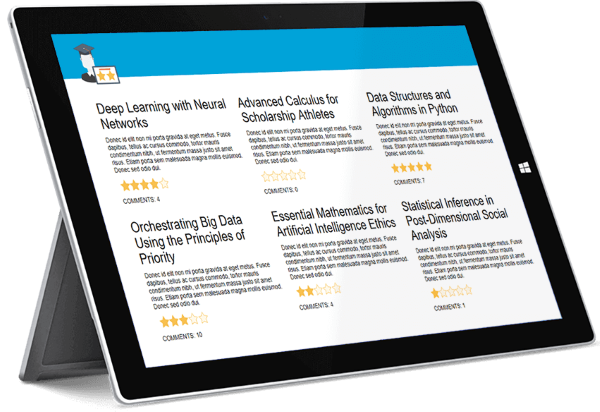
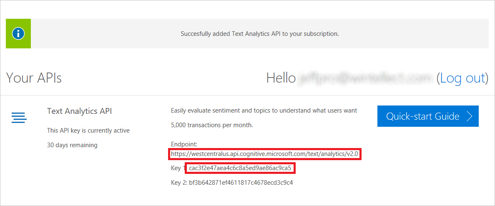
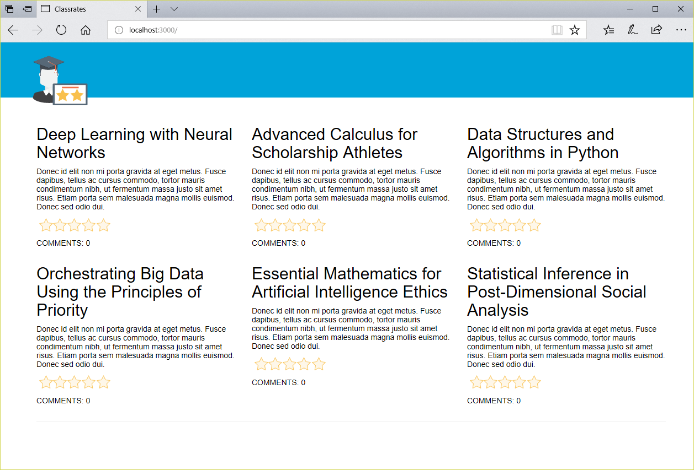
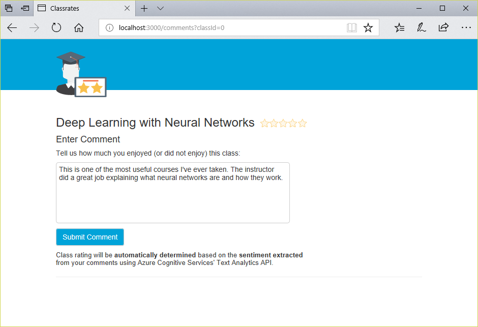
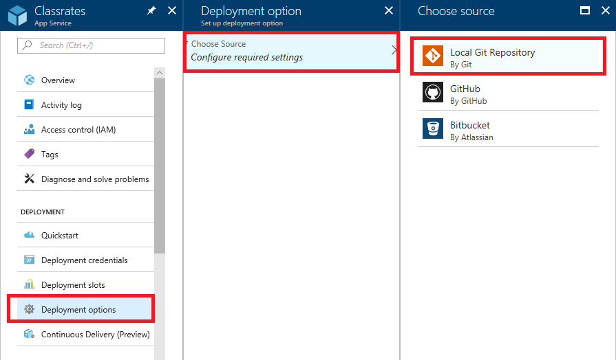
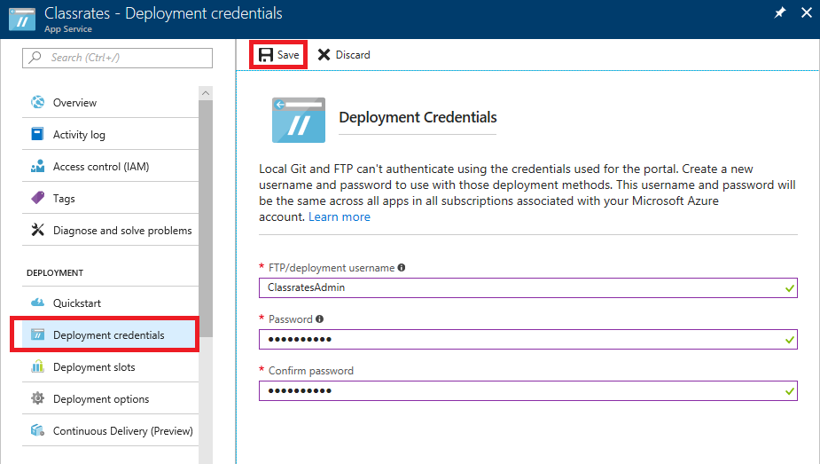
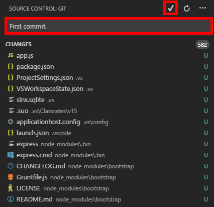
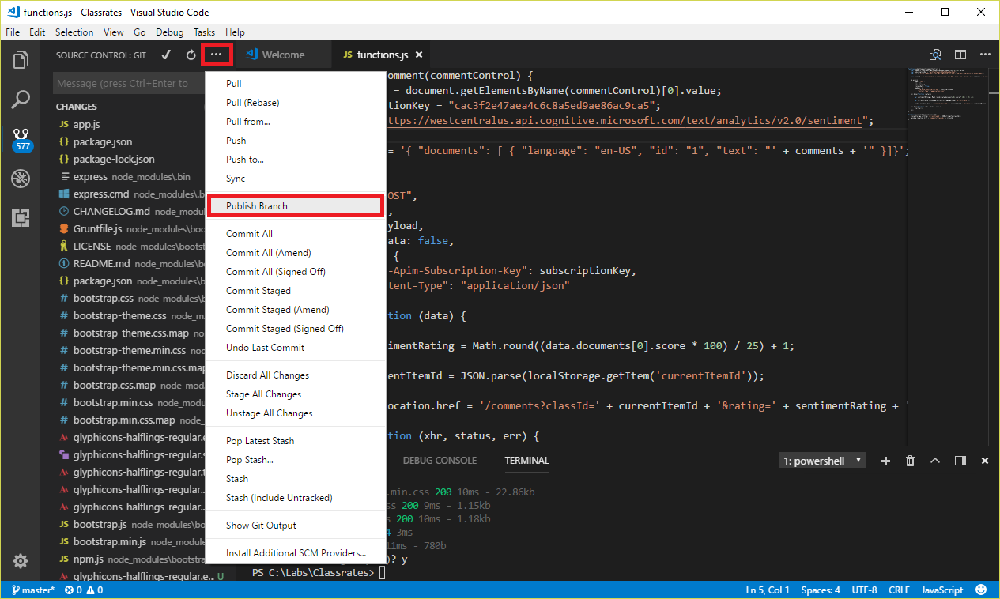

<a name="HOLTitle"></a>
# Fun with Azure Web Apps #

---

How easy is it to build a Web site and deploy it to Azure? What if it's not just a static Web site, but a dynamic, data-driven Web site that runs on Node.js, utilizes [Git](https://git-scm.com) for source control, and uses Artificial Intelligence (AI) to process user input? It's easier than you might think, thanks to [Azure Web Apps](https://azure.microsoft.com/en-us/documentation/articles/app-service-web-overview/), which provides a robust platform for Web apps of all types and features built-in Git support; [Visual Studio Code](https://code.visualstudio.com/), a free and cross-platform source-code editor that includes seamless Git support of its own; and Azure Cognitive Services' [Text Analytics API](https://azure.microsoft.com/services/cognitive-services/text-analytics/), which exposes [REST](https://en.wikipedia.org/wiki/Representational_state_transfer) methods backed by AI and machine learning for analyzing text for sentiment, language, topics, and more.

In this lab, you will create an Azure Web App and use Visual Studio Code to deploy to it the "Classrates" site pictured below that lets you rate college classes. Rather than enter ratings directly, you will enter comments, and the site will use the Text Analytics API to analyze comments for sentiment and rate the classes accordingly. You will also leverage the Git support in Azure and Visual Studio Code to enact source control and publish to Azure directly from Visual Studio Code. And you will accomplish all of this in under 30 minutes.



Sound like fun? Then let's get started!

<a name="Prerequisites"></a>
## Prerequisites ##

The following are required to complete this hands-on lab:

- An active Microsoft Azure subscription. If you don't have one, [sign up for a free trial](http://aka.ms/WATK-FreeTrial).
- [Git client](https://git-scm.com/download) for Windows, macOS, or Linux
- [Visual Studio Code](http://code.visualstudio.com)

<a name="Exercises"></a>
## Exercises ##

This hands-on lab includes the following exercises:

- [Exercise 1: Get a Text Analytics API key](#Exercise1)
- [Exercise 2: Run the Classrates site locally](#Exercise2)
- [Exercise 3: Create an Azure Web App](#Exercise3)
- [Exercise 4: Deploy Classrates to Azure](#Exercise4)

Estimated time to complete this lab: **20 to 30** minutes.

<a name="Exercise1"></a>
## Exercise 1: Get a Text Analytics API key ##

The Classrates site that you are going to build uses Cognitive Services' [Text Analytics API](https://azure.microsoft.com/services/cognitive-services/text-analytics/) to analyze sentiment in the comments that students enter. The Text Analytics API takes text as input and returns a value from 0 to 1 quantifying the sentiment expressed in that text. The higher the score, the more favorable the sentiment. A comment such as "The most awesome class I've ever taken!" will score very high, while "Wouldn't wish this class on my worst enemy" will score low.

In order to call the Text Analytics API, you need an API key. In this exercise, you will retrieve a free API key from the "Try Cognitive Services" portal. A free key enables you to call the Text Analytics API up to 5,000 times per month. If you need more than that — if, for example, you intend to use the Text Analytics API in a production app or Web site — you can use the Azure portal to [sign up for a paid API key](https://docs.microsoft.com/azure/cognitive-services/text-analytics/how-tos/text-analytics-how-to-signup) with higher limits.

1. Go to https://azure.microsoft.com/try/cognitive-services in your browser. Click **Language**, and then click **Get API Key** to the right of "Text Analytics API."

	

    _Getting a Text Analytics API key_ 

1.  Check the **I agree** box in the ensuing dialog. Then click **Next** and sign in using your Microsoft account (or a Facebook, LinkedIn, or GitHub account if you prefer).

1. Copy the endpoint URL and either of the API keys presented to you into a text file or some other place where you can easily retrieve them in the next exercise. Or simply leave the browser window open so you can copy and paste from there.

	

    _Copying the endpoint and API key_ 

The endpoint is the base URL to which calls to the Text Analytics API are placed — "base" because "/sentiment" must be added to the end to complete the URL. The API key travels in an HTTP header in each request. Without a valid API key, the Text Analytics API fails requests placed to it. It is the API's way of ensuring that the caller is authorized.

<a name="Exercise2"></a>
## Exercise 2: Run the Classrates site locally ##

[Visual Studio Code](http://code.visualstudio.com) is a free, lightweight, and powerful source-code editor available for Windows, macOS, and Linux. It supports a variety of popular programming languages, including JavaScript, TypeScript, and Python, and it features built-in support for Git. In this exercise, you will load the source code for Classrates into Visual Studio Code, add the endpoint and API key you retrieved in the previous exercise, and test the Web site locally.

1. If [Git](https://git-scm.com/) isn't installed on your PC, go to https://git-scm.com/downloads and install the Git client for your operating system. Git is a free and open-source distributed version-control system, and it integrates seamlessly into Visual Studio Code.

	> If you aren't sure whether Git is installed, open a Command Prompt or terminal window and type ** git --version**. If a version number is displayed, then the Git client is installed.

1. If Visual Studio Code isn't installed on your PC, go to https://code.visualstudio.com/ and install it now. Conveniently, this will also install Node.js if it isn't already installed. Classrates runs on Node.js.

1. Create a folder named "Classrates" on your hard disk. Then download the [zip file containing the Web site's source code](https://topcs.blob.core.windows.net/public/classrates.zip) and copy its contents into the "Classrates" folder.

1. Start Visual Studio Code and use the **File** > **Open Folder...** command to open the "Classrates" folder.

1. Select **Integrated Terminal** from Visual Studio Code's **View** menu to open an integrated terminal. Then execute the following command in the integrated terminal to install [Bootstrap](https://www.npmjs.com/package/bootstrap), [Express](https://www.npmjs.com/package/express), and other packages that the site requires:

	```
	npm install
	```

1. Use the EXPLORER panel in Visual Studio code to open the file named **functions.js** located in the project's "public/scripts" folder. Replace TEXT_ANALYTICS_API_KEY on line 3 with the API key you retrieved in the previous exercise, and replace TEXT_ANALYTICS_ENDPOINT on line 4 with the endpoint URL you retrieved in the same exercise. Then save the file.

	

	_Editing functions.js_

1. Execute the following command in Visual Studio Code's integrated terminal to start the Web app:

	```
	npm start
	```

1. Open a browser to http://localhost:3000 and confirm that the Classrates Web site appears:

	

    _The Classrates Web site_ 

1. Click **Deep Learning with Neural Networks** to go to the comments page for that class. Enter a comment and click the **Submit Comment** button. How does this comment rate on a scale of one to five stars?

	

    _Entering a comment_ 

1. Enter additional comments for this class. Observe how the individual comments are rated, and how each new comment affects the overall rating for the class.

Play around with the Web site and familiarize yourself with how it works. The next step is to deploy it to Azure so others can enjoy it as well. But first, you need to create an Azure Web App to host it. 

<a name="Exercise3"></a>
## Exercise 3: Create an Azure Web App ##

In this exercise, you will use the [Azure portal](https://portal.azure.com) to create an Azure Web App and configure it to use continuous integration. [Continuous integration](https://en.wikipedia.org/wiki/Continuous_integration) means that the Web site is deployed to the Web App from a Git repository hosted in the cloud that is synced to a local repository. In the next exercise, you will set up a local Git repository in Visual Studio Code and connect it to the remote Git repository. Consequently, you will be able to publish to Azure by checking in your code changes and pushing the changes to the remote repository.

1. Open the [Azure portal](https://portal.azure.com) in your browser. If you are asked to sign in, do so using your Microsoft account.

1. In the portal, click **+ Create a resource**, followed by **Web + Mobile** and **Web App**.

    

    _Creating an Azure Web App_

1. Enter a unique name for the app. The name must be unique across Azure, so you will probably have to name it something other than "Classrates." Select **Create new** under "Resource Group" and enter a resource-group name, and select the operating system on which you want the Web App to run. (Either Windows or Linux is fine.) Click **App service plan/Location** and create a new service plan that specifies the Azure region in which you want to host the Web App (for example, East US). Then click the **Create** button at the bottom of the blade.

	> When you create a service plan, you can also choose the type of server that will host the Web site and select a cost model. At the time of this writing, Azure offers a free hosting plan for Windows, but not for Linux. Azure is constantly evolving, so this may change in the future.

	

	_Creating an Azure Web App_

1. Wait for the deployment to finish. (It typically takes 5 minutes or less.) Then go to the Azure Web App in the Azure portal. One way to get there is to click **Resource groups** in the ribbon on the left, select the resource group whose name you specified in the previous step, and then click the Web App resource. You can also click the **Go to resource** button in the dialog that pops up in the portal when the deployment completes.

1. Click **Deployment options** in the menu on the left side of the blade for the Azure Web App. Click **Choose Source** followed by **Local Git Repository**. Then click **OK** at the bottom of the "Deployment option" blade.

	

	_Specifying the deployment source_

1. Click **Deployment credentials** in the menu on the left. Enter the user name and password that you wish to use for Git deployments. Then click **Save** at the top of the blade. **Remember the user name and password that you enter**, because you will need them to deploy the Web site.

	

	_Specifying deployment credentials_

With the Azure Web App created and configured to use Git as a deployment source, the next step is to place the project under Git source control on your PC and connect the local repository to the one that serves as the deployment source for the Web App.

<a name="Exercise4"></a>
## Exercise 4: Deploy Classrates to Azure ##

In this exercise, you will use Visual Studio Code to place the Classrates project under source control and connect it to the Azure Web App created in the previous exercise. Then you will publish to Azure and see Classrates light up as a living, breathing Web site.

1. Return to Visual Studio Code and click the **Source Control** button in the activity bar. Then click the **Initialize Repository** icon and select the "Classrates" folder. 

	

	_Initializing the local repository_

1. Type "First commit" into the message box, and then click the check mark to commit your changes. If prompted to automatically stage your commits, click **Yes** or **Always** depending on whether you wish to be prompted each time you commit changes.

    

    _Committing changes to the local Git repository_ 

1. Execute the following command in Visual Studio Code's integrated terminal to connect the local Git repository to the Azure Web App. Replace WEB_APP_NAME in two places with the name assigned to your Azure Web App:

	```
	git remote add Classrates https://WEB_APP_NAME.scm.azurewebsites.net:443/WEB_APP_NAME.git
	```

1. Click the ellipsis at the top of the SOURCE CONTROL panel and select **Publish Branch** from the menu to publish the Classrates Web site to Azure. When prompted for Git credentials, enter the user name and password you specified in Step 6 of the previous exercise.

    

    _Publishing the Web App_  

1. Navigate to http://WEB_APP_NAME.azurewebsites.net in your browser, substituting your Azure Web App's name for WEB_APP_NAME. Confirm that Classrates' home page appears in your browser:

	

	_Classrates running in Azure_

1. Click around the site and enter a few comments, ensuring that the site works the same in Azure as it did when it was running locally.

Now that you have continuous integration set up, you can make changes to the Web site by making the changes locally, checking them in, and rerunning the **Publish Branch** command. Of course, you can still test your changes locally before publishing them to Azure. You also enjoy the many benefits of source control, including the ability to isolate the work that you do in branches, view the changes that have been committed, and easily revert to previous versions of the code. To learn more about source control in Visual Studio Code, see [Using Version Control in VS Code](https://code.visualstudio.com/docs/editor/versioncontrol).

<a name="Summary"></a>
## Summary ##

Want to do more to make Classrates a first-rate Web app? One suggestion is to add support for editing and deleting comments. Another idea is to add a MySQL database to persist the comments that are entered. Currently, the comments are stored only in memory, and they go away if the Web App is recycled. It's easy to create a MySQL database in Azure and connect it to an Azure Web App. For guidance, see [Connect an existing Azure App Service to Azure Database for MySQL server](https://docs.microsoft.com/en-us/azure/mysql/howto-connect-webapp). Now that you have a solid foundation to work from, the only limit is your imagination.

---

Copyright 2018 Microsoft Corporation. All rights reserved. Except where otherwise noted, these materials are licensed under the terms of the MIT License. You may use them according to the license as is most appropriate for your project. The terms of this license can be found at https://opensource.org/licenses/MIT.