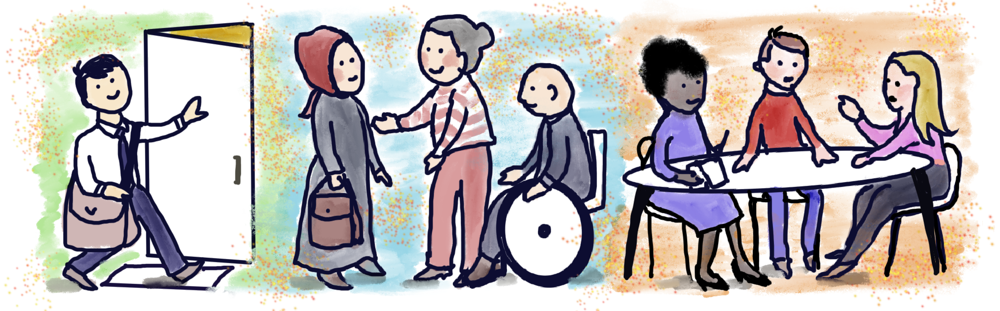

> Image by [Jen Looper](https://twitter.com/jenlooper)

# Digital Accessibility Content

Resources of interest to students and faculty all about Digital Accessibility, including all the ways that we make our apps usable for everyone.

## Talks
[Testing Web Accessibility by Adrián Bolonio](https://speakerdeck.com/bolonio/testing-web-accessibility)
>How to find accessibility vulnerabilities in your website

## Code Samples

## Tools
[Accessibility Insights by Microsoft](https://accessibilityinsights.io/)
>Test accessibility of webpages, web applications, Android applications and Windows applications

[WebAIM: Contrast Checker](https://webaim.org/resources/contrastchecker/)
>Check if the contrast ratio of your design's foreground and background colors adhere to Web Content Accessibility Guidelines (WCAG)

[Accessible Color Palette Builder](https://toolness.github.io/accessible-color-matrix/)
>Generate a matrix that shows accessible color pairings from your color scheme

[alex](https://alexjs.com/)
>Catch insensitive, inconsiderate writing

## Courseware
[Accessibility Fundamentals Learning Path on Microsoft Learn](https://docs.microsoft.com/learn/paths/accessibility-fundamentals/)
>Take lessons on Microsoft Learn about digital accessibility

## Blogs

## Initiatives

## Events
