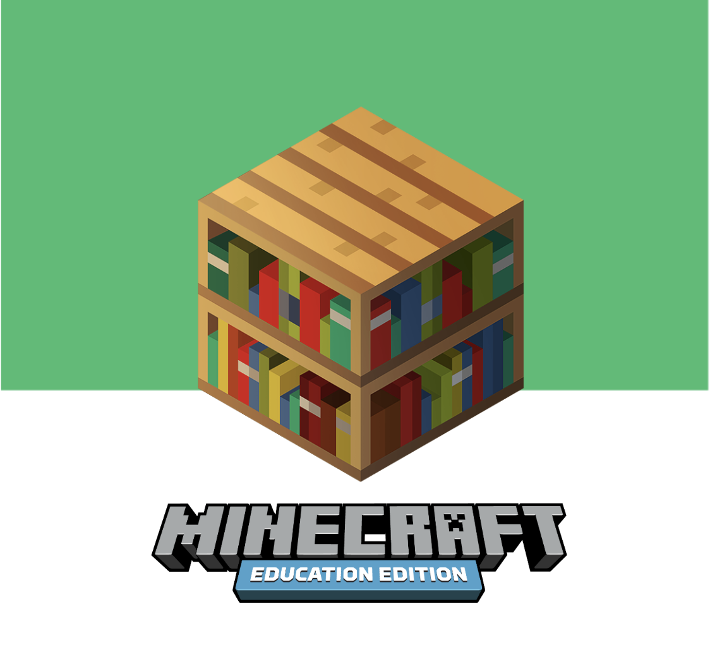
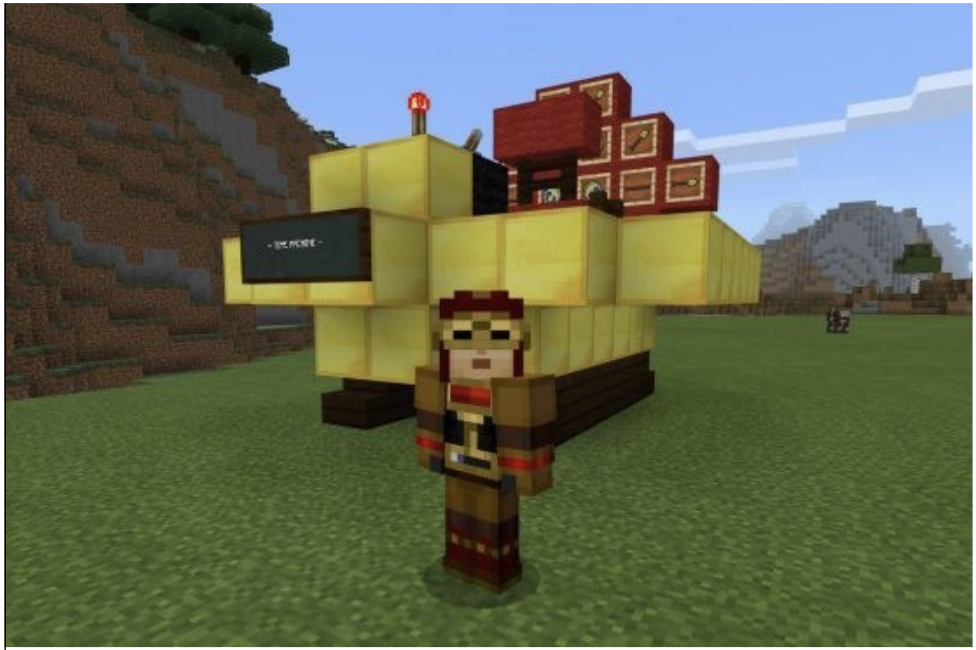
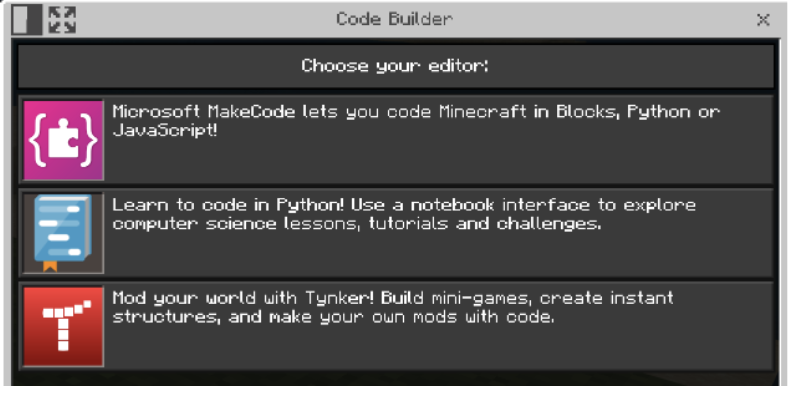

# Build 2022 Coding and Design Challenge 

This build challenge for Build 2022 and Minecraft: Education Edition is designed to engage your creativity, build your coding skills and strengthen your innovative thinking. Design the future without compromise!  

## Quick Start 

Getting started with Minecraft: Education Edition is easy.  

1. DOWNLOAD & INSTALL THE APP 

[Download Minecraft: Education Edition](https://education.minecraft.net/get-started/download/) for Windows, Mac, or iPad. Follow the directions on the page to ensure your device is setup to support Minecraft. 
 
2. LOGIN 

After you download and launch Minecraft: Education Edition, login with your Office 365 school account and password. If you do not have an office 365 account, access it this way: [Free Microsoft Office 365 for Schools & Students | Microsoft Education](https://www.microsoft.com/en-us/education/products/office)

3. START THE BUILD CHALLENGE 

Take a look at the Build Challenge below. Links will download the world file that you need for the challenge. Double-clicking these files will open them in Minecraft: Education Edition where you can start creating, exploring, and building right away. 

This immersive 3D world provides a ‘build plate’, or area where you can build your solution. 

---

## TIME MACHINE  

Re-imagine a space in your university or community. What will the space look like 100 years in the future? Visit the link below to get started: 

https://aka.ms/TimeMachineChallenge

### Objective  

Choose a space in your university or community and then use Minecraft to reimagine the space. What will the space look like 100 years in the future? How can the space change to meet a future need? How will it help people learn and grow? How will your design show how you can reshape the future? Use your coding skills to build! 

Use Minecraft's CodeBuilder to build your re-imagined space.  You can choose MakeCode (Block, JavaScript or Python) or Python Azure Notebooks IDE to build your program. 

Use the structure block and mixed reality viewer to photograph your creation next to the real location.  

### Submit Your Entry! 

Now that you've completed your build, you can tell us about it and be eligible for some digital swag! Describe how you designed and built your re-imagined space and submit it [using this form](https://forms.microsoft.com/r/yUY3eJMwic). The first 200 entrants will be eligible to win a limited-edition Azure Hero badge.

If you are under 18, you will need a parent, guardian, or educator to submit your entry.
